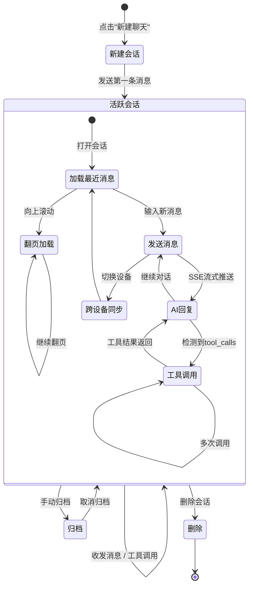
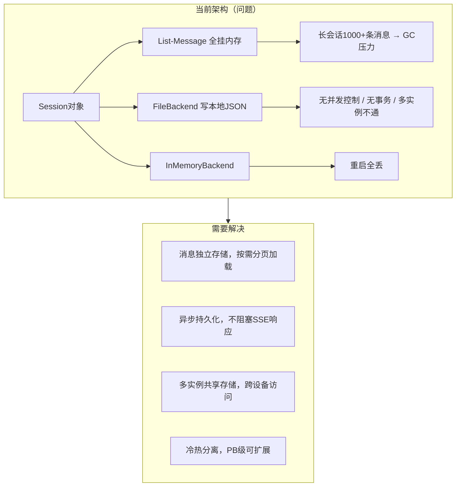
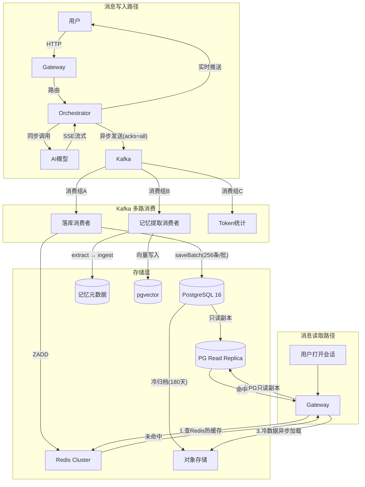
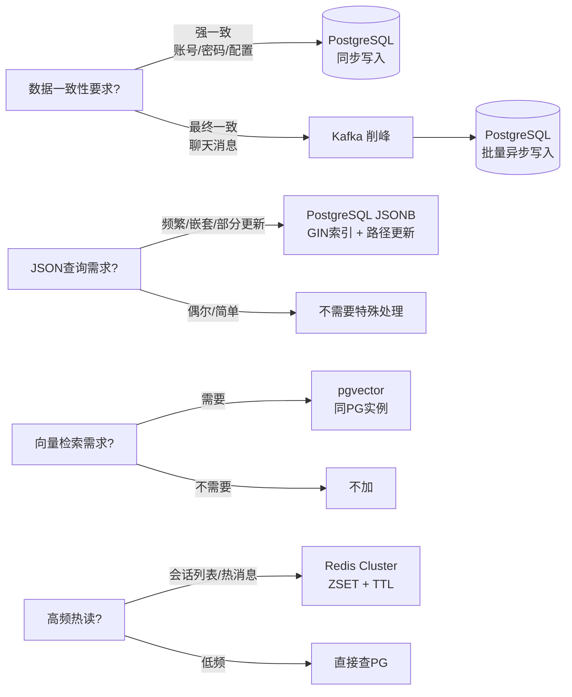
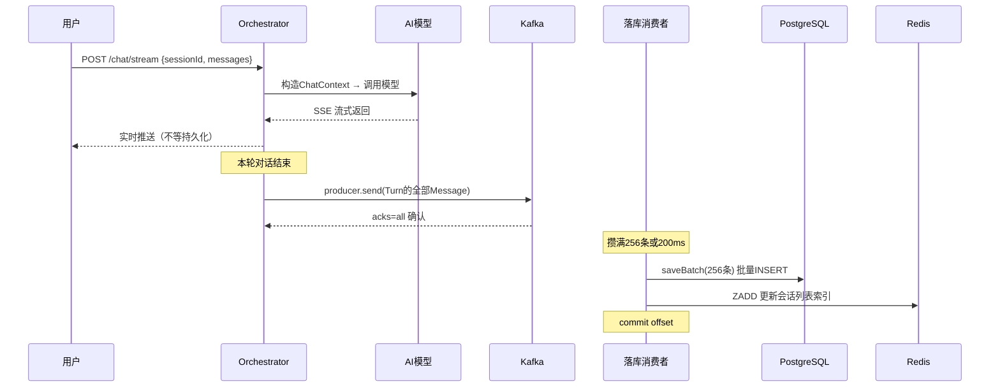
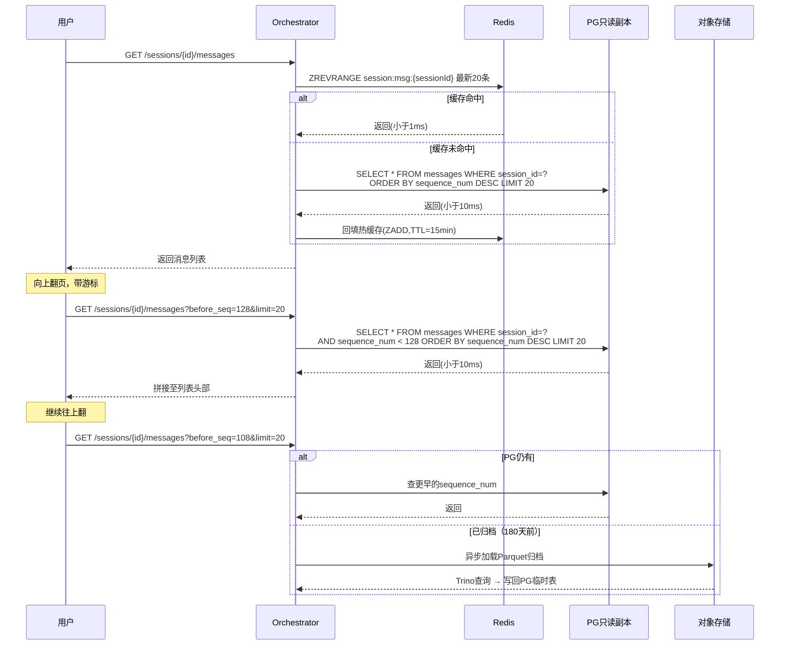
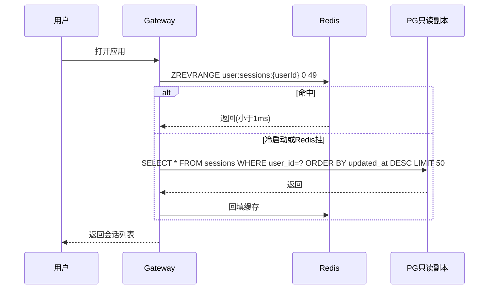
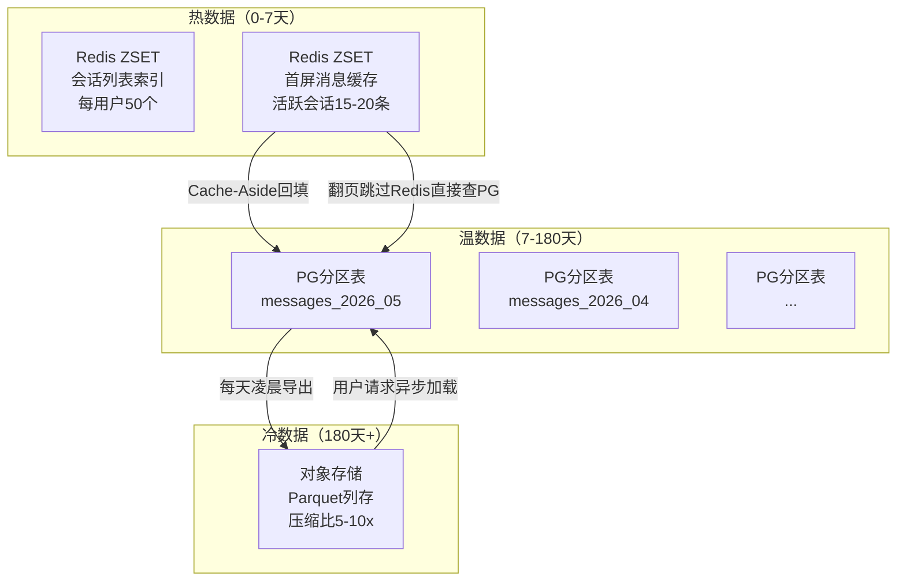
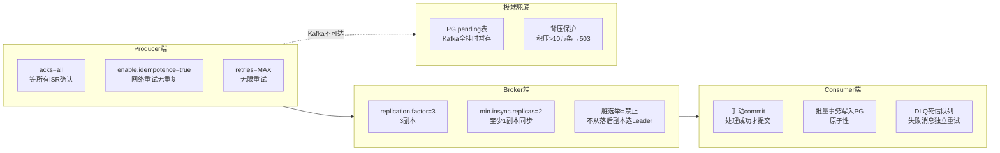
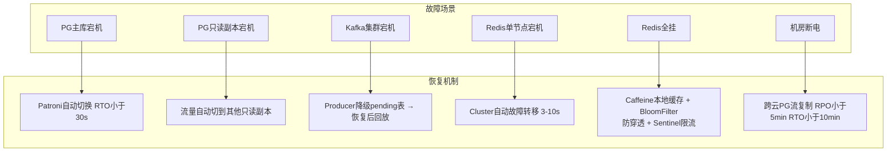

# LyClaw 会话存储与数据持久化设计

> 版本：v2.0 / 日期：2026-05-15
> 涵盖：会话存储 · 消息持久化 · 技术选型 · Kafka可靠性 · 故障恢复
> 待补充：登录系统设计 · 记忆架构设计

---

## 1. 业务场景



**核心数据流：**

| 操作 | 频率 | 延迟要求 | 数据量 |
|------|------|---------|--------|
| 发送消息 + AI回复 | 极高（峰值数万QPS） | SSE实时推送，持久化异步 | 一轮最多数十条Message |
| 加载最近消息 | 高（打开会话） | < 100ms | 近10轮对话 |
| 翻页历史消息 | 中（翻阅历史） | < 500ms | 按需分页 |
| 会话列表 | 高（打开应用） | < 50ms | 每用户最多显示N个会话 |
| 跨会话搜索 | 低 | < 2s | 全文检索 |

**规模假设：** 百万DAU，日均1亿条新消息，峰值QPS为均值5-10倍。

---

## 2. 现状问题



| # | 问题 | 影响 |
|---|------|------|
| 1 | `Session` 内嵌 `List<Message>`，全量加载 | 长会话撑爆内存，GC频繁 |
| 2 | FileBackend 本地JSON文件 | 多实例数据不通，无事务 |
| 3 | InMemoryBackend | 重启全丢 |
| 4 | 持久化同步阻塞 | 用户等落库才能看到回复 |
| 5 | 无冷热分离 | 全量数据一直在线，成本线性增长 |

---

## 3. 目标架构全景



**设计原则：**

| 原则 | 说明 |
|------|------|
| 读写分离 | 写入走Kafka→PG主库，读取走Redis→PG只读副本→对象存储 |
| 异步优先 | 消息持久化全异步，用户看到回复不等落库 |
| Kafka为枢纽 | 生产者只写一次，消费者各取所需 |
| 冷热分离 | 热数据Redis，温数据PG分区表，冷数据Parquet归档 |

---

## 4. 技术选型



### 4.1 数据库：PostgreSQL 16（统一实例）

**为什么不分 MySQL + PG 两套：**

用户数据不只是账号密码。用户会创建工具（JSON嵌套steps）、Agent（JSON嵌套tools+pipeline）、任务规划（DAG依赖图）。这些结构不可预知、需要按内部字段查询、需要部分更新——正是 JSONB 的核心场景。

```
MySQL JSON                         PostgreSQL JSONB
─────────────────────────────────────────────────────
本质 = TEXT + 校验层                本质 = 二进制独立类型
查询 = 每次临时解析字符串            查询 = 直接读树结构
索引 = 虚拟列（新增查询要改表）       索引 = GIN（任意路径通用）
更新 = 重写整个字段                  更新 = jsonb_set() 只改目标路径
```

**业界验证：** ChatGPT 8亿用户的全部数据（账号、会话、计费、配置）都在单主 PG 上，~50个只读副本 + PgBouncer 连接池，不做分片。

**分片策略（增长期）：**

| 阶段 | 消息量 | 方案 |
|------|--------|------|
| 前期 | < 5亿 | 单主 + 只读副本（跟ChatGPT一样） |
| 增长期 | > 5亿 | Citus 按 `user_id` 分布到多worker |
| 分区 | 所有阶段 | 按月份声明式分区，`user_id` 嵌入 `session_id` 前缀 |

### 4.2 ORM：MyBatis-Plus

- **不用JPA：** Hibernate生成SQL不可控，N+1和懒加载在百万并发下是灾难
- **不用纯JDBC：** 批量写入、分页都要自己造轮子
- **选MyBatis-Plus：** `saveBatch` 一条SQL插256条 + XML复杂查询可控 + 分页插件成熟

### 4.3 消息队列：Kafka

| 对比维度 | Kafka | Redis Streams | RocketMQ |
|---------|-------|--------------|----------|
| 积压能力 | 磁盘级，几千万条 | 内存级，OOM风险 | 磁盘级 |
| 多路消费 | 原生消费组 | 消费组 | 消费组 |
| 回溯回放 | offset指定 | 需要ID | offset指定 |
| CDC生态 | Debezium天然集成 | 无 | 较弱 |

**核心理由：** 削峰是刚需（峰值是均值5-10倍），Kafka磁盘级缓冲让积压不影响业务。同时消费组机制让落库、记忆提取、Token统计互不干扰。

### 4.4 缓存：Redis Cluster

**Redis 只存什么：**

| Key | 类型 | 内容 | 写入方 | TTL |
|-----|------|------|--------|-----|
| `user:sessions:{userId}` | ZSET | 最近50个会话的索引（id+名称+最后一条摘要） | 落库消费者 ZADD | 7d |
| `session:msg:{sessionId}` | ZSET | **仅当前正在聊的1-2个会话**的首屏消息（15-20条） | Cache-Aside 回填 | 15min |

**Redis 不存什么：**

- 会话里 100 条消息的 95% → PG 读副本，< 10ms
- 翻页请求 → 直接 PG
- 冷会话的消息体（超过 TTL 没打开的会话）→ 不占 Redis 内存
- 180 天前的历史消息 → 对象存储 Parquet

**为什么这样设计：**

全量缓存不可行——百万用户 × 50 会话 × 100 条消息 × 2KB = 10TB，Redis 成本爆炸且没必要。区分"用户正在看的"（Redis）和"用户聊过的"（PG），首屏秒开靠 Redis，翻历史靠 PG 10ms，浏览器渲染都比这慢。

**内存估算（百万 DAU）：**

| 数据 | 计算 | 结果 |
|------|------|------|
| 会话列表索引 | 1M × 50 会话 × 300B | ~15GB |
| 活跃会话消息 | 1M × 3%并发 × 1.5 会话 × 20 条 × 2KB | ~1.8GB |
| **合计** | | **~17GB** |

3 主 3 从 Redis Cluster 每节点 32GB，轻松容纳，水平扩容加节点即可。

**概念澄清：** Message（一条消息记录）≠ Turn（一轮对话，用户发一次到下次发之前，含中间所有AI回复和工具调用往返）。

### 4.5 连接池：PgBouncer + HikariCP

```
HikariCP → PgBouncer（事务池化）→ PostgreSQL
           连接复用：百级 → 十级
           延迟：50ms → 5ms
```

| 数据源 | 连接数 | 超时 | 用途 |
|--------|--------|------|------|
| 强一致 | 20 | 2s | 注册/登录/配置写入 |
| 最终一致 | 100 | 30s | 消息批量写入/查询 |

---

## 5. 数据流设计

### 5.1 写入消息



**关键决策：**

1. **Orchestrator同步调AI → SSE实时推用户，异步写Kafka。** 用户看到回复时消息未必已落库——和ChatGPT、DeepSeek做法一致。
2. **Kafka消息是整个Turn的完整往返**（user + assistant + 中间所有tool消息），不是单条Message。这保证消费者拿到完整上下文。
3. **Consumer攒批写入：** 256条或200ms触发一次PG `saveBatch`，吞吐远高于逐条INSERT。
4. **会话列表索引由落库消费者更新**（ZADD），热消息缓存在加载会话时Cache-Aside回填（不在写入路径）。

### 5.2 加载会话消息

首次打开的请求不带参数，翻页带游标：

```
GET /sessions/{id}/messages              → 返回最新 20 条
GET /sessions/{id}/messages?before_seq=128&limit=20  → 返回 seq < 128 的 20 条
```



**`sequence_num` 是会话内严格递增的整数**，消息写入时由应用层或 PG 序列分配。游标翻页的优势：即使中间插入新消息，page 也不会错位。

**前端预取保证流畅体验：** 后端查 PG 10ms 很快，但移动端网络往返可能 100-300ms。前端在用户滚到离顶部边界还差 3-5 条时提前发起 `?before_seq=` 请求，数据回来时无缝拼接，用户永远看不到 loading。

```
用户屏幕可见范围：
最新  ←  seq=135, 134, 133, ...  （从 Redis 首屏加载）
          ...
          seq=128  ← 首屏最旧一条
       ─ ─ ─ ─ ─ ─ ─  预取触发线（离边界 3 条）
          seq=127, 126, 125, ...  （已预取回来，尚未进入视口）
更早 ←   ...
```

**Cache-Aside模式：** 热消息缓存由读操作回填（不是写入路径推送）。好处是只缓存真正被访问的会话，避免大量冷会话挤占Redis内存。

### 5.3 加载会话列表



**Redis 做会话列表索引的理由：** 打开应用必查，百万DAU下对PG的读压力极大。Redis ZSET按 `updated_at` 排序，天然匹配业务需求。PG只做兜底。

### 5.4 两步读路径：从会话列表到消息内容

上面 5.3 和 5.2 是串联的——用户看到的完整流程分两步：

1. **打开应用，加载会话列表**（5.3）：Redis ZSET `user:sessions:{userId}` 只返回最近 50 个会话的 ID + 名称 + 最后一条摘要，**不包含消息内容**。这一步极快（<1ms），适合首屏渲染。
2. **点击某个会话，加载首屏消息**（5.2）：前端拿 `sessionId` 发 `GET /sessions/{id}/messages` → Redis ZSET `session:msg:{sessionId}` 返回最新 15-20 条 → 不命中则查 PG 回填。
3. **向上翻页**：前端带 `?before_seq=` 游标直接查 PG（不走 Redis），< 10ms。

Redis 里存了两类 ZSET：

| Key | 内容 | 条数 | TTL | 用途 |
|-----|------|------|-----|------|
| `user:sessions:{userId}` | 会话索引（id + 名称 + 最后摘要） | 每用户 50 个 | 7d | 首屏列表 |
| `session:msg:{sessionId}` | 首屏消息（完整 JSON） | 每会话 15-20 条 | 15min | 当前活跃会话秒开 |

前端先调列表接口拿 ID，再调消息接口拿内容——两步查询走 Redis 均在 < 1ms，用户感知不到延迟。

### 5.5 messages 表结构

```sql
CREATE TABLE messages (
    id              BIGSERIAL       PRIMARY KEY,
    session_id      VARCHAR(32)     NOT NULL,
    user_id         VARCHAR(32)     NOT NULL,

    -- 消息内容（来自 Message.java）
    role            VARCHAR(20)     NOT NULL,       -- user / assistant / system / tool
    content         TEXT,                            -- 消息正文
    thinking        TEXT,                            -- DeepSeek 推理链
    model           VARCHAR(50),                     -- 生成此消息的模型

    -- 工具调用（JSONB，仅 assistant 消息有值）
    tool_calls      JSONB,                           -- [{toolCallId, name, arguments, result}]
    tool_call_id    VARCHAR(64),                     -- tool 消息关联的 call_id

    -- Token 统计
    usage           JSONB,                           -- {promptTokens, completionTokens, totalTokens}

    -- 游标翻页核心字段
    sequence_num    BIGINT          NOT NULL,

    created_at      TIMESTAMPTZ     NOT NULL DEFAULT NOW(),

    CONSTRAINT fk_msg_session FOREIGN KEY (session_id)
        REFERENCES sessions(id) ON DELETE CASCADE,

    UNIQUE (session_id, sequence_num),
    INDEX  idx_msg_session_seq (session_id, sequence_num DESC)
);
```

**字段与现有代码的对应关系：**

| DB 列 | `Message.java` 字段 | 说明 |
|-------|---------------------|------|
| `role` | `role` | 前端据此渲染不同气泡样式 |
| `content` | `content` | 消息正文 |
| `thinking` | `thinking` | DeepSeek 的 `reasoning_content`，前端可折叠展示 |
| `model` | `model` | 哪個模型生成的，便于回溯和成本分析 |
| `tool_calls` | `toolCalls` (List\<ToolCall\>) | 直接 JSONB 序列化，包含 toolCallId/name/arguments/result |
| `tool_call_id` | `toolCallId` | tool 角色消息关联到对应的 assistant 工具调用 |
| `usage` | `usage` (Usage) | {promptTokens, completionTokens, totalTokens} |
| `sequence_num` | 新增 | 会话内严格递增，游标翻页的核心 |

**不需要 `updated_at`**——消息写入后从不修改。

**分区策略（后续扩展）：**

```sql
CREATE TABLE messages (...) PARTITION BY RANGE (created_at);
CREATE TABLE messages_2026_05 FOR VALUES FROM ('2026-05-01') TO ('2026-06-01');
CREATE TABLE messages_2026_06 FOR VALUES FROM ('2026-06-01') TO ('2026-07-01');
```

每月凌晨自动创建下月分区。180 天前的分区导出 Parquet 到对象存储后 `DROP PARTITION`，PG 永不超过 70TB。`user_id` 字段预留为 Citus 分片键，真到 PB 级切分布式时零改造。

---

## 6. 存储分层



| 层级 | 存储 | 延迟 | 数据量（百万DAU） | 存什么 |
|------|------|------|------------------|--------|
| 热 | Redis Cluster | < 1ms | ~17GB | 会话列表索引 + 活跃会话首屏消息 |
| 温 | PG分区表 | < 10ms | ~70TB（180天） | 全部消息，按月分区 |
| 冷 | 对象存储(Parquet) | < 2s（异步） | ~70TB（压缩后） | 180天前归档数据 |

**Redis = "你是谁 + 你在聊什么"，PG = "你聊过什么"。** 打开应用秒开靠 Redis，翻历史靠 PG。

---

## 7. Kafka 消息可靠性



### 7.1 Producer：Kafka不可达时写PG pending表

```sql
-- 不是文件WAL，是PG表。已经在架构里的基础设施，不额外引入依赖
CREATE TABLE lyclaw_pending_messages (
    id            BIGSERIAL PRIMARY KEY,
    topic         VARCHAR(200) NOT NULL,
    payload       JSONB NOT NULL,
    status        VARCHAR(20) NOT NULL DEFAULT 'PENDING',
    retry_count   INT NOT NULL DEFAULT 0,
    next_retry_at TIMESTAMPTZ NOT NULL DEFAULT NOW()
);
CREATE INDEX idx_pm_retry ON lyclaw_pending_messages (status, next_retry_at);
```

后台Job每5秒捞100条重试，指数退避。积压超过10万条→拒绝新请求→返回503。

### 7.2 Broker：3副本 + ISR≥2

| 故障场景 | 结果 |
|---------|------|
| Leader宕机 | ISR选新Leader，消息0丢失 |
| Leader+1Follower同时宕机 | ISR不足，Producer失败→pending表兜底 |
| 全集群宕机 | 全部进pending表，恢复后重放 |

### 7.3 Consumer：手动commit + DLQ

```
主队列消息 → 处理成功 → commitSync()
           → 处理失败 → 写DLQ topic → commitSync()（不卡主队列）

DLQ消费者（独立消费组）:
  10s → 30s → 1min → 5min → 15min 指数退避
  全失败 → 告警 + 人工介入
```

| 层面 | 靠什么不丢 | 极端兜底 |
|------|-----------|---------|
| Producer | acks=all + 幂等 + 无限重试 | PG pending表 |
| Broker | 3副本 + ISR≥2 + 禁脏选举 | 副本自动切换Leader |
| Consumer | 手动commit + PG事务 | DLQ独立重试 |

---

## 8. 故障恢复



---

## 9. 记忆架构设计

> 废弃原因：旧的 4 层记忆模型（SENSORY→SHORT_TERM→LONG_TERM→ENTITY）是早期为了对齐"人脑模型"而设计的，ConcurrentHashMap 全内存存储、SHA-256 伪嵌入、正则提取——整个设计在百万 DAU 和需要真实语义理解的需求下不成立。以下从头设计。

### 9.1 核心需求

> 调研来源：LangChain LangMem（三种记忆类型）、Mem0（对比决策 + 知识图谱）、bMAS（黑板架构）、AutoGPT（不要过早优化）、CrewAI（层级式多 Agent 记忆）、Anthropic Claude SDK（文件式持久记录）、Google A2A（Agent 间不共享内部状态）

本次记忆架构基于以下需求设计，每一条来自调研结论：

| # | 需求 | 说明 |
|---|------|------|
| **多 Agent 协同** |
| 1 | **内部黑板共享记忆** | 项目核心卖点。同一会话内的 Plan/Action/Reflect/Respond Agent 通过共享黑板（Blackboard）读写任务上下文和中间结果。Agent 之间不直接通信，一切读写走黑板 |
| 2 | **Orchestrator 预取分发** | Agent 本身不能"实时收到通知"——它在 LLM 调用中。Orchestrator 在调度每个 Agent **之前**先读黑板 + 检索记忆，把该给的上下文打包进 ChatContext，再派活 |
| 3 | **A2A 留给外部 Agent** | 内部协同用黑板，与**外部** Agent（第三方服务、其他 LyClaw 实例）通信走 Google A2A 协议（Task/Message/Artifact 模式）。A2A 明确不共享内部状态——这是正确的设计，不是限制 |
| **记忆分类与存储** |
| 4 | **三种记忆类型**（语义/情景/程序） | 复用 LangChain LangMem 分类，替代旧的 4 层模型（SENSORY→SHORT_TERM→LONG_TERM→ENTITY）。原因见 9.2 |
| 5 | **真实嵌入模型** | SHA-256 伪随机向量替换为 BGE-M3（本地 ONNX，1024 维），具备语义相似度能力 |
| 6 | **持久化到 PostgreSQL + pgvector** | 4 个 ConcurrentHashMap 全部替换，重启不丢。pgvector HNSW 索引，10 万条以内暴力搜索完全够用（AutoGPT 的教训：别过早优化） |
| **防膨胀与生命周期** |
| 7 | **对比后决定增删改** | 不是"每次对话结束无脑写入"。LLM 提取候选 → 与已有记忆对比相似度 → ADD / UPDATE / DELETE / UNCHANGED。三道防线见 9.4 |
| 8 | **记忆衰减与定时清理** | 90 天未访问 + 重要性 < 0.5 → 归档冷存储。重要性评分 < 0.3 的信息不提取 |
| 9 | **用户级数据隔离** | 所有记忆带 `user_id`，查询/写入均在用户范围内 |
| **管道与配置** |
| 10 | **异步记忆管道** | 记忆提取不阻塞对话响应。对话结束 → Kafka → 消费者异步提取/嵌入/入库 |
| 11 | **可配置的记忆开关与检索条数** | 用户可在设置中关闭记忆、调整检索 top-K |
| **依赖顺序** |
| 12 | **开发顺序：引擎 → 会话 → 记忆 → 登录** | 核心引擎不够强，记忆提取无东西可提、会话不值得存、登录保护的是空气。先让单次对话产生 5-10 条有质量的消息，再上持久化和多租户 |

### 9.2 三种记忆类型

参照 LangChain LangMem 的分类，替换旧的 4 层模型：

| 记忆类型 | 内容 | 存储方式 | 例子 |
|----------|------|---------|------|
| **语义记忆 Semantic** | 事实、偏好、用户知识 | pgvector 向量检索 | "用户使用 Spring Boot 3.5 + JDK 21"、"用户不喜欢 Lombok" |
| **情景记忆 Episodic** | 过去对话的摘要、时间戳、上下文快照 | JSONB + 时间索引 | "上周三讨论过 NullPointerException"、"上次聊天内容回顾" |
| **程序记忆 Procedural** | 行为模式、工具使用偏好、写作风格 | JSONB + 标签索引 | "代码输出偏好简洁风格"、"倾向于用 grep 而不是 find" |

**为什么废弃 4 层模型：**
- SENSORY（原始对话）和 SHORT_TERM（会话内上下文）本质上都是当前会话的短期数据，属于会话管理（第 5 章已解决），不是记忆持久化要负责的
- ENTITY（结构化实体）可以作为语义记忆的子集，不需要单独一层
- 三种记忆类型的分类更贴近"AI 实际需要什么信息来做决策"，而不是"信息在大脑里物理上处于哪个区域"

### 9.3 多 Agent 记忆共享架构

**核心模式：内部黑板 + 外部 A2A**

```
                         ┌──────────────────────┐
                         │     Orchestrator      │  ← Control Unit（调度员）
                         │   持有黑板引用 + 预取    │
                         │   调度前读黑板 → 打包    │
                         │   ChatContext → 派活   │
                         └──┬───┬───┬───┬──────┘
                      ┌─────┘   │   │   └─────┐
                      ▼         ▼   ▼         ▼
                  ┌──────┐ ┌──────┐ ┌──────┐ ┌──────┐
                  │ Plan │ │Action│ │Reflect│ │Respond│
                  │ 规划  │ │ 执行  │ │ 反思  │ │ 响应  │
                  └──┬───┘ └──┬───┘ └──┬───┘ └──┬───┘
                     │        │        │        │
                     └────────┼────────┼────────┘
                              │ 读写   │
                    ┌─────────▼────────▼─────────┐
                    │         BLACKBOARD          │  ← 唯一共享记忆中心
                    │                             │
                    │  · 当前任务目标与约束         │
                    │  · Plan Agent 产出的计划     │
                    │  · Action Agent 的工具结果   │
                    │  · Reflect Agent 的评估      │
                    │  · 各 Agent 无私有记忆模块    │
                    └────────────┬────────────────┘
                                 │
                    ┌────────────▼────────────────┐
                    │       记忆持久化层            │
                    │                             │
                    │  语义记忆(pgvector)          │
                    │  情景记忆(JSONB + FTS)       │
                    │  程序记忆(JSONB + 标签)      │
                    └─────────────────────────────┘

      外部 Agent（第三方服务）── A2A 协议 ──→ 不共享内部黑板
                                             只交换 Task/Artifact
```

**关键设计：Agent 不能"实时收到"通知**

Agent 在执行中是单线程循环（思考→调工具→等结果→生成），不可能被打断接收共享记忆的推送。正确做法是 Orchestrator 在派活前预取：

```
Orchestrator 准备调度 Action Agent
  ├── 读黑板：Plan Agent 产出的执行计划
  ├── 读 pgvector：相关历史记忆（语义/情景/程序）
  ├── 打包进 ChatContext
  └── 派给 Action Agent → Agent 的 System Prompt 里已经有完整上下文
```

memX/Agno 的 WebSocket 通知、Pub/Sub 那一层只是实现细节，本质上就是**调度前预取**。

**记忆写策略（对话结束后异步执行）：**

```
对话结束 → 本轮全部消息入 Kafka
  │
  ├──→ 消费组: 记忆提取
  │      ├── LLM 提取关键事实/偏好/经验
  │      ├── 生成嵌入向量 (BGE-M3)
  │      ├── 与已有记忆对比（检索 top-5 最相似）
  │      │     ├── 全新信息 → ADD
  │      │     ├── 已有但更新 → UPDATE
  │      │     ├── 矛盾/过时 → DELETE
  │      │     └── 已存在且无变化 → UNCHANGED
  │      └── 写入 pgvector + JSONB
  │
  └──→ 消费组: 黑板更新
         ├── 检测到跨 Agent 有价值信息（工具结果、评估结论等）
         └── 写入黑板对应区域（任务状态、中间产出）
```

**共享层级：**

| 级别 | 范围 | 例子 |
|------|------|------|
| `user` | 当前用户的所有 Agent 可见 | 用户技术栈偏好、项目结构 |
| `session` | 当前会话的所有 Agent 可见 | 本轮讨论的任务目标、约束条件 |
| `agent` | 单个 Agent 私有 | Agent 的内部执行状态、临时缓存 |

### 9.4 记忆增删改决策

**核心原则：不是每条对话都值得变成记忆。**

```
新对话 → LLM 提取候选记忆
              │
              ▼
    在已有记忆中检索 top-5 最相似
              │
    ┌─────────┼─────────┐
    ▼         ▼         ▼         ▼
  ADD      UPDATE    DELETE   UNCHANGED
  全新信息  信息更新   矛盾/过时  已存在
              │
              ▼
    写入前再做一次去重检查
    （同批次内的重复候选）
```

**防止记忆膨胀的三道防线：**

| 防线 | 机制 | 触发条件 |
|------|------|---------|
| 第一道 | 提取门槛 | 重要性评分 < 0.3 的信息不提取 |
| 第二道 | 对比决策 | 与已有记忆相似度 > 0.9 则 UNCHANGED |
| 第三道 | 定时清理 | 90 天未访问 + 重要性 < 0.5 → 归档到冷存储 |

### 9.5 检索流程

```
用户消息
  │
  ├──→ 生成查询嵌入向量
  │
  ├──→ 路径一: 向量语义检索（pgvector HNSW）
  │      语义记忆: top-10 相似事实/偏好
  │
  ├──→ 路径二: BM25 关键词检索（PG tsvector）
  │      情景记忆: 包含关键词的对话摘要
  │
  ├──→ 路径三: 标签/元数据过滤
  │      程序记忆: 工具偏好、写作风格
  │
  └──→ 融合排序 (加权 + Cross-Encoder 重排 top-20)
        │
        ▼
      top-5 注入 LLM 上下文
```

### 9.6 数据库表设计

```sql
-- 语义记忆：事实、偏好、知识
CREATE TABLE semantic_memories (
    id              BIGSERIAL       PRIMARY KEY,
    user_id         VARCHAR(32)     NOT NULL,
    content         TEXT            NOT NULL,           -- LLM 提取的事实原文
    embedding       vector(1024),                       -- BGE-M3 嵌入
    category        VARCHAR(50),                        -- FACT / PREFERENCE / KNOWLEDGE / RELATION
    importance      FLOAT           DEFAULT 0.5,
    access_count    INT             DEFAULT 0,
    last_accessed   TIMESTAMPTZ,
    created_at      TIMESTAMPTZ     NOT NULL DEFAULT NOW(),
    updated_at      TIMESTAMPTZ     NOT NULL DEFAULT NOW(),

    INDEX idx_sm_embedding USING hnsw (embedding vector_cosine_ops)
);

-- 情景记忆：对话摘要、事件
CREATE TABLE episodic_memories (
    id              BIGSERIAL       PRIMARY KEY,
    user_id         VARCHAR(32)     NOT NULL,
    session_id      VARCHAR(32),                        -- 来源会话
    summary         TEXT            NOT NULL,           -- LLM 生成的对话摘要
    participants    JSONB,                              -- 参与对话的 Agent 列表
    key_entities    JSONB,                              -- 涉及的关键实体
    ts_vector       TSVECTOR,                           -- 全文搜索
    importance      FLOAT           DEFAULT 0.5,
    created_at      TIMESTAMPTZ     NOT NULL DEFAULT NOW(),

    INDEX idx_em_fts USING gin (ts_vector)
);

-- 程序记忆：行为模式、偏好行为
CREATE TABLE procedural_memories (
    id              BIGSERIAL       PRIMARY KEY,
    user_id         VARCHAR(32)     NOT NULL,
    pattern_type    VARCHAR(50)     NOT NULL,           -- TOOL_PREFERENCE / CODE_STYLE / WORKFLOW
    description     TEXT            NOT NULL,
    examples        JSONB,                              -- 示例对话片段
    confidence      FLOAT           DEFAULT 0.5,        -- 置信度（多次确认提升）
    created_at      TIMESTAMPTZ     NOT NULL DEFAULT NOW(),
    updated_at      TIMESTAMPTZ     NOT NULL DEFAULT NOW(),

    UNIQUE (user_id, pattern_type)
);

-- 记忆共享权限表
CREATE TABLE memory_sharing (
    memory_id       BIGINT          NOT NULL,
    memory_type     VARCHAR(20)     NOT NULL,           -- semantic / episodic / procedural
    scope           VARCHAR(20)     NOT NULL DEFAULT 'user',  -- user / session / agent
    agent_id        VARCHAR(64),                        -- scope=agent 时指定
    granted_at      TIMESTAMPTZ     NOT NULL DEFAULT NOW(),

    INDEX idx_ms_scope (scope, agent_id)
);
```

### 9.7 待设计章节

本记忆架构的详细设计（各子系统的类图、API、具体算法）将在独立文档中展开。以下为预留的子章节：

```
┌─────────────────────────────────────────────────────────┐
│              记忆架构详细设计（待展开）                     │
│                                                          │
│  · 嵌入服务层: BGE-M3 ONNX 加载 / 批处理 / 缓存           │
│  · 向量存储层: pgvector HNSW 索引 / 分区 / 性能调优        │
│  · LLM 提取器: Prompt 设计 / 输出格式 / 对比决策逻辑        │
│  · 混合检索引擎: 多路融合 / 权重配置 / Cross-Encoder      │
│  · 记忆生命周期: 衰减函数 / 定时清理 / 冷归档             │
│  · 知识图谱: Neo4j 集成 / 实体关系 / 多跳推理（后期）       │
│  · RAG 文档管道: 解析→切块→嵌入→索引（后期）              │
│  · API 设计: MemoryFeignClient / MemoryController       │
│  · 迁移方案: 旧代码清理 / 新模块结构 / 灰度上线            │
└─────────────────────────────────────────────────────────┘
```

---

## 附录：技术栈总览

| 组件 | 选型 | 用途 |
|------|------|------|
| 主数据库 | PostgreSQL 16 | 全量持久化（用户+会话+消息+记忆+向量） |
| ORM | MyBatis-Plus | 批量写入 + 复杂查询 |
| 向量 | pgvector | PG原生扩展，零额外服务 |
| 消息队列 | Kafka | 削峰 + 多路消费 |
| 缓存 | Redis Cluster 3主3从 | 会话列表 + 热消息 |
| 连接池 | PgBouncer + HikariCP | 减少PG连接数 |
| 对象存储 | MinIO / S3 | 冷数据Parquet归档 |
| 嵌入模型 | BGE-M3 (本地ONNX) | 生产默认 |
| 图数据库 | Neo4j (后期) | 知识图谱引擎启用时 |
