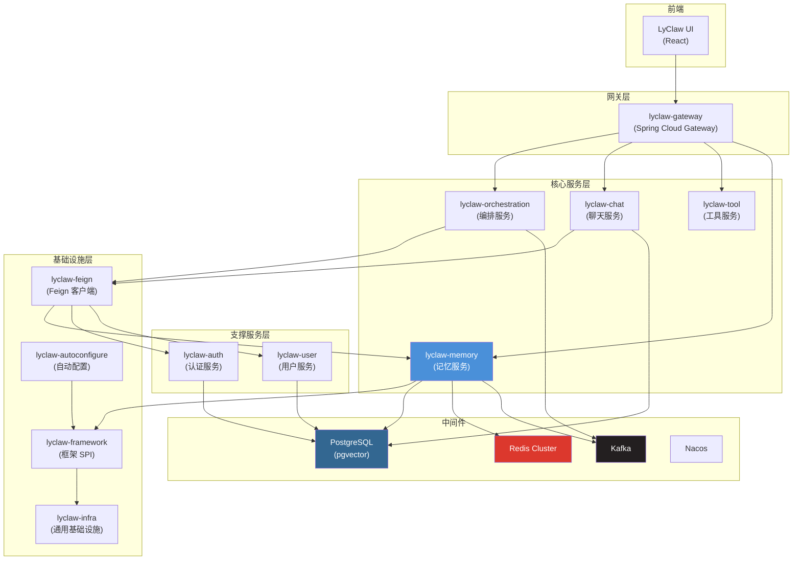
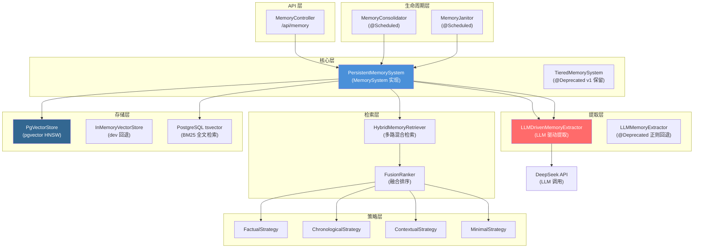
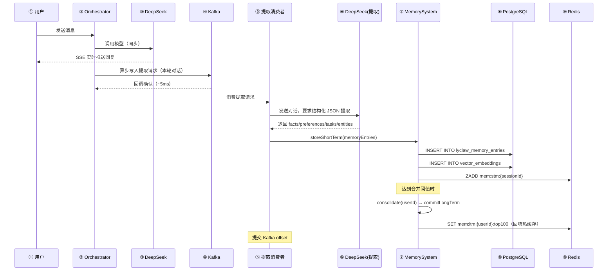
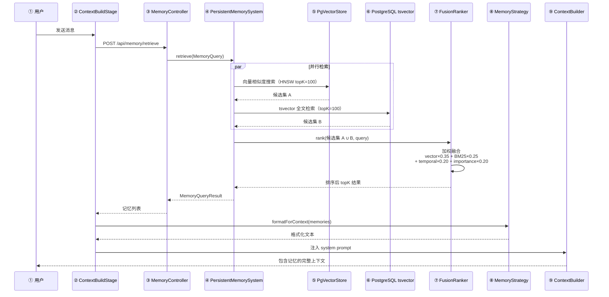

# 记忆架构设计 3.0

## 业务场景分析

**跨会话记忆连续性**
- 用户在会话 A 中告诉 AI"我在用 Spring Boot 3.2 + JDK 21，项目叫 LyClaw"，三天后在新会话 B 中问"帮我写个配置类"——AI 应自动带上 Spring Boot 3.2 和 JDK 21 的上下文
- 用户说"记住，我不喜欢用 Lombok"，后续所有会话生成的代码都不应包含 Lombok
- 用户问"上次讨论的那个 NullPointerException 怎么修的"，AI 应检索到历史会话中的相关讨论

**记忆生命周期**
- 对话中自动提取：每轮对话结束后，异步提取其中的事实、偏好、任务、实体
- 短期记忆：当前会话内高频访问的信息（如正在讨论的 bug 上下文）
- 长期记忆：跨会话持久化的知识（如用户的技术栈偏好、项目结构）
- 记忆衰减与清理：长期不访问的记忆自动降低权重，过期后归档或删除

**用户配置持久化**
- 用户在设置页面配置：默认模型、temperature、system prompt、记忆开关、检索条数
- 用户在任意设备修改配置，其他设备立即生效
- 用户关闭记忆功能后，不再提取新记忆，已存储的记忆也不会注入上下文

**记忆检索**
- 用户发消息时，自动检索与该消息语义相关的历史记忆
- 长会话中支持翻页查看更早的记忆内容
- 跨会话搜索："搜一下我之前关于 Redis 的讨论"

**规模参考**
- 百万 DAU，每用户日均产生约 20 条值得提取的记忆条目
- 长期记忆总量：百万用户 × 数百条 = 数亿条
- 检索延迟要求：记忆检索 + 注入 < 200ms（不阻塞 SSE 首字响应）


## 当前架构诊断

### 现有代码（lyclaw-memory 模块）

当前已有较完整的接口层和概念验证实现：

| 组件 | 现状 | 问题 |
|------|------|------|
| `TieredMemorySystem` | 四层 ConcurrentHashMap | 全内存，重启全丢 |
| `SimpleEmbeddingModel` | SHA-256 + 正弦伪嵌入 768d | 无语义相似度能力 |
| `InMemoryVectorStore` | 暴力余弦搜索 O(n) | 无索引，数据量大了不可用 |
| `LLMMemoryExtractor` | 正则提取（7 种模式） | 名称含 LLM 但实际不用 LLM，准确率低 |
| `HybridMemoryRetriever` | 向量+BM25+时间衰减+重要性 | 算法框架正确，但依赖伪嵌入 |
| `DefaultMemoryConsolidator` | Union-Find + Jaccard | 算法合理，但绕过了接口直接操作 TieredMemorySystem |
| `DefaultMemoryJanitor` | 去重 + 冲突解决 + 过期驱逐 | 同样绕过接口，instanceof 检查耦合 |
| `MemoryStrategy` | 接口定义了 formatForContext 等 | **零实现**，目前无人实现 |
| `MemoryPersistence` | 策略模式接口已定义 | 从未被 TieredMemorySystem 调用 |

### 十大问题

1. **无持久化**：ConcurrentHashMap 重启全丢，不满足跨会话记忆需求
2. **伪嵌入**：SHA-256 哈希无语义，向量检索形同虚设
3. **无向量索引**：O(n) 暴力搜索，百万级向量不可用
4. **正则提取**：准确率低，无法理解上下文语义
5. **MemoryStrategy 空壳**：记忆无法按策略格式化为 LLM 上下文
6. **检索参数固化**：ContextBuildStage 硬编码 topK=10，用户不可配置
7. **合并器/清理器耦合**：绕过 MemorySystem 接口直接操作实现类
8. **无异步管道**：记忆提取在请求线程中同步执行（虽然当前是正则所以很快）
9. **无用户配置**：记忆开关、检索策略等无持久化存储
10. **FusionRanker 硬编码**：权重内嵌在 HybridMemoryRetriever 中，不可切换

### 保留的资产

- **四层记忆模型**（感知→短期→长期→实体）：认知科学基础扎实，继续沿用
- **SPI 接口体系**：MemorySystem、MemoryExtractor、MemoryConsolidator、MemoryJanitor、VectorStore、EmbeddingModel、FusionRanker、MemoryStrategy——全部保留，仅补充实现
- **混合检索框架**：向量 + BM25 + 时间衰减 + 重要性的多路加权排序，公式本身不需要改
- **合并算法**：Union-Find + Jaccard 相似度去重，继续使用


## 技术选型

### 嵌入模型：SimpleEmbedding（默认）→ 本地 ONNX（可选）→ OpenAI API（v2）

| 选项 | 优势 | 劣势 | 决策 |
|------|------|------|------|
| SimpleEmbedding（SHA-256 + 正弦） | 零依赖，零成本，延迟 <1ms | 无语义相似度能力 | v1 默认 |
| 本地 ONNX BGE-M3 | 1024 维真实语义向量，离线可用，零 API 成本 | 需下载约 2GB 模型文件，CPU 推理 20-50ms | v1 可选 |
| OpenAI text-embedding-3-small | 最强语义质量，无需本地 GPU | 网络延迟，API 费用，数据隐私 | v2 |

**选型理由**：v1 默认用 SimpleEmbedding 保持零外部依赖和一键启动体验。ONNX 作为可配置的 opt-in 升级路径——用户愿意下载模型就能获得真实语义检索。OpenAI API 在 v2 引入，面向对检索质量要求高且不介意 API 成本的用户。

### 向量存储：pgvector

| 选项 | 优势 | 劣势 | 决策 |
|------|------|------|------|
| pgvector（PostgreSQL 扩展） | 复用现有 PG 连接，零新基础设施，HNSW 索引，支持 JSONB 元数据过滤 | 单节点写入瓶颈，百万级以上向量需要分片 | **选择** |
| Qdrant / Milvus | 十亿级向量性能优异，分布式原生 | 独立部署运维，增加系统复杂度，v1 用不上 | 不选 |
| InMemoryVectorStore（现有） | 零依赖 | O(n) 暴力搜索，不持久化 | 保留为 dev 降级 |

**选型理由**：对齐笔记.md 中 PostgreSQL 的技术选型。pgvector 的 HNSW 索引在 10 万级向量下查询延迟 <10ms，完全满足 v1 规模。Citus 分布式的扩展路径与 session 存储一致。

### 持久存储：PostgreSQL + MyBatis-Plus

与 notes.md 的决策完全对齐：
- JSONB 存 memory 元数据（tags、metadata），支持 GIN 索引和路径查询
- tsvector 内置全文搜索（BM25 检索路），不依赖 Elasticsearch
- pgvector 存储向量嵌入，一库多用
- MyBatis-Plus saveBatch 批量写入 256 条一批

### 异步管道：Kafka

| 用途 | topic | 说明 |
|------|-------|------|
| 记忆提取 | `lyclaw-memory-extraction` | 对话结束后异步消费，调用 LLM 提取记忆 |

对齐 notes.md 的 Kafka 技术选型。记忆提取不阻塞 SSE 响应——用户看到 AI 回复后，后台异步完成提取。失败降级写本地日志，Kafka 恢复后回放。

### 缓存：Redis Cluster

| 缓存 | key | TTL | 说明 |
|------|-----|-----|------|
| 嵌入缓存 | `emb:{model}:{sha256(text)}` | 1h | 相同文本不重复调用嵌入模型 |
| 热记忆缓存 | `mem:ltm:{userId}:top100` | 5min | 高频用户的长期记忆热缓存 |
| 会话记忆 | `mem:stm:{sessionId}` | 24h | 当前会话的短期记忆 |

对齐 notes.md 的 Redis Cluster 设计，Cache-Aside 回填模式。

### 提取模型：DeepSeek Chat

当前 LLMMemoryExtractor 用正则，准确率低。v1 改为 LLM 驱动——每轮对话结束后异步调用 DeepSeek，要求以结构化 JSON 输出提取到的 fact / preference / task / entity。单次提取消耗约 200 token，成本约 $0.0001，按每会话 50 轮对话计，每会话记忆提取成本约 $0.005。


## 整体架构

### 项目整体架构图



记忆服务（lyclaw-memory）在项目中的位置：独立的 Spring Boot 微服务，通过 Feign 暴露 API 给编排层和聊天层调用，自身依赖 PostgreSQL（pgvector）、Redis Cluster、Kafka。

### 记忆系统内部架构



### 记忆提取与存储数据流



**① 用户发送消息**：携带 sessionId，进入编排流水线。

**② Orchestrator 处理**：ContextBuildStage 先检索记忆注入上下文，然后调用 AI 模型。

**③ AI 模型返回**：DeepSeek 返回 assistant 消息（可能含 tool_calls）。SSE 实时推送给用户，不等持久化。

**④ 写入 Kafka**：Orchestrator 在 SSE 返回后，将本轮对话异步写入 `lyclaw-memory-extraction` topic。`acks=1`，延迟约 5ms，不阻塞响应。

**⑤ 提取消费者**：从 Kafka 拉取对话，调用 DeepSeek 做结构化提取。Prompt 模板要求输出 JSON，包含 facts（事实）、preferences（偏好）、tasks（任务）、entities（实体）。

**⑥ LLM 返回结构化 JSON**：提取消费者解析 JSON，构造 `MemoryEntry` 列表。

**⑦ 存入 MemorySystem**：调用 `storeShortTerm()` 存入短期记忆层，同时生成向量嵌入写入 pgvector。

**⑧ 写入 PostgreSQL**：`lyclaw_memory_entries` 存文本，`vector_embeddings` 存向量。MyBatis-Plus saveBatch 批量写入。

**⑨ 更新 Redis**：短期记忆写入 Redis ZSET（TTL 24h），提交 Kafka offset。合并后的长期记忆回填热缓存（TTL 5min）。

### 记忆检索与注入流



**① 用户发送消息**：触发 ContextBuildStage（编排流水线阶段 0）。

**② ContextBuildStage**：以用户消息文本构造 `MemoryQuery`（topK=10），调用 MemoryFeignClient。

**③ MemoryController**：接收 retrieve 请求，转发到 PersistentMemorySystem。

**④ PersistentMemorySystem**：并行触发向量检索和 BM25 全文检索。

**⑤ PgVectorStore**：用户消息 → EmbeddingModel 生成向量 → pgvector HNSW 索引查询余弦相似度 topK=100。

**⑥ PostgreSQL tsvector**：用户消息分词 → `to_tsvector('jieba', content) @@ plainto_tsquery('jieba', query)` → topK=100。

**⑦ FusionRanker**：两路候选集去重合并，加权计算综合分数（向量 0.35 + BM25 0.25 + 时间衰减 0.20 + 重要性 0.20），取 topK 返回。

**⑧ MemoryStrategy**：将检索到的记忆按策略格式化——FactualStrategy 输出"已知事实: ..."，ContextualStrategy 按相关度降序排列。

**⑨ ContextBuilder**：格式化后的记忆文本以 `<memory>...</memory>` XML 标签注入到 system prompt 中，在会话历史之前。


## 核心组件设计

### PersistentMemorySystem（主实现，替代 ConcurrentHashMap）

`PersistentMemorySystem implements MemorySystem`，实现 MemorySystem 接口的全部方法，用 PostgreSQL 替代 ConcurrentHashMap。

**存储层级映射：**

| 记忆层 | 存储 | 说明 |
|--------|------|------|
| SENSORY | Redis ZSET `sensory:{sessionId}` TTL=1h | 对话原始感知数据，高吞吐、短生命周期 |
| SHORT_TERM | Redis ZSET `stm:{sessionId}` TTL=24h + PG 表 | 当前会话提取的记忆，会话内高频访问 |
| LONG_TERM | PostgreSQL `lyclaw_memory_entries` + pgvector `vector_embeddings` | 跨会话持久化，合并后提升至此 |
| ENTITY | PostgreSQL `lyclaw_memory_entries`（entity_type + entity_id 联合索引） | 结构化实体（人、项目、技术栈） |

**关键设计点：**
- `ingestPerception()`：写入 Redis ZSET，不落 PG（感知数据量大且生命周期短）
- `storeShortTerm()`：同时写 Redis ZSET + PG 表（异步），PG 是主存储
- `commitLongTerm()`：更新 PG 中条目的 layer 字段为 LONG_TERM，衰减因子降低
- `retrieve()`：调用 HybridMemoryRetriever 执行多路检索
- `consolidate()`：调用 MemoryConsolidator，将高重要性短期记忆提升为长期
- 与 TieredMemorySystem 通过配置 `lyclaw.memory.provider` 切换

### PgVectorStore（向量存储）

`PgVectorStore implements VectorStore`，基于 PostgreSQL pgvector 扩展。

- 表：`vector_embeddings(collection, vector(1024), metadata JSONB)`
- 索引：HNSW `(m=16, ef_construction=200)`，10 万向量下查询 <10ms
- 维度：1024（BGE-M3 ONNX）或 768（SimpleEmbedding），创建时自动检测
- 过滤：metadata JSONB 支持 `userId`、`category`、`sessionId` 等条件过滤
- 搜索：`SELECT ... ORDER BY vector <=> query_vector LIMIT topK`
- 回退：pgvector 不可用时降级到 InMemoryVectorStore

### LLMDrivenMemoryExtractor（LLM 驱动提取）

`LLMDrivenMemoryExtractor implements MemoryExtractor`，替代正则提取。

- 触发：Kafka 消费者异步调用，不阻塞 SSE 响应
- 输入：本轮对话的全部消息（user + assistant + tool）
- Prompt 模板（核心）：
  ```
  从以下对话中提取关键信息，以 JSON 格式输出。提取类型：
  - fact: 陈述的事实（技术栈、版本号、项目名等）
  - preference: 用户的偏好和习惯（不喜欢 Lombok、喜欢函数式风格等）
  - task: 正在进行或计划的任务
  - entity: 涉及的人、项目、系统

  输出格式：[{"type": "...", "content": "...", "importance": 0.0-1.0}]
  只输出 JSON，不要其他内容。
  ```
- 回退：LLM 调用失败时降级到现有的 `LLMMemoryExtractor`（正则提取）
- 成本控制：通过 `lyclaw.memory.extraction.llm-driven` 开关控制，默认关闭

### MemoryStrategy 实现（四种格式化策略）

| 策略 | 适用场景 | 格式 |
|------|----------|------|
| **FactualStrategy** | 需要准确事实的问答 | `已知事实:\n- {content}\n- {content}` |
| **ChronologicalStrategy** | 时间敏感的对话 | `历史记录:\n[{createdAt}] {content}\n...` |
| **ContextualStrategy** | 通用场景（默认） | 按 relevanceScore 降序：`相关记忆:\n- {content}` |
| **MinimalStrategy** | Token 预算紧张 | 单行压缩：`记忆: {summary1}; {summary2}` |

所有策略实现 `MemoryStrategy` 接口，通过 `shouldIncludeInContext()` 过滤不相关内容（如过期的、重要度低于阈值的）。策略选择由用户配置控制，默认 ContextualStrategy。

### HybridMemoryRetriever（保留增强）

保留现有的多路检索算法框架，改动两处：
1. 向量检索委托给 `PgVectorStore`（非 InMemoryVectorStore）
2. BM25 委托给 PostgreSQL tsvector 全文检索（非内存中的简单关键词匹配）

融合公式不变：
```
score = α × vectorCosine + β × bm25Score + γ × temporalDecay + δ × importance
```
权重从配置文件读取，用户可在前端调整（通过用户配置持久化）。

### MemoryConsolidator & MemoryJanitor（保留修复）

- **DefaultMemoryConsolidator**：保留 Union-Find + Jaccard（阈值 0.6）合并算法，修复为通过 MemorySystem 接口操作而非直接操作实现类
- **DefaultMemoryJanitor**：去掉 `instanceof TieredMemorySystem` 硬编码检查，改为通过 MemorySystem 接口的 `getLongTermEntries()` 和 `removeLongTermEntry()` 操作
- **LLMDrivenConsolidator**（新增）：批量调用 LLM 合并相似记忆并生成摘要，在 v1 作为可选的高级合并策略
- 调度：`@Scheduled(cron = "${lyclaw.memory.lifecycle.consolidation.schedule}")` / `@Scheduled(cron = "${lyclaw.memory.lifecycle.janitor.schedule}")`


## 用户配置持久化

### 可配置项

| 配置项 | 默认值 | 说明 |
|--------|--------|------|
| `memory.enabled` | true | 记忆功能总开关 |
| `memory.retrieval.topK` | 10 | 每次检索返回的记忆条数 |
| `memory.retrieval.strategy` | contextual | 格式化策略：factual / chronological / contextual / minimal |
| `memory.extraction.llm-driven` | false | LLM 提取开关（false 时用正则） |
| `memory.lifecycle.retention-days` | 90 | 长期记忆保留天数 |
| `memory.lifecycle.auto-consolidate` | true | 是否自动合并记忆 |

### 存储方案

- 表：`lyclaw_user_configs(user_id, config_key, config_value JSONB, updated_at)`，联合主键 `(user_id, config_key)`
- 读写路径：强一致 PG 写入（同步），读取走 Cache-Aside Redis
- API：`GET /api/user/config/memory` / `PUT /api/user/config/memory`，body 为 JSON 键值对
- 生效机制：写入 PG → 失效 Redis key `user:config:{userId}:memory` → 下次检索时读新配置

### 前端配置页面

用户在设置页面的"记忆设置"区域：
- 开关：启用/关闭记忆功能
- 滑块：记忆检索条数（1-50）
- 下拉：记忆策略（事实型/时间型/上下文型/最小型）
- 开关：LLM 智能提取（提示"开启后记忆更准确，但会产生少量 API 费用"）
- 数字：保留天数（7-365）

这些配置通过 `PUT /api/user/config/memory` 持久化到 PostgreSQL，跨设备登录后自动同步。


## 数据库设计

### lyclaw_memory_entries（记忆条目表）

```sql
CREATE TABLE lyclaw_memory_entries (
    id            VARCHAR(32) PRIMARY KEY,
    user_id       VARCHAR(32) NOT NULL,
    session_id    VARCHAR(64),
    layer         VARCHAR(20) NOT NULL DEFAULT 'SHORT_TERM',
    content       TEXT NOT NULL,
    summary       VARCHAR(500),
    category      VARCHAR(20),          -- FACT / PREFERENCE / TASK / EVENT / ENTITY
    importance    DOUBLE PRECISION DEFAULT 0.5,
    access_count  INTEGER DEFAULT 0,
    decay_factor  DOUBLE PRECISION DEFAULT 0.02,
    tags          JSONB DEFAULT '[]',
    metadata      JSONB DEFAULT '{}',
    entity_type   VARCHAR(50),
    entity_id     VARCHAR(64),
    created_at    TIMESTAMPTZ DEFAULT NOW(),
    updated_at    TIMESTAMPTZ DEFAULT NOW()
);

CREATE INDEX idx_mem_user_layer ON lyclaw_memory_entries(user_id, layer);
CREATE INDEX idx_mem_session ON lyclaw_memory_entries(session_id);
CREATE INDEX idx_mem_entity ON lyclaw_memory_entries(entity_type, entity_id);
CREATE INDEX idx_mem_content_fts ON lyclaw_memory_entries
    USING GIN (to_tsvector('simple', content));
```

### vector_embeddings（向量嵌入表）

```sql
CREATE EXTENSION IF NOT EXISTS vector;

CREATE TABLE vector_embeddings (
    id          VARCHAR(64) PRIMARY KEY,
    collection  VARCHAR(128) NOT NULL,   -- memory / document / entity
    vector      VECTOR(1024),            -- 维度取决于嵌入模型
    metadata    JSONB DEFAULT '{}',      -- {userId, memoryEntryId, category}
    created_at  TIMESTAMPTZ DEFAULT NOW()
);

CREATE INDEX idx_vec_collection ON vector_embeddings(collection);
CREATE INDEX idx_vec_hnsw ON vector_embeddings
    USING hnsw (vector vector_cosine_ops)
    WITH (m = 16, ef_construction = 200);
```

### lyclaw_user_configs（用户配置表）

```sql
CREATE TABLE lyclaw_user_configs (
    user_id      VARCHAR(32) NOT NULL,
    config_key   VARCHAR(128) NOT NULL,  -- 如 "memory.retrieval.topK"
    config_value JSONB NOT NULL,         -- 任意 JSON 值
    updated_at   TIMESTAMPTZ DEFAULT NOW(),
    PRIMARY KEY (user_id, config_key)
);
```


## 配置设计

```yaml
lyclaw:
  memory:
    enabled: true
    provider: persistent                    # persistent(3.0) / inmemory(旧版)
    embedding:
      provider: simple                      # simple / local-onnx
      model: BGE-M3                         # ONNX 模型名，仅 local-onnx 时生效
      dimension: 768                        # 自动检测，simple=768, BGE-M3=1024
    vector-store:
      provider: pgvector                    # pgvector / inmemory
    retrieval:
      default-top-k: 10                     # 1-50
      fusion-method: weighted_sum           # weighted_sum / rrf
      fusion-weights:
        vector: 0.35
        bm25: 0.25
        temporal: 0.20
        importance: 0.20
    lifecycle:
      consolidation:
        schedule: "0 0 * * * *"             # 每小时
        importance-threshold: 0.7           # 重要度 >= 0.7 才提升为长期记忆
        dedup-threshold: 0.85               # Jaccard >= 0.85 视为重复
      janitor:
        schedule: "0 0 3 * * *"             # 每天凌晨 3 点
        retention-days: 90
    extraction:
      llm-driven: false                     # true=LLM提取, false=正则提取
      model: deepseek-chat                  # LLM 提取用的模型
    cache:
      embedding-ttl: 3600                   # 嵌入缓存 TTL(秒)
      hot-memory-ttl: 300                   # 热记忆缓存 TTL(秒)
```


## 实现路线图

### v1（本文档范围）

- [ ] PersistentMemorySystem 替代 ConcurrentHashMap，PostgreSQL 持久化
- [ ] PgVectorStore（HNSW 索引）
- [ ] LLMDrivenMemoryExtractor（DeepSeek 异步提取）
- [ ] MemoryStrategy 四种实现（Factual / Chronological / Contextual / Minimal）
- [ ] 用户配置持久化（lyclaw_user_configs 表 + REST API）
- [ ] Kafka 异步提取管道
- [ ] @Scheduled 定时 consolidation 和 janitor
- [ ] Redis 嵌入缓存 + 热记忆缓存
- [ ] 前端设置页"记忆设置"区域（UI）

### v2（后续）

- [ ] RAG 文档处理管道（PDF/Markdown 解析、分块、索引）
- [ ] ONNX BGE-M3 本地嵌入模型（opt-in）
- [ ] 知识图谱（实体关系提取、图遍历检索）
- [ ] Cross-Encoder 重排序（提升检索精度）
- [ ] 多嵌入提供商支持

### v3（远期）

- [ ] 知识库管理 UI（上传文档、设置知识库可见性）
- [ ] 多租户知识图谱共享
- [ ] Learning-to-Rank 检索融合（用户反馈驱动）


## 关键文件清单

**新增文件（lyclaw-memory 模块）：**
- `impl/PersistentMemorySystem.java` — MemorySystem 主实现（替代 TieredMemorySystem）
- `impl/PgVectorStore.java` — pgvector 向量存储实现
- `impl/LLMDrivenMemoryExtractor.java` — LLM 驱动提取（替代 LLMMemoryExtractor）
- `strategy/FactualStrategy.java` — 事实型格式化策略
- `strategy/ChronologicalStrategy.java` — 时间型格式化策略
- `strategy/ContextualStrategy.java` — 上下文型格式化策略
- `strategy/MinimalStrategy.java` — 最小型格式化策略
- `impl/LLMDrivenConsolidator.java` — LLM 驱动合并（可选）

**修改文件：**
- `lyclaw-framework/.../memory/MemoryEntry.java` — 补全持久化相关字段
- `lyclaw-framework/.../memory/MemoryQuery.java` — 增加 strategy 字段
- `lyclaw-memory/.../impl/HybridMemoryRetriever.java` — 委托 PgVectorStore
- `lyclaw-memory/.../impl/DefaultMemoryJanitor.java` — 去掉 instanceof TieredMemorySystem
- `lyclaw-orchestration/.../stage/ContextBuildStage.java` — 读取用户配置，使用 MemoryStrategy 格式化
- `lyclaw-feign/.../MemoryFeignClient.java` — 新增用户配置相关端点

**废弃文件：**
- `lyclaw-memory/.../impl/TieredMemorySystem.java` — 标记 @Deprecated，provider=inmemory 时可用
- `lyclaw-memory/.../impl/LLMMemoryExtractor.java` — 标记 @Deprecated，作为 LLM 提取的降级回退
