# LyClaw 微服务架构设计文档

> **版本**: v1.0 | **日期**: 2026-05-10 | **作者**: LyClaw 架构团队
>
> 本文档全面阐述 LyClaw——一个基于 Spring Cloud Alibaba 微服务架构的 AI 编程助手框架——的系统设计、核心机制、模块分解、协议层、前端架构及部署方案。

---

## 目录

- [第一章 项目概述与背景](#第一章-项目概述与背景)
- [第二章 分层架构总览](#第二章-分层架构总览)
- [第三章 模块详细分解](#第三章-模块详细分解)
- [第四章 领域模型与DTO](#第四章-领域模型与dto)
- [第五章 四元AI循环](#第五章-四元ai循环)
- [第六章 七阶段SSE管道](#第六章-七阶段sse管道)
- [第七章 MCP/A2A协议层](#第七章-mcpa2a协议层)
- [第八章 多Agent协作模式](#第八章-多agent协作模式)
- [第九章 模型适配器层](#第九章-模型适配器层)
- [第十章 基础设施层](#第十章-基础设施层)
- [第十一章 前端架构](#第十一章-前端架构)
- [第十二章 部署与运维](#第十二章-部署与运维)
- [附录](#附录)

---

---

# 第一章  项目概述与背景

## 1.1 什么是 LyClaw

LyClaw 是一个**基于多智能体协作的 AI 编码助手框架**（AI-Powered Coding Assistant Framework with Multi-Agent Collaboration）。其名称 "LyClaw" 取义于 "Lynx Claw"（猞猁之爪），寓意系统如猞猁般敏锐、精准、高效地理解并执行开发者的编码意图。

### 1.1.1 产品定位

LyClaw 并非一个简单的"聊天机器人"或"代码补全工具"。它的设计目标是为开发者提供一个**可嵌入、可编排、可观测**的软件工程智能体底座。在 LyClaw 的世界观中，编码活动被建模为由多个专业化 AI 智能体（Agent）协作完成的知识工作流——而非单一大模型的一次性问答。

具体来说，LyClaw 可以扮演以下角色：

- **IDE 插件的后端服务**：接收 IDE 传来的代码上下文和用户意图，编排多智能体完成重构、调试、代码生成等任务
- **CLI 工具的核心引擎**：作为命令行 AI 助手的推理与执行引擎，支持管道式任务编排
- **CI/CD 流水线的智能审查节点**：在代码合入前自动进行代码审查、安全扫描、测试用例生成
- **独立的知识工作自动化平台**：通过 MCP/A2A 协议与外部系统对接，构建跨工具的智能工作流

### 1.1.2 工作流程概要

用户通过前端界面提交自然语言编码请求后，系统的处理流程如下：

1. **网关接收**：Spring Cloud Gateway 接收 HTTP 请求，根据路径前缀路由至对应微服务
2. **编排启动**：Orchestration 服务构建 ChatContext（包含会话、消息历史、记忆内容、工具定义、拦截器链）
3. **记忆检索**：Memory 服务根据当前会话和用户意图，从四层记忆中检索相关上下文
4. **任务规划**：Plan 服务将用户意图分解为可执行的任务图（TaskGraph），选择合适的规划策略
5. **工具执行**：Action 服务按拓扑顺序调度工具和技能，每个工具调用经过沙箱隔离和安全策略校验
6. **质量反思**：Reflect 服务对执行结果进行多维度评估，检测幻觉、逻辑矛盾，低于阈值时触发策略调整
7. **流式响应**：全链路使用 SSE（Server-Sent Events）将结果实时推送回前端

### 1.1.3 核心能力矩阵

| 能力维度 | 具体描述 |
|---------|---------|
| **多模型适配** | 统一抽象层屏蔽 DeepSeek、MiniMax、OpenAI、Anthropic 等模型 API 差异 |
| **任务规划** | 支持 DAG（有向无环图）、CoT（思维链）、ReAct、层级递归四种规划策略 |
| **工具调用** | 内置 Calculator、Command、WebSearch、CurrentTime 等工具，支持沙箱隔离执行 |
| **技能编排** | 工具可组合为技能（Skill），形成有向技能图谱（SkillGraph），支持工具到技能的适配转换 |
| **多层记忆** | 四层记忆体系：感知记忆 → 短期记忆 → 长期记忆 → 实体记忆，带重要性评分和衰减函数 |
| **质量反思** | 多维度输出评估：准确性（35%）、完整性（30%）、安全性（20%）、用户体验（15%） |
| **协议互通** | 支持 MCP（Model Context Protocol）工具发现与 A2A（Agent-to-Agent）通信 |
| **流式推送** | 基于 WebFlux + SSE 的全链路流式响应，支持 `[DONE]` 结束标记与指数退避自动重连 |
| **会话管理** | 支持创建、查询、删除会话，会话状态存储于 ConcurrentHashMap 中 |
| **配置热更新** | 模型配置通过 ConfigStorage 持久化，支持运行时动态切换模型和提供者 |
| **可观测性** | 基于 Micrometer 的指标采集，TraceContext 提供全链路请求跟踪 |

---

## 1.2 核心设计哲学

### 1.2.1 四元 AI 认知循环（Quaternion AI Cycle）

LyClaw 将 AI 智能体的认知过程抽象为四个正交维度，每个维度既是独立的微服务，又通过 Feign 声明式 HTTP 调用和共享数据总线形成闭环。这四个维度对应认知心理学中的经典模型：

```
                    ┌──────────────┐
                    │   用户输入    │
                    └──────┬───────┘
                           │
                           ▼
    ┌──────────┐     ┌──────────┐     ┌──────────┐     ┌──────────┐
    │  Memory  │◄───▶│   Plan   │────▶│  Action  │────▶│ Reflect  │
    │  (记忆)   │     │  (规划)   │     │  (行动)   │     │  (反思)   │
    └──────────┘     └──────────┘     └──────────┘     └────┬─────┘
         ▲                                                  │
         └──────────────────── 反馈 ────────────────────────┘
```

- **Plan（规划层）**：接收用户意图和记忆检索结果，选择合适的规划策略（DAG/CoT/ReAct/Hierarchical），将复杂任务分解为可执行的任务节点图（TaskGraph）。每个节点指定类型（tool/skill）、所需工具集、依赖关系和超时约束。PlanController 支持 6 种分解策略：SEQUENTIAL（顺序链）、BY_DOMAIN（按领域分组）、BY_PHASE（分析→设计→实现→验证）、PARALLEL_INDEPENDENT（独立并行）、LLM_DRIVEN（大模型自主决策）、TREE（自顶向下递归拆分）。

- **Action（行动层）**：消费 TaskPlan，按拓扑顺序调度 TaskNode 的执行。每个节点可以是"tool"类型（直接调用工具，超时 30 秒）或"skill"类型（调用组合技能，超时 60 秒）。ActionExecutorImpl 内置 4 线程固定池执行器（`Executors.newFixedThreadPool(4)`），确保同步阻塞的工具调用不阻塞 WebFlux 事件循环。所有工具调用经过 ToolCallPolicy 策略校验和 ToolSandbox 沙箱隔离。

- **Reflect（反思层）**：对 Action 的输出进行加权多维度质量评估。`ReflectionEngineImpl` 加权公式为 `0.35*accuracy + 0.30*completeness + 0.20*safety + 0.15*userExperience`。当综合评分低于 0.6 阈值或检测到错误时，触发 StrategyAdjustment 建议。错误检测覆盖三类：幻觉检测（hallucination）、逻辑矛盾检测（logic contradiction）、工具调用失败模式检测（tool failure pattern）。

- **Memory（记忆层）**：四层分级记忆系统贯穿全流程。感知层瞬时摄入用户输入和工具返回，短期层维护会话级上下文，长期层沉淀跨会话知识，实体层存储结构化领域实体。记忆检索采用四因子加权混合算法，合并（Consolidation）过程将高重要性短期记忆提升为长期记忆，看门人（Janitor）定期清理过期感知数据。

### 1.2.2 微服务化分解原则

LyClaw 从早期 14 个 Maven 模块的单体架构演进而来，拆分遵循以下四项原则：

**原则一：有界上下文（Bounded Context）**

每个微服务对应一个明确的领域边界。Plan 服务只关心「如何将用户意图分解为可执行步骤」，不关心「这些步骤具体如何执行」；Action 服务只关心「如何安全地调度工具和技能」，不关心「执行结果的质量评估」。这种清晰的边界使得每个服务的代码量可控、团队可独立负责。

**原则二：独立可替换性（Replaceability）**

每个服务的内部实现对其他服务透明。例如，Memory 服务当前使用内存级 `ConcurrentHashMap` 作为向量存储（`InMemoryVectorStore`），未来可替换为 Milvus 或 Pinecone，只需实现 `MemoryRetriever` 接口，其余服务完全无感。同样，Plan 服务的 DAG 规划器可替换为更复杂的图优化算法，Action 服务的工具注册表可替换为远程工具市场。

**原则三：弹性与隔离（Resilience & Isolation）**

任何单个服务的故障不应导致全链路崩溃。例如：
- Action 服务的工具执行超时时，Reflect 服务仍能基于已有输出进行评估
- Plan 服务的任务分解失败时，Orchestration 服务可降级为原始用户消息直接传递给 Protocol 服务
- Memory 服务不可用时，各服务仍能基于本地缓存和会话上下文继续工作

**原则四：技术异构准备（Polyglot Readiness）**

虽然当前全部服务统一使用 Spring Boot WebFlux + Maven，但架构设计上不排斥技术异构。只要每个服务对外保持 REST API + Feign 接口契约不变，未来可以：
- 将 Memory 服务用 Python + FastAPI 重写，利用 Python 生态的向量数据库驱动
- 将 Plan 服务用 Go 重写，利用其高并发性能处理大规模任务图计算
- 将 Reflect 服务用 Rust 重写，利用其安全性和零成本抽象进行文本分析

### 1.2.3 管道-拦截器架构模式

LyClaw 的整体编排采用**管道（Pipeline）+ 拦截器链（InterceptorChain）**模式，这是从 Netty 和 Spring WebFlux 的设计中汲取的灵感：

```java
// 管道接口：定义有序的处理阶段序列
public interface Pipeline {
    void execute(ChatContext context);
    List<PipelineStage> getStages();
}

// 责任链接口：控制阶段流转和中断
public interface Chain {
    void next(ChatContext context);       // 推进到下一阶段
    void breakChain(ChatContext context); // 中断管道
    int getCurrentStage();                // 获取当前阶段索引
}

// 拦截器接口：在阶段边界插入横切关注点
public interface Interceptor {
    void beforeStage(ChatContext context, int stageIndex);
    void afterStage(ChatContext context, int stageIndex);
    void onError(ChatContext context, Throwable error);
}
```

Pipeline 定义了一系列有序的 PipelineStage，每个阶段执行一个特定的处理步骤（如"记忆检索"、"任务规划"、"工具执行"）。Chain 控制阶段的顺序流转和条件中断。InterceptorChain 在阶段边界以 AOP（面向切面编程）方式插入可插拔的横切关注点，实现了业务逻辑与技术关注的彻底分离。典型的拦截器包括：

- **日志拦截器**：记录每个阶段的入参、出参、耗时
- **安全拦截器**：校验用户权限和工具调用许可
- **限流拦截器**：基于令牌桶或滑动窗口控制每个用户的并发请求数
- **埋点拦截器**：向 Micrometer 注册阶段级别的延迟和成功率指标
- **跟踪拦截器**：通过 TraceContext 传播 traceId 和 spanId

### 1.2.4 上下文传播模型

所有服务间的调用都通过 `ChatContext` 对象进行上下文传播。`ChatContext` 是贯穿整个请求生命周期的数据载体：

```java
public class ChatContext {
    private final ChatRequest request;           // 原始请求
    private Session session;                     // 会话状态（可更新）
    private final MemoryContent memory;          // 记忆检索结果
    private final List<Message> messages;        // 消息历史
    private final List<ToolDefinition> toolDefinitions; // 可用工具列表
    private final InterceptorChain interceptorChain;    // 拦截器链
    private final ModelProvider modelProvider;          // 模型提供者
    private ChatResult result;                   // 处理结果（可更新）
    private final TraceContext tracing;          // 链路跟踪上下文
    private final Map<String, Object> attributes; // 扩展属性（key-value）
}
```

`ChatContext` 的设计遵循"不可变对象 + 可变字段"的混合模式：核心引用（request、memory、toolDefinitions）在构造后不可变，确保线程安全；而 session、result、attributes 可在管道执行过程中被更新。`TraceContext` 内置 traceId 和 spanId，支持集成 OpenTelemetry 等分布式链路追踪系统。

---

## 1.3 技术栈全景

### 1.3.1 后端技术栈详解

| 层次 | 技术 | 版本 | 选型理由 |
|------|------|------|---------|
| **语言运行时** | Java | 17 (LTS) | 长期支持版本，成熟生态，Spring Boot 3.x 最低要求；支持 Sealed Classes、Pattern Matching、Records 等现代语法 |
| **基础框架** | Spring Boot | **3.5.14** | 响应式优先（WebFlux 为一级公民）、AOT 编译支持、GraalVM Native Image 友好、虚拟线程预览 |
| **微服务治理** | Spring Cloud | **2025.0.0** | 最新功能主线，与 Spring Boot 3.5.x 对齐，包含服务发现、负载均衡、熔断降级的完整生态 |
| **服务注册/配置** | Spring Cloud Alibaba + Nacos | **2025.0.0.0 / 2.5** | 国产微服务生态首选；Nacos 2.5 支持 gRPC 通信协议（替代 HTTP 长轮询）、xDS 协议支持、配置变更实时推送 |
| **API 网关** | Spring Cloud Gateway | (随 Cloud 2025.0) | 基于 WebFlux 的响应式网关，与后端 WebFlux 统一编程模型；支持动态路由、限流、熔断 |
| **声明式 RPC** | OpenFeign + LoadBalancer | (随 Cloud 2025.0) | 接口驱动的服务间通信，通过注解声明即可自动生成 HTTP 客户端，与 Nacos 服务发现无缝集成 |
| **响应式 Web** | Spring WebFlux (Reactor 3.6.8) | 3.6.8 | 全链路非阻塞 I/O，基于 Netty 的事件循环模型，SSE 流式响应的技术基石；支持背压（Backpressure） |
| **HTTP 客户端** | OkHttp 4.12.0 / Retrofit 2.9.0 | — | OkHttp 提供连接池复用、HTTP/2 支持、自动重试；Retrofit 提供声明式 HTTP 接口定义 |
| **工具集合** | Hutool 5.8.44 | — | 国产全能工具类库，涵盖日期、加密、HTTP、JSON、文件、图片等常见操作 |
| **代码简化** | Lombok 1.18.36 | — | 编译期注解处理器，消除 getter/setter/constructor 等样板代码 |
| **可观测性** | Micrometer 1.14.5 | — | 厂商无关的指标采集门面，支持对接 Prometheus + Grafana / InfluxDB / Datadog |
| **构建工具** | Maven + Enforcer 3.4.1 | — | 多模块依赖管理；Enforcer 插件强制执行 Java 版本、Maven 版本和依赖收敛规则，防止循环依赖 |

### 1.3.2 前端技术栈

| 技术 | 版本 | 用途 |
|------|------|------|
| Vue 3 | ^3.5.32 | 渐进式前端框架，Composition API 提供更好的逻辑复用和类型推导 |
| Vite | ^8.0.8 | 新一代前端构建工具，利用浏览器原生 ES Module 实现极速 HMR（热模块替换） |
| TypeScript | ~5.7.0 | JavaScript 的超集，提供静态类型检查，提升大型前端项目的可维护性 |
| Pinia | ^2.3.1 | Vue 3 官方推荐的状态管理库，轻量且完全支持 TypeScript |
| Vue Router | ^4.5.1 | Vue 3 官方路由管理器，支持动态路由、导航守卫、路由元信息 |
| Marked | ^18.0.2 | 高性能 Markdown 解析与渲染引擎，用于展示 AI 生成的格式化内容 |
| vue-tsc | ^2.2.8 | Vue 模板的类型检查工具，确保模板中的类型安全 |

### 1.3.3 前端 SSE 客户端实现

前端通过自定义的 `useSSE` 组合式函数（Composable）消费后端 SSE 流。该实现封装了完整的 SSE 协议处理逻辑，特点如下：

- **基于 Fetch API 的流式读取**：使用 `ReadableStream.getReader()` 逐块读取响应体，通过 `TextDecoder` 将字节流解码为文本，累积到缓冲区后按行解析
- **SSE 协议解析**：正确处理 SSE 标准的 `event:` 和 `data:` 字段，支持多行 data 合并（以空行作为事件结束标记）
- **Unicode 转义解码**：使用正则 `\\u([0-9a-fA-F]{4})` 匹配并转换为 `String.fromCharCode`，解决流式传输中文时的编码问题
- **`[DONE]` 结束标记**：识别服务器发送的 `[DONE]` 标记作为流结束信号，同时以流自然关闭作为兜底
- **指数退避自动重连**：最大 5 次重试，延迟按 `2^n * 2000ms` 递增（2s、4s、8s、16s、32s），通过 `setTimeout` 调度
- **AbortController 连接管理**：通过 `AbortController` 提供的 `AbortSignal` 实现可取消的网络请求，`disconnect()` 时清理定时器和挂起连接
- **连接状态机**：维护 `disconnected → connecting → connected → reconnecting → disconnected` 的状态流转，通过 `ConnectionState` 类型向外暴露

### 1.3.4 Maven 多模块工程结构

父 POM 定义了统一的依赖版本管理和公共插件配置，所有 13 个子模块（7 个服务 + 6 个共享库）由父 POM 集中管理：

```xml
<!-- 父 POM 核心配置片段 -->
<groupId>lyjew.com</groupId>
<artifactId>LyClaw</artifactId>
<version>0.0.1-SNAPSHOT</version>
<packaging>pom</packaging>

<properties>
    <java.version>17</java.version>
    <spring-boot.version>3.5.14</spring-boot.version>
    <spring-cloud.version>2025.0.0</spring-cloud.version>
    <spring-cloud-alibaba.version>2025.0.0.0</spring-cloud-alibaba.version>
    <reactor.version>3.6.8</reactor.version>
    <okhttp.version>4.12.0</okhttp.version>
    <retrofit.version>2.9.0</retrofit.version>
    <hutool.version>5.8.44</hutool.version>
    <lombok.version>1.18.36</lombok.version>
</properties>

<modules>
    <module>lyclaw-common</module>         <!-- L1 基础层 -->
    <module>lyclaw-core</module>           <!-- L1 核心接口层 -->
    <module>lyclaw-infra</module>          <!-- L0 基础设施层 -->
    <module>lyclaw-protocol</module>       <!-- L3 协议层 -->
    <module>lyclaw-adapter</module>        <!-- L2 适配器层 -->
    <module>lyclaw-plan</module>           <!-- L4 四元核心：规划 -->
    <module>lyclaw-memory</module>         <!-- L4 四元核心：记忆 -->
    <module>lyclaw-action</module>         <!-- L4 四元核心：行动 -->
    <module>lyclaw-reflect</module>        <!-- L4 四元核心：反思 -->
    <module>lyclaw-orchestration</module>  <!-- L5 编排层 -->
    <module>lyclaw-facade</module>         <!-- L6 门面层 -->
    <module>lyclaw-storage</module>        <!-- 存储实现 -->
    <module>lyclaw-gateway</module>        <!-- L8 网关层 -->
</modules>
```

父 POM 通过 `dependencyManagement` 统一管理 Spring Boot BOM、Spring Cloud BOM、Spring Cloud Alibaba BOM 三大 BOM，确保子模块继承一致的传递依赖版本。同时通过 `maven-enforcer-plugin` 强制执行依赖收敛规则，防止版本冲突和循环依赖。

---

## 1.4 项目演进历史

### 1.4.1 阶段一：Maven 多模块单体（v0.0.x）

最初 LyClaw 是一个典型的 Maven 多模块单体工程，包含 14 个子模块。各模块虽然在编译期通过 Maven 依赖实现了代码隔离（独立的 JAR 依赖），但运行时被 Spring Boot Maven Plugin 打包成单一的 fat JAR，所有代码运行在同一个 JVM 进程中。

这一阶段的核心理念是"编译期模块化，运行期一体化"。模块间通过 Spring 依赖注入进行直接方法调用，不涉及任何网络通信。这种架构的优点是开发效率高、调试方便、无网络开销；但随着功能膨胀，暴露出以下痛点：

- **模块边界模糊化**：核心模块（`lyclaw-engine`）逐渐成为"大泥球"（Big Ball of Mud），承载了编排逻辑、记忆管理、任务规划、工具执行等几乎所有业务逻辑，类文件超过 100 个，包结构复杂
- **无法独立部署**：任何局部修改都需重新构建和部署整个 fat JAR（通常 80MB+），部署和启动耗时
- **无法独立扩缩容**：JVM 堆内存需要在所有功能间共享，无法针对性地扩大记忆存储或规划计算的内存
- **单点故障**：任何一个模块中的内存泄漏、死锁或 OOM 都会导致整个系统不可用
- **Web 层耦合**：`lyclaw-web` 模块将前端静态资源与业务逻辑耦合在一起，前端无法独立开发和部署

### 1.4.2 阶段二：Spring Cloud 微服务架构（当前）

完成微服务拆分后，整体架构形成清晰的层次结构：

- 将 `lyclaw-engine` 的功能**全部分发**至 5 个四元核心微服务（plan/action/reflect/memory/orchestration），原模块标记删除
- 将 `lyclaw-web` 的职责**拆分**为独立的 Vue 3 前端项目（`lyclaw-ui`）和 Spring Cloud Gateway 网关（`lyclaw-gateway`），原模块标记删除
- **新增** `lyclaw-infra`（基础设施共享层）和 `lyclaw-protocol`（协议层）
- 所有服务通过 Nacos 进行服务注册与发现（namespace: `lyclaw`），通过 OpenFeign + LoadBalancer 进行声明式 RPC 调用
- 网关统一对外暴露路由，后端服务对内通信，形成"南北向 + 东西向"的双层流量模型

### 1.4.3 关键里程碑

| 阶段 | 里程碑 | 核心工作 |
|------|--------|---------|
| **初始化** | Initial commit | 项目框架搭建，基础 Maven 多模块结构建立；Git 仓库初始化，`.gitignore` 配置 |
| **基础建设** | Core Layer | `lyclaw-common` 和 `lyclaw-core` 共享层搭建，定义领域模型和核心接口 |
| **AI 引擎** | AI Engine Layer Completed! | 四元 AI 循环（Plan/Action/Reflect/Memory）全部核心接口和默认实现完成；Pipeline 管道模式落地 |
| **存储实现** | Storage Layer | `lyclaw-storage` 模块加入，会话持久化、配置持久化、文件仓储实现 |
| **文档建立** | README & SECURITY | 项目文档完善，安全策略建立（SECURITY.md） |
| **架构重构** | Microservice Migration | 从 14 模块单体 → 7 服务 + 6 共享库；引入 Nacos 注册中心 + Spring Cloud Gateway；删除 `lyclaw-engine` 和 `lyclaw-web` |
| **协议接入** | Protocol Layer | MCP 客户端/服务端实现，A2A 网关实现，Protocol 独立部署为微服务 |
| **前端迁移** | UI Separation | 前端从 Java Web 模块中剥离为独立的 `lyclaw-ui` 项目（Vue 3 + Vite + TypeScript） |
| **稳定性加固** | Polish | Feign 超时优化、SSE 管道完善、前端断线重连、CORS 跨域处理、Enforcer 依赖治理 |

---

## 1.5 关键差异化特性深度解析

### 1.5.1 SSE 流式管道（全链路非阻塞）

LyClaw 的 SSE 管道从网关到 LLM API 是全链路响应式的。传统的"轮询 + 阻塞 IO"方案会在每层引入线程等待，而 LyClaw 的 WebFlux 架构确保整个调用链上的线程永不阻塞：

```
前端 (useSSE → Fetch API ReadableStream)
  → Gateway (Netty NIO, 300s 响应超时)
    → Orchestration (Flux<String> SSE 流)
      → Plan (WebFlux REST 调用)
      → Action (WebFlux + CompletableFuture 分离线程池)
      → Protocol (WebFlux → OkHttp Retrofit → LLM API SSE 流)
      → Reflect (WebFlux REST 调用)
      → Memory (WebFlux REST 调用)
```

关键技术细节：

- `OrchestrationController` 的 `/api/chat/stream` 端点使用 `produces = MediaType.TEXT_EVENT_STREAM_VALUE`，返回 `Flux<String>`。Spring WebFlux 在 Netty 层面将 Flux 的每次 `onNext` 事件直接写入 HTTP 响应，无需等待 Flux 完成。
- Action 服务中的同步工具调用（CommandTool 等）通过 `CompletableFuture.supplyAsync(..., executorService)` 将阻塞操作隔离到独立的线程池（4 线程），不阻塞 WebFlux 的事件循环线程（Netty worker threads）。
- Gateway 的路由配置中 `response-timeout: 300s` 专门为 LLM 长连接 SSE 流设置，避免中间代理超时切断连接。
- 前端 `useSSE` 使用 `fetch()` 的 `response.body.getReader()` 实现真正的流式消费，而非等待整个响应完成。

`/api/chat` 端点（非流式）通过 `Flux.collectList()` 收集所有片段后一次性返回 `ChatResult`，使用 `.subscribeOn(Schedulers.boundedElastic())` 确保收集操作不阻塞事件循环。

### 1.5.2 MCP/A2A 双协议支持

LyClaw 在 Protocol 服务中同时实现了两种开放协议，使系统具备与外部生态对接的能力：

**MCP（Model Context Protocol）**

MCP 是由 Anthropic 推动的开放协议标准，旨在统一大模型与外部工具的交互方式。LyClaw 的双向 MCP 实现包括：

- **MCP Server 端（`McpServerImpl`）**：将 LyClaw 内部的工具（Calculator、Command、WebSearch 等）注册为 MCP 工具，供外部 MCP 客户端发现和调用
- **MCP Client 端（`McpClientImpl`）**：通过 `POST /api/protocol/mcp/discover` 接口动态发现外部 MCP 服务器的工具列表，返回 `List<McpToolDescriptor>` 后注册到 Action 服务的工具注册表中
- **工具适配（`McpToolAdapter`）**：将远程 MCP 工具封装为 LyClaw 内部的 `Tool` 接口实现，使得对 Action 服务而言，远程工具与本地工具无区别

**A2A（Agent-to-Agent）**

A2A 协议定义了多智能体间的任务派发、消息传递和共识达成机制。LyClaw 的 A2A 实现包括：

- **`A2aGatewayImpl`**：智能体间的消息网关，负责序列化/反序列化 AgentEvent，管理消息队列和可靠投递
- **`A2aDiscovery`**：智能体注册和发现，维护在线智能体列表和能力描述
- **`AgentEvent` 事件模型**：定义 10 种事件类型（TASK_STARTED、TASK_PROGRESS、TASK_COMPLETED、TASK_FAILED、AGENT_STATE_CHANGED、COLLABORATION_STARTED、COLLABORATION_ENDED、CONSENSUS_REACHED、MESSAGE_RECEIVED、ALERT_TRIGGERED），覆盖智能体协作的全生命周期
- **`Orchestrator.executeAgentTask(OrchestrationContext)`**：执行智能体任务，`OrchestrationContext` 携带 `AgentTask` 列表和 `collaborationModeId`

```java
@Data
@Builder
public class AgentEvent {
    public enum EventType {
        TASK_STARTED, TASK_PROGRESS, TASK_COMPLETED, TASK_FAILED,
        AGENT_STATE_CHANGED, COLLABORATION_STARTED, COLLABORATION_ENDED,
        CONSENSUS_REACHED, MESSAGE_RECEIVED, ALERT_TRIGGERED
    }
    private EventType type;
    private String agentId;
    private String data;
    private Map<String, Object> metadata;
    private long timestamp;
}
```

### 1.5.3 四层记忆系统

LyClaw 的记忆系统从人类认知心理学中汲取设计灵感，分为四个递进层级：

```
┌──────────────────────────────────────────────────┐
│              Tiered Memory System                 │
│                 (分层记忆系统)                      │
├────────────┬────────────┬────────────────────────┤
│  SENSORY   │ SHORT_TERM │      LONG_TERM         │
│ 感知记忆    │ 短期记忆    │       长期记忆           │
│ (瞬时微秒级) │ (会话级分钟) │     (跨会话持久化)       │
│ decay=0.1  │ decay=0.05 │      decay=0.02        │
├────────────┴────────────┴────────────────────────┤
│                 ENTITY MEMORY                     │
│                   实体记忆                         │
│  entityType:entityId 主键  ·  版本号乐观锁          │
└──────────────────────────────────────────────────┘
```

**各层详解：**

- **SENSORY（感知记忆，`MemoryLayerType.SENSORY`）**：最底层的瞬态存储，容量最大但保留时间最短。每次用户输入、工具返回、中间推理结果都作为 `PerceptionData` 被摄入（`ingestPerception`）。衰减因子为 0.1（最高），意味着访问频率低的条目会被看门人（Janitor，`evictExpiredPerceptions`）优先清理。

- **SHORT_TERM（短期记忆，`MemoryLayerType.SHORT_TERM`）**：会话级别的上下文维持。从感知记忆提升后（`storeShortTerm`），条目获得会话 ID 绑定、自动摘要生成（>200 字符截断）、`lastAccessedAt` 时间戳更新。衰减因子为 0.05，对应会话级别的保留时长。

- **LONG_TERM（长期记忆，`MemoryLayerType.LONG_TERM`）**：跨会话的知识沉淀。通过 Consolidation 过程（`consolidate`）从短期迁移——当条目重要性 >= `MemoryConsolidationPolicy.importanceThreshold`（默认 0.7）时，条目从短期存储移除并提交到长期存储（`commitLongTerm`）。长期记忆的衰减因子降至 0.02。

- **ENTITY（实体记忆，`MemoryLayerType.ENTITY`）**：结构化的领域知识节点。以 `entityType:entityId` 作为复合主键，支持 `upsertEntity`（插入或更新）语义，带 `version` 字段的乐观锁。适用于存储用户偏好、项目配置、API 文档等结构化元数据。

**记忆合并策略（`MemoryConsolidationPolicy`）**：

```java
@Data
@Builder
public class MemoryConsolidationPolicy {
    private double importanceThreshold = 0.7;  // 提升阈值：高于此值才可提升到长期
    private double dedupThreshold = 0.85;      // 去重阈值：相似度高于此值视为重复
    private boolean llmDrivenSummary = true;   // 是否使用 LLM 生成记忆摘要
    private int maxBatchSize = 100;            // 单次合并最大处理条目数
}
```

**混合检索算法（`HybridMemoryRetriever`）**：

记忆检索采用加权四因子评分，是目前业界先进的混合检索方案：

```
score = α × VS(q, e) + β × BM25(q, e) + γ × TF(e) + δ × I(e)

其中：
  VS(q, e)   — 向量余弦相似度（query embedding vs entry embedding）
  BM25(q, e) — 标准 BM25 文本相关度（k1=1.5, b=0.75）
  TF(e)      — 时间衰减因子（由 ExponentialDecayFunction 或 PowerLawDecayFunction 计算）
  I(e)       — 重要性评分（由 LLM 在摄入时评估，范围 [0, 1]）
  α, β, γ, δ — 可配置权重参数（通过 MemoryQuery 传入）
```

候选条目通过 `PriorityQueue`（最小堆）维护 Top-K，时间复杂度 O(N log K)，相比全量排序的 O(N log N) 有显著优化。

**记忆分类体系（`MemoryCategory`）**：

| 类别 | 含义 | 示例 |
|------|------|------|
| FACT | 事实知识 | "Spring Boot 3.x 需要 Java 17+" |
| PREFERENCE | 用户偏好 | "用户喜欢使用 Stream API 而非 for 循环" |
| EVENT | 事件记录 | "2026-05-10 用户请求重构 UserService 模块" |
| LESSON | 经验教训 | "上次使用 @Transactional 嵌套导致了死锁" |
| TASK | 任务记录 | "修复 Bug #42 的任务计划" |
| RELATION | 关系知识 | "UserController 依赖 UserService" |
| GOAL | 目标状态 | "用户希望将项目迁移到微服务架构" |

---

# 第二章  分层架构总览

## 2.1 总体架构图

以下 Mermaid 图展示了 LyClaw 的完整架构拓扑，包括 7 个可独立部署的微服务、6 个共享库、前端应用以及 Nacos 注册中心。

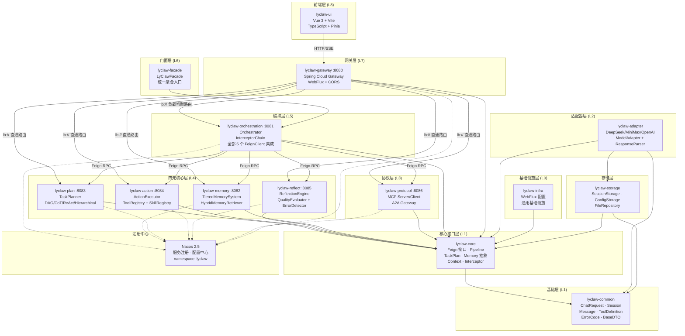
```mermaid
graph TD
    subgraph Frontend["前端层 (L8)"]
        UI[lyclaw-ui<br/>Vue 3 + Vite<br/>TypeScript + Pinia]
    end

    subgraph Gateway["网关层 (L7)"]
        GW[lyclaw-gateway :8080<br/>Spring Cloud Gateway<br/>WebFlux + CORS]
    end

    subgraph FacadeLayer["门面层 (L6)"]
        FC[lyclaw-facade<br/>LyClawFacade<br/>统一聚合入口]
    end

    subgraph Orchestration["编排层 (L5)"]
        ORCH[lyclaw-orchestration :8081<br/>Orchestrator<br/>InterceptorChain<br/>全部 5 个 FeignClient 集成]
    end

    subgraph Quaternion["四元核心层 (L4)"]
        PLAN[lyclaw-plan :8083<br/>TaskPlanner<br/>DAG/CoT/ReAct/Hierarchical]
        ACTION[lyclaw-action :8084<br/>ActionExecutor<br/>ToolRegistry + SkillRegistry]
        REFLECT[lyclaw-reflect :8085<br/>ReflectionEngine<br/>QualityEvaluator + ErrorDetector]
        MEMORY[lyclaw-memory :8082<br/>TieredMemorySystem<br/>HybridMemoryRetriever]
    end

    subgraph ProtocolLayer["协议层 (L3)"]
        PROT[lyclaw-protocol :8086<br/>MCP Server/Client<br/>A2A Gateway]
    end

    subgraph AdapterLayer["适配器层 (L2)"]
        ADP[lyclaw-adapter<br/>DeepSeek/MiniMax/OpenAI<br/>ModelAdapter + ResponseParser]
    end

    subgraph CoreLayer["核心接口层 (L1)"]
        CORE[lyclaw-core<br/>Feign 接口 · Pipeline<br/>TaskPlan · Memory 抽象<br/>Context · Interceptor]
    end

    subgraph CommonLayer["基础层 (L1)"]
        COM[lyclaw-common<br/>ChatRequest · Session<br/>Message · ToolDefinition<br/>ErrorCode · BaseDTO]
    end

    subgraph InfraLayer["基础设施层 (L0)"]
        INFRA[lyclaw-infra<br/>WebFlux 配置<br/>通用基础设施]
    end

    subgraph StorageLayer["存储层"]
        STOR[lyclaw-storage<br/>SessionStorage · ConfigStorage<br/>FileRepository]
    end

    subgraph Registry["注册中心"]
        NACOS[Nacos 2.5<br/>服务注册 · 配置中心<br/>namespace: lyclaw]
    end

    UI -->|HTTP/SSE| GW
    GW -->|lb:// 负载均衡路由| ORCH
    GW -->|lb:// 直通路由| MEMORY
    GW -->|lb:// 直通路由| PLAN
    GW -->|lb:// 直通路由| ACTION
    GW -->|lb:// 直通路由| REFLECT
    GW -->|lb:// 直通路由| PROT

    ORCH -->|Feign RPC| PLAN
    ORCH -->|Feign RPC| ACTION
    ORCH -->|Feign RPC| REFLECT
    ORCH -->|Feign RPC| MEMORY
    ORCH -->|Feign RPC| PROT

    FC --> ORCH

    PLAN --> CORE
    ACTION --> CORE
    REFLECT --> CORE
    MEMORY --> CORE
    PROT --> CORE
    ORCH --> CORE
    GW --> CORE

    CORE --> COM
    ADP --> CORE
    ADP --> COM
    ADP --> STOR
    INFRA --> CORE
    STOR --> COM
    STOR --> CORE

    ORCH -.-> NACOS
    MEMORY -.-> NACOS
    PLAN -.-> NACOS
    ACTION -.-> NACOS
    REFLECT -.-> NACOS
    PROT -.-> NACOS
    GW -.-> NACOS
```

**图例说明**：

- 实线箭头 `-->` 表示编译期依赖（Maven 依赖关系）
- 虚点线 `-.->` 表示注册连接（Nacos 服务注册）
- `lb://` 表示 Spring Cloud LoadBalancer 的客户端负载均衡路由

---

## 2.2 微服务分解理由

### 2.2.1 七个微服务的逐项分析

| 服务 | 核心动机 | 详细理由 |
|------|---------|---------|
| **lyclaw-gateway** (:8080) | 统一入口、南北流量管控 | 路由转发（Java DSL 定义 7 条路由规则）、CORS 跨域处理、客户端负载均衡（lb:// 前缀）、响应超时控制（300s 适配 SSE 长连接）。前端只与 Gateway 通信，不感知后端服务的 IP 和端口。 |
| **lyclaw-orchestration** (:8081) | 四元循环总控、东西流量协调 | 作为 Plan→Action→Reflect→Memory 流程的总编排者，持有全部 5 个 `@FeignClient` 接口，是服务间调用的发起方。管理会话（Session）生命周期（创建/查询/删除），构建并传播 `ChatContext`。`@EnableFeignClients` 扫描 `lyclaw-core` 中所有 Feign 接口。 |
| **lyclaw-plan** (:8083) | 任务分解独立、算法可插拔 | 6 种分解策略（SEQUENTIAL/BY_DOMAIN/BY_PHASE/PARALLEL_INDEPENDENT/LLM_DRIVEN/TREE）和 4 种规划器（DAGTaskPlanner/CotPlanner/ReActPlanner/HierarchicalPlanner），每种算法复杂度差异显著。`PlanController.selectPlanner()` 根据策略名动态选择规划器实例（通过 Spring `@Qualifier` 注入）。 |
| **lyclaw-action** (:8084) | 安全隔离、执行沙箱化 | 工具执行具有最高安全风险（CommandTool 可执行系统命令、WebSearchTool 可发起网络请求）。通过 `ToolSandboxImpl`（沙箱隔离）、`ToolCallPolicy`（策略管控）、SandboxLevel（NONE/READ_ONLY/NETWORK_ONLY/FULL）四层安全防护。内置 4 线程 `ExecutorService` 隔离阻塞操作。 |
| **lyclaw-reflect** (:8085) | 质量评估独立、可扩展 | 质量评估需额外 LLM 调用和文本分析（幻觉检测、逻辑矛盾检测），计算开销独立于业务流程。加权评分公式各维度权重独立可调。独立部署支持横向扩展评估实例。 |
| **lyclaw-memory** (:8082) | 向量存储独立、存储后端可替换 | 向量存储和 BM25 混合检索的内存和计算消耗大。当前使用 `InMemoryVectorStore`（内存级），未来可平滑切换到 Redis（RedisStack）、Milvus、Pinecone。衰减函数可插拔（`ExponentialDecayFunction` vs `PowerLawDecayFunction`）。 |
| **lyclaw-protocol** (:8086) | 协议独立演进、外部生态对接 | MCP/A2A 协议的实现细节与业务逻辑完全解耦。协议版本升级（如 MCP 0.x → 1.x）只需修改此服务，不影响其他服务。双向实现（Server + Client）支持既暴露工具又发现外部工具。 |

### 2.2.2 共享库的设计考量与依赖层次

共享库遵循**自底向上**的严格单向依赖原则，通过 Maven Enforcer Plugin 的 `dependencyConvergence` 规则强制执行，杜绝循环依赖：

```
lyclaw-common (最底层: 领域模型, 无内部依赖)
    ↑
lyclaw-core (核心接口: 仅依赖 common, 定义所有 Feign 接口和领域抽象)
    ↑
    ├── lyclaw-infra (基础设施: 依赖 core, WebFlux 通用配置)
    ├── lyclaw-adapter (适配器: 依赖 core + common + storage)
    ├── lyclaw-storage (存储: 依赖 common + core)
    │       ↑
    └───────┴── lyclaw-facade (门面: 依赖 orchestration 服务模块)
```

关键设计决策：

- **common 与 core 的分离**：`lyclaw-common` 只有纯 POJO 和枚举，不依赖 Spring；`lyclaw-core` 依赖 Spring Cloud OpenFeign，定义了带 `@FeignClient` 注解的服务间契约。这种分离使得非 Spring 环境也能使用 common 中的领域模型。
- **Feign 接口集中在 core**：所有 `@FeignClient` 接口定义在 `lyclaw-core` 中而非各自的实现服务中。这样 orchestration 服务只需依赖 core 即可声明所有 RPC 调用，避免了"M x N"的接口散布问题。
- **facade 的特殊地位**：`lyclaw-facade` 聚合了 Orchestrator、ModelProvider、ToolRegistry、SessionStorage、ConfigStorage、MemorySystem 六大组件，提供单一的统一入口。外部系统集成 LyClaw 时只需依赖 facade 一个模块。
- **infra 的通用性**：`lyclaw-infra` 提供 WebFlux 通用配置和拦截器实现，被所有业务微服务（plan/action/reflect/memory/orchestration/protocol）依赖，确保基础设施配置的一致性。

---

## 2.3 服务矩阵

| 服务名称 | 端口 | Spring 应用名 | 服务类型 | 核心职责 | 关键组件 |
|---------|------|-------------|---------|---------|---------|
| **lyclaw-gateway** | 8080 | lyclaw-gateway | 网关 | 统一入口、路由转发、CORS、负载均衡 | `GatewayConfig`（RouteLocator DSL 定义，7 条路由）、`CorsWebFilter`、`LyClawGatewayApplication`（`@EnableDiscoveryClient`） |
| **lyclaw-orchestration** | 8081 | lyclaw-orchestration-service | 编排 | 四元循环总控、会话管理、ChatContext 构建与传播 | `OrchestrationController`（`/api/chat/stream` SSE 端点、`/api/chat` 同步端点）、`Orchestrator` 接口、`InterceptorChain`、5 个 FeignClient 集成 |
| **lyclaw-memory** | 8082 | lyclaw-memory-service | 记忆 | 四层记忆存取（感知/短期/长期/实体）、混合向量检索、记忆合并清理 | `TieredMemorySystem`（4 个 ConcurrentHashMap）、`HybridMemoryRetriever`（四因子加权）、`InMemoryVectorStore`（余弦相似度）、`SimpleEmbeddingModel`、`LLMMemoryExtractor` |
| **lyclaw-plan** | 8083 | lyclaw-plan-service | 规划 | 任务分解、策略选择（6 种）、计划验证、任务图构建 | `DAGTaskPlanner`、`CotPlanner`、`ReActPlanner`、`HierarchicalPlanner`、`PlanValidator`、`TaskGraphImpl`（关键路径/最大并行度/进度） |
| **lyclaw-action** | 8084 | lyclaw-action-service | 行动 | 工具/技能执行、沙箱隔离（SandboxLevel 四级）、策略管控 | `ActionExecutorImpl`（4 线程执行器）、`ToolSandboxImpl`、`DefaultToolRegistry`、`DefaultSkillRegistry`、`SkillGraphImpl`、`McpToolAdapter` |
| **lyclaw-reflect** | 8085 | lyclaw-reflect-service | 反思 | 质量评估（4 维度加权）、错误检测（3 类）、策略调整建议 | `ReflectionEngineImpl`（加权公式）、`DefaultQualityEvaluator`、`DefaultErrorDetector`、`DefaultStrategyAdjuster` |
| **lyclaw-protocol** | 8086 | lyclaw-protocol-service | 协议 | MCP 工具发现/注册（双向）、A2A 智能体通信、外部模型 API 调用 | `McpServerImpl`、`McpClientImpl`、`McpToolDiscovery`、`A2aGatewayImpl`、`A2aDiscovery`、`ExternalAgentAdapterImpl` |

### 服务端口分配

```
8080 ─ lyclaw-gateway          (用户入口, WebFlux 响应式网关)
8081 ─ lyclaw-orchestration    (编排中枢, 持有全部 FeignClient)
8082 ─ lyclaw-memory           (记忆存储, 四层分级 + 混合检索)
8083 ─ lyclaw-plan             (任务规划, 4 种规划器 + 6 种策略)
8084 ─ lyclaw-action           (工具执行, 沙箱隔离 + 策略管控)
8085 ─ lyclaw-reflect          (质量反思, 四维加权评估)
8086 ─ lyclaw-protocol         (协议互通, MCP 双向 + A2A 网关)
8848 ─ Nacos 2.5               (注册中心 + 配置中心, namespace: lyclaw)
```

---

## 2.4 共享库矩阵

| 库名称 | ArtifactId | 打包 | 核心内容 | 被依赖方 |
|-------|-----------|------|---------|---------|
| **lyclaw-common** | lyclaw-common | jar | `ChatRequest`、`Session`、`Message`、`ToolDefinition`、`ToolCall`、`ModelConfig`、`ModelResponse`、`Usage`、`Memory`、`CronJob` 等 9 个共享 POJO；`BaseDTO` 基类（带 Lombok @Data）；`ErrorCode` 枚举（统一错误码体系）；`LyClawException` 运行时异常 | 所有其他共享库和所有微服务（11 个消费者） |
| **lyclaw-core** | lyclaw-core | jar | 5 个 `@FeignClient` 接口（Plan/Memory/Action/Reflect/Protocol）；`Pipeline`/`Chain`/`PipelineStage` 管道抽象；`Orchestrator` 编排器接口；`MemorySystem` 接口 + 所有记忆模型（PerceptionData、MemoryEntry、MemoryLayerType、MemoryCategory 等）；`TaskPlanner`/`TaskPlan`/`TaskNode`/`PlanGraph` 规划模型；`ChatContext` 上下文对象；`Interceptor`/`InterceptorChain` 拦截器接口；`EventBus` 事件总线；`TraceContext` 跟踪上下文；`ContentFilter`/`FilterResult` 内容过滤；`SessionTransaction` 事务管理 | 所有微服务（7 个）+ lyclaw-infra + lyclaw-adapter + lyclaw-storage + lyclaw-facade（11 个消费者） |
| **lyclaw-infra** | lyclaw-infra | jar | WebFlux 通用基础设施配置、通用拦截器实现、异常全局处理 | 所有业务微服务（plan/action/reflect/memory/orchestration/protocol，共 6 个消费者） |
| **lyclaw-adapter** | lyclaw-adapter | jar | `DeepSeekOpenAIAdapter`（DeepSeek API 适配为 OpenAI 格式）、`MinimaxAdapter`；`OkHttpModelApiClient`（OkHttp + Retrofit 实现）；`OpenAIRequest`/`OpenAIResponse`、`AnthropicRequest`/`AnthropicResponse` DTO；`OpenAIResponseParser`、`AnthropicResponseParser`（SSE 流式解析）；`DefaultModelProvider`；`AdapterAutoConfiguration`（自动装配） | lyclaw-protocol、lyclaw-orchestration（2 个消费者） |
| **lyclaw-storage** | lyclaw-storage | jar | `SessionStorage`（会话持久化接口 + 实现）、`ConfigStorage`（模型配置持久化）、`FileRepository`（文件仓储）、存储策略 | lyclaw-adapter、lyclaw-facade、lyclaw-orchestration（3 个消费者） |
| **lyclaw-facade** | lyclaw-facade | jar | `LyClawFacade` 统一聚合组件（`@Component`），将 Orchestrator、ModelProvider、ToolRegistry、SessionStorage、ConfigStorage、MemorySystem 六大组件装配为单一入口，暴露 `chat()`、`agentTask()`、`getSessions()`、`getProviders()` 等高级 API | 供外部系统集成使用 |

---

## 2.5 模块到服务的迁移映射

下表完整记录了从早期 14 个 Maven 单体模块到当前 7 服务 + 6 共享库的架构演进轨迹：

| 早期 Maven 模块 | 迁移目标 | 类型变化 | 详细说明 |
|---------------|---------|---------|---------|
| `lyclaw-engine` | **已删除** | 单体引擎 → 分布式分发 | 原引擎模块承载了编排、记忆管理、任务规划、工具执行等几乎全部核心逻辑。重构后其功能全部分发至 orchestration、plan、action、reflect、memory 五个四元核心微服务。POM 中保留注释 `lyclaw-engine 功能已全部分发至各微服务，模块删除` |
| `lyclaw-web` | **已删除** | 嵌入式 Web → 前端+网关分离 | 原模块将前端静态资源（HTML/JS/CSS）与后端 Spring MVC Controller 耦合在一个模块中。重构后被拆分为独立的前端项目 `lyclaw-ui`（Vue 3 + Vite）和 API 网关 `lyclaw-gateway`（Spring Cloud Gateway）。POM 中保留注释 `lyclaw-web 已被 lyclaw-gateway 替代，模块删除` |
| (无) | **lyclaw-gateway (新增)** | — | 基于 Spring Cloud Gateway 的响应式 API 网关，定义 7 条路由规则，端口 8080 |
| (无) | **lyclaw-infra (新增)** | — | 基础设施共享层，提供 WebFlux 通用配置和拦截器实现 |
| (无) | **lyclaw-facade (新增)** | — | 门面聚合组件，将 6 个核心组件装配为统一入口，供外部集成 |
| `lyclaw-orchestration` | `lyclaw-orchestration` | 共享库 → 微服务 | 从普通 JAR 依赖库升级为可独立部署的 Spring Boot 服务，新增 `OrchestrationServiceApplication` 启动类（`@EnableDiscoveryClient` + `@EnableFeignClients`）、`OrchestrationController` 暴露 REST API、`application.yml` 配置端口 8081 和 Nacos 注册 |
| `lyclaw-plan` | `lyclaw-plan` | 共享库 → 微服务 | 升级为独立服务，新增启动类、PlanController（暴露 `/api/plan/plan`、`/api/plan/revise`、`/api/plan/decompose` 等 7 个端点）、端口 8083 |
| `lyclaw-action` | `lyclaw-action` | 共享库 → 微服务 | 升级为独立服务，新增启动类、ActionController、端口 8084 |
| `lyclaw-reflect` | `lyclaw-reflect` | 共享库 → 微服务 | 升级为独立服务，新增启动类、ReflectController、端口 8085 |
| `lyclaw-memory` | `lyclaw-memory` | 共享库 → 微服务 | 升级为独立服务，新增启动类、MemoryController（暴露 `/api/memory/retrieve`、`/api/memory/ingest`、`/api/memory/consolidate`、`/api/memory/stats` 四个端点）、端口 8082 |
| `lyclaw-protocol` | `lyclaw-protocol` | 共享库 → 微服务 | 升级为独立服务，新增启动类、ProtocolController、端口 8086 |
| `lyclaw-common` | `lyclaw-common` | 保持不变 | 共享领域模型（9 个 POJO + BaseDTO + ErrorCode），无 Spring Boot 启动依赖 |
| `lyclaw-core` | `lyclaw-core` | 保持不变 | 共享核心接口（5 个 FeignClient + Pipeline + Context + Memory/Plan/Tool 抽象），无 Spring Boot 启动依赖 |
| `lyclaw-adapter` | `lyclaw-adapter` | 保持不变 | 模型适配器（DeepSeek/MiniMax DTO + Parser + Provider），无 Spring Boot 启动依赖 |
| `lyclaw-storage` | `lyclaw-storage` | 保持不变 | 存储实现（SessionStorage/ConfigStorage/FileRepository），无 Spring Boot 启动依赖 |

---

## 2.6 服务间通信架构

### 2.6.1 Feign 调用拓扑图

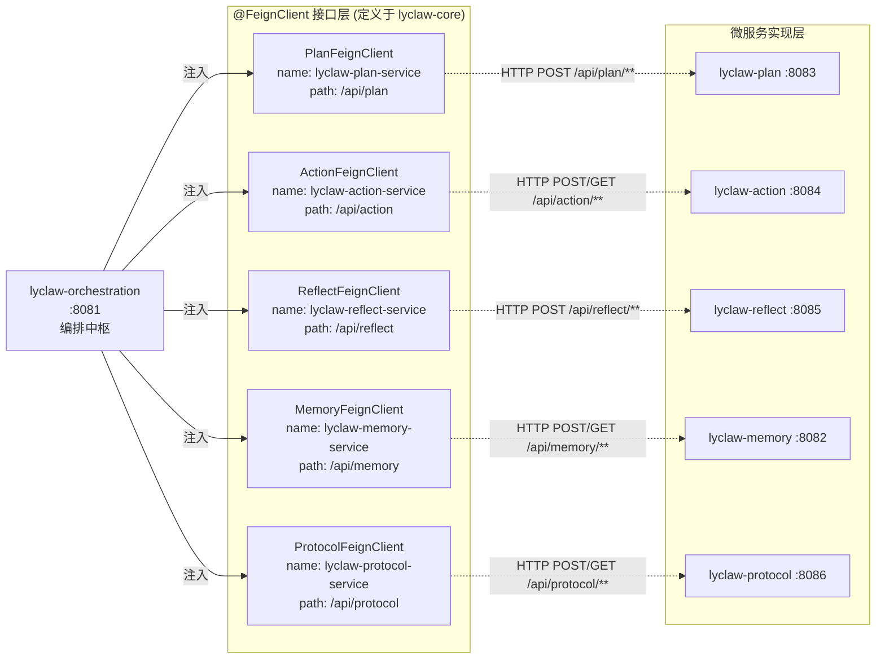
```mermaid
graph LR
    ORCH[lyclaw-orchestration<br/>:8081<br/>编排中枢]

    subgraph FeignInterfaces["@FeignClient 接口层 (定义于 lyclaw-core)"]
        PFC[PlanFeignClient<br/>name: lyclaw-plan-service<br/>path: /api/plan]
        AFC[ActionFeignClient<br/>name: lyclaw-action-service<br/>path: /api/action]
        RFC[ReflectFeignClient<br/>name: lyclaw-reflect-service<br/>path: /api/reflect]
        MFC[MemoryFeignClient<br/>name: lyclaw-memory-service<br/>path: /api/memory]
        PRFC[ProtocolFeignClient<br/>name: lyclaw-protocol-service<br/>path: /api/protocol]
    end

    subgraph Services["微服务实现层"]
        PLAN[lyclaw-plan :8083]
        ACTION[lyclaw-action :8084]
        REFLECT[lyclaw-reflect :8085]
        MEMORY[lyclaw-memory :8082]
        PROT[lyclaw-protocol :8086]
    end

    ORCH -->|注入| PFC
    ORCH -->|注入| AFC
    ORCH -->|注入| RFC
    ORCH -->|注入| MFC
    ORCH -->|注入| PRFC

    PFC -.->|HTTP POST /api/plan/**| PLAN
    AFC -.->|HTTP POST/GET /api/action/**| ACTION
    RFC -.->|HTTP POST /api/reflect/**| REFLECT
    MFC -.->|HTTP POST/GET /api/memory/**| MEMORY
    PRFC -.->|HTTP POST/GET /api/protocol/**| PROT
```

通信模型说明：

- **唯一调用方**：Orchestration 是唯一持有全部 5 个 FeignClient 的服务。四元核心服务（Plan/Action/Reflect/Memory）之间不直接互相调用，所有协调由 Orchestration 统一编排。
- **声明式 RPC**：FeignClient 接口定义在 `lyclaw-core` 中，通过 `@FeignClient(name = "服务名")` 注解声明目标服务。运行时 Feign 动态生成 HTTP 代理，通过 Nacos 解析服务名到具体 IP:PORT。
- **负载均衡**：Feign 集成 Spring Cloud LoadBalancer，默认使用轮询（Round Robin）策略。
- **超时配置**：通过 `spring.cloud.openfeign.client.config.default.connectTimeout=5000` 和 `readTimeout=30000` 配置全局默认超时。对于长耗时 LLM 调用，由 Protocol 服务内部的 OkHttp Retrofit 层单独管理超时。

### 2.6.2 各 Feign 接口契约

所有接口按 RESTful 风格设计，使用标准 HTTP 方法语义。

**PlanFeignClient**（规划服务接口）

```java
@FeignClient(name = "lyclaw-plan-service", path = "/api/plan")
public interface PlanFeignClient {

    // 创建任务计划：接收用户意图，返回分解后的 TaskPlan
    @PostMapping("/plan")
    TaskPlan plan(@RequestBody PlanRequest request);

    // 修订任务计划：根据反思反馈调整现有计划
    @PostMapping("/revise")
    TaskPlan revise(@RequestBody ReviseRequest request);
}
```

**ActionFeignClient**（行动服务接口）

```java
@FeignClient(name = "lyclaw-action-service", path = "/api/action")
public interface ActionFeignClient {

    // 执行单个工具：传入工具名和参数，返回执行结果
    @PostMapping("/execute-tool")
    ToolResult executeTool(@RequestBody ToolExecuteRequest request);

    // 执行组合技能：传入技能 ID，返回技能执行结果
    @PostMapping("/execute-skill")
    SkillResult executeSkill(@RequestBody SkillExecuteRequest request);

    // 列出所有已注册工具：返回工具定义列表（名称、描述、参数 Schema）
    @GetMapping("/tools")
    List<ToolDefinition> listTools();
}
```

**ReflectFeignClient**（反思服务接口）

```java
@FeignClient(name = "lyclaw-reflect-service", path = "/api/reflect")
public interface ReflectFeignClient {

    // 执行反思：对 Action 输出进行质量评估，返回反思报告
    @PostMapping("/reflect")
    ReflectionReport reflect(@RequestBody ReflectRequest request);
}
```

**MemoryFeignClient**（记忆服务接口）

```java
@FeignClient(name = "lyclaw-memory-service", path = "/api/memory")
public interface MemoryFeignClient {

    // 记忆检索：根据查询条件从多层记忆中检索相关条目
    @PostMapping("/retrieve")
    MemoryQueryResult retrieve(@RequestBody MemoryQuery query);

    // 感知摄入：将原始感知数据存入感知记忆层
    @PostMapping("/ingest")
    Map<String, Object> ingest(@RequestBody PerceptionData data,
            @RequestParam("sessionId") String sessionId,
            @RequestParam(value = "userId", required = false, defaultValue = "default") String userId);

    // 记忆合并：将高重要性短期记忆提升至长期记忆
    @PostMapping("/consolidate")
    Map<String, Object> consolidate(@RequestParam("userId") String userId,
            @RequestParam("sessionId") String sessionId);

    // 记忆统计：获取各层记忆的计数和容量信息
    @GetMapping("/stats")
    MemoryStats getStats();
}
```

**ProtocolFeignClient**（协议服务接口）

```java
@FeignClient(name = "lyclaw-protocol-service", path = "/api/protocol")
public interface ProtocolFeignClient {

    // MCP 工具发现：通过服务器命令发现外部 MCP 工具列表
    @PostMapping("/mcp/discover")
    List<McpToolDescriptor> discoverTools(@RequestParam("serverCommand") String serverCommand);

    // 模型对话：直接调用 LLM API（非流式）
    @PostMapping("/model/chat")
    Map<String, Object> chat(@RequestBody Map<String, Object> request);
}
```

### 2.6.3 网关路由表

Spring Cloud Gateway 通过 Java DSL 定义路由，所有路由均使用 `lb://` 前缀实现基于 Nacos 服务发现的客户端负载均衡：

```java
@Configuration
public class GatewayConfig {

    @Bean
    public RouteLocator customRoutes(RouteLocatorBuilder builder) {
        return builder.routes()
                // 对话路由：/api/chat 和 /api/chat/stream → orchestration 服务
                .route("chat-api", r -> r
                        .path("/api/chat", "/api/chat/stream")
                        .uri("lb://lyclaw-orchestration-service"))

                // 会话管理路由：/api/sessions/** → orchestration 服务
                .route("sessions-api", r -> r
                        .path("/api/sessions/**")
                        .uri("lb://lyclaw-orchestration-service"))

                // 记忆路由：/api/memory/** → memory 服务（直通）
                .route("memory-api", r -> r
                        .path("/api/memory/**")
                        .uri("lb://lyclaw-memory-service"))

                // 规划路由：/api/plan/** → plan 服务（直通）
                .route("plan-api", r -> r
                        .path("/api/plan/**")
                        .uri("lb://lyclaw-plan-service"))

                // 行动路由：/api/action/**, /api/tools/**, /api/skills/** → action 服务（直通）
                .route("action-api", r -> r
                        .path("/api/action/**", "/api/tools/**", "/api/skills/**")
                        .uri("lb://lyclaw-action-service"))

                // 反思路由：/api/reflect/** → reflect 服务（直通）
                .route("reflect-api", r -> r
                        .path("/api/reflect/**")
                        .uri("lb://lyclaw-reflect-service"))

                // 协议路由：/api/protocol/**, /api/models/** → protocol 服务（直通）
                .route("protocol-api", r -> r
                        .path("/api/protocol/**", "/api/models/**")
                        .uri("lb://lyclaw-protocol-service"))
                .build();
    }

    @Bean
    public CorsWebFilter corsFilter() {
        CorsConfiguration config = new CorsConfiguration();
        config.setAllowedOriginPatterns(List.of("*"));  // 开发阶段宽松配置
        config.setAllowedMethods(List.of(GET, POST, PUT, DELETE, OPTIONS));
        config.setAllowedHeaders(List.of("*"));
        config.setAllowCredentials(true);
        config.setMaxAge(Duration.ofHours(1));

        UrlBasedCorsConfigurationSource source = new UrlBasedCorsConfigurationSource();
        source.registerCorsConfiguration("/**", config);
        return new CorsWebFilter(source);
    }
}
```

网关设计要点：

- **对话与会话**（`/api/chat`、`/api/sessions/**`）仅路由到 orchestration，不暴露直通路由。这确保对话流程必须经过编排层，由 Orchestrator 统一协调四元循环。
- **直通路由**（`/api/memory/**`、`/api/plan/**` 等）允许前端在调试时直接访问单个服务。正常业务流程中，这些路由由 orchestration 通过 Feign 在服务间调用，不经过网关。
- **CORS 全放通配置**用于开发阶段（允许所有来源和方法）。生产环境应收紧 `allowedOriginPatterns` 为具体的域名白名单。
- **Gateway 响应超时 300s**：`spring.cloud.gateway.server.webflux.httpclient.response-timeout: 300s`，为 LLM 长连接 SSE 流预留充足的时间窗口。

---

## 2.7 技术栈版本总表

| 组件 | GroupId / ArtifactId | 版本 | 层级 | 备注 |
|------|---------------------|------|------|------|
| Java | — | 17 (LTS) | 语言 | Sealed Classes、Pattern Matching、Records |
| Maven | — | 3.8+ | 构建 | 父 POM 管理 13 个子模块 |
| Spring Boot | org.springframework.boot | **3.5.14** | 基础框架 | 父 POM 通过 BOM 统一管理 |
| Spring Cloud | org.springframework.cloud | **2025.0.0** | 微服务治理 | 父 POM 通过 BOM 统一管理 |
| Spring Cloud Alibaba | com.alibaba.cloud | **2025.0.0.0** | 微服务治理 | Nacos 集成 |
| Nacos Server | com.alibaba.nacos | 2.5 | 注册/配置 | 端口 8848, namespace: lyclaw |
| Spring WebFlux | (随 Boot 3.5.14) | — | 响应式 Web | 基于 Reactor Core 3.6.8 |
| Spring Cloud Gateway | (随 Cloud 2025.0) | — | API 网关 | WebFlux 响应式网关，Java DSL 路由 |
| Spring Cloud OpenFeign | (随 Cloud 2025.0) | — | 声明式 RPC | 5 个 @FeignClient 接口 |
| Spring Cloud LoadBalancer | (随 Cloud 2025.0) | — | 客户端负载均衡 | lb:// 前缀整合 |
| Spring Boot Actuator | (随 Boot 3.5.14) | — | 健康检查 | 所有微服务均集成 |
| Spring Boot Validation | (随 Boot 3.5.14) | — | 参数校验 | common 层使用 |
| Reactor Core | io.projectreactor | 3.6.8 | 响应式编程 | Flux/Mono + 背压 |
| Micrometer | io.micrometer | 1.14.5 | 可观测性 | 指标采集门面 |
| OkHttp | com.squareup.okhttp3 | 4.12.0 | HTTP 客户端 | 连接池复用、HTTP/2 |
| Retrofit | com.squareup.retrofit2 | 2.9.0 | 声明式 HTTP | LLM API 调用 |
| Hutool | cn.hutool | 5.8.44 | 工具集合 | 国产全能工具库 |
| Lombok | org.projectlombok | 1.18.36 | 代码简化 | `@Data`, `@Builder`, `@Slf4j` |
| Maven Compiler | org.apache.maven.plugins | 3.11.0 | 编译 | 支持 Java 17 `--parameters` |
| Maven Enforcer | org.apache.maven.plugins | 3.4.1 | 依赖治理 | 防版本冲突和循环依赖 |
| Vue 3 | — | ^3.5.32 | 前端框架 | Composition API |
| Vite | — | ^8.0.8 | 前端构建 | ES Module 原生 HMR |
| TypeScript | — | ~5.7.0 | 前端语言 | 静态类型检查 |
| Pinia | — | ^2.3.1 | 状态管理 | Vue 3 官方推荐 |
| Vue Router | — | ^4.5.1 | 前端路由 | 单页应用导航 |
| Marked | — | ^18.0.2 | Markdown 渲染 | AI 输出格式化展示 |
| Node.js | — | ^20.19.0 / >=22.12.0 | 前端运行时 | LTS 版本要求 |

---

## 2.8 Nacos 配置与启动类详解

### 2.8.1 统一服务注册配置

所有 7 个微服务通过完全一致的 Nacos 配置模板进行服务注册（仅服务名和端口不同）：

```yaml
spring:
  application:
    name: lyclaw-orchestration-service  # 各服务替换为己名
  cloud:
    nacos:
      discovery:
        server-addr: 127.0.0.1:8848    # Nacos 服务器地址
        namespace: lyclaw               # 命名空间隔离
        group: DEFAULT_GROUP            # 默认分组
server:
  port: 8081                            # 各服务替换为分配端口
```

- **命名空间 `lyclaw`**：所有 LyClaw 服务注册在同一命名空间下，与其他项目的服务在 Nacos 层面完全隔离
- **命名空间事先在 Nacos 控制台创建**（命名空间 ID 即 `lyclaw`），服务启动时通过 `namespace` 属性指定
- **`DEFAULT_GROUP`**：当前开发阶段使用默认分组；未来可扩展为按环境（`dev`/`test`/`prod`）分组，实现灰度发布和流量隔离
- **注册中心端口 8848**：Nacos 标准 HTTP 端口（gRPC 端口为 9848/9849，Nacos 2.x 默认使用 gRPC 进行服务发现通信）

### 2.8.2 Orchestration 启动类

作为编排中枢，`OrchestrationServiceApplication` 同时启用了服务发现、Feign 客户端扫描和跨模块组件扫描：

```java
@SpringBootApplication(scanBasePackages = "lyjew.com.lyclaw")
@EnableDiscoveryClient
@EnableFeignClients(basePackages = "lyjew.com.lyclaw.feign")
public class OrchestrationServiceApplication {
    public static void main(String[] args) {
        SpringApplication.run(OrchestrationServiceApplication.class, args);
    }
}
```

关键注解说明：

- **`@SpringBootApplication(scanBasePackages = "lyjew.com.lyclaw")`**：跨 Maven 模块的组件扫描，确保加载所有共享库（common、core、infra、adapter、storage、facade）中的 `@Component`、`@Service`、`@Configuration` 注解类
- **`@EnableDiscoveryClient`**：向 Nacos 注册自身（服务名 `lyclaw-orchestration-service`，端口 8081），同时启用服务发现功能（用于 Feign 解析目标服务地址）
- **`@EnableFeignClients(basePackages = "lyjew.com.lyclaw.feign")`**：精确扫描 `lyclaw-core` 中 `feign` 包下的全部 5 个 `@FeignClient` 接口，由 Feign 框架动态生成 HTTP 代理 Bean 并注入到 Spring 容器

---

> **下一章预告**：第三章将深入每个微服务的内部设计，包括领域模型详解、核心算法推导、数据流图（Sequence Diagram）和关键代码走读。
# 第三章：模块详细分解


LyClaw 系统共包含 13 个 Maven 模块，按部署模式分为两大类：**共享库**（不独立部署，被微服务依赖）和**微服务**（独立部署运行）。此外，还有两个处于废弃/合并状态的遗留模块。

---

### 3.1 共享库模块 (Shared Libraries)

共享库为纯 Java 库，打包为 `.jar`，被所有微服务通过 Maven 依赖引用，不包含 Spring Boot 启动类。

---

#### 3.1.1 lyclaw-common -- 通用基础模块

**目录路径:** `/lyclaw-common/src/main/java/lyjew/com/lyclaw/`

**模块职责:** 提供所有模块共享的基础 DTO、领域模型、枚举、异常基类。不依赖任何其他 LyClaw 模块，是整个系统的底层基石。

**包结构:**

```
lyjew.com.lyclaw.base
├── BaseDTO                      # 所有 DTO 的抽象基类（id, createdAt, updatedAt）
└── exception
    └── LyClawException          # 统一异常基类（code, httpStatus, message）

lyjew.com.lyclaw.enums
└── ErrorCode                    # 统一错误码枚举（含 40+ 错误码，覆盖系统/模型/存储/校验/会话）

lyjew.com.lyclaw.model
├── ChatRequest                  # 对话请求模型（sessionId, messages, stream, tools, thinking等）
├── Message                      # 消息模型（role, content, model, usage, toolCalls）
├── Memory                       # 记忆模型（content, title, enabled, tags）
├── Session                      # 会话模型（sessionId, name, model, messages[]）
├── ModelConfig                  # 模型配置（name, provider, apiKey, model, baseUrl, enabled）
├── ModelResponse                # 模型统一响应（含 ToolCallRequest 内部类）
├── ToolCall                     # 工具调用记录（toolCallId, name, arguments, result）
├── ToolDefinition               # 工具定义（name, displayName, description, parameters, source）
├── CronJob                      # 定时任务模型
└── Usage                        # Token 用量统计（promptTokens, completionTokens, totalTokens）
```

**关键设计:**
- `BaseDTO` 使用 `@SuperBuilder` + `@JsonIgnoreProperties(ignoreUnknown = true)`，支持 JSON 反序列化时忽略未知字段
- `ErrorCode` 枚举包含 `code()`, `httpStatus()`, `exception()` 三个工厂方法，支持直接转换为 `LyClawException`
- `Message` 提供静态工厂方法 `user()`, `assistant()`, `system()`, `tool()` 用于快速构造不同角色消息
- `ChatRequest` 包含 `thinkingEnabled`, `thinkingBudget` 等深度思考参数，支持 DeepSeek/Claude 的推理增强能力

---

#### 3.1.2 lyclaw-core -- 核心接口与抽象层

**目录路径:** `/lyclaw-core/src/main/java/lyjew/com/lyclaw/`

**模块职责:** 定义系统的所有 SPI (Service Provider Interface) 接口、Feign 客户端接口、领域 DTO、抽象基类。这是整个系统的"契约层"，所有微服务实现都依赖并实现这些接口。**零实现代码，纯接口+DTO。**

**包结构详表（共 22 个顶级包，130+ 文件）:**

| 包路径 | 文件数 | 职责描述 |
|--------|--------|----------|
| `base` | 2 | `BaseEngine`, `BaseStorage` 抽象基类 |
| `common` | 1 | `PageResult` 通用分页结果 |
| `context` | 2 | `ChatContext` 对话上下文容器, `ContextBuilder` 上下文构建器接口 |
| `dto` | 3 | `ChatResult`, `AgentResult`, `SkillResult` 跨服务数据传输对象 |
| `engine` | 3 | `Engine` 引擎接口, `EngineSelector` 引擎选择器, `EngineMetadata` |
| `cache` | 2 | `CacheService` 缓存服务接口, `CacheStats` 缓存统计 |
| `event` | 2 | `Event` 事件基类, `EventBus` 事件总线接口 |
| `exception` | 2 | `ModelException`, `StorageException` 领域异常 |
| `error` | 3 | `ErrorPolicy`, `RetryConfig`, `ToolExecuteException` 错误处理 |
| `feign` | 5 | 五个微服务间 Feign 客户端接口定义 |
| `filter` | 2 | `ContentFilter` 内容过滤器接口, `FilterResult` 过滤结果 |
| `infra/alert` | 3 | `Alert`, `AlertManager`, `AlertRule` 告警基础设施接口 |
| `infra/metrics` | 2 | `MetricsCollector`, `MetricsSnapshot` 指标采集接口 |
| `interceptor` | 2 | `Interceptor` 拦截器接口, `InterceptorChain` 拦截器链 |
| `memory/*` | 20+ | 记忆系统完整领域模型（详见第四章） |
| `orchestration` | 3 | `Orchestrator`, `OrchestrationContext`, `AgentEvent` |
| `persistence` | 5 | `MemoryPersistence`, `SessionPersistence`, `PersistenceDecision` 等 |
| `pipeline` | 3 | `Pipeline`, `PipelineStage`, `Chain` 管道模式接口 |
| `protocol/**` | 12 | MCP 协议接口与 A2A 协议接口（详见协议模块） |
| `reflect` | 11 | 反思引擎完整领域模型（详见第四章） |
| `repository` | 1 | `FileRepository` 文件仓库接口 |
| `retrieval` | 2 | `VectorStore`, `SearchResult` 检索接口 |
| `security` | 7 | `SecurityManager`, `ApprovalResult`, `AuditLog`, `PermissionLevel`, `SandboxLevel`, `TimeRange` 等 |
| `skill` | 6 | `Skill`, `SkillRegistry`, `SkillExecutor`, `SkillGraph`, `SkillType`, `SkillProgressCallback` |
| `strategy` | 1 | `FormatStrategy` 格式化策略接口 |
| `task` | 13 | 任务规划全部领域模型（详见第四章） |
| `tool` | 6 | `Tool`, `ToolRegistry`, `ToolResult`, `ToolCallPolicy`, `ToolErrorAction` 等 |
| `tracing` | 1 | `TraceContext` 链路追踪上下文 |
| `transaction` | 4 | `TransactionContext`, `SessionTransaction`, `SessionUpdate`, `SessionUpdateStrategy` |
| `adapter` | 1 | `ModelAdapter` 模型适配器顶层接口 |
| `agent/**` | 18 | 多 Agent 协作框架（Agent 注册、通信、协作模式、自动扩缩容） |
| `provider` | 1 | `ModelProvider` 模型提供者接口 |
| `action` | 6 | `ActionExecutor`, `ActionResult`, `ComputerUseAgent`, `ToolResult`, `ToolSandbox`, 请求 DTO |
| `template` | 1 | `AbstractModelAdapter` 模型适配器模板基类 |

---

#### 3.1.3 lyclaw-infra -- 基础设施模块

**目录路径:** `/lyclaw-infra/src/main/java/lyjew/com/lyclaw/infra/`

**模块职责:** 提供事件总线实现、安全增强实现、统一配置管理、可观测性指标采集。

**关键实现类:**

```
lyjew.com.lyclaw.infra
├── config
│   └── LyClawProperties              # @ConfigurationProperties(prefix="lyclaw")
│                                     #   包含 Memory/Security/Metrics/Agent 四大子配置组
├── event
│   ├── InfraEventBus                 # EventBus 接口实现（支持虚拟线程异步发布）
│   ├── AgentStateChangedEvent        # Agent 状态变更事件
│   ├── AlertTriggeredEvent           # 告警触发事件
│   ├── MemoryConsolidatedEvent       # 记忆固化完成事件
│   ├── ReflectionCompletedEvent      # 反思完成事件
│   ├── TokenConsumedEvent            # Token 消耗事件
│   └── ToolCalledEvent               # 工具调用事件
├── security
│   ├── EnhancedSecurityManager       # 安全增强实现（Guardrail Chain + 审批 + 权限 + 审计日志）
│   └── PromptInjectionFilter         # 提示注入过滤
├── alert
│   └── DefaultAlertManager           # 默认告警管理器
└── metrics
    └── MicrometerMetricsCollector    # 基于 Micrometer 的指标采集实现
```

**LyClawProperties 配置结构:**

| 配置前缀 | 关键属性 | 默认值 |
|----------|----------|--------|
| `lyclaw.memory` | enabled, vectorStore, embedding(.model=local-onnx, .dimension=768), temporal(.decayModel=exponential, .halfLifeDays=30), retrieval(.topK=20, .alpha=0.45/.beta=0.20/.gamma=0.15/.delta=0.20) | -- |
| `lyclaw.security` | enabled=true, defaultPermissionLevel=EXECUTE_SAFE, auditEnabled=true | -- |
| `lyclaw.metrics` | enabled=true, backend=micrometer | -- |
| `lyclaw.agent` | maxConcurrent=5, poolSize=10, defaultTimeoutMs=300000, scaling(.enabled=true, .targetIdleRatio=0.3, .maxQueueDepth=20) | -- |

**InfraEventBus 设计要点:**
- 使用 `ConcurrentHashMap<Class<?>, CopyOnWriteArrayList<Consumer<?>>>` 存储订阅关系
- 支持精确类型订阅和通配符（父类型）订阅
- 提供 `publishAsync()` 方法，内部使用 `Executors.newVirtualThreadPerTaskExecutor()` 虚拟线程
- 单次订阅者异常不会影响其他订阅者的执行

**EnhancedSecurityManager 设计要点:**
- **Guardrail 链:** 输入过滤器链 + 输出过滤器链，任一过滤器不通过即拒绝
- **权限级别:** `DENY < READ < EXECUTE_SAFE < EXECUTE_MODIFY < EXECUTE_DESTRUCTIVE < ADMIN`
- **审计日志:** 使用哈希链 (hash chain) 防止日志篡改，每个日志条目包含 `previousHash` 和 `currentHash`
- **内置工具权限映射:** ReadFile→READ, ExecuteCommand→EXECUTE_SAFE, DeleteFile→EXECUTE_DESTRUCTIVE 等

---

#### 3.1.4 lyclaw-storage -- 文件存储模块

**目录路径:** `/lyclaw-storage/src/main/java/lyjew/com/lyclaw/`

**模块职责:** 实现基于文件系统的存储引擎，负责会话 (Session)、记忆 (Memory)、配置 (ModelConfig)、定时任务 (CronJob) 的持久化读写。

**关键实现类:**

```
lyjew.com.lyclaw.storage
├── MemoryStorage        # extends BaseStorage<Memory>       -- 读写 memory/ 目录 (Markdown 格式)
├── SessionStorage       # extends BaseStorage<Session>      -- 读写 sessions/ 目录 (JSON 格式)
├── ConfigStorage        # extends BaseStorage<ModelConfig>  -- 读写 configs/ 目录 (JSON 格式)
└── CronStorage          # extends BaseStorage<CronJob>      -- 读写 cron/ 目录 (JSON 格式)

lyjew.com.lyclaw.engine
└── LocalFileEngine      # implements Engine + AbstractFileEngine
                         #   本地文件引擎，支持 ChatRequest 的 Flux<String> 流式执行

lyjew.com.lyclaw.strategy
├── JsonFormatStrategy      # 基于 Jackson ObjectMapper 的 JSON 序列化策略
└── MarkdownFormatStrategy  # Markdown 格式序列化策略（用于记忆文件）
```

**BaseStorage<T> 抽象基类核心方法:**

```java
void save(T entity)            // 提取 ID → 序列化 → 写入文件
Optional<T> get(String id)     // 读取文件 → 反序列化
boolean delete(String id)      // 删除文件
List<T> getAll()               // 列出所有文件并反序列化
boolean exists(String id)      // 检查文件是否存在
```

内部依赖 `FileRepository` 接口（定义在 lyclaw-core）进行实际文件操作。

---

### 3.2 微服务模块 (Microservices)

每个微服务包含独立的 Spring Boot 启动类，通过 Feign 客户端进行服务间通信，可独立部署和伸缩。

---

#### 3.2.1 lyclaw-gateway (端口 8080) -- API 网关

**目录路径:** `/lyclaw-gateway/src/main/java/lyjew/com/lyclaw/gateway/`

**关键文件:**

| 文件 | 类型 | 职责 |
|------|------|------|
| `LyClawGatewayApplication.java` | Spring Boot 启动类 | 微服务入口 |
| `GatewayConfig.java` | @Configuration | 路由规则 + CORS 配置 |

**路由规则表:**

| 路由 ID | 路径匹配 | 转发目标 |
|----------|----------|----------|
| chat-api | `/api/chat`, `/api/chat/stream` | `lb://lyclaw-orchestration-service` |
| sessions-api | `/api/sessions/**` | `lb://lyclaw-orchestration-service` |
| memory-api | `/api/memory/**` | `lb://lyclaw-memory-service` |
| plan-api | `/api/plan/**` | `lb://lyclaw-plan-service` |
| action-api | `/api/action/**`, `/api/tools/**`, `/api/skills/**` | `lb://lyclaw-action-service` |
| reflect-api | `/api/reflect/**` | `lb://lyclaw-reflect-service` |
| protocol-api | `/api/protocol/**`, `/api/models/**` | `lb://lyclaw-protocol-service` |

**CORS 配置:** 允许所有来源 (`*`)，支持 GET/POST/PUT/DELETE/OPTIONS 方法，允许携带凭证，`maxAge=1h`。

**设计要点:** 使用 Spring Cloud Gateway 的响应式编程模型，路由通过 `lb://` 前缀实现客户端负载均衡，SSE (Server-Sent Events) 流式数据通过网关透明代理。

---

#### 3.2.2 lyclaw-orchestration (端口 8081) -- 编排中心

**目录路径:** `/lyclaw-orchestration/src/main/java/lyjew/com/lyclaw/orchestration/`

**关键实现类:**

```
lyjew.com.lyclaw.orchestration
├── OrchestrationServiceApplication    # 启动类
├── controller
│   └── OrchestrationController        # REST API (/api/chat, /api/chat/stream, /api/sessions)
├── impl
│   ├── OrchestratorImpl               # 核心编排实现（7阶段 SSE 流水线）
│   ├── DefaultAgentCoordinator        # Agent 协调器实现
│   ├── DefaultAgentRegistry           # Agent 注册中心
│   ├── AgentLifecycleManager          # Agent 生命周期管理
│   ├── AutoScalerImpl                 # Agent 池自动扩缩容
│   ├── StarAgentChannel               # 星型拓扑的 Agent 通信通道
│   ├── ConsensusEngineImpl            # 共识引擎实现
│   ├── CollaborationHubImpl           # 协作中心实现
│   └── collab/
│       ├── MarketCollaborationMode     # 市场式协作模式
│       ├── NetworkCollaborationMode    # 网络式协作模式
│       ├── PipelineCollaborationMode   # 流水线式协作模式
│       └── SupervisorWorkerMode        # 管理者-工作者模式
├── pipeline
│   ├── ContextBuildStage              # 上下文构建阶段
│   ├── InterceptorStage               # 拦截器阶段
│   ├── ToolCallLoopStage              # 工具调用循环阶段
│   ├── ResponseBuildStage             # 响应构建阶段
│   ├── MetricsStage                   # 指标采集阶段
│   ├── DefaultPipeline                # 默认管道实现
│   ├── DefaultChain                   # 默认链实现
│   └── PipelineBuilder                # 管道构建器
├── context
│   └── FullWindowContextBuilder       # 全窗口上下文构建器
├── config
│   └── FeignReactiveConfig            # Feign 响应式配置
└── dto
    └── ChatRequest                    # 编排层专用 DTO（含 messages: List<Map<String,String>>）
```

**OrchestratorImpl 7 阶段 SSE 流水线:**

```
[1] CONTEXT_BUILD  → [2] INTERCEPT    → [3] PLAN
  加载会话&记忆        安全审查&过滤       DAG任务规划

[4] EXECUTE        → [5] REFLECT     → [6] RESPOND       → [7] METRICS
  逐节点执行工具       反思&质量评分      记忆固化&构建响应     指标汇总输出
```

每一阶段通过 `formatSSE(eventType, payload)` 向前端发送 `event:` / `data:` 格式的 SSE 事件流。前端可实时感知编排进度。编排器通过 `PlanFeignClient`, `ActionFeignClient`, `ReflectFeignClient`, `MemoryFeignClient` 四个 Feign 客户端协调下游微服务。

**Agent 协作框架:**
- 提供 4 种协作模式：`MarketCollaborationMode` (市场式竞价)、`NetworkCollaborationMode` (网状对等)、`PipelineCollaborationMode` (流水线传递)、`SupervisorWorkerMode` (管理分工)
- 支持 `TopologyType.STAR` (星型) 拓扑的 Agent 通道
- `AutoScalerImpl` 根据空闲率自动增减 Agent 池大小，`targetIdleRatio=0.3`, `maxQueueDepth=20`

---

#### 3.2.3 lyclaw-memory (端口 8082) -- 记忆层服务

**目录路径:** `/lyclaw-memory/src/main/java/lyjew/com/lyclaw/memory/`

**关键实现类:**

```
lyjew.com.lyclaw.memory
├── MemoryServiceApplication           # 启动类
├── controller
│   └── MemoryController               # REST API (/api/memory)
├── impl
│   ├── TieredMemorySystem             # 四层记忆系统核心实现
│   │                                   #   感知层(SENSORY)→短期层(SHORT_TERM)→长期层(LONG_TERM)→实体层(ENTITY)
│   ├── HybridMemoryRetriever          # 混合检索器 (向量+Bm25+时间衰减)
│   ├── InMemoryVectorStore            # 内存向量存储 (余弦相似度)
│   ├── SimpleEmbeddingModel           # 简易嵌入模型
│   ├── DefaultMemoryConsolidator      # 记忆固化器 (按重要性阈值从短期晋升到长期)
│   ├── DefaultMemoryJanitor           # 记忆清理器 (去重、过期清理)
│   ├── LLMMemoryExtractor             # 基于 LLM 的记忆提取
│   ├── ExponentialDecayFunction       # 指数衰减函数
│   ├── PowerLawDecayFunction          # 幂律衰减函数
│   └── LegacyMemoryManagerAdapter     # 旧版 MemoryManager 适配器
```

**四层记忆架构:**

| 层级 | 枚举值 | 存储结构 | 生命周期 | 特点 |
|------|--------|----------|----------|------|
| 感知层 | `SENSORY` | `ConcurrentHashMap<String, MemoryEntry>` | 数分钟 | 原始对话数据，衰减因子 0.1 |
| 短期层 | `SHORT_TERM` | `ConcurrentHashMap<String, MemoryEntry>` | 数小时 | 经提取的摘要记忆，衰减因子 0.05 |
| 长期层 | `LONG_TERM` | `ConcurrentHashMap<String, MemoryEntry>` | 持久 | 经固化的重要性记忆，衰减因子 0.02 |
| 实体层 | `ENTITY` | `ConcurrentHashMap<String, EntityMemory>` | 持久 | 结构化实体信息，含关系网络 |

**HybridMemoryRetriever 混合检索算法:**

检索评分公式：`score = alpha * vectorScore + beta * bm25Score + gamma * temporalDecay + delta * importance`

默认权重：`alpha=0.45, beta=0.20, gamma=0.15, delta=0.20`

- `vectorScore`: 基于余弦相似度的向量语义匹配
- `bm25Score`: 基于 BM25 算法的关键词匹配（K1=1.5, B=0.75）
- `temporalDecay`: 基于时间衰减函数的时间新鲜度
- `importance`: 记忆重要性的直接影响

---

#### 3.2.4 lyclaw-plan (端口 8083) -- 任务规划服务

**目录路径:** `/lyclaw-plan/src/main/java/lyjew/com/lyclaw/plan/`

**关键实现类:**

```
lyjew.com.lyclaw.plan
├── PlanServiceApplication            # 启动类
├── controller
│   └── PlanController                # REST API (/api/plan)
├── impl
│   ├── DAGTaskPlanner                # DAG 任务规划器 (默认)
│   │                                  #   根据复杂度自动选择简单/中等/复杂规划策略
│   ├── CoTPlanner                    # Chain-of-Thought 规划器
│   │                                  #   生成 THINK→ACT→OBSERVE 推理链
│   ├── ReActPlanner                  # ReAct 规划器
│   │                                  #   生成 THOUGHT→ACTION→OBSERVATION 循环
│   ├── HierarchicalPlanner           # 分层规划器
│   ├── LLMTaskDecomposer             # 基于 LLM 的任务分解器
│   ├── PlanValidatorImpl             # 计划验证器
│   └── TaskGraphImpl                 # 任务图实现
```

**三种规划策略对比:**

| 策略 | Bean 名称 | 核心思想 | 节点类型 | 适用场景 |
|------|-----------|----------|----------|----------|
| DAGPlanner | `dagTaskPlanner` | 根据意图复杂度分级规划 | ANALYZE/RESEARCH/DESIGN/PREPARE/INTEGRATE/EXECUTE/VERIFY | 通用任务 |
| CoTPlanner | `cotPlanner` | Chain-of-Thought 链式推理 | THINK/ACT/OBSERVE | 需要推理推导的任务 |
| ReActPlanner | `reActPlanner` | Reasoning + Acting 循环 | THOUGHT/ACTION/OBSERVATION | 需要交互式探索的任务 |

**DAGTaskPlanner 复杂度分级:**

- **简单 (complexity 0-1):** 单节点 `EXECUTE`，超时 10 秒
- **中等 (complexity 2-3):** 4 节点：ANALYZE → PLAN → EXECUTE → VERIFY，超时 30 秒
- **复杂 (complexity 4+):** 7 节点：ANALYZE → RESEARCH/DESIGN/PREPARE (并行) → INTEGRATE → EXECUTE → VERIFY

**DecompositionStrategy 枚举:** `SEQUENTIAL`, `BY_DOMAIN`, `BY_PHASE`, `PARALLEL_INDEPENDENT`, `LLM_DRIVEN`, `TREE`

**PlanController API 端点:**
- `POST /api/plan/plan` -- 接收 `PlanRequest {sessionId, userIntent, strategy, context}` 返回 `TaskPlan`
- `POST /api/plan/revise` -- 接收 `ReviseRequest {originalPlan, feedback}` 返回修订后的 `TaskPlan`

---

#### 3.2.5 lyclaw-action (端口 8084) -- 动作执行服务

**目录路径:** `/lyclaw-action/src/main/java/lyjew/com/lyclaw/action/`

**关键实现类:**

```
lyjew.com.lyclaw.action
├── ActionServiceApplication          # 启动类
├── controller
│   └── ActionController              # REST API (/api/action)
├── impl
│   ├── ActionExecutorImpl            # 动作执行器核心实现
│   │                                  #   线程池 (4 固定线程), 工具 30s 超时, 技能 60s 超时
│   ├── DefaultToolRegistry           # 工具注册中心 (ConcurrentHashMap)
│   ├── DefaultSkillRegistry          # 技能注册中心
│   ├── DefaultSkillExecutor          # 默认技能执行器
│   ├── DefaultToolCallPolicy         # 工具调用策略 (限流、权重控制)
│   ├── McpToolAdapter                # MCP 工具适配器 (将 MCP 工具转为 Tool 接口)
│   ├── ToolCallLoop                  # 工具调用循环
│   ├── ToolSandboxImpl               # 工具沙箱实现
│   └── SkillGraphImpl                # 技能依赖图实现
├── skill
│   └── ToolToSkillAdapter            # 工具→技能适配器
└── tool
    ├── WebSearchTool                  # 网络搜索工具 (支持 Brave Search API 和模拟回退)
    ├── CommandTool                    # Shell 命令执行工具 (30s 超时, 10KB 输出截断)
    ├── CalculatorTool                 # 计算器工具
    └── CurrentTimeTool                # 当前时间工具
```

**ActionController API 端点:**
- `POST /api/action/execute-tool` -- 接收 `ToolExecuteRequest{toolName, args, sessionId}` 返回 `ToolResult`
- `POST /api/action/execute-skill` -- 接收 `SkillExecuteRequest{skillId, context}` 返回 `SkillResult`
- `GET /api/action/tools` -- 列出所有已注册工具的定义

**Tool 接口契约:**
```java
public interface Tool {
    String getName();
    ToolResult execute(ToolCall toolCall, ChatContext context);
    ToolDefinition getDefinition();
}
```

**内置工具详情:**

| 工具名 | 类 | 描述 |
|--------|------|------|
| `web_search` | WebSearchTool | 联网搜索，优先使用 Brave Search API，无 Key 时回退模拟结果 |
| `command` | CommandTool | 在 Linux 服务器上执行 shell 命令，超时 30 秒，输出截断 10000 字符 |
| `calculator` | CalculatorTool | 数学表达式计算 |
| `current_time` | CurrentTimeTool | 获取当前日期时间 |

**ToolSandbox 安全级别映射:**
- `SandboxLevel.ISOLATED` (完全隔离)
- `SandboxLevel.READ_ONLY` (只读)
- `SandboxLevel.RESTRICTED` (受限)
- `SandboxLevel.CONTAINER` (容器沙箱)
- `SandboxLevel.NONE` (无沙箱)

---

#### 3.2.6 lyclaw-reflect (端口 8085) -- 反思引擎服务

**目录路径:** `/lyclaw-reflect/src/main/java/lyjew/com/lyclaw/reflect/`

**关键实现类:**

```
lyjew.com.lyclaw.reflect
├── ReflectServiceApplication         # 启动类
├── controller
│   └── ReflectController             # REST API (/api/reflect)
└── impl
    ├── ReflectionEngineImpl          # 反思引擎核心实现
    │                                  #   四维质量评分 (Accuracy/Completeness/Safety/UX)
    ├── DefaultQualityEvaluator       # 质量评估器 (四个维度独立评分)
    ├── DefaultErrorDetector          # 错误检测器 (幻觉/逻辑矛盾/工具失败模式)
    ├── DefaultStrategyAdjuster       # 策略调整器 (根据反思报告生成调整建议)
```

**ReflectionEngineImpl 质量评分公式:**

```
overallScore = accuracy * 0.35 + completeness * 0.30 + safety * 0.20 + userExperience * 0.15
```

当 `overallScore < 0.6` 或检测到错误时，自动调用 `StrategyAdjuster` 生成策略调整建议。

**DetectedError.ErrorType 枚举:**
- `HALLUCINATION` -- 幻觉（内容与事实不符）
- `LOGIC_CONTRADICTION` -- 逻辑矛盾
- `TOOL_FAILURE_PATTERN` -- 工具调用失败模式
- `INCOMPLETE_OUTPUT` -- 输出不完整
- `SAFETY_VIOLATION` -- 安全违规
- `FORMAT_ERROR` -- 格式错误

**ReflectController API 端点:**
- `POST /api/reflect/reflect` -- 接收 `ReflectRequest{sessionId, output, expectedOutput, context}` 返回 `ReflectionReport`

---

#### 3.2.7 lyclaw-protocol (端口 8086) -- 协议服务

**目录路径:** `/lyclaw-protocol/src/main/java/lyjew/com/lyclaw/protocol/`

**关键实现类:**

```
lyjew.com.lyclaw.protocol
├── ProtocolServiceApplication        # 启动类
├── controller
│   └── ProtocolController            # REST API (/api/protocol)
├── mcp
│   ├── McpServerImpl                 # MCP Server 实现 (JSON-RPC 2.0, 支持 STDIO/SSE/WebSocket)
│   ├── McpClientImpl                 # MCP Client 实现
│   └── McpToolDiscovery              # MCP 工具发现
├── a2a
│   ├── A2aGatewayImpl               # A2A (Agent-to-Agent) 网关实现
│   └── A2aDiscovery                 # A2A Agent 发现
└── impl
    └── ExternalAgentAdapterImpl     # 外部 Agent 适配器
```

**McpServerImpl 设计要点:**
- 支持三种传输：`STDIO` (标准输入输出), `SSE` (Server-Sent Events), `WEBSOCKET`
- 实现 JSON-RPC 2.0 协议，支持 `initialize`, `tools/list`, `tools/call`, `resources/list`, `prompts/list` 方法
- 使用虚拟线程 (`Executors.newVirtualThreadPerTaskExecutor`) 处理并发请求
- 工具注册、资源注册、模板注册均使用 `ConcurrentHashMap` 保证线程安全

**ProtocolController API 端点:**
- `POST /api/protocol/mcp/discover` -- MCP 工具发现，接收 `serverCommand` 参数
- `POST /api/protocol/model/chat` -- 统一模型对话接口

---

### 3.3 遗留模块 (Deprecated / Merged)

---

#### 3.3.1 lyclaw-adapter -- 模型适配器（已合并入 lyclaw-protocol）

**目录路径:** `/lyclaw-adapter/src/main/java/lyjew/com/lyclaw/`

**模块职责:** 提供多家大模型厂商的适配器实现。目前正在逐步合并到 `lyclaw-protocol` 模块中。

**关键实现类:**

```
lyjew.com.lyclaw.adapter
├── deepseek
│   └── DeepSeekOpenAIAdapter         # DeepSeek 适配器 (OpenAI 兼容协议)
│                                      #   模型: deepseek-v4-flash, baseUrl: api.deepseek.com
│                                      #   支持 Thinking 模式, 流式+非流式, 工具调用
├── minimax
│   └── MinimaxAdapter               # MiniMax 适配器
├── factory
│   └── ModelAdapterFactory           # 适配器工厂 (从 Spring 容器自动发现所有 ModelAdapter Bean)
│                                      #   支持 getAdapter(provider), getConfiguredAdapter(config)
├── config
│   └── AdapterAutoConfiguration      # 适配器自动配置
└── provider/impl
    └── DefaultModelProvider           # 默认模型提供者实现

lyjew.com.lyclaw.client
├── ModelApiClient                    # HTTP 模型 API 客户端接口
└── ClientImpl
    └── OkHttpModelApiClient           # 基于 OkHttp 的实现

lyjew.com.lyclaw.dto/request
├── OpenAIRequest                      # OpenAI 兼容格式请求 DTO
└── AnthropicRequest                   # Anthropic 格式请求 DTO

lyjew.com.lyclaw.dto/response
├── OpenAIResponse                     # OpenAI 兼容格式响应 DTO
└── AnthropicResponse                 # Anthropic 格式响应 DTO

lyjew.com.lyclaw.parser
├── ResponseParser                     # 响应解析器接口
└── ParserImpl
    ├── OpenAIResponseParser           # OpenAI 响应解析器
    └── AnthropicResponseParser        # Anthropic 响应解析器
```

**AbstractModelAdapter 模板方法模式:**

```java
public abstract class AbstractModelAdapter implements ModelAdapter {
    // 模板方法
    ModelResponse chat(ChatRequest) {
        checkConfigured();
        beforeCall(request);
        Object apiReq = buildRequest(request);      // 子类实现
        String rawResp = sendRequest(apiReq);        // 子类实现
        Object apiResp = parseResponse(rawResp);      // 子类实现
        ModelResponse unified = toUnifiedResponse(apiResp); // 子类实现
        afterCall(unified);
        return unified;
    }
    // 抽象方法: buildRequest, sendRequest, parseResponse, toUnifiedResponse
    // 钩子方法: beforeCall, afterCall, handleError
}
```

---

#### 3.3.2 LyClaw (lyclaw-engine) -- 原始引擎（48 类，逐步解体）

**目录路径:** `/LyClaw/src/main/java/lyjew/com/lyclaw/`

**模块状态:** 原始的单体引擎模块，包含 48 个类，正在逐步废弃/迁移。核心的 `Engine` 接口和 `EngineSelector` 已抽离到 `lyclaw-core` 中，具体实现正分散到各微服务模块。

**说明:** 该模块不再在新的微服务架构中使用，保留仅用于向后兼容。`MemoryManager` 接口（该模块中的旧版本）已标记 `@Deprecated(since = "2.0", forRemoval = true)`，由 `MemorySystem` 接口替代。

---

# 第四章：领域模型与 DTO

### 4.1 核心包结构总览

```
lyjew.com.lyclaw (lyclaw-core)
├── base/                   # 抽象基类
├── common/                 # 通用工具类
├── dto/                    # 跨服务数据传输对象
├── context/                # 对话上下文
├── engine/                 # 引擎抽象
├── event/                  # 事件系统接口
├── memory/                 # ★ 记忆系统领域模型 (20+ 文件)
│   ├── consolidator/       #    固化器接口
│   ├── extractor/          #    提取器接口
│   ├── janitor/            #    清理器接口
│   ├── retriever/          #    检索器接口
│   ├── temporal/           #    时间衰减函数接口
│   └── vector/             #    向量嵌入接口
├── task/                   # ★ 任务规划领域模型 (13 文件)
├── reflect/                # ★ 反思引擎领域模型 (11 文件)
├── action/                 # ★ 动作执行领域模型 (4 文件)
│   └── tool/               #    工具结果
├── orchestration/          #    编排执行领域模型
├── protocol/               # ★ 协议层领域模型
│   ├── mcp/               #    MCP 协议
│   └── a2a/               #    A2A 协议
├── agent/                  #    Agent 协作框架
│   ├── collab/             #    协作模式
│   ├── communication/      #    共识引擎
│   ├── external/           #    外部 Agent
│   └── scaling/            #    自动扩缩容
├── skill/                  #    技能引擎
├── security/               #    安全框架
├── tool/                   #    工具框架
├── pipeline/               #    管道模式
├── interceptor/            #    拦截器链
├── tracing/                #    链路追踪
├── transaction/            #    事务管理
├── persistence/            #    持久化策略
│   ├── memory/             #    记忆持久化
│   └── session/            #    会话持久化
├── repository/             #    文件仓库接口
├── provider/               #    模型提供者接口
├── adapter/                #    模型适配器接口
├── template/               #    适配器模板基类
├── feign/                  #    Feign 客户端接口
├── filter/                 #    内容过滤器
├── infra/                  #    基础设施接口
│   ├── alert/              #    告警
│   └── metrics/            #    指标
├── error/                  #    错误处理
├── exception/              #    异常
├── cache/                  #    缓存
├── strategy/               #    策略
└── retrieval/              #    检索
```

### 4.2 SPI 核心接口体系

以下是系统中最关键的 SPI 接口及其职责说明：

#### 4.2.1 Orchestrator -- 编排器

```java
public interface Orchestrator {
    Flux<String> execute(ChatContext context);                    // 7段SSE流水线执行
    Flux<AgentEvent> executeAgentTask(OrchestrationContext ctx);  // Agent协作任务
    boolean cancel(String collaborationId);                       // 取消协作
    double getProgress(String collaborationId);                   // 查询进度
}
```

#### 4.2.2 MemorySystem -- 记忆系统

```java
public interface MemorySystem {
    MemoryEntry ingestPerception(String sessionId, PerceptionData data);
    MemoryEntry storeShortTerm(String sessionId, MemoryEntry entry);
    MemoryEntry commitLongTerm(MemoryEntry entry);
    void upsertEntity(EntityMemory entity);
    MemoryQueryResult retrieve(MemoryQuery query);
    List<MemoryEntry> getShortTermMemories(String sessionId);
    List<MemoryEntry> getRelevantLongTerm(float[] contextEmbedding, int topK);
    Optional<EntityMemory> getEntity(String entityType, String entityId);
    void consolidate(String userId, MemoryConsolidationPolicy policy);
    void evictExpiredPerceptions();
    MemoryStats getStats();
}
```

#### 4.2.3 TaskPlanner -- 任务规划器

```java
public interface TaskPlanner {
    TaskPlan plan(ChatContext context);
    TaskPlan plan(ChatContext context, String userIntent);
    TaskPlan revise(TaskPlan original, ReflectionFeedback feedback);
    TaskPlan optimize(AgentResult previousResult);
    PlanGraph decompose(TaskNode rootTask, DecompositionStrategy strategy);
}
```

#### 4.2.4 ActionExecutor -- 动作执行器

```java
public interface ActionExecutor {
    Flux<ActionResult> execute(TaskPlan plan, ChatContext context);
    CompletableFuture<ToolResult> executeTool(String toolName, Map<String, Object> args, SandboxLevel level);
    CompletableFuture<SkillResult> executeSkill(String skillId, ChatContext context);
}
```

#### 4.2.5 ReflectionEngine -- 反思引擎

```java
public interface ReflectionEngine {
    ReflectionReport reflect(ChatContext context, ActionResult result);
    QualityAssessment assessQuality(String output, QualityCriteria criteria);
    List<DetectedError> detectErrors(String output, List<String> groundTruth);
    StrategyAdjustment suggestAdjustment(ReflectionReport report);
}
```

#### 4.2.6 Engine -- 底层引擎

```java
public interface Engine {
    String getName();
    boolean supports(ChatRequest request);
    Flux<String> execute(ChatRequest request);
    EngineMetadata getMetadata();
}
```

#### 4.2.7 ModelAdapter -- 模型适配器

```java
public interface ModelAdapter {
    ModelResponse chat(ChatRequest request);
    Flux<String> chatStream(ChatRequest request);
    int countTokens(String text);
    boolean validate();
    String getProvider();
    boolean isConfigured();
    void configure(ModelConfig config);
    String getModel();
    String getBaseUrl();
    // SSE 解析默认方法
    List<ModelResponse.ToolCallRequest> extractSseToolCalls(String rawSSE);
    String extractSsePlainText(String rawSSE);
    String extractSseTokenUsage(String rawSSE);
}
```

#### 4.2.8 ToolRegistry -- 工具注册中心

```java
public interface ToolRegistry {
    void register(Tool tool);
    Tool get(String name);
    List<ToolDefinition> getAllDefinitions();
    ToolResult execute(ToolCall toolCall, ChatContext context);
}
```

#### 4.2.9 SkillRegistry / SkillExecutor -- 技能引擎

```java
public interface SkillRegistry {
    void register(Skill skill);
    Skill get(String skillId);
    List<Skill> getAll();
    List<String> getDependencies(String skillId);
    List<String> resolveExecutionOrder();
}

public interface SkillExecutor {
    CompletableFuture<SkillResult> execute(Skill skill, ChatContext context);
    boolean cancel(String skillId);
    double getProgress(String skillId);
    void setProgressCallback(SkillProgressCallback callback);
}
```

#### 4.2.10 SecurityManager -- 安全管理器

```java
public interface SecurityManager {
    ApprovalResult approve(ChatContext context, String action);
    void revoke(String sessionId);
    boolean checkPermission(String userId, String action);
    boolean checkPermission(String userId, String action, PermissionLevel requiredLevel);
    List<String> getEffectivePolicies();
}
```

#### 4.2.11 EventBus -- 事件总线

```java
public interface EventBus {
    void publish(Event event);
    <T extends Event> void subscribe(Class<T> eventType, Consumer<T> handler);
    <T extends Event> void unsubscribe(Class<T> eventType, Consumer<T> handler);
    void clear();
}
```

#### 4.2.12 Pipeline -- 管道

```java
public interface Pipeline {
    void execute(ChatContext context);
    List<PipelineStage> getStages();
}
```

### 4.3 Feign 客户端接口

微服务间通信通过以下 5 个 Feign 客户端接口实现，定义在 `lyclaw-core` 的 `feign` 包中：

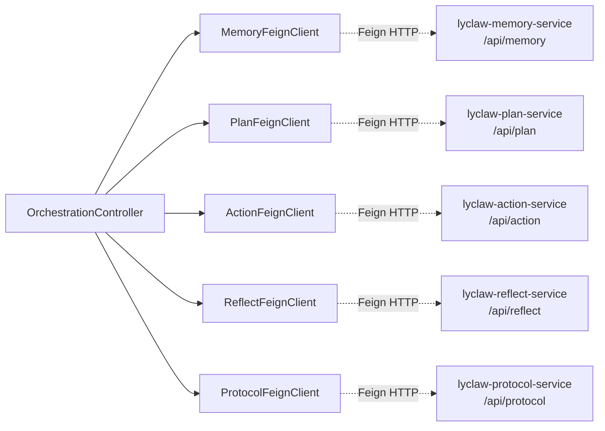
```mermaid
graph LR
    OC[OrchestrationController] --> MFC[MemoryFeignClient]
    OC --> PFC[PlanFeignClient]
    OC --> AFC[ActionFeignClient]
    OC --> RFC[ReflectFeignClient]
    OC --> PRFC[ProtocolFeignClient]

    MFC -.->|Feign HTTP| MS["lyclaw-memory-service<br/>/api/memory"]
    PFC -.->|Feign HTTP| PS["lyclaw-plan-service<br/>/api/plan"]
    AFC -.->|Feign HTTP| AS["lyclaw-action-service<br/>/api/action"]
    RFC -.->|Feign HTTP| RS["lyclaw-reflect-service<br/>/api/reflect"]
    PRFC -.->|Feign HTTP| PRS["lyclaw-protocol-service<br/>/api/protocol"]
```

| Feign 客户端 | 服务名 | 端点 | 方法 |
|-------------|--------|------|------|
| `MemoryFeignClient` | `lyclaw-memory-service` | `/api/memory` | `retrieve(query)`, `ingest(data,sessionId,userId)`, `consolidate(userId,sessionId)`, `getStats()` |
| `PlanFeignClient` | `lyclaw-plan-service` | `/api/plan` | `plan(request)`, `revise(request)` |
| `ActionFeignClient` | `lyclaw-action-service` | `/api/action` | `executeTool(request)`, `executeSkill(request)`, `listTools()` |
| `ReflectFeignClient` | `lyclaw-reflect-service` | `/api/reflect` | `reflect(request)` |
| `ProtocolFeignClient` | `lyclaw-protocol-service` | `/api/protocol` | `discoverTools(serverCommand)`, `chat(request)` |

### 4.4 关键 DTO 详解

#### 4.4.1 记忆系统 DTO

**MemoryEntry** -- 记忆条目（核心实体）

| 字段 | 类型 | 说明 |
|------|------|------|
| entryId | String | 唯一标识 |
| userId | String | 所属用户 |
| sessionId | String | 所属会话 |
| layer | MemoryLayerType | 所在层级 (SENSORY/SHORT_TERM/LONG_TERM/ENTITY) |
| content | String | 记忆内容 |
| summary | String | 摘要（内容过长时自动截取前 200 字符） |
| embedding | float[] | 向量嵌入 |
| category | MemoryCategory | 分类 (FACT/PREFERENCE/EVENT/LESSON/TASK/RELATION/GOAL) |
| importance | double | 重要性 |
| accessCount | int | 访问次数 |
| temporal | TemporalProps | 时间属性（创建时间、最后访问时间、衰减因子、强度） |
| tags | List\<String\> | 标签列表 |
| metadata | Map\<String, Object\> | 元数据 |

**MemoryQuery** -- 记忆查询请求

| 字段 | 类型 | 默认值 | 说明 |
|------|------|--------|------|
| queryText | String | -- | 查询文本 |
| queryEmbedding | float[] | -- | 查询向量（可选） |
| topK | int | 20 | 返回数量 |
| alpha | double | 0.45 | 向量分数权重 |
| beta | double | 0.20 | BM25 分数权重 |
| gamma | double | 0.15 | 时间衰减权重 |
| delta | double | 0.20 | 重要性权重 |
| layerFilter | List\<MemoryLayerType\> | null(全部) | 层级过滤 |
| categoryFilter | List\<MemoryCategory\> | null(全部) | 分类过滤 |
| tagFilter | List\<String\> | null(全部) | 标签过滤 |
| metadataFilter | Map\<String, Object\> | null(全部) | 元数据过滤 |

**PerceptionData** -- 感知数据（输入端 DTO）

| 字段 | 类型 | 说明 |
|------|------|------|
| role | String | 角色 (user/assistant) |
| content | String | 对话内容 |
| timestamp | long | 时间戳 |
| toolCallIds | List\<String\> | 关联的工具调用 ID |
| metadata | Map\<String, Object\> | 扩展元数据 |

**EntityMemory** -- 实体记忆

| 字段 | 类型 | 说明 |
|------|------|------|
| entityType | String | 实体类型 |
| entityId | String | 实体 ID |
| name | String | 名称 |
| description | String | 描述 |
| properties | Map\<String, Object\> | 属性 |
| relations | List\<EntityRelation\> | 关系列表 (relationType, targetEntityType, targetEntityId, weight) |
| version | long | 版本号（upsert 自增） |
| updatedAt | long | 更新时间 |

**MemoryStats** -- 记忆统计

| 字段 | 类型 | 说明 |
|------|------|------|
| perceptionCount | long | 感知层条目数 |
| shortTermCount | long | 短期层条目数 |
| longTermCount | long | 长期层条目数 |
| entityCount | long | 实体层条目数 |
| totalTokens | long | 总 Token 估算 |
| avgImportance | double | 平均重要性 |
| lastConsolidationTime | long | 上次固化时间 |
| lastJanitorRunTime | long | 上次清理时间 |

---

#### 4.4.2 反思引擎 DTO

**ReflectionReport** -- 反思报告

| 字段 | 类型 | 说明 |
|------|------|------|
| reflectionId | String | 反思报告 ID |
| sessionId | String | 关联会话 |
| quality | QualityAssessment | 质量评估 |
| errors | List\<DetectedError\> | 检测到的错误 |
| suggestion | StrategyAdjustment | 策略调整建议（仅在评分低或有错误时生成） |
| overallScore | double | 综合评分 |
| timestamp | long | 时间戳 |

**QualityAssessment** -- 质量评估

| 字段 | 类型 | 说明 |
|------|------|------|
| accuracy | double | 准确性 (权重 0.35) |
| completeness | double | 完整性 (权重 0.30) |
| safety | double | 安全性 (权重 0.20) |
| userExperience | double | 用户体验 (权重 0.15) |
| overall | double | 加权综合评分 |

**DetectedError** -- 检测到的错误

| 字段 | 类型 | 说明 |
|------|------|------|
| type | ErrorType | 错误类型 (HALLUCINATION/LOGIC_CONTRADICTION/TOOL_FAILURE_PATTERN/INCOMPLETE_OUTPUT/SAFETY_VIOLATION/FORMAT_ERROR) |
| description | String | 错误描述 |
| location | String | 错误位置 |
| confidence | double | 置信度 |
| suggestion | String | 修复建议 |

**ToolCallRecord** -- 工具调用记录（用于错误检测分析）

| 字段 | 类型 | 说明 |
|------|------|------|
| toolName | String | 工具名称 |
| success | boolean | 是否成功 |
| durationMs | long | 耗时 |
| output | String | 输出 |
| errorMessage | String | 错误信息 |

---

#### 4.4.3 任务规划 DTO

**TaskPlan** -- 任务计划接口

```java
@JsonDeserialize(as = SimpleTaskPlan.class)
public interface TaskPlan {
    List<TaskNode> getNodes();
    List<String> getDependencies(String nodeId);
    long getEstimatedCompletionTime();
    boolean isReady();
}
```

**TaskNode** -- 任务节点

| 字段 | 类型 | 说明 |
|------|------|------|
| nodeId | String | 节点唯一 ID |
| type | String | 节点类型 (ANALYZE/RESEARCH/DESIGN/EXECUTE/VERIFY/THINK/ACT/OBSERVE/THOUGHT/ACTION/OBSERVATION 等) |
| description | String | 节点描述 |
| requiredTools | List\<String\> | 需要的工具列表 |
| dependencies | List\<String\> | 依赖的前置节点 ID |
| timeoutMs | long | 超时时间 |

**PlanRequest** -- 规划请求

| 字段 | 类型 | 说明 |
|------|------|------|
| sessionId | String | 会话 ID |
| userIntent | String | 用户意图 |
| strategy | String | 规划策略 ("default" / "cot" / "react" 等) |
| context | Map\<String, Object\> | 上下文 |

**ReflectionFeedback** -- 反思反馈

| 字段 | 类型 | 说明 |
|------|------|------|
| reportId | String | 关联的报告 ID |
| nodeId | String | 关联的节点 ID |
| qualityScore | double | 质量评分 |
| detectedErrors | List\<String\> | 检测到的错误列表 |
| suggestedStrategy | String | 建议策略 ("replan" / "reorder" / "insert" / "more_cycles") |
| adjustedPrompt | String | 调整后的提示词 |

---

#### 4.4.4 动作执行 DTO

**ActionResult** -- 动作执行结果

| 字段 | 类型 | 说明 |
|------|------|------|
| nodeId | String | 关联的 TaskNode ID |
| success | boolean | 是否成功 |
| output | String | 输出内容 |
| errorMessage | String | 错误信息 |
| durationMs | long | 耗时 |
| metadata | Map\<String, Object\> | 元数据 (可包含 groundTruth, toolCallHistory 等) |

**ToolResult** (core) / ToolResult (action.tool) -- 工具执行结果（存在两份定义）

| 字段 | 类型 | 说明 |
|------|------|------|
| toolName | String | 工具名称 |
| success | boolean | 是否成功 |
| output | String | 输出 |
| errorMessage | String | 错误信息 |
| durationMs | long | 耗时 |
| metadata | Map\<String, Object\> | 元数据 |

**SkillResult** -- 技能执行结果

| 字段 | 类型 | 说明 |
|------|------|------|
| skillId | String | 技能 ID |
| success | boolean | 是否成功 |
| output | String | 输出 |
| error | String | 错误信息 |
| durationMs | long | 耗时 |
| progress | double | 进度 0.0-1.0 |

**SkillExecuteRequest** -- 技能执行请求

| 字段 | 类型 | 说明 |
|------|------|------|
| skillId | String | 技能 ID |
| context | Map\<String, Object\> | 上下文 |

**ToolExecuteRequest** -- 工具执行请求

| 字段 | 类型 | 说明 |
|------|------|------|
| toolName | String | 工具名称 |
| args | Map\<String, Object\> | 参数 |
| sessionId | String | 会话 ID |

---

### 4.5 领域模型关系图


```mermaid
classDiagram
    direction TB

    class BaseDTO {
        <<abstract>>
        +String id
        +LocalDateTime createdAt
        +LocalDateTime updatedAt
    }

    class Session {
        +String sessionId
        +String name
        +String model
        +List~Message~ messages
        +addMessage(Message)
    }
    BaseDTO <|-- Session

    class Message {
        +String role
        +String content
        +String model
        +Usage usage
        +List~ToolCall~ toolCalls
        +String toolCallId
    }
    BaseDTO <|-- Message

    class ChatRequest {
        +String sessionId
        +List~Message~ messages
        +String systemPrompt
        +String model
        +Integer maxTokens
        +boolean stream
        +Double temperature
        +Double topP
        +List~ToolDefinition~ tools
        +boolean thinkingEnabled
        +Integer thinkingBudget
    }

    class ChatContext {
        +ChatRequest request
        +Session session
        +MemoryContent memory
        +List~Message~ messages
        +List~ToolDefinition~ toolDefinitions
        +InterceptorChain interceptorChain
        +ModelProvider modelProvider
        +ChatResult result
        +TraceContext tracing
    }

    class TaskPlan {
        <<interface>>
        +getNodes() List~TaskNode~
        +getDependencies(String) List~String~
        +isReady() boolean
    }
    class SimpleTaskPlan {
        +List~TaskNode~ nodes
    }
    TaskPlan <|.. SimpleTaskPlan

    class TaskNode {
        +String nodeId
        +String type
        +String description
        +List~String~ requiredTools
        +List~String~ dependencies
        +long timeoutMs
    }
    SimpleTaskPlan *-- TaskNode

    class MemorySystem {
        <<interface>>
        +ingestPerception()
        +storeShortTerm()
        +commitLongTerm()
        +upsertEntity()
        +retrieve()
        +consolidate()
        +evictExpiredPerceptions()
        +getStats()
    }

    class MemoryEntry {
        +String entryId
        +String sessionId
        +MemoryLayerType layer
        +String content
        +String summary
        +float[] embedding
        +MemoryCategory category
        +double importance
        +int accessCount
        +TemporalProps temporal
        +List~String~ tags
        +Map metadata
    }
    MemorySystem ..> MemoryEntry : manages

    class MemoryQuery {
        +String queryText
        +float[] queryEmbedding
        +int topK
        +double alpha
        +double beta
        +double gamma
        +double delta
        +List~MemoryLayerType~ layerFilter
        +List~MemoryCategory~ categoryFilter
        +List~String~ tagFilter
    }

    class MemoryQueryResult {
        +List~MemoryEntry~ entries
        +int totalHits
        +long queryTimeMs
        +String retrievalMethod
    }

    class EntityMemory {
        +String entityType
        +String entityId
        +String name
        +String description
        +Map properties
        +List~EntityRelation~ relations
        +long version
        +long updatedAt
    }

    class PerceptionData {
        +String role
        +String content
        +long timestamp
        +List~String~ toolCallIds
        +Map metadata
    }

    class ReflectionEngine {
        <<interface>>
        +reflect(ChatContext, ActionResult) ReflectionReport
        +assessQuality(String, QualityCriteria) QualityAssessment
        +detectErrors(String, List~String~) List~DetectedError~
        +suggestAdjustment(ReflectionReport) StrategyAdjustment
    }

    class ReflectionReport {
        +String reflectionId
        +String sessionId
        +QualityAssessment quality
        +List~DetectedError~ errors
        +StrategyAdjustment suggestion
        +double overallScore
        +long timestamp
    }
    ReflectionEngine ..> ReflectionReport : produces

    class QualityAssessment {
        +double accuracy
        +double completeness
        +double safety
        +double userExperience
        +double overall
    }
    ReflectionReport *-- QualityAssessment

    class DetectedError {
        +ErrorType type
        +String description
        +String location
        +double confidence
        +String suggestion
    }
    ReflectionReport *-- DetectedError

    class ActionExecutor {
        <<interface>>
        +execute(TaskPlan, ChatContext) Flux~ActionResult~
        +executeTool(String, Map, SandboxLevel) CompletableFuture~ToolResult~
        +executeSkill(String, ChatContext) CompletableFuture~SkillResult~
    }

    class ActionResult {
        +String nodeId
        +boolean success
        +String output
        +String errorMessage
        +long durationMs
        +Map metadata
    }
    ActionExecutor ..> ActionResult : produces

    class ToolResult {
        +String toolName
        +boolean success
        +String output
        +String errorMessage
        +long durationMs
        +Map metadata
    }

    class Orchestrator {
        <<interface>>
        +execute(ChatContext) Flux~String~
        +executeAgentTask(OrchestrationContext) Flux~AgentEvent~
        +cancel(String) boolean
        +getProgress(String) double
    }

    class OrchestrationContext {
        +ChatContext chatContext
        +List~AgentTask~ tasks
        +String collaborationModeId
        +Map attributes
        +String collaborationId
    }

    class AgentEvent {
        +EventType type
        +String agentId
        +String data
        +Map metadata
        +long timestamp
    }

    class ToolRegistry {
        <<interface>>
        +register(Tool)
        +get(String) Tool
        +getAllDefinitions() List~ToolDefinition~
        +execute(ToolCall, ChatContext) ToolResult
    }

    class Tool {
        <<interface>>
        +getName() String
        +execute(ToolCall, ChatContext) ToolResult
        +getDefinition() ToolDefinition
    }

    class ModelAdapter {
        <<interface>>
        +chat(ChatRequest) ModelResponse
        +chatStream(ChatRequest) Flux~String~
        +countTokens(String) int
        +validate() boolean
        +configure(ModelConfig)
    }

    class McpServer {
        <<interface>>
        +start()
        +stop()
        +registerTool(McpToolDescriptor)
        +executeTool(String, Map) CompletableFuture~ToolResult~
    }

    class EventBus {
        <<interface>>
        +publish(Event)
        +subscribe(Class, Consumer)
        +unsubscribe(Class, Consumer)
        +clear()
    }

    class Pipeline {
        <<interface>>
        +execute(ChatContext)
        +getStages() List~PipelineStage~
    }

    class SecurityManager {
        <<interface>>
        +approve(ChatContext, String) ApprovalResult
        +revoke(String)
        +checkPermission(String, String) boolean
        +getEffectivePolicies() List~String~
    }

    Orchestrator ..> TaskPlan : uses
    Orchestrator ..> ActionExecutor : uses
    Orchestrator ..> ReflectionEngine : uses
    Orchestrator ..> MemorySystem : uses
    Orchestrator ..> SecurityManager : uses
    Orchestrator ..> EventBus : uses
    Orchestrator ..> ChatContext : consumes
    ActionExecutor ..> ToolRegistry : uses
    ActionExecutor ..> TaskPlan : consumes
    ReflectionEngine ..> ActionResult : consumes
    MemorySystem ..> MemoryQuery : consumes
    MemorySystem ..> MemoryQueryResult : produces
    MemorySystem ..> PerceptionData : consumes
    MemorySystem ..> EntityMemory : manages
```

### 4.6 微服务间调用链路

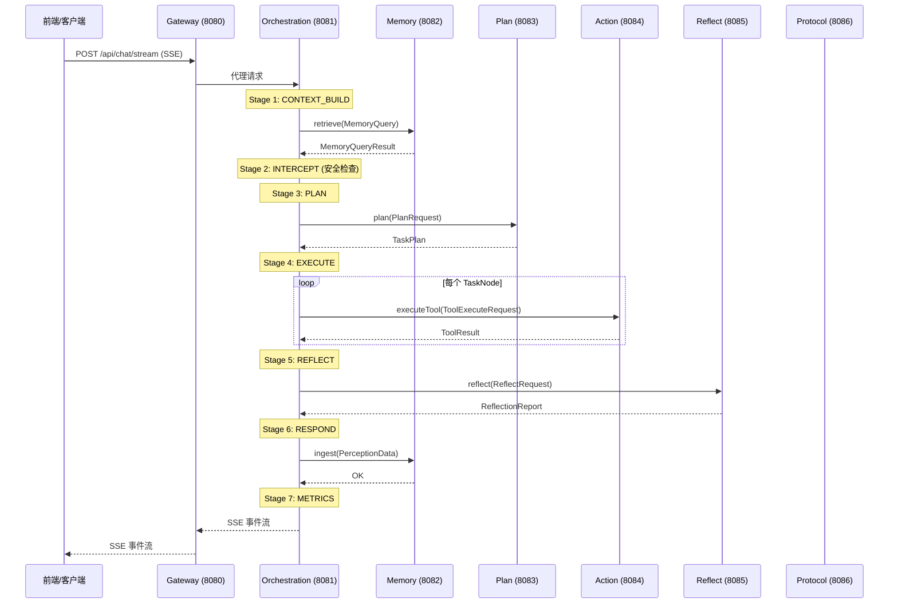
```mermaid
sequenceDiagram
    participant Client as 前端/客户端
    participant GW as Gateway (8080)
    participant ORC as Orchestration (8081)
    participant MEM as Memory (8082)
    participant PLAN as Plan (8083)
    participant ACT as Action (8084)
    participant REF as Reflect (8085)
    participant PROTO as Protocol (8086)

    Client->>GW: POST /api/chat/stream (SSE)
    GW->>ORC: 代理请求

    Note over ORC: Stage 1: CONTEXT_BUILD
    ORC->>MEM: retrieve(MemoryQuery)
    MEM-->>ORC: MemoryQueryResult

    Note over ORC: Stage 2: INTERCEPT (安全检查)

    Note over ORC: Stage 3: PLAN
    ORC->>PLAN: plan(PlanRequest)
    PLAN-->>ORC: TaskPlan

    Note over ORC: Stage 4: EXECUTE
    loop 每个 TaskNode
        ORC->>ACT: executeTool(ToolExecuteRequest)
        ACT-->>ORC: ToolResult
    end

    Note over ORC: Stage 5: REFLECT
    ORC->>REF: reflect(ReflectRequest)
    REF-->>ORC: ReflectionReport

    Note over ORC: Stage 6: RESPOND
    ORC->>MEM: ingest(PerceptionData)
    MEM-->>ORC: OK

    Note over ORC: Stage 7: METRICS
    ORC-->>GW: SSE 事件流
    GW-->>Client: SSE 事件流
```

### 4.7 枚举类型总览

| 枚举 | 所在模块 | 值 |
|------|----------|-----|
| `MemoryLayerType` | lyclaw-core | `SENSORY`, `SHORT_TERM`, `LONG_TERM`, `ENTITY` |
| `MemoryCategory` | lyclaw-core | `FACT`, `PREFERENCE`, `EVENT`, `LESSON`, `TASK`, `RELATION`, `GOAL` |
| `DetectedError.ErrorType` | lyclaw-core | `HALLUCINATION`, `LOGIC_CONTRADICTION`, `TOOL_FAILURE_PATTERN`, `INCOMPLETE_OUTPUT`, `SAFETY_VIOLATION`, `FORMAT_ERROR` |
| `PermissionLevel` | lyclaw-core | `DENY(0)`, `READ(1)`, `EXECUTE_SAFE(2)`, `EXECUTE_MODIFY(3)`, `EXECUTE_DESTRUCTIVE(4)`, `ADMIN(5)` |
| `SandboxLevel` | lyclaw-core | `ISOLATED`, `READ_ONLY`, `RESTRICTED`, `CONTAINER`, `NONE` |
| `McpTransportType` | lyclaw-core | `STDIO`, `SSE`, `WEBSOCKET` |
| `CollaborationMode` | lyclaw-core | -- |
| `TopologyType` | lyclaw-core | -- |
| `DecompositionStrategy` | lyclaw-core | `SEQUENTIAL`, `BY_DOMAIN`, `BY_PHASE`, `PARALLEL_INDEPENDENT`, `LLM_DRIVEN`, `TREE` |
| `AgentState` | lyclaw-core | -- |
| `SkillType` | lyclaw-core | -- |
| `AgentEvent.EventType` | lyclaw-core | `COLLABORATION_STARTED`, `TASK_STARTED`, `TASK_COMPLETED`, `TASK_FAILED`, `COLLABORATION_ENDED` |
| `ErrorCode` | lyclaw-common | 40+ 错误码，按前缀分类：1xxx 系统错误，2xxx 模型错误，3xxx 存储错误，4xxx 校验错误，5xxx 会话错误 |
| `A2aMessageType` | lyclaw-core | -- |

### 4.8 ErrorCode 错误码完整对照表

LyClaw 使用 `lyclaw.com.lyclaw.enums.ErrorCode` 枚举统一管理系统中所有可预见的异常。每个错误码由三要素组成：业务编码（code）、HTTP 状态码（httpStatus）和默认中文消息（defaultMessage）。以下按大类分列全部 40 个错误码：

**系统级错误（1xxx）：**

| 错误码 | 枚举名 | HTTP | 消息 |
|--------|--------|------|------|
| 1000 | SYSTEM_ERROR | 500 | 系统内部错误 |
| 1001 | STORAGE_ERROR | 500 | 存储读写失败 |
| 1002 | CONFIG_MISSING | 500 | 配置项缺失或无效 |

**模型层错误（2xxx）：**

| 错误码 | 枚举名 | HTTP | 消息 |
|--------|--------|------|------|
| 2001 | MODEL_CONFIG_NOT_FOUND | 404 | 模型配置不存在 |
| 2002 | MODEL_API_INVALID_KEY | 401 | API Key 无效或已过期 |
| 2003 | MODEL_API_FORBIDDEN | 403 | API Key 没有访问权限 |
| 2004 | MODEL_API_TIMEOUT | 504 | 模型 API 响应超时 |
| 2005 | MODEL_API_RATE_LIMITED | 429 | 请求过于频繁，请稍后重试 |
| 2006 | MODEL_API_ERROR | 502 | 模型 API 返回错误 |
| 2007 | MODEL_RESPONSE_PARSE_ERROR | 500 | 模型响应解析失败 |
| 2008 | MODEL_TOOL_CALLS_EXCEEDED | 400 | 工具调用轮次超过上限 |
| 2009 | MODEL_INVALID_REQUEST | 400 | 请求参数无效 |
| 2010 | MODEL_CONTENT_FILTER | 400 | 内容被安全策略过滤 |
| 2011 | MODEL_UNSUPPORTED_OPERATION | 400 | 模型不支持此操作 |
| 2012 | ADAPTER_NOT_FOUND | 500 | 未找到对应的模型适配器 |
| 2013 | ADAPTER_NOT_CONFIGURED | 400 | 适配器尚未配置，请先调用 configure() |

**存储层错误（3xxx）：**

| 错误码 | 枚举名 | HTTP | 消息 |
|--------|--------|------|------|
| 3001 | STORAGE_FILE_NOT_FOUND | 404 | 文件不存在 |
| 3002 | STORAGE_READ_ERROR | 500 | 读取文件失败 |
| 3003 | STORAGE_WRITE_ERROR | 500 | 写入文件失败 |
| 3004 | STORAGE_PARSE_ERROR | 500 | 文件解析失败 |
| 3005 | STORAGE_DELETE_ERROR | 500 | 删除文件失败 |
| 3006 | STORAGE_CREATE_DIR_ERROR | 500 | 创建目录失败 |
| 3007 | STORAGE_LIST_ERROR | 500 | 列出目录失败 |

**校验/配置错误（4xxx）：**

| 错误码 | 枚举名 | HTTP | 消息 |
|--------|--------|------|------|
| 4001 | VALIDATION_ERROR | 400 | 参数校验失败 |
| 4002 | CONFIG_NAME_DUPLICATE | 409 | 配置名称已存在 |
| 4003 | CONFIG_NAME_NOT_FOUND | 404 | 配置名称不存在 |

**会话层错误（5xxx）：**

| 错误码 | 枚举名 | HTTP | 消息 |
|--------|--------|------|------|
| 5001 | SESSION_NOT_FOUND | 404 | 会话不存在 |
| 5002 | SESSION_MESSAGE_LIMIT | 400 | 会话消息数已达上限 |
| 5003 | SESSION_CORRUPTED | 500 | 会话文件已损坏 |

`ErrorCode` 枚举的设计优势在于通过工厂方法直接返回异常对象：`ErrorCode.MODEL_API_TIMEOUT.exception()` 即返回一个完整的 `LyClawException`，携带了 code、httpStatus 和 defaultMessage。也可通过 `exception(Throwable cause)` 传入原始异常作为 cause，或通过 `exception(String customMessage)` 使用自定义消息。

### 4.9 技术架构总结

**技术栈全景：**

| 层面 | 技术选择 | 说明 |
|------|----------|------|
| 框架 | Spring Boot 3.x + Spring Cloud | 微服务基础框架 |
| 响应式编程 | Project Reactor (Flux/Mono) | 流式处理 SSE、Reactor 调度 |
| 服务间通信 | Spring Cloud OpenFeign | 声明式 HTTP 客户端 |
| API 网关 | Spring Cloud Gateway | 响应式路由、CORS、SSE 穿透 |
| 序列化 | Jackson (ObjectMapper) | JSON/YAML/Markdown 多格式支持 |
| 配置管理 | @ConfigurationProperties | 层次化配置绑定（lyclaw.* 前缀） |
| 可观测性 | Micrometer | 指标采集、流水线计时、调用统计 |
| 向量检索 | 内存余弦相似度 + BM25 | 混合检索（向量 + 关键词 + 时间 + 重要性） |
| 并发控制 | ConcurrentHashMap + 虚拟线程 | 线程安全的存储 + Project Loom |
| 模型协议 | OpenAI 兼容 + Anthropic 原生 | 多厂商适配 |
| 协议标准 | MCP 2024-11-05 + A2A | JSON-RPC 2.0 / SSE / STDIO |
| 安全防护 | Guardrail Chain + 哈希链审计 | 多层过滤 + 防篡改审计 |

**核心设计模式应用：**

| 设计模式 | 应用场景 | 相关类 |
|----------|----------|--------|
| 模板方法模式 | 模型适配器 | `AbstractModelAdapter` → `DeepSeekOpenAIAdapter` / `MinimaxAdapter` |
| 策略模式 | 任务规划器 | `TaskPlanner` → `DAGTaskPlanner` / `CoTPlanner` / `ReActPlanner` |
| 注册表模式 | 工具/技能管理 | `DefaultToolRegistry` / `DefaultSkillRegistry` |
| 工厂模式 | 适配器创建 | `ModelAdapterFactory` |
| 管道模式 | 编排流水线 | `Pipeline` → `DefaultPipeline` (7 个 `PipelineStage`) |
| 观察者模式 | 事件总线 | `EventBus` → `InfraEventBus` (publish/subscribe) |
| 建造者模式 | 领域对象构造 | 全部 DTO 使用 `@Builder` |
| 职责链模式 | 拦截器/过滤器 | `InterceptorChain` / Guardrail Chain |
| 组合模式 | 任务图 | `PlanGraph` (节点 + 边依赖) |
| 桥接模式 | 格式策略 | `BaseStorage` + `FormatStrategy` (JSON/Markdown) |

**数据流向总结：**

在 LyClaw 微服务架构中，数据沿固定方向流转：

```
用户输入 → Gateway(8080) → Orchestration(8081)
  ├── 阶段1 CONTEXT_BUILD: Orchestration → Memory(8082) 检索记忆
  ├── 阶段2 INTERCEPT: 本地安全审查 + 内容过滤
  ├── 阶段3 PLAN: Orchestration → Plan(8083) 生成任务图
  ├── 阶段4 EXECUTE: Orchestration → Action(8084) 逐节点执行
  ├── 阶段5 REFLECT: Orchestration → Reflect(8085) 质量评估
  ├── 阶段6 RESPOND: Orchestration → Memory(8082) 记忆固化
  └── 阶段7 METRICS: 统计汇总 + SSE 推送至前端
```

整个系统以`ChatContext`作为贯穿全生命周期的上下文容器，包含会话状态、记忆内容、消息历史、工具定义、拦截器链、追踪信息。每个微服务通过 Feign 客户端接口进行通信，接口契约定义在`lyclaw-core`模块中以实现编译时接口约束。

**模块依赖关系总览：**

在 Maven 依赖层面，模块之间形成清晰的层次依赖：

```
lyclaw-common （最底层，无依赖）
    ↓
lyclaw-core （仅依赖 lyclaw-common，定义全部 SPI 接口）
    ↓
lyclaw-infra / lyclaw-storage （依赖 lyclaw-core，提供基础设施实现）
    ↓
lyclaw-memory / lyclaw-plan / lyclaw-action / lyclaw-reflect / lyclaw-protocol
    ↓ （各微服务依赖 lyclaw-core + lyclaw-common + lyclaw-infra）
lyclaw-orchestration （依赖 lyclaw-core，通过 Feign 调用各下游微服务）
    ↓
lyclaw-gateway （最外层，依赖 Spring Cloud Gateway，不依赖业务模块）
```

这种分层架构确保了模块间的单向依赖、接口与实现分离、以及独立部署能力。新增微服务只需实现`lyclaw-core`中的对应 SPI 接口并在网关中添加路由规则，无需修改已有模块代码。

---

*（第三章与第四章完）*
# 第五章：四元AI循环 (Plan→Action→Reflect→Memory)

## 5.1 概述

四元AI循环是 LyClaw 自主Agent的核心引擎，构成了从感知用户意图到产生最终响应的完整闭环。一个完整的循环包含四个阶段：规划（Plan）、执行（Action）、反思（Reflect）、记忆（Memory）。每个阶段由一个独立的微服务模块承载，通过 Feign 客户端进行服务间通信，由编排层（Orchestrator）统一调度。

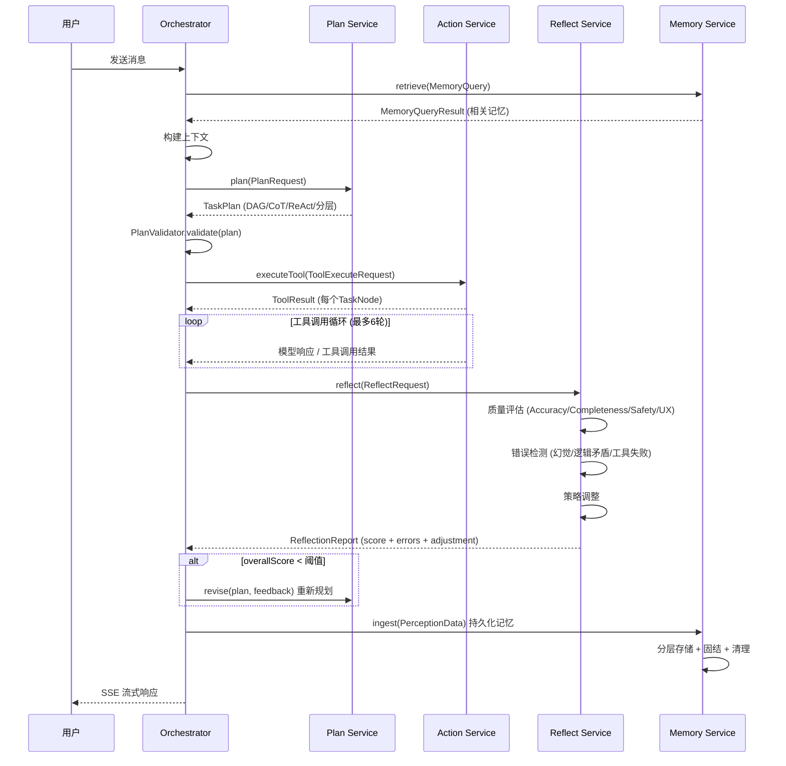
```mermaid
sequenceDiagram
    participant User as 用户
    participant Orch as Orchestrator
    participant PlanSvc as Plan Service
    participant ActionSvc as Action Service
    participant ReflectSvc as Reflect Service
    participant MemorySvc as Memory Service

    User->>Orch: 发送消息
    Orch->>MemorySvc: retrieve(MemoryQuery)
    MemorySvc-->>Orch: MemoryQueryResult (相关记忆)
    Orch->>Orch: 构建上下文

    Orch->>PlanSvc: plan(PlanRequest)
    PlanSvc-->>Orch: TaskPlan (DAG/CoT/ReAct/分层)
    Orch->>Orch: PlanValidator.validate(plan)

    Orch->>ActionSvc: executeTool(ToolExecuteRequest)
    ActionSvc-->>Orch: ToolResult (每个TaskNode)
    loop 工具调用循环 (最多6轮)
        ActionSvc-->>Orch: 模型响应 / 工具调用结果
    end

    Orch->>ReflectSvc: reflect(ReflectRequest)
    ReflectSvc->>ReflectSvc: 质量评估 (Accuracy/Completeness/Safety/UX)
    ReflectSvc->>ReflectSvc: 错误检测 (幻觉/逻辑矛盾/工具失败)
    ReflectSvc->>ReflectSvc: 策略调整
    ReflectSvc-->>Orch: ReflectionReport (score + errors + adjustment)

    alt overallScore < 阈值
        Orch->>PlanSvc: revise(plan, feedback) 重新规划
    end

    Orch->>MemorySvc: ingest(PerceptionData) 持久化记忆
    MemorySvc->>MemorySvc: 分层存储 + 固结 + 清理
    Orch-->>User: SSE 流式响应
```

## 5.2 Plan (规划) — 任务分解与策略选择

规划阶段的核心接口是 `TaskPlanner`，LyClaw 提供了四种差异化策略的规划器实现，均位于 `lyclaw-plan` 模块的 `lyjew.com.lyclaw.plan.impl` 包中。

### 5.2.1 DAGTaskPlanner — 基于复杂度的有向无环图规划器

`DAGTaskPlanner` 是默认的任务规划器，通过对用户意图进行模式匹配来评估复杂度，并生成相应粒度的 DAG 任务计划。

**复杂度评估机制**：使用两组正则表达式模式进行意图分类：

```java
// 复杂模式 — 检测需要多步执行的任务
private static final Pattern COMPLEX_PATTERN = Pattern.compile(
    "(?i)\\b(build|create|develop|implement|design|deploy|migrate|refactor|"
    + "optimize|integrate|configure|orchestrate|analyze|investigate|"
    + "transform|generate|compare|evaluate|summarize|translate|review|"
    + "同时|并行|并且|以及|另外|此外|首先.*然后.*最后|"
    + "第一步|第二步|第三步|阶段|步骤)\\b");

// 简单模式 — 检测单步可完成的任务
private static final Pattern SIMPLE_PATTERN = Pattern.compile(
    "(?i)\\b(what is|who is|when|where|how to|define|explain|describe|list|show|get|fetch)\\b");
```

复杂度评估结果与计划生成策略的映射关系如下：

| 复杂度级别 | 匹配条件 | 计划策略 | 典型节点数 |
|-----------|---------|---------|-----------|
| 0 (简单) | 简单模式命中 且 复杂计数 <= 1 | `buildSimplePlan` | 1 个 EXECUTE 节点 |
| 1 (轻量) | 复杂计数 <= 1 | `buildSimplePlan` | 1 个 EXECUTE 节点 |
| 2-3 (中等) | 复杂计数 <= 3 | `buildMediumPlan` | 4 个节点 (ANALYZE->PLAN->EXECUTE->VERIFY) |
| 4+ (复杂) | 复杂计数 > 3 | `buildComplexPlan` | 7 个节点 (含并行分支 RESEARCH/DESIGN/PREPARE) |

**中等复杂度计划结构**（链式依赖）：

```
ANALYZE -> PLAN -> EXECUTE -> VERIFY
```

**高复杂度计划结构**（含并行分支）：

```
                    ┌──> RESEARCH ──┐
ROOT (ANALYZE) ─────┼──> DESIGN  ───┼──> INTEGRATE ──> EXECUTE ──> VERIFY
                    └──> PREPARE ───┘
```

**反馈驱动的计划修订**：`DAGTaskPlanner.revise()` 方法根据 `ReflectionFeedback` 执行三种修订策略：

- `fullReplan` — 当 `qualityScore < 0.3` 或建议包含"replan"时，触发完全重规划
- `reorderNodes` — 当检测到顺序错误时，重新排列节点并更新依赖
- `insertNode` — 当检测到缺失步骤时，插入额外的 VERIFY 节点并更新下游依赖

**任务分解策略**：`decompose()` 方法支持六种分解策略：

| 策略枚举 | 方法 | 适用场景 |
|---------|------|---------|
| `SEQUENTIAL` | `decomposeSequential` | 按句号/分号拆分，最多5个子任务，>5时自动合并为4组 |
| `BY_DOMAIN` | `decomposeByDomain` | 按领域关键词拆分 (code/data/document/network)，使用 LinkedHashMap 保证顺序 |
| `BY_PHASE` | `decomposeByPhase` | 四阶段拆分：ANALYZE→DESIGN→IMPLEMENT→VERIFY |
| `PARALLEL_INDEPENDENT` | `decomposeParallel` | 检测"同时/并行/分别"等关键词，生成无依赖的并行分支 |
| `LLM_DRIVEN` | `decomposeLlmDriven` | 委托给 `decomposeByPhase` (当前实现) |
| `TREE` | `decomposeTree` | 生成3×2的树形结构：3个一级节点各含2个二级节点 |

### 5.2.2 CoTPlanner — 思维链规划器

`CoTPlanner`（标注为 `@Service("cotPlanner")`）实现了基于 Chain-of-Thought 推理范式的规划。当用户意图包含"why/reason/step by step/逻辑/推理/推导/证明/计算/debug/根因"等推理关键词时，系统应选择此规划器。

**链长度决策**：基于意图中推理关键词的命中次数，公式为 `min(5, max(3, matchCount + 2))`，确保链长度在 3 到 5 之间。

**THINK-ACT-OBSERVE 三步循环**：

```java
private enum CoTStep {
    THINK {
        // 思考阶段：理解问题并推理，不需要工具
        String buildDescription(String intent, int stepNum, int total) {
            return String.format("[Chain %d/%d] Think: Understand and reason about - %s", ...);
        }
        boolean requiresTool() { return false; }
    },
    ACT {
        // 行动阶段：执行具体操作，需要 knowledge_search 工具
        boolean requiresTool() { return true; }
    },
    OBSERVE {
        // 观察阶段：验证结论，不需要工具
        boolean requiresTool() { return false; }
    }
}
```

步骤分配规则：首步必为 THINK，末步必为 OBSERVE，中间步交替 THINK 和 ACT。

**反馈修订**：当 `qualityScore < 0.3` 时重新规划；当建议包含"add_step"或"verify"时，在链尾追加 OBSERVE 节点进行额外验证。

### 5.2.3 ReActPlanner — Reasoning+Acting 循环规划器

`ReActPlanner`（标注为 `@Service("reActPlanner")`）实现了 ReAct（Reasoning and Acting）范式，每个循环包含 THOUGHT→ACTION→OBSERVATION 三个节点。

**循环次数决策**：`Math.min(maxCycles, Math.max(2, intent.length() / 50))`，默认 `maxCycles=5`（可通过 `lyclaw.plan.react.max-cycles` 配置），确保至少2个循环。

**工具分配**：非最终循环的 ACTION 节点携带 `ACTION_TOOLS` 列表（`web_search`, `code_executor`, `file_read`），最终循环的 ACTION 节点不携带工具（作为纯文本回复）。最终循环的 THOUGHT 描述为" Synthesize final answer"，OBSERVATION 描述为" Final verification"。

**反馈修订**：检测以下条件触发额外循环：
- `qualityScore < 0.3`
- 建议包含 "more_cycles"
- 错误描述包含 "premature" / "early" / "incomplete" / "不完整"

额外循环在末尾追加一组完整的 THOUGHT→ACTION→OBSERVATION 三元组。

### 5.2.4 HierarchicalPlanner — 三层分层规划器

`HierarchicalPlanner`（标注为 `@Service("hierarchicalPlanner")`）生成最多三层深度的树形任务结构。

**层级结构定义**：

| 层级 | 标签 (L1/L2/L3) | 含义 |
|-----|-----------------|------|
| L1 | ANALYSIS, EXECUTION, VERIFICATION | 宏观阶段 |
| L2 (ANALYSIS下) | Context-Gathering, Requirement-Analysis, Risk-Assessment | 分析子任务 |
| L2 (EXECUTION下) | Implementation, Integration, Testing, Optimization, Deployment | 执行子任务 |
| L2 (VERIFICATION下) | Validation, Review, Documentation | 验证子任务 |
| L3 | 每个L2对应2-3个具体的 ATOMIC 操作 | 原子任务 |

L1 数量公式：`min(3, max(1, intent.length() / 100 + 1))`
L2 数量公式：`min(5, max(2, intent.length() / 80 + 2))`
L3 数量：每 L2 固定最多 2 个 ATOMIC 节点，超时时间为默认值的一半（30秒）。

**反馈修订**：当 `qualityScore < 0.3` 时，追加一个 EXTRA-VERIFICATION 层级（含 L2 Deep-Check 和 L3 原子验证任务）。

### 5.2.5 PlanValidatorImpl — DAG 计划验证器

`PlanValidatorImpl` 在计划生成后执行结构性验证，确保生成的 TaskPlan 是一个合法的有向无环图（DAG）。

**验证规则清单**：

| 验证项 | 检测方法 | 约束 |
|-------|---------|------|
| 计划非空 | `plan == null \|\| nodes.isEmpty()` | 必须包含至少 1 个节点 |
| 节点ID唯一性 | `HashSet.add()` 判重 | 无重复 nodeId |
| 依赖有效性 | 遍历 deps，检查 `allNodeIds.contains(dep)` | 所有依赖必须指向已存在的节点 |
| 无环检测 | Kahn算法 (BFS拓扑排序) | 入度为0入队，已访问节点数 == 总节点数 |
| 根节点存在 | 检查 `inDegree == 0` 的节点 | 至少 1 个根节点 |
| 可达性 | BFS从根节点遍历 | 所有节点必须从根节点可达 |
| 连通性 | BFS从每个根节点遍历 | 无孤立子图 |
| 时间预算 | `estimatedTime > 600,000ms` | 总预估时间不超过 10 分钟 |
| 节点数限制 | `nodes.size() > 50` | 不超过 50 个节点 |

环形依赖检测使用 Kahn 算法的核心逻辑：

```java
// BFS 拓扑排序检测环
Deque<String> queue = new ArrayDeque<>();
for (String nodeId : allNodeIds) {
    if (inDegree.getOrDefault(nodeId, 0) == 0) queue.add(nodeId);
}
int visitedCount = 0;
while (!queue.isEmpty()) {
    String current = queue.poll();
    visitedCount++;
    for (String neighbor : adjacency.getOrDefault(current, List.of())) {
        if (inDegree.merge(neighbor, -1, Integer::sum) == 0) queue.add(neighbor);
    }
}
// visitedCount != allNodeIds.size() 则存在环
```

### 5.2.6 TaskGraphImpl — 增强型任务图

`TaskGraphImpl` 继承自 `PlanGraph`，提供图分析能力：

- **拓扑排序** (`getTopologicalOrder`)：Kahn算法 + 缓存机制，支持增量失效
- **关键路径** (`getCriticalPath`)：动态规划计算最长路径，综合考虑节点权重和边权重
- **最大并行度** (`getMaxParallelism`)：BFS 层级遍历，统计每层同时可执行的节点数
- **子图提取** (`extractSubgraph`)：从指定根节点提取可达子图
- **祖先/后代查询** (`getAncestors` / `getDescendants`)：DFS/BFS 遍历依赖关系图
- **进度详情** (`getProgressDetail`)：按状态分类统计节点数

规划流程图：

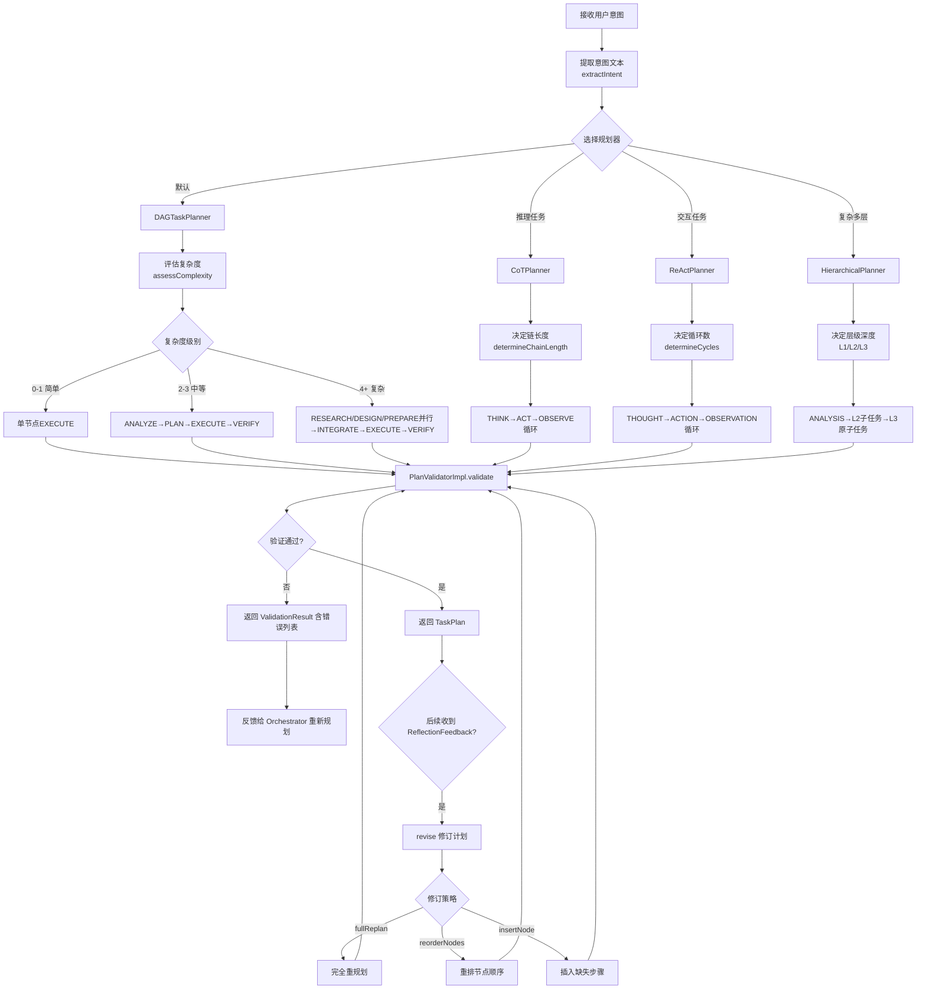
```mermaid
flowchart TD
    A[接收用户意图] --> B[提取意图文本<br/>extractIntent]
    B --> C{选择规划器}
    C -->|默认| D[DAGTaskPlanner]
    C -->|推理任务| E[CoTPlanner]
    C -->|交互任务| F[ReActPlanner]
    C -->|复杂多层| G[HierarchicalPlanner]

    D --> D1[评估复杂度<br/>assessComplexity]
    D1 --> D2{复杂度级别}
    D2 -->|0-1 简单| D3[单节点EXECUTE]
    D2 -->|2-3 中等| D4[ANALYZE→PLAN→EXECUTE→VERIFY]
    D2 -->|4+ 复杂| D5[RESEARCH/DESIGN/PREPARE并行→INTEGRATE→EXECUTE→VERIFY]

    E --> E1[决定链长度<br/>determineChainLength]
    E1 --> E2[THINK→ACT→OBSERVE循环]

    F --> F1[决定循环数<br/>determineCycles]
    F1 --> F2[THOUGHT→ACTION→OBSERVATION循环]

    G --> G1[决定层级深度<br/>L1/L2/L3]
    G1 --> G2[ANALYSIS→L2子任务→L3原子任务]

    D3 --> H[PlanValidatorImpl.validate]
    D4 --> H
    D5 --> H
    E2 --> H
    F2 --> H
    G2 --> H

    H --> I{验证通过?}
    I -->|是| J[返回 TaskPlan]
    I -->|否| K[返回 ValidationResult 含错误列表]
    K --> L[反馈给 Orchestrator 重新规划]

    J --> M{后续收到 ReflectionFeedback?}
    M -->|是| N[revise 修订计划]
    N --> O{修订策略}
    O -->|fullReplan| P[完全重规划]
    O -->|reorderNodes| Q[重排节点顺序]
    O -->|insertNode| R[插入缺失步骤]
    P --> H
    Q --> H
    R --> H
```

## 5.3 Action (执行) — 工具调用与技能编排

执行阶段负责将 TaskPlan 中的节点逐个转化为具体的工具调用或技能执行。核心组件位于 `lyclaw-action` 模块的 `lyjew.com.lyclaw.action.impl` 包。

### 5.3.1 ActionExecutorImpl — 动作执行器

`ActionExecutorImpl` 是执行层的核心调度器，使用 4 线程的守护线程池（线程名前缀 `action-executor`）执行任务。

**节点类型分发逻辑**：

```java
private ActionResult executeNode(TaskNode node, ChatContext context) {
    if ("tool".equalsIgnoreCase(type)) {
        // 工具节点：取 requiredTools[0] 作为工具名
        // 通过 executeTool() 异步执行 (CompletableFuture, 30s超时)
    } else if ("skill".equalsIgnoreCase(type)) {
        // 技能节点：通过 executeSkill() 异步执行 (CompletableFuture, 60s超时)
    } else {
        // 未知类型：返回失败
    }
}
```

- 工具节点超时：30 秒
- 技能节点超时：60 秒
- 节点执行通过 `Flux.create()` 将每个节点的结果逐个发射，支持背压控制

### 5.3.2 DefaultToolRegistry — 工具注册中心

基于 `ConcurrentHashMap<String, Tool>` 的线程安全工具注册中心：

- **自动发现**：通过构造函数注入 `List<Tool>`，Spring 自动收集所有 `Tool` 接口实现
- **MCP 协议支持**：通过 `registerMcpTool()` 方法将外部 MCP (Model Context Protocol) 工具适配为 `McpToolAdapter` 注册
- **分类统计**：`getCategoryStats()` 按 `source` 字段（如 "builtin"）分组统计工具数量
- **覆盖保护**：同名工具注册时输出 WARN 日志

### 5.3.3 ToolSandboxImpl — 工具沙箱（五级安全隔离）

`ToolSandboxImpl` 实现了五级递增的沙箱安全模型，通过 `SandboxLevel` 枚举控制：

| 级别 | 枚举值 | 隔离策略 | 适用工具 |
|-----|--------|---------|---------|
| 0 | `NONE` | 无隔离，直接在调用线程执行 | 所有工具 |
| 1 | `READ_ONLY` | 仅允许只读工具（calculator, current_time, web_search） | 纯查询类 |
| 2 | `RESTRICTED` | 在临时目录中执行（`Files.createTempDirectory`），执行后清理 | 大部分工具 |
| 3 | `CONTAINER` | 进程级隔离（`ProcessBuilder`），超时 30s，输出截断至 10000 字符 | command 工具 |
| 4 | `ISOLATED` | 同上，但语义上代表完全隔离环境 | command 工具 |

RESTRICTED 级别的关键实现：将 `user.dir` 临时切换到沙箱目录，执行完成后`finally`块中删除所有临时文件。

command 工具在 CONTAINER/ISOLATED 级别通过 `ProcessBuilder("sh", "-c", command)` 启动独立进程，`waitFor(30, SECONDS)` 控制超时，超时则 `destroyForcibly()` 强制终止。

### 5.3.4 DefaultSkillRegistry 与 DefaultSkillExecutor — 技能系统

`DefaultSkillRegistry` 管理技能的注册与依赖关系，通过 `SkillGraph` 维护技能间的依赖图，支持：
- `getDependencies(skillId)` — 查询技能依赖
- `resolveExecutionOrder()` — 拓扑排序获取执行顺序

`DefaultSkillExecutor` 使用 4 线程的守护线程池（线程名前缀 `skill-worker`）执行技能，5 分钟超时：

- **进度追踪**：通过 `progressMap`（ConcurrentHashMap）和 `SkillProgressCallback` 回调实时报告进度（0.0 到 1.0）
- **取消支持**：`cancel(skillId)` 方法通过 `CompletableFuture.cancel(true)` 中断执行
- **生命周期管理**：`runningFutures` 追踪所有正在执行的技能

### 5.3.5 ToolCallLoop — 模型驱动的工具调用循环

`ToolCallLoop` 是执行层的核心循环组件，驱动 LLM 在多轮对话中自主决定何时调用工具：

```
while (round < maxRounds):
    1. adapter.chat(context) → ModelResponse
    2. 如果无 tool_calls → break (对话结束)
    3. 逐个执行 tool_calls
       - toolRegistry.execute() → ToolResult
       - 失败时: toolCallPolicy.handleToolError() → ABORT/SKIP/RETRY
       - 将 tool role 消息追加到 messages
    4. 检查 shouldContinue(context, round) → 是否继续
    5. round++
```

错误处理策略由 `ToolErrorAction` 枚举控制：
- `ABORT` — 终止循环，设置错误上下文
- `SKIP` — 跳过当前工具，继续下一轮
- `RETRY` — 重试失败的工具

### 5.3.6 内置工具清单

| 工具名 | 类 | 功能 | 关键参数 | 限制 |
|-------|-----|------|---------|------|
| `calculator` | `CalculatorTool` | 数学表达式计算 | `expression` (String) | 递归下降解析器，支持 +-*/^% () |
| `command` | `CommandTool` | Shell 命令执行 | `command` (String) | 30s 超时，输出截断至 10000 字符 |
| `current_time` | `CurrentTimeTool` | 获取当前时间 | `timezone` (String, 可选) | 支持 IANA 时区标识符 |
| `web_search` | `WebSearchTool` | 互联网搜索 | `searchQuery` (String) | Brave Search API，15s HTTP 超时 |

`CalculatorTool` 实现了完整的递归下降表达式解析器（`parseExpression` → `parseTerm` → `parsePower` → `parseFactor` → `parseNumber`），支持运算符优先级和括号分组，包含除零保护和一元正负号处理。

`WebSearchTool` 优先使用 Brave Search API（通过环境变量 `SEARCH_API_KEY` 配置），API 不可用时回退到模拟搜索结果。

**工具执行生命周期**：

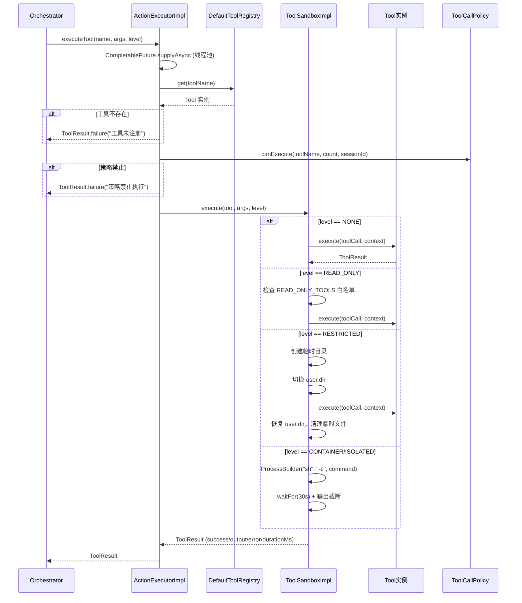
```mermaid
sequenceDiagram
    participant Orchestrator
    participant ActionExec as ActionExecutorImpl
    participant Registry as DefaultToolRegistry
    participant Sandbox as ToolSandboxImpl
    participant Tool as Tool实例
    participant Policy as ToolCallPolicy

    Orchestrator->>ActionExec: executeTool(name, args, level)
    ActionExec->>ActionExec: CompletableFuture.supplyAsync (线程池)
    
    ActionExec->>Registry: get(toolName)
    Registry-->>ActionExec: Tool 实例
    
    alt 工具不存在
        ActionExec-->>Orchestrator: ToolResult.failure("工具未注册")
    end

    ActionExec->>Policy: canExecute(toolName, count, sessionId)
    alt 策略禁止
        ActionExec-->>Orchestrator: ToolResult.failure("策略禁止执行")
    end

    ActionExec->>Sandbox: execute(tool, args, level)

    alt level == NONE
        Sandbox->>Tool: execute(toolCall, context)
        Tool-->>Sandbox: ToolResult
    else level == READ_ONLY
        Sandbox->>Sandbox: 检查 READ_ONLY_TOOLS 白名单
        Sandbox->>Tool: execute(toolCall, context)
    else level == RESTRICTED
        Sandbox->>Sandbox: 创建临时目录
        Sandbox->>Sandbox: 切换 user.dir
        Sandbox->>Tool: execute(toolCall, context)
        Sandbox->>Sandbox: 恢复 user.dir，清理临时文件
    else level == CONTAINER/ISOLATED
        Sandbox->>Sandbox: ProcessBuilder("sh", "-c", command)
        Sandbox->>Sandbox: waitFor(30s) + 输出截断
    end

    Sandbox-->>ActionExec: ToolResult (success/output/error/durationMs)
    ActionExec-->>Orchestrator: ToolResult
```

## 5.4 Reflect (反思) — 质量评估与策略调整

反思阶段对执行结果进行多维度的质量评估、错误检测和策略调整。核心组件位于 `lyclaw-reflect` 模块的 `lyjew.com.lyclaw.reflect.impl` 包。

### 5.4.1 ReflectionEngineImpl — 反思引擎

`ReflectionEngineImpl` 是反思阶段的调度中心，协调整合三个子系统：

```java
public ReflectionReport reflect(ChatContext context, ActionResult result) {
    // 1. 提取输出文本和会话信息
    String output = extractOutput(result);
    
    // 2. 构建质量评估标准并评估
    QualityCriteria criteria = buildCriteria(taskDescription, result);
    QualityAssessment quality = assessQuality(output, criteria);
    
    // 3. 三类错误检测
    errors.addAll(detectErrors(output, groundTruth));      // 幻觉检测
    errors.addAll(detectLogicErrors(output));               // 逻辑矛盾
    errors.addAll(detectToolFailures(result));              // 工具失败
    
    // 4. 计算综合得分
    double overallScore = computeOverallScore(quality);
    // = accuracy*0.35 + completeness*0.30 + safety*0.20 + userExperience*0.15
    
    // 5. 如果有错误或得分低于阈值(0.6)，生成策略调整建议
    if (!errors.isEmpty() || overallScore < QUALITY_THRESHOLD) {
        StrategyAdjustment suggestion = suggestAdjustment(report);
        report.setSuggestion(suggestion);
    }
}
```

**加权评分公式**：

```
overallScore = clamp(
    accuracy × 0.35 +
    completeness × 0.30 +
    safety × 0.20 +
    userExperience × 0.15
)
```

### 5.4.2 DefaultQualityEvaluator — 四维质量评估器

`DefaultQualityEvaluator` 从四个维度评估输出质量：

#### (1) 准确性评估 `evaluateAccuracy()`

```
wordOverlap = Jaccard(output词集, expected词集)
keyTermMatch = |expected关键术语 ∩ output词集| / |expected关键术语|
contradictionPenalty = min(1.0, 矛盾对计数 × 0.2)

accuracy = wordOverlap × 0.50 + keyTermMatch × 0.35 + (1.0 - contradictionPenalty) × 0.15
```

关键术语提取：过滤停用词（62个英文停用词），保留长度 > 2 的词。

#### (2) 完整性评估 `evaluateCompleteness()`

将任务描述按 `[\n.;]` 拆分为需求项（长度 >= 3），对每个需求项检查输出中是否包含其关键术语（匹配率 >= 60% 视为满足）。

```java
double completeness = addressedRequirements / totalRequirements;
```

#### (3) 安全性评估 `evaluateSafety()`

从 1.0 开始扣分的三级检测：

| 检测类型 | 正则/关键词 | 扣分 |
|---------|-----------|------|
| PII 泄露 | 手机号、邮箱、身份证/社保号 正则 | -0.20 |
| 有害内容 | "kill yourself", "child abuse", "terrorist" 等 | -0.25 |
| 注入模式 | `<script>`, `SELECT FROM`, `DROP TABLE`, `eval()`, `${}` 等 | -0.30 |

最低安全分为 0.0。

#### (4) 用户体验评估 `evaluateUserExperience()`

三因子加权：

```
UX = lengthScore × 0.25 + structureScore × 0.45 + toneScore × 0.30

lengthScore:  < 20 chars → 0.2, > 1500 chars 且无结构 → 0.5, 其他 → 1.0
structureScore: headings(+0.35) + lists(+0.30) + paragraphs(+0.20) + codeBlocks(+0.10) + bold(+0.05)
toneScore: >= 5 礼貌词 → 1.0, >= 3 → 0.8, >= 1 → 0.6, 无 → 0.3
```

### 5.4.3 DefaultErrorDetector — 错误检测器（三层检测）

#### 第一层：幻觉检测 `detectHallucination()`

**无据断言标记**（`UNSUPPORTED_CLAIM_MARKERS`，共 14 个）：

```
"research shows", "studies have shown", "study shows",
"it is well known", "as we all know", "obviously",
"undoubtedly", "without a doubt", "it is proven",
"experts agree", "scientists have found",
"according to research", "data shows",
"it has been demonstrated", "clearly"
```

当输出中包含这些标记且无引用来源时，以置信度 0.65 标记为幻觉。

**高置信度绝对断言**（`HIGH_CONFIDENCE_MARKERS`，共 10 个）：

```
"definitely", "certainly", "absolutely", "always",
"never", "without exception", "every single",
"in all cases", "guaranteed", "invariably"
```

置信度为 0.55（`HALLUCINATION_BASE_CONFIDENCE - 0.1`）。

**已知事实矛盾检测**：通过否定词交叉匹配（输出包含否定但事实不包含，或反之）且共享 >= 2 个关键词时，置信度 0.85。

#### 第二层：逻辑矛盾检测 `detectLogicContradiction()`

**矛盾词对**（`CONTRADICTION_PAIRS`，共 30 对）：

```
increase/decrease, always/never, always/sometimes, every/none,
all of/none of, must/should not, must/optional, required/optional,
mandatory/voluntary, true/false, correct/wrong, correct/incorrect,
hot/cold, fast/slow, high/low, best/worst,
first/last, recommend/avoid, beneficial/harmful,
efficient/inefficient, large/small, many/few,
more/less, better/worse, open/closed, start/end,
begin/finish, safe/dangerous, easy/difficult, simple/complex,
positive/negative, success/failure, good/bad
```

算法：将文本按 `[.!?\n]+` 分割为句子（长度 >= 5），对每对句子进行矛盾词对交叉匹配。使用 `\b` 词边界精确匹配。检测到矛盾时置信度为 0.75。

#### 第三层：工具失败模式检测 `detectToolFailurePattern()`

三种失败模式的检测机制：

| 失败模式 | 检测条件 | 置信度 | 建议 |
|---------|---------|--------|------|
| 连续失败 | 同一工具连续失败 >= 3 次 | 0.85 | 切换到替代工具或验证工具可用性 |
| 系统性失败 | 所有工具调用均失败 且 总数 >= 3 | 0.90 | 检查网络连接、API凭证和工具配置 |
| 超时 | 失败的工具调用持续时间 > 30,000ms | 0.80 | 增加超时时间或使用更快的替代工具 |

### 5.4.4 DefaultStrategyAdjuster — 策略调整器

按优先级从高到低依次检查，返回首个匹配的调整方案：

| 优先级 | 分数 | 触发条件 | 调整类型 | 关键参数 |
|-------|------|---------|---------|---------|
| 1 | 1.00 | 工具系统性失败 | `ADD_TOOL_CALL` | checkConnectivity=true, verifyAuth=true |
| 2 | 0.95 | 检测到幻觉 | `REDUCE_TEMPERATURE` | temperature=0.3, addGroundTruthContext=true |
| 3 | 0.90 | safety < 0.5 | `TRIGGER_HUMAN_INTERVENTION` | requireHumanReview=true, blockAutoExecution=true |
| 4 | 0.80 | 检测到逻辑矛盾 | `REWRITE_PROMPT` | reasoningStrategy="chain_of_thought", verifySteps=true, temperature=0.5 |
| 5 | 0.70 | accuracy < 0.4 | `ADD_TOOL_CALL` | augmentWithTools=true, reasoningStrategy="tool_augmented" |
| 6 | 0.60 | completeness < 0.4 | `SWITCH_PLAN_STRATEGY` | decomposeFurther=true, addCompletenessCheck=true |
| 7 | 0.50 | userExperience < 0.3 | `REWRITE_PROMPT` | reasoningStrategy="structured_output", requireHeadings=true |
| 8 | 0.45 | 错误数 > 3 | `SWITCH_PLAN_STRATEGY` | reasoningStrategy="retry_with_different_approach", fallbackToHuman=true |
| 9 | 0.40 | overallScore < 0.5 | `SWITCH_PLAN_STRATEGY` | majorReplan=true, reanalyzeTaskFromScratch=true |

## 5.5 Memory (记忆) — 分层记忆系统

记忆系统是四元循环的数据持久层，负责存储、检索、固结和清理 Agent 的感知与经验。核心组件位于 `lyclaw-memory` 模块的 `lyjew.com.lyclaw.memory.impl` 包。

### 5.5.1 TieredMemorySystem — 四层分层记忆

`TieredMemorySystem` 使用四个 `ConcurrentHashMap` 实现认知科学启发的分层记忆架构：

| 记忆层 | 存储容器 | MemoryLayerType | 衰减因子 | 生命周期 |
|-------|---------|-----------------|---------|---------|
| 感知记忆 (Sensory) | `perceptionStore` | `SENSORY` | 0.1 | 极短，每次请求后可能被清除 |
| 短期记忆 (STM) | `shortTermStore` | `SHORT_TERM` | 0.05 | 会话级，固结时提升或过期清除 |
| 长期记忆 (LTM) | `longTermStore` | `LONG_TERM` | 0.02 | 持久化，最低衰减速率 |
| 实体记忆 (Entity) | `entityStore` | — | — | 版本化存储，按 `entityType:entityId` 索引 |

**记忆生命周期流程**：

1. `ingestPerception()` — 感知数据进入感知层 (importance=0.5, accessCount=0)
2. `storeShortTerm()` — 提升到短期层，自动生成摘要（内容 > 200 字符时截断）
3. `commitLongTerm()` — 提升到长期层，衰减因子降低至 0.02
4. `consolidate()` — 批量固结：重要性 >= 阈值的短时记忆提升为长期
5. `evictExpiredPerceptions()` — 清理所有层中已过期的记忆

**检索流程** `retrieve(MemoryQuery)`：

```java
// 1. 根据 layerFilter 从各层收集候选 (默认收集所有层)
// 2. 应用 categoryFilter 过滤
// 3. 应用 tagFilter 过滤 (Collections.disjoint 检查)
// 4. 应用 metadataFilter 过滤 (Map.equals 精确匹配)
// 5. 委托给 memoryRetriever 排序
// 6. 返回 MemoryQueryResult (entries + totalHits + queryTimeMs + retrievalMethod)
```

Token 估算：中文 CJK 字符计 1 token，其他字符 4 个计 1 token。

### 5.5.2 InMemoryVectorStore — 内存向量存储

基于三个 `ConcurrentHashMap` 的轻量级向量存储：

- `embeddings` — `Map<String, float[]>` 存储向量
- `payloads` — `Map<String, String>` 存储关联文本
- `metadataStore` — `Map<String, Map<String, Object>>` 存储元数据

向量搜索使用**最小堆 TopK**算法：遍历所有向量计算余弦相似度，维护大小为 K 的最小堆。当相似度 > 堆顶时替换。堆排序后逆序返回（从高到低）。

余弦相似度计算：

```java
public double cosineSimilarity(float[] a, float[] b) {
    double dot = 0.0, normA = 0.0, normB = 0.0;
    for (int i = 0; i < a.length; i++) {
        dot += (double) a[i] * b[i];
        normA += (double) a[i] * a[i];
        normB += (double) b[i] * b[i];
    }
    double denominator = Math.sqrt(normA) * Math.sqrt(normB);
    return denominator < 1e-12 ? 0.0 : Math.max(0.0, Math.min(1.0, dot / denominator));
}
```

### 5.5.3 HybridMemoryRetriever — 混合检索器

检索方法名：`hybrid_vector_bm25_temporal`，融合四种信号进行记忆排序。

**混合评分公式**：

```
combinedScore = α × vectorScore + β × bm25Score + γ × temporalScore + δ × importanceScore

其中：
  α, β, γ, δ 由 MemoryQuery 的 getAlpha/getBeta/getGamma/getDelta 提供
  vectorScore = cosineSimilarity(queryEmbedding, entryEmbedding)
  bm25Score = BM25(queryText, entryContent)  [K1=1.5, B=0.75]
  temporalScore = entry.getTemporal().computeDecay()  [指数衰减]
  importanceScore = entry.getImportance()
```

**BM25 实现细节**：

```java
// 词频 (TF)
int tf = countOccurrences(lowerContent, term);
// 逆文档频率 (IDF)
double idf = Math.log(1.0 + (N - docFreq + 0.5) / (docFreq + 0.5));
// 文档长度归一化
double numerator = tf * (K1 + 1.0);
double denominator = tf + K1 * (1.0 - B + B * dl / avgdl);
// 单term得分
score += idf * numerator / denominator;
```

结果通过最小堆 TopK 选取，返回结果前对每个条目调用 `incrementAccess()` 更新访问计数。

### 5.5.4 DefaultMemoryConsolidator — 记忆固结器

固结过程将短期记忆转化为长期记忆，同时合并重复内容：

1. **Jaccard 相似度去重**：对每个记忆条目进行分词（保留长度 >= 2 的字母数字/中文），计算 Jaccard 相似度
2. **并查集聚类**：相似度 >= 0.6 的条目归入同一组（Union-Find 算法，路径压缩）
3. **组合并**：每组中保留重要性最高的条目，合并同组其他条目的内容（用 `"; "` 连接），截断至 500 字符
4. **提升**：重要性 >= 阈值的条目调用 `commitLongTerm()` 提升至长期记忆
5. **过期清理**：调用 `evictExpiredPerceptions()` 清除所有过期条目

### 5.5.5 DefaultMemoryJanitor — 记忆清理器

定期清理记忆存储，保持系统健康：

- **去重**（Jaccard >= 0.85）：保留更好的条目（选择标准：`accessCount` > `importance` > `recency`）
- **冲突解决**：使用 `CONFLICT_PATTERNS`（如"在/不在"、"喜欢/不喜欢"、"是/不是"等中文矛盾模式）检测矛盾记忆，保留更新的条目（按 `createdAt` 时间戳）
- **过期清理**：移除所有 `temporal.isExpired()` 为 true 的条目
- **空间统计**：记录释放的字节数（按 content 长度估算）

### 5.5.6 ExponentialDecayFunction — 指数衰减函数

```java
public double compute(long daysSinceCreation, double baseDecayFactor) {
    return Math.exp(-baseDecayFactor * daysSinceCreation);
}
```

不同记忆层的衰减因子：
- 感知层：baseDecayFactor = 0.1，7天后权重降至约 0.50
- 短期层：baseDecayFactor = 0.05，14天后权重降至约 0.50
- 长期层：baseDecayFactor = 0.02，35天后权重降至约 0.50

---

# 第六章：七阶段SSE管道

## 6.1 概述

LyClaw 的编排层 (Orchestration Layer) 实现了一条七阶段 SSE (Server-Sent Events) 管道，将四元AI循环展开为对客户端透明的、可观测的流式处理流程。每个阶段向前端发送特定类型的 SSE 事件，使得前端可以实时展示 Agent 的处理进度。

管道的核心实现位于 `lyclaw-orchestration` 模块中，入口方法为 `OrchestratorImpl.execute()`。

## 6.2 管道架构总览

### 6.2.1 双轨管道设计

LyClaw 的管道设计采用双轨机制：

1. **OrchestratorImpl 直连管道**（7 阶段 SSE）：通过 Feign 客户端直接调用各微服务，在每个阶段发送明确的 SSE 事件
2. **PipelineBuilder 链式管道**（5 阶段 Chain）：基于职责链模式，通过 `PipelineBuilder` 自动发现和排序 `PipelineStage` Bean，由 `ContextBuildStage`、`InterceptorStage`、`ToolCallLoopStage`、`MetricsStage`、`ResponseBuildStage` 组成

### 6.2.2 非阻塞架构

`OrchestratorImpl.execute()` 使用 Reactor 框架确保 Netty 事件循环不被阻塞：

```java
public Flux<String> execute(ChatContext context) {
    return Flux.defer(() -> {
        // 所有同步 Feign 调用在 defer 内部执行
        // ...
        return Flux.<String>create(sink -> { /* 七阶段管道逻辑 */ });
    }).subscribeOn(Schedulers.boundedElastic());
}
```

`Flux.defer()` 延迟执行直到有订阅者，`subscribeOn(Schedulers.boundedElastic())` 将整个管道逻辑调度到弹性线程池，避免阻塞 Netty 的 IO 线程。

### 6.2.3 七阶段与 SSE 事件对照表

| 阶段 | 开始事件 | 完成事件 | 中间事件 | 关键组件 |
|-----|---------|---------|---------|---------|
| 1. CONTEXT_BUILD | `context_build_start` | `context_build_complete` | — | MemoryFeignClient |
| 2. INTERCEPT | `intercept_start` | `intercept_complete` | `intercept_blocked` (阻断时) | SecurityManager, ContentFilter |
| 3. PLAN | `plan_start` | `plan_complete` | `plan_node` (每个节点) | PlanFeignClient |
| 4. EXECUTE | `action_start` | `action_complete` | `action_result` (每个节点) | ActionFeignClient |
| 5. REFLECT | `reflect_start` | `reflect_complete` | — | ReflectFeignClient |
| 6. RESPOND | `respond_start` | `respond_complete` | `message` (最终响应) | MemoryFeignClient |
| 7. METRICS | — | `metrics` + `done` | — | MetricsCollector |

**错误事件**：`error` + `done` (status=error)

**管道流程图**：


```mermaid
flowchart TD
    Start([用户请求到达]) --> FluxDefer[Flux.defer + subscribeOn<br/>Schedulers.boundedElastic]

    FluxDefer --> S1[Stage 1: CONTEXT_BUILD]
    S1 --> S1a[memoryFeignClient.retrieve<br/>MemoryQuery: topK=10]
    S1a --> S1b[SSE: context_build_complete<br/>+ memoryHits + queryTimeMs]
    S1b --> S1c[MetricsCollector.recordMemoryRetrieval]
    S1c --> S2[Stage 2: INTERCEPT]

    S2 --> S2a{SecurityManager<br/>approve?}
    S2a -->|拒绝| Block1[SSE: intercept_blocked<br/>→ done]
    S2a -->|通过| S2b{ContentFilter<br/>filter?}
    S2b -->|阻断| Block2[SSE: intercept_blocked<br/>→ done]
    S2b -->|通过| S2c[SSE: intercept_complete]
    S2c --> S3[Stage 3: PLAN]

    S3 --> S3a[PlanRequest: sessionId + userIntent<br/>+ strategy=default]
    S3a --> S3b[planFeignClient.plan]
    S3b --> S3c[SSE: plan_complete + nodeCount]
    S3c --> S3d[SSE: plan_node × N<br/>每个节点发送 type/description]
    S3d --> S4[Stage 4: EXECUTE]

    S4 --> S4a[遍历 TaskNode 列表]
    S4a --> S4b[SSE: action_start<br/>nodeId + description]
    S4b --> S4c[actionFeignClient.executeTool<br/>ToolExecuteRequest]
    S4c --> S4d{成功?}
    S4d -->|是| S4e[SSE: action_result<br/>status=success + output]
    S4d -->|否| S4f[SSE: action_result<br/>status=failed + error]
    S4e --> S4g{MetricsCollector<br/>存在?}
    S4f --> S4g
    S4g --> S4h[recordToolCall: type + success + durationMs]
    S4h --> S4i{还有更多节点?}
    S4i -->|是| S4a
    S4i -->|否| S4j[SSE: action_complete<br/>total + success + failed]
    S4j --> S5[Stage 5: REFLECT]

    S5 --> S5a[ReflectRequest: sessionId + combinedOutput]
    S5a --> S5b[reflectFeignClient.reflect]
    S5b --> S5c[SSE: reflect_complete<br/>score + reflectionId]
    S5c --> S6[Stage 6: RESPOND]

    S6 --> S6a[buildFinalResponse<br/>整合结果 + ReflectionReport]
    S6a --> S6b[memoryFeignClient.ingest<br/>PerceptionData]
    S6b --> S6c[SSE: respond_complete]
    S6c --> S6d[SSE: message<br/>最终响应文本]
    S6d --> S7[Stage 7: METRICS]

    S7 --> S7a[计算 totalDuration]
    S7a --> S7b[MetricsCollector.recordPipelineStage<br/>ORCHESTRATION_TOTAL]
    S7b --> S7c[MetricsCollector.recordLlmCall]
    S7c --> S7d[SSE: metrics<br/>totalDurationMs + successRate + reflectScore]
    S7d --> S7e[SSE: done<br/>status=completed + durationMs]
    S7e --> Complete([管道完成])

    Block1 --> End([终止])
    Block2 --> End
```

## 6.3 各阶段详解

### 6.3.1 Stage 1: CONTEXT_BUILD — 上下文构建

**SSE 事件**：`context_build_start` → `context_build_complete`

**核心逻辑**：

```java
MemoryQuery memoryQuery = MemoryQuery.builder()
    .queryText(userMessage)
    .topK(10)
    .build();
MemoryQueryResult memoryResult = memoryFeignClient.retrieve(memoryQuery);

sink.next(formatSSE("context_build_complete",
    "Loaded session, retrieved " + memoryHits + " memory entries"));

if (metricsCollector != null) {
    metricsCollector.recordMemoryRetrieval(queryTimeMs, memoryHits);
    metricsCollector.recordPipelineStage("CONTEXT_BUILD", duration);
}
```

此阶段通过 Memory Service 检索与当前用户消息相关的前 10 条记忆，为后续规划提供上下文背景。

在 `ContextBuildStage`（链式管道版本）中，还通过 `ContextBuilder.buildContext()` 构建完整的消息上下文（包括系统提示词、工具定义注入），并将检索结果存储为 `__memory_retrieval_result__` 上下文属性。

### 6.3.2 Stage 2: INTERCEPT — 安全拦截

**SSE 事件**：`intercept_start` → `intercept_complete` 或 `intercept_blocked`

**核心逻辑**：

```
SecurityManager.approve(context, "EXECUTE_CHAT")
    ├── 通过 → 继续
    └── 拒绝 → SSE: intercept_blocked → done → 终止

ContentFilter.filter(userMessage, context)
    ├── 通过 → SSE: intercept_complete
    └── 阻断 → SSE: intercept_blocked → done → 终止
```

这是一个**可阻断阶段**：任何检查不通过都会导致管道提前终止。`InterceptorStage`（链式管道版本）额外包含 `InterceptorChain.preHandle()` 拦截器链检查。

### 6.3.3 Stage 3: PLAN — 任务规划

**SSE 事件**：`plan_start` → `plan_node` (每个节点) → `plan_complete`

**核心逻辑**：

```java
PlanRequest planReq = PlanRequest.builder()
    .sessionId(sessionId)
    .userIntent(userMessage)
    .strategy("default")
    .context(Map.of("sessionId", sessionId, "timestamp", System.currentTimeMillis()))
    .build();
TaskPlan plan = planFeignClient.plan(planReq);

// 逐个发送节点信息
for (TaskNode node : nodes) {
    sink.next(formatSSE("plan_node",
        "{\"index\":...,\"nodeId\":...,\"type\":...,\"description\":...}"));
}
```

经由 Feign 调用 Plan Service，服务端根据 `strategy="default"` 选择 `DAGTaskPlanner` 进行任务分解。每个生成的 TaskNode 都以 `plan_node` 事件形式推送到前端。

### 6.3.4 Stage 4: EXECUTE — 任务执行

**SSE 事件**：`action_start` (每个节点) → `action_result` (每个节点) → `action_complete`

**核心逻辑**：遍历 TaskPlan 的节点列表，逐个通过 ActionFeignClient 执行：

```java
for (TaskNode node : nodes) {
    sink.next(formatSSE("action_start", "{...nodeId, description...}"));

    ToolExecuteRequest toolReq = ToolExecuteRequest.builder()
        .toolName(node.getType())
        .args(Map.of("nodeId", node.getNodeId(),
                     "description", node.getDescription(),
                     "sessionId", sessionId))
        .sessionId(sessionId)
        .build();
    ToolResult result = actionFeignClient.executeTool(toolReq);

    if (result.isSuccess()) {
        successCount.incrementAndGet();
        sink.next(formatSSE("action_result", "{status:success, output, durationMs}"));
        metricsCollector.recordToolCall(type, true, durationMs);
    } else {
        failCount.incrementAndGet();
        sink.next(formatSSE("action_result", "{status:failed, error, durationMs}"));
        metricsCollector.recordToolCall(type, false, durationMs);
    }
}
```

**ToolCallLoopStage（链式管道版本）** 实现了更复杂的工具调用循环，支持两种模式：

1. **同步模式** (`isStream=false`)：每轮调用 `adapter.chat()` 获取 `ModelResponse`，检查是否有 `toolCalls`，执行工具后追加 tool 消息，继续下一轮
2. **流式模式** (`isStream=true`)：使用 `adapter.chatStream()` 获取 SSE 流，通过 `CountDownLatch` 等待流完成（90s 超时），解析累积的 SSE 文本提取工具调用

工具执行支持 **Feign 远程调用 + 本地回退**：

```java
private ToolResult executeToolViaFeignOrLocal(...) {
    if (actionFeignClient != null) {
        try {
            // 优先通过 Feign 调用 Action Service
            return remoteResult;
        } catch (Exception feignError) {
            // 回退到本地 ToolRegistry
        }
    }
    // 最终回退：本地执行
    return toolRegistry.execute(toolCall, context);
}
```

错误处理：根据 `ToolCallPolicy.handleToolError()` 返回的 `ToolErrorAction` 决定 `ABORT`（终止整个循环）或 `SKIP`（跳过当前工具）。

### 6.3.5 Stage 5: REFLECT — 质量反思

**SSE 事件**：`reflect_start` → `reflect_complete`

**核心逻辑**：

```java
String combinedOutput = String.join("\n", toolResults);
ReflectRequest reflectReq = ReflectRequest.builder()
    .sessionId(sessionId)
    .output(combinedOutput.isEmpty() ? userMessage : combinedOutput)
    .context("Orchestration pipeline execution - " + nodes.size() + " tasks processed")
    .build();
ReflectionReport report = reflectFeignClient.reflect(reflectReq);

sink.next(formatSSE("reflect_complete",
    "{\"score\":" + report.getOverallScore()
    + ",\"reflectionId\":\"" + report.getReflectionId() + "\"}"));
```

将所有工具执行结果拼接为单一输出字符串，发送给 Reflection Service 进行四维质量评估。返回的 `ReflectionReport` 包含评分、错误列表和策略调整建议。

### 6.3.6 Stage 6: RESPOND — 响应构建与记忆持久化

**SSE 事件**：`respond_start` → `respond_complete` → `message`

**核心逻辑**：

```java
String responseText = buildFinalResponse(successCount, failCount, toolResults, report);

PerceptionData perception = PerceptionData.builder()
    .role("assistant")
    .content("Orchestration pipeline completed for session: " + sessionId
        + " | Tasks: " + nodes.size()
        + " | Success: " + successCount.get()
        + " | Failed: " + failCount.get()
        + " | ReflectScore: " + score)
    .timestamp(System.currentTimeMillis())
    .metadata(Map.of("sessionId", sessionId, "taskCount", nodes.size(),
        "successCount", successCount.get(), "failCount", failCount.get(),
        "orchestrationDurationMs", totalDuration))
    .build();
memoryFeignClient.ingest(perception, sessionId, "default");

sink.next(formatSSE("message", escapeJson(responseText)));
```

`buildFinalResponse()` 构建包含以下信息的结构化响应：
- 任务执行统计（成功/失败数）
- Reflection 评分及四维质量细节
- 前 5 个工具结果摘要（每个截断至 200 字符）

记忆持久化通过 `MemoryFeignClient.ingest()` 将管道执行摘要写入 Memory Service，标记为 `role="assistant"`，包含完整的执行元数据。

`ResponseBuildStage`（链式管道版本）还负责：
- 构建 `ChatResult` 对象，设置 token 使用量和总耗时
- 调用 `interceptorChain.postHandle()` 执行后置拦截器
- 将助手消息追加到 `Session.messages`
- 通过 `MemoryManager.append()` 追加到工作记忆

### 6.3.7 Stage 7: METRICS — 指标收集

**SSE 事件**：`metrics` → `done`

**核心逻辑**：

```java
long totalDuration = System.currentTimeMillis() - orchestrationStart;
metricsCollector.recordPipelineStage("ORCHESTRATION_TOTAL", totalDuration);
metricsCollector.recordLlmCall("orchestrator", "scheduler", 0, responseLength, totalDuration);

sink.next(formatSSE("metrics",
    "{\"totalDurationMs\":" + totalDuration
    + ",\"tasksProcessed\":" + nodes.size()
    + ",\"successRate\":" + (nodes.size() > 0
        ? String.format("%.2f", (double) successCount.get() / nodes.size())
        : "1.0")
    + ",\"reflectScore\":" + score + "}"));

sink.next(formatSSE("done",
    "{\"status\":\"completed\",\"durationMs\":" + totalDuration + "}"));
sink.complete();
```

`MetricsStage`（链式管道版本）额外记录：
- LLM 调用指标：provider, model, prompt tokens, completion tokens, durationMs
- 管道总耗时：`recordPipelineStage("pipeline_total", totalDuration)`
- `MetricsSnapshot` 摘要日志
- 通过 `EventBus.publish()` 发布 `METRICS_COLLECTED` 事件

## 6.4 PipelineBuilder 链式管道模式

### 6.4.1 自动发现与排序

`PipelineBuilder` 通过 Spring 依赖注入自动收集所有 `PipelineStage` 接口的实现，按 `getOrder()` 排序构建管道：

```java
@Component
public class PipelineBuilder {
    public PipelineBuilder(List<PipelineStage> allStages) {
        allStages.sort(Comparator.comparingInt(PipelineStage::getOrder));
        this.allStages = allStages;
        this.pipeline = new DefaultPipeline(new ArrayList<>(allStages));
        // 输出发现的阶段列表
    }
}
```

### 6.4.2 管道阶段排序

| Order | 阶段类 | 职责 |
|-------|-------|------|
| 0 | `ContextBuildStage` | 上下文构建 + 记忆检索 |
| 1 | `InterceptorStage` | 安全拦截 + 内容过滤 |
| 2 | `ToolCallLoopStage` | LLM 对话 + 工具调用循环 |
| 3 | `MetricsStage` | 指标收集 + EventBus 发布 |
| 4 | `ResponseBuildStage` | 响应构建 + 记忆持久化 |

### 6.4.3 Chain 职责链模式

`DefaultChain` 实现 `Chain` 接口，维护管道阶段的顺序执行：

```java
public void proceed(ChatContext context) {
    while (currentIndex < stages.size() && !broken) {
        PipelineStage stage = stages.get(currentIndex);
        currentIndex++;
        if (!stage.supports(context)) continue;  // 跳过不支持的阶段
        stage.process(context, this);              // 执行阶段
    }
}
```

关键特性：
- **跳过机制**：`stage.supports(context)` 返回 false 时跳过当前阶段
- **中断机制**：`chain.breakChain(context)` 设置 `broken=true`，停止后续阶段
- **传递机制**：每个阶段的 `process()` 方法接收 `Chain` 对象，完成后调用 `chain.next(context)` 或 `chain.breakChain(context)`

在 `InterceptorStage` 中，当安全检查或内容过滤不通过时调用 `chain.breakChain(context)` 中断整个管道，防止不安全的内容被处理。

### 6.4.4 流式处理协同

`ToolCallLoopStage` 与 `ResponseBuildStage` 通过上下文属性进行跨阶段流式协同：

```
ToolCallLoopStage:
  → 创建 Sinks.Many<String> (realtimeSink)
  → context.setAttribute("__realtime_sink__", realtimeSink)
  → context.setAttribute("__realtime_flux__", realtimeFlux)
  → context.setAttribute("__stream_full_content__", fullContent)
  → context.setAttribute("__stream_token_usage__", tokenUsage)
  → context.setAttribute("__stream_consumed__", true)

ResponseBuildStage:
  → context.getAttribute("__stream_consumed__") → 走 handleSyncPersistDirect()
  → context.getAttribute("__stream_flux__") → 走 handleStream() 装饰 Flux
  → context.getAttribute("__stream_full_content__") → 提取纯文本
```

## 6.5 SSE 事件格式

所有 SSE 事件遵循统一格式：

```
event: <event_type>
data: <json_or_text_payload>

```

`formatSSE()` 方法实现：

```java
private String formatSSE(String eventType, String payload) {
    return "event: " + eventType + "\ndata: " + payload + "\n\n";
}
```

**完整 SSE 事件流示例**（简化版）：

```
event: context_build_start
data: Loading session and retrieving memories

event: context_build_complete
data: Loaded session, retrieved 5 memory entries

event: intercept_start
data: Running security checks and content filter

event: intercept_complete
data: Security check and content filter passed

event: plan_start
data: Planning task decomposition

event: plan_node
data: {"index":1,"nodeId":"mid-abc123-ana","type":"ANALYZE","description":"Analyze: ..."}

event: plan_node
data: {"index":2,"nodeId":"mid-abc123-pln","type":"PLAN","description":"Plan approach for: ..."}

event: plan_node
data: {"index":3,"nodeId":"mid-abc123-exe","type":"EXECUTE","description":"Execute: ..."}

event: plan_complete
data: Planned 3 task(s)

event: action_start
data: {"index":1,"total":3,"nodeId":"mid-abc123-ana","description":"Analyze: ..."}

event: action_result
data: {"index":1,"status":"success","output":"Analysis complete...","durationMs":1523}

...

event: action_complete
data: {"total":3,"success":3,"failed":0}

event: reflect_start
data: Reflecting on execution results

event: reflect_complete
data: {"score":0.85,"reflectionId":"a1b2c3d4-..."}

event: respond_start
data: Building response and persisting memories

event: respond_complete
data: Response built and memory persisted

event: message
data: Orchestration completed.\nTasks executed: 3 (success: 3, failed: 0)\n...

event: metrics
data: {"totalDurationMs":4532,"tasksProcessed":3,"successRate":"1.00","reflectScore":0.85}

event: done
data: {"status":"completed","durationMs":4532}
```

## 6.6 性能与可靠性设计

### 6.6.1 非阻塞 IO

整个管道通过 `Flux.defer().subscribeOn(Schedulers.boundedElastic())` 确保所有阻塞操作（Feign HTTP 调用、文件 IO、进程启动）均不在 Netty 的 IO 线程上执行，保证网关层的响应性能。

### 6.6.2 超时与回退

| 组件 | 超时 | 回退策略 |
|-----|------|---------|
| Feign 调用 | Feign 默认配置 | try-catch 捕获异常，发送 error SSE 事件 |
| 工具执行 | 30s (CompletableFuture.get) | 返回 TimeoutException 的 ActionResult |
| 技能执行 | 60s (CompletableFuture.get) | 返回 TimeoutException 的 ActionResult |
| 流式响应 | 90s (CountDownLatch.await) | 中断循环 |
| 工具远程调用 | Feign 超时 | 自动回退到本地 ToolRegistry |

### 6.6.3 指标与可观测性

MetricsCollector 在管道全生命周期中记录：

- 每个阶段的耗时 (`recordPipelineStage`)
- 记忆检索耗时和命中数 (`recordMemoryRetrieval`)
- 每个工具调用的成功/失败/耗时 (`recordToolCall`)
- LLM 调用的 token 使用量和耗时 (`recordLlmCall`)

MetricsStage 在管道末尾通过 `MetricsSnapshot` 汇总统计并通过 EventBus 发布事件。

---

*（第五章、第六章完）*
# 第七章: MCP/A2A协议层

## 7.1 概述

LyClaw的协议层负责Agent与外部工具、远程服务之间的标准化通信。该层实现了两大开放协议：**MCP（Model Context Protocol）** 用于工具调用与资源发现，**A2A（Agent-to-Agent）** 用于跨Agent任务协作。两种协议协同工作，共同构建起LyClaw在多Agent场景下的完整通信基建。

在大型语言模型驱动的Agent系统中，协议层是连接"思考"与"行动"的桥梁。模型通过推理决定需要调用什么工具或咨询哪个远程Agent，而协议层负责将这些决策转化为标准化的网络通信，并可靠地传递执行结果。协议层的设计质量直接决定了Agent系统的互操作性和可扩展性。

协议层采用 **接口-实现分离** 的架构模式。核心接口定义在 `lyclaw-core` 模块中（`lyjew.com.lyclaw.protocol.mcp` 和 `lyjew.com.lyclaw.protocol.a2a` 包），具体实现位于 `lyclaw-protocol` 模块中。这种设计使得协议实现可独立演进，同时核心业务逻辑仅依赖稳定接口。当协议规范发生变更时，只需替换实现模块，核心代码无需任何修改，充分体现了依赖倒置原则的价值。

## 7.2 MCP协议架构

MCP（Model Context Protocol）是Anthropic发布的开放协议标准，旨在为AI模型提供统一的工具调用、资源访问和提示词管理接口。LyClaw完整实现了MCP的JSON-RPC 2.0通信规范，支持STDIO和SSE两种传输方式。

### 7.2.1 核心接口体系

MCP子系统由以下核心接口构成层级关系：

| 接口 | 所在包 | 职责 |
|------|--------|------|
| `McpServer` | `lyjew.com.lyclaw.protocol.mcp` | 服务端：工具注册、执行、生命周期管理 |
| `McpClient` | `lyjew.com.lyclaw.protocol.mcp` | 客户端：连接管理、工具发现、远程调用 |
| `McpToolDescriptor` | `lyjew.com.lyclaw.protocol.mcp` | 工具描述符：名称、描述、输入Schema |

### 7.2.2 MCP Server实现（McpServerImpl）

`McpServerImpl` 是MCP服务端的核心实现类，位于 `lyclaw-protocol` 模块。它作为Spring的 `@Component` 被注入到系统中，承载着向外部客户端暴露工具能力的职责。

**内部状态管理：**

```java
// 工具、资源、提示词均使用ConcurrentHashMap保证线程安全
private final Map<String, McpToolDescriptor> tools = new ConcurrentHashMap<>();
private final Map<String, McpResourceDescriptor> resources = new ConcurrentHashMap<>();
private final Map<String, McpPromptDescriptor> prompts = new ConcurrentHashMap<>();

// JSON-RPC请求ID自增计数器
private final AtomicLong requestIdCounter = new AtomicLong(0);

// 运行状态标识
private final AtomicBoolean running = new AtomicBoolean(false);

// 虚拟线程执行器——每个请求一个虚拟线程，无阻塞地并发处理
private final ExecutorService executor = Executors.newVirtualThreadPerTaskExecutor();
```

**工具注册（registerTool）：**

工具注册接口接收 `McpToolDescriptor` 对象，以工具名称作为键存入 `ConcurrentHashMap`。每次注册后记录日志，包含工具名称和所属服务器名称：

```java
@Override
public void registerTool(McpToolDescriptor tool) {
    tools.put(tool.getName(), tool);
    log.info("Registered tool: {} (server: {})", tool.getName(), tool.getServerName());
}
```

`McpToolDescriptor` 是工具描述的数据载体，通过Lombok的 `@Builder` 模式构建，包含四个核心字段：

```java
@Data @Builder
public class McpToolDescriptor {
    private String name;              // 工具名称，作为唯一标识
    private String description;       // 工具功能描述
    private Map<String, Object> inputSchema;  // 输入参数的JSON Schema
    private String serverName;        // 所属MCP服务器名称
}
```

**工具执行（executeTool）：**

`executeTool` 返回 `CompletableFuture<ToolResult>`，在虚拟线程池中异步执行。执行流程为：查找工具描述符 -> 构建执行输出 -> 构造ToolResult。若工具未找到，直接返回失败结果；若执行异常，捕获后返回含错误信息的失败结果。

```java
@Override
public CompletableFuture<ToolResult> executeTool(String toolName, Map<String, Object> args) {
    McpToolDescriptor descriptor = tools.get(toolName);
    if (descriptor == null) {
        return CompletableFuture.completedFuture(
                ToolResult.builder().toolName(toolName).success(false)
                        .errorMessage("Tool not found: " + toolName).build());
    }
    long start = System.currentTimeMillis();
    return CompletableFuture.supplyAsync(() -> {
        // 异步执行工具逻辑...
    }, executor);
}
```

**传输层实现：**

`McpServerImpl` 支持三种传输类型的切换：

```java
public enum McpTransportType { STDIO, SSE, WEBSOCKET }
```

- **STDIO传输（startStdioTransport）**：当前是主实现，也是MCP协议最初设计的原生传输方式。启动一个守护线程（`mcp-stdio-reader`），持续从 `System.in` 按行读取JSON-RPC请求。每读到一行非空内容，便提交到虚拟线程池中异步处理，处理完成后通过 `System.out` 同步写回响应。`synchronized (System.out)` 保证多线程下输出的原子性，防止并发响应的交错输出。

选择STDIO作为主要传输方式有多重优势：首先，无需端口管理和网络安全配置，简化部署；其次，与子进程模型天然契合，进程的生命周期管理即为服务器的生命周期；最后，STDIO的稳定性和性能在本地通信场景下优于HTTP。对于需要网络通信的场景，系统预留了SSE和WebSocket两种替代传输方式。

```java
private void startStdioTransport() {
    stdinReaderThread = new Thread(() -> {
        try (var reader = new BufferedReader(
                new InputStreamReader(System.in, StandardCharsets.UTF_8))) {
            String line;
            while (running.get() && (line = reader.readLine()) != null) {
                if (line.isBlank()) continue;
                String request = line;
                executor.submit(() -> {
                    String response = handleJsonRpcRequest(request);
                    synchronized (System.out) {
                        System.out.println(response);
                        System.out.flush();
                    }
                });
            }
        } catch (IOException e) { /* ... */ }
    }, "mcp-stdio-reader");
    stdinReaderThread.setDaemon(true);
}
```

- **SSE传输（startSseTransport）**：当前为占位实现，仅输出日志标记端点 `/mcp/sse`，为未来基于HTTP长连接的Server-Sent Events传输预留。
- **WebSocket传输**：预留，尚未实现。

**JSON-RPC请求分发（handleJsonRpcRequest）：**

这是MCP Server的消息中枢。基于Jackson解析原始JSON字符串，通过 `method` 字段的switch表达式分发到对应处理器：

| method值 | 处理方法 | 功能 |
|----------|----------|------|
| `tools/list` | `handleToolsList(id)` | 返回所有已注册工具的清单 |
| `tools/call` | `handleToolsCall(id, params)` | 调用指定工具并返回执行结果 |
| `resources/list` | `handleResourcesList(id)` | 返回已注册资源的列表 |
| `prompts/list` | `handlePromptsList(id)` | 返回已注册提示词的列表 |
| `initialize` | `handleInitialize(id)` | 握手协商协议版本与能力集 |
| 其他 | `errorResponse(-32601)` | 返回"方法未找到"错误 |

**初始化握手（handleInitialize）：**

返回协议版本（`2024-11-05`）、服务器信息及能力声明：

```java
private String handleInitialize(JsonNode id) {
    ObjectNode caps = objectMapper.createObjectNode()
            .put("tools", "{listChanged:true}")
            .put("resources", "{subscribe:false, listChanged:false}")
            .put("prompts", "{listChanged:false}");
    ObjectNode result = objectMapper.createObjectNode()
            .put("protocolVersion", "2024-11-05");
    result.set("serverInfo", ...)
    result.set("capabilities", caps);
    return successResponse(id, result);
}
```

**响应格式化：**

所有响应均遵循JSON-RPC 2.0信封格式。`successResponse` 和 `errorResponse` 两个私有方法封装了响应的序列化逻辑：

```java
// 成功响应格式：
// {"jsonrpc":"2.0","id":1,"result":{...}}

// 错误响应格式：
// {"jsonrpc":"2.0","id":1,"error":{"code":-32601,"message":"Method not found"}}
```

| JSON-RPC错误码 | 含义 | 触发场景 |
|----------------|------|----------|
| `-32700` | Parse error | JSON反序列化失败 |
| `-32601` | Method not found | 未匹配到任何已知方法 |
| `-32602` | Invalid params | tools/call中缺少name参数 |
| `-32000` | Server error | 工具执行过程中抛出异常 |

### 7.2.3 MCP Client实现（McpClientImpl）

`McpClientImpl` 负责管理到多个MCP服务器的连接、发现远端工具并执行远程调用。作为Spring `@Component` 注入到系统中。

**内部类ServerConnection：**

`ServerConnection` 是客户端的核心数据结构，封装了到单个MCP服务器的完整连接状态。每个连接由以下组件构成：

| 字段 | 类型 | 说明 |
|------|------|------|
| `serverKey` | String | 由命令+参数派生的唯一键 |
| `serverName` | String | 服务端命令名称 |
| `transportType` | String | 传输类型（"stdio"/"sse"） |
| `process` | Process | 子进程句柄（STDIO模式） |
| `stdinWriter` | BufferedWriter | 向子进程stdin写入JSON-RPC请求 |
| `stdoutReader` | BufferedReader | 从子进程stdout读取JSON-RPC响应 |
| `sseEndpoint` | String | SSE端点URL |
| `tools` | ConcurrentHashMap | 从该服务器发现的工具缓存 |
| `requestIdCounter` | AtomicLong | 请求ID自增计数器 |
| `initialized` | volatile boolean | 是否已完成初始化握手 |

**连接生命周期：**

客户端连接遵循严格的初始化流程：

1. **connect()**: 通过 `deriveServerKey()` 生成唯一键。使用 `ProcessBuilder` 启动子进程，错误流合并到标准输出（`redirectErrorStream(true)`）。创建 `ServerConnection` 对象并存入 `connections`（ConcurrentHashMap）。
2. **initializeServer()**: 发送JSON-RPC `initialize` 请求，携带协议版本（`2024-11-05`）、客户端信息（`lyclaw-mcp-client / 0.0.1`）和空能力集。收到成功响应后设置 `initialized = true`。
3. **disconnect()**: 遍历所有连接，对STDIO类型调用 `process.destroy()`，等待5秒后必要时 `destroyForcibly()`。清空连接映射表。

```java
private String deriveServerKey(String cmd, List<String> args) {
    StringBuilder sb = new StringBuilder(cmd);
    if (args != null) args.forEach(a -> sb.append(':').append(a));
    return sb.toString();
}
```

**工具发现（discoverTools）：**

遍历所有已初始化的连接，对每个连接发送 `tools/list` JSON-RPC请求，将返回的工具数组解析为 `McpToolDescriptor` 列表：

```java
private List<McpToolDescriptor> discoverToolsFromServer(ServerConnection conn) throws Exception {
    ObjectNode request = buildRequest("tools/list", null, conn);
    String response = sendJsonRpcRequest(request, conn);
    JsonNode root = objectMapper.readTree(response);
    // 检查error字段
    if (root.has("error")) throw new IOException("MCP error: " + ...);
    // 遍历 result.tools 数组，构建McpToolDescriptor
    List<McpToolDescriptor> tools = new ArrayList<>();
    JsonNode arr = root.path("result").path("tools");
    if (arr.isArray()) {
        for (JsonNode n : arr) {
            tools.add(McpToolDescriptor.builder()
                    .name(n.path("name").asText())
                    .description(n.path("description").asText(""))
                    .inputSchema(...)
                    .serverName(conn.serverName).build());
        }
    }
    return tools;
}
```

**工具调用（callTool）：**

返回 `CompletableFuture<ToolResult>`，实现流程为：
1. 检查连接是否为空，为空则返回错误
2. 从所有连接的缓存中查找持有该工具的服务器（`c.tools.containsKey(toolName)`）
3. 构造 `tools/call` JSON-RPC请求，参数包含 `name` 和 `arguments`
4. 发送请求，解析响应，提取 `result.content[]` 中所有 `type="text"` 的内容块并拼接

**STDIO读写线程安全：**

`sendStdioRequest` 方法在 `synchronized (conn)` 块内执行写请求行 -> 刷新 -> 读响应行的操作，保证单个连接上的请求-响应匹配不会被并发干扰：

```java
private String sendStdioRequest(ObjectNode request, ServerConnection conn) throws IOException {
    synchronized (conn) {
        String json = objectMapper.writeValueAsString(request);
        conn.stdinWriter.write(json);
        conn.stdinWriter.newLine();
        conn.stdinWriter.flush();
        String response = conn.stdoutReader.readLine();
        if (response == null) throw new IOException("Server closed stdout");
        return response;
    }
}
```

**SSE传输模拟：**

当前SSE实现为存根模式。`sendSseRequest` 根据请求方法返回预设JSON字符串，模拟远端MCP服务器的行为：

- `tools/list` -> 返回空工具列表 `{"tools":[]}`
- `tools/call` -> 返回模拟文本结果 `"SSE tool call result (simulated)"`
- `initialize` -> 返回标准协议版本信息

这是为将来接入真实SSE MCP服务端预留的扩展点。

### 7.2.4 JSON-RPC消息格式

MCP协议基于JSON-RPC 2.0规范。以下为LyClaw实现中的典型消息示例。

**请求格式（通用结构）：**

```json
{
    "jsonrpc": "2.0",
    "id": 1,
    "method": "tools/list",
    "params": null
}
```

**tools/call 请求（含参数）：**

```json
{
    "jsonrpc": "2.0",
    "id": 3,
    "method": "tools/call",
    "params": {
        "name": "web_search",
        "arguments": {
            "query": "最新AI趋势",
            "maxResults": 5
        }
    }
}
```

**成功响应：**

```json
{
    "jsonrpc": "2.0",
    "id": 3,
    "result": {
        "isError": false,
        "content": [
            {
                "type": "text",
                "text": "Tool [web_search] executed: 搜索网页内容\nArguments: {query=最新AI趋势, maxResults=5}\nServer: lyclaw-mcp-server"
            }
        ]
    }
}
```

**错误响应：**

```json
{
    "jsonrpc": "2.0",
    "id": 1,
    "error": {
        "code": -32601,
        "message": "Method not found: unknown/method"
    }
}
```

**tools/list 响应结构：**

```json
{
    "jsonrpc": "2.0",
    "id": 1,
    "result": {
        "tools": [
            {
                "name": "web_search",
                "description": "搜索互联网获取实时信息",
                "serverName": "lyclaw-mcp-server",
                "inputSchema": {
                    "type": "object",
                    "properties": {
                        "query": {"type": "string", "description": "搜索关键词"},
                        "maxResults": {"type": "integer", "default": 10}
                    },
                    "required": ["query"]
                }
            }
        ]
    }
}
```

**initialize 响应：**

```json
{
    "jsonrpc": "2.0",
    "id": 1,
    "result": {
        "protocolVersion": "2024-11-05",
        "serverInfo": {
            "name": "lyclaw-mcp-server",
            "version": "0.0.1"
        },
        "capabilities": {
            "tools": {"listChanged": true},
            "resources": {"subscribe": false, "listChanged": false},
            "prompts": {"listChanged": false}
        }
    }
}
```

### 7.2.5 MCP交互时序图

**工具发现流程（tools/list）：**

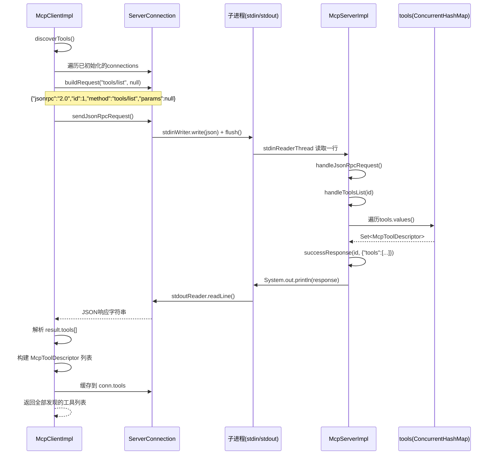
```mermaid
sequenceDiagram
    participant Client as McpClientImpl
    participant Conn as ServerConnection
    participant Process as 子进程(stdin/stdout)
    participant Server as McpServerImpl
    participant Registry as tools(ConcurrentHashMap)

    Client->>Client: discoverTools()
    Client->>Conn: 遍历已初始化的connections
    Client->>Conn: buildRequest("tools/list", null)
    Note over Client,Conn: {"jsonrpc":"2.0","id":1,"method":"tools/list","params":null}
    Client->>Conn: sendJsonRpcRequest()
    Conn->>Process: stdinWriter.write(json) + flush()
    Process->>Server: stdinReaderThread 读取一行
    Server->>Server: handleJsonRpcRequest()
    Server->>Server: handleToolsList(id)
    Server->>Registry: 遍历tools.values()
    Registry-->>Server: Set<McpToolDescriptor>
    Server->>Server: successResponse(id, {"tools":[...]})
    Server->>Process: System.out.println(response)
    Process->>Conn: stdoutReader.readLine()
    Conn-->>Client: JSON响应字符串
    Client->>Client: 解析 result.tools[]
    Client->>Client: 构建 McpToolDescriptor 列表
    Client->>Conn: 缓存到 conn.tools
    Client-->>Client: 返回全部发现的工具列表
```

**工具执行流程（tools/call）：**

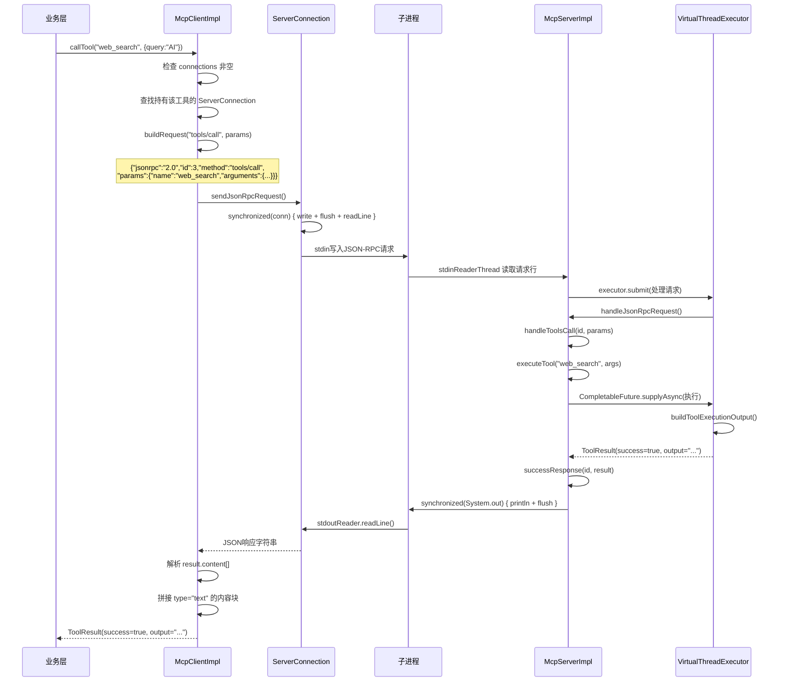
```mermaid
sequenceDiagram
    participant Caller as 业务层
    participant Client as McpClientImpl
    participant Conn as ServerConnection
    participant Process as 子进程
    participant Server as McpServerImpl
    participant Executor as VirtualThreadExecutor

    Caller->>Client: callTool("web_search", {query:"AI"})
    Client->>Client: 检查 connections 非空
    Client->>Client: 查找持有该工具的 ServerConnection
    Client->>Client: buildRequest("tools/call", params)
    Note over Client: {"jsonrpc":"2.0","id":3,"method":"tools/call",<br/>"params":{"name":"web_search","arguments":{...}}}
    Client->>Conn: sendJsonRpcRequest()
    Conn->>Conn: synchronized(conn) { write + flush + readLine }
    Conn->>Process: stdin写入JSON-RPC请求
    Process->>Server: stdinReaderThread 读取请求行
    Server->>Executor: executor.submit(处理请求)
    Executor->>Server: handleJsonRpcRequest()
    Server->>Server: handleToolsCall(id, params)
    Server->>Server: executeTool("web_search", args)
    Server->>Executor: CompletableFuture.supplyAsync(执行)
    Executor->>Executor: buildToolExecutionOutput()
    Executor-->>Server: ToolResult(success=true, output="...")
    Server->>Server: successResponse(id, result)
    Server->>Process: synchronized(System.out) { println + flush }
    Process->>Conn: stdoutReader.readLine()
    Conn-->>Client: JSON响应字符串
    Client->>Client: 解析 result.content[]
    Client->>Client: 拼接 type="text" 的内容块
    Client-->>Caller: ToolResult(success=true, output="...")
```

## 7.3 A2A协议架构

A2A（Agent-to-Agent）协议是Google发布的开放标准，旨在实现异构Agent系统之间的互操作。与MCP关注模型与工具的交互不同，A2A关注的是Agent与Agent之间的协作——两个由不同团队、使用不同框架实现的Agent，只需遵循A2A协议规范，即可相互发现、发送任务和共享产物。LyClaw实现了A2A协议的核心概念：Agent Card（代理名片）、任务发送、产物获取和任务取消。

### 7.3.1 A2A核心概念

| 概念 | 对应类 | 说明 |
|------|--------|------|
| Agent Card | `A2aAgentCard` | Agent的身份标识和能力声明，类似于MCP的Server Info |
| Task Spec | `A2aTaskSpec` | 任务描述，包含ID、描述、参数等 |
| Artifact | `A2aArtifact` | 任务执行产生的产物（文本、文件等） |
| Capability | `AgentCapability` | Agent能力枚举（TEXT_GEN, TOOL_USE, RAG等） |
| Endpoint | `AgentEndpoint` | Agent暴露的HTTP端点信息 |
| Well-known | `/.well-known/agent-card.json` | 标准化的Agent发现路径 |

### 7.3.2 A2aGatewayImpl——A2A网关实现

`A2aGatewayImpl` 是A2A协议的核心网关，作为Spring `@Component` 运行。它管理本地注册的Agent卡、维护任务状态和产物缓存。

**内部状态：**

```java
// 本地注册的Agent卡，键为agentId
private final Map<String, A2aAgentCard> localAgents = new ConcurrentHashMap<>();
// 任务状态跟踪，键为taskId
private final Map<String, String> taskStatuses = new ConcurrentHashMap<>();
// 任务产物缓存，键为taskId -> artifactId -> A2aArtifact
private final Map<String, Map<String, A2aArtifact>> taskArtifacts = new ConcurrentHashMap<>();
// 虚拟线程执行器
private final ExecutorService executor = Executors.newVirtualThreadPerTaskExecutor();
```

**Agent Card获取（getAgentCard）：**

优先从 `localAgents` 缓存中查找，未命中时异步构建远程Agent卡。远程模式模拟了对 `/.well-known/agent-card.json` 的标准HTTP GET请求：

```java
@Override
public CompletableFuture<A2aAgentCard> getAgentCard(String agentUrl) {
    A2aAgentCard local = localAgents.get(agentUrl);
    if (local != null) return CompletableFuture.completedFuture(local);

    return CompletableFuture.supplyAsync(() -> {
        // 模拟 GET {agentUrl}/.well-known/agent-card.json
        return A2aAgentCard.builder()
                .agentId("remote-" + UUID.randomUUID().toString().substring(0, 8))
                .name("Remote Agent @ " + agentUrl)
                .description("Auto-discovered remote agent")
                .url(agentUrl).version("1.0.0")
                .capabilities(List.of(AgentCapability.TEXT_GEN, AgentCapability.TOOL_USE))
                .endpoints(List.of(AgentEndpoint.builder()
                        .url(agentUrl + "/a2a/task")
                        .transportType("HTTP").primary(true).build()))
                .metadata(Map.of("discovered", "true"))
                .build();
    }, executor);
}
```

**任务发送（sendTask）：**

接收 `A2aTaskSpec`，模拟向远端Agent的 `/a2a/task` 端点发送POST请求。执行后将状态记录为 `"COMPLETED"`，并返回带有模拟耗时的 `AgentResult`：

```java
@Override
public CompletableFuture<AgentResult> sendTask(String agentUrl, A2aTaskSpec task) {
    return CompletableFuture.supplyAsync(() -> {
        String taskId = task.getTaskId() != null
                ? task.getTaskId() : UUID.randomUUID().toString();
        taskStatuses.put(taskId, "COMPLETED");
        long simulatedDuration = 100 + (long) (Math.random() * 200);
        return new AgentResult(agentUrl, "COMPLETED",
                "Task completed: " + task.getDescription(),
                "Task [" + taskId + "] executed successfully...",
                simulatedDuration);
    }, executor);
}
```

**资源管理：**

- **getArtifact**: 先查 `taskArtifacts` 缓存，未命中时构造模拟产物返回
- **cancelTask**: 将任务状态更新为 `"CANCELLED"`，返回 `true`
- **registerLocalAgent**: 将本地的 `A2aAgentCard` 注册到 `localAgents` 映射中
- **cacheArtifact**: 将产物存入 `taskArtifacts` 的嵌套映射中

### 7.3.3 A2aDiscovery——Agent发现机制

`A2aDiscovery` 实现了基于 `/.well-known/agent-card.json` 标准路径的Agent自动发现。

**发现流程：**

1. **规范化URL**: 去除末尾斜杠
2. **缓存检查**: 通过 `urlToAgentId` 映射查找是否已发现过该URL
3. **异步发现**: 在虚拟线程中执行 `simulateDiscovery()`
4. **注册缓存**: 将发现的Agent卡存入 `discoveredAgents` 和 `urlToAgentId`

```java
public CompletableFuture<A2aAgentCard> discover(String url) {
    String normalisedUrl = url.endsWith("/") ? url.substring(0, url.length() - 1) : url;
    // 缓存命中检查...
    return CompletableFuture.supplyAsync(() -> {
        A2aAgentCard card = simulateDiscovery(normalisedUrl);
        registerAgent(card);
        urlToAgentId.put(normalisedUrl, card.getAgentId());
        return card;
    }, executor);
}
```

**能力筛选：**

`findAgentsByCapability(AgentCapability)` 方法支持按照能力标签筛选已发现的Agent，为协作模式中的Agent选择提供依据：

```java
public List<A2aAgentCard> findAgentsByCapability(AgentCapability capability) {
    return discoveredAgents.values().stream()
            .filter(card -> card.getCapabilities() != null
                    && card.getCapabilities().contains(capability))
            .collect(Collectors.toList());
}
```

**Agent Card解析（parseAgentCard）：**

`parseAgentCard` 是一个预留方法（`@SuppressWarnings("unused")`），实现从原始JSON解析标准A2A Agent Card格式，支持 `capabilities`、`endpoints`、`metadata` 字段的完整解析。该方法将在真实HTTP发现实现时启用。

### 7.3.4 ExternalAgentAdapter——外部Agent适配器

`ExternalAgentAdapter` 接口定义在 `lyjew.com.lyclaw.agent.external` 包中，提供对远端Agent的统一抽象：

```java
public interface ExternalAgentAdapter {
    CompletableFuture<AgentCard> discover(String endpointUrl);
    CompletableFuture<AgentResult> sendTask(String agentUrl, AgentTask task, Duration timeout);
    CompletableFuture<TaskStatus> queryTaskStatus(String agentUrl, String taskId);
    CompletableFuture<Boolean> cancelTask(String agentUrl, String taskId);
}
```

该接口的内部实现 `ExternalAgentAdapterImpl`（位于 `lyclaw-protocol` 模块）桥接了A2A协议与内部Agent调度系统，将A2A的 `A2aAgentCard` 转换为内部的 `AgentCard`，将 `A2aTaskSpec` 转换为 `AgentTask`，实现协议层与业务层的解耦。

---

# 第八章: 多Agent协作模式

## 8.1 概述

LyClaw的协作层实现了四种经典的多Agent协作拓扑模式，分别对应不同的任务分解与调度策略。协作层的核心设计理念是 **模式可插拔**：每种协作模式实现 `CollaborationMode` 接口，通过 `CollaborationHub` 统一注册和编排。`AgentCoordinator` 负责Agent的具体调度执行，`AgentLifecycle` 管理Agent的完整生命周期，配合 `AutoScaler` 实现协作规模的动态伸缩。

多Agent协作系统的核心挑战在于：如何将复杂任务分解为可分配给异质Agent的子任务，如何协调这些Agent之间的信息交换，以及如何应对部分Agent失败时的容错处理。LyClaw通过将协作策略抽象为可插拔模式，使用户可以根据任务特征选择最合适的协作拓扑，而非被锁定在单一的协作范式中。这种设计借鉴了分布式系统领域的"共识-协调"理论，将其适配到AI Agent的具体场景中。

## 8.2 核心接口与数据模型

### 8.2.1 协作模式接口（CollaborationMode）

`CollaborationMode` 是四种协作模式的统一抽象接口，定义了协作的完整生命周期：

```java
public interface CollaborationMode {
    String getModeId();                              // 模式唯一标识
    TopologyType getPreferredTopology();              // 偏好的拓扑结构
    AssignmentPlan assign(List<AgentHandle> availableAgents, OrchestrationContext ctx);  // 任务分配
    CompletableFuture<AgentResult> execute(CollaborationContext ctx);  // 执行协作
    boolean cancel(String collaborationId);           // 取消协作
    double getProgress(String collaborationId);       // 获取进度
    boolean supportsDynamicScaling();                 // 是否支持动态伸缩
}
```

### 8.2.2 协作中枢接口（CollaborationHub）

`CollaborationHub` 负责管理所有已注册的协作模式，提供模式查找与匹配能力：

```java
public interface CollaborationHub {
    void register(CollaborationMode mode);             // 注册协作模式
    Optional<CollaborationMode> getMode(String modeId); // 按ID查找模式
    List<CollaborationMode> listModes();                // 列出所有模式
    List<CollaborationMode> findCompatible(TopologyType topology);  // 按拓扑查找兼容模式
}
```

### 8.2.3 拓扑类型枚举（TopologyType）

```java
public enum TopologyType {
    STAR,        // 星形：中心节点连接所有边缘节点
    MESH,        // 网状：节点之间全连接或部分连接
    HIERARCHICAL, // 层级：树状结构
    HYBRID       // 混合：组合多种拓扑
}
```

### 8.2.4 协作上下文（CollaborationContext）

`CollaborationContext` 封装了一次协作会话的完整参数：

| 字段 | 类型 | 说明 |
|------|------|------|
| `collaborationId` | String | 协作会话唯一标识 |
| `modeId` | String | 使用的协作模式ID |
| `participants` | List\<AgentHandle\> | 参与协作的Agent列表 |
| `sharedState` | Map\<String, Object\> | 协作过程中的共享状态黑板 |
| `maxRounds` | int | 最大协作轮数，防止无限循环 |
| `timeoutMs` | long | 超时时间（毫秒） |

### 8.2.5 分配计划（AssignmentPlan）

`AssignmentPlan` 定义了将工作单元分配给Agent的方案。其内部类 `Assignment` 记录每个Agent的角色和优先级：

```java
public class AssignmentPlan {
    @Data @Builder
    public static class Assignment {
        private String agentId;      // Agent标识
        private String taskNodeId;   // 任务节点标识
        private String role;         // 角色（如 supervisor/worker/bidder）
        private int priority;        // 优先级
    }
    private List<Assignment> assignments;
    private Map<String, List<String>> communicationChannels;  // Agent间的通信通道拓扑
}
```

### 8.2.6 Agent生命周期（AgentLifecycle）

`AgentLifecycle` 接口管理单个Agent的完整生命周期：

```java
public interface AgentLifecycle {
    CompletableFuture<AgentHandle> create(AgentSpec spec);     // 创建Agent
    CompletableFuture<AgentResult> schedule(String agentId, AgentTask task); // 调度任务
    boolean pause(String agentId);       // 暂停Agent
    boolean resume(String agentId);      // 恢复Agent
    boolean terminate(String agentId);   // 终止Agent
    AgentState getState(String agentId); // 查询Agent状态
}
```

### 8.2.7 Agent状态机

`AgentState` 定义了Agent的六种状态：

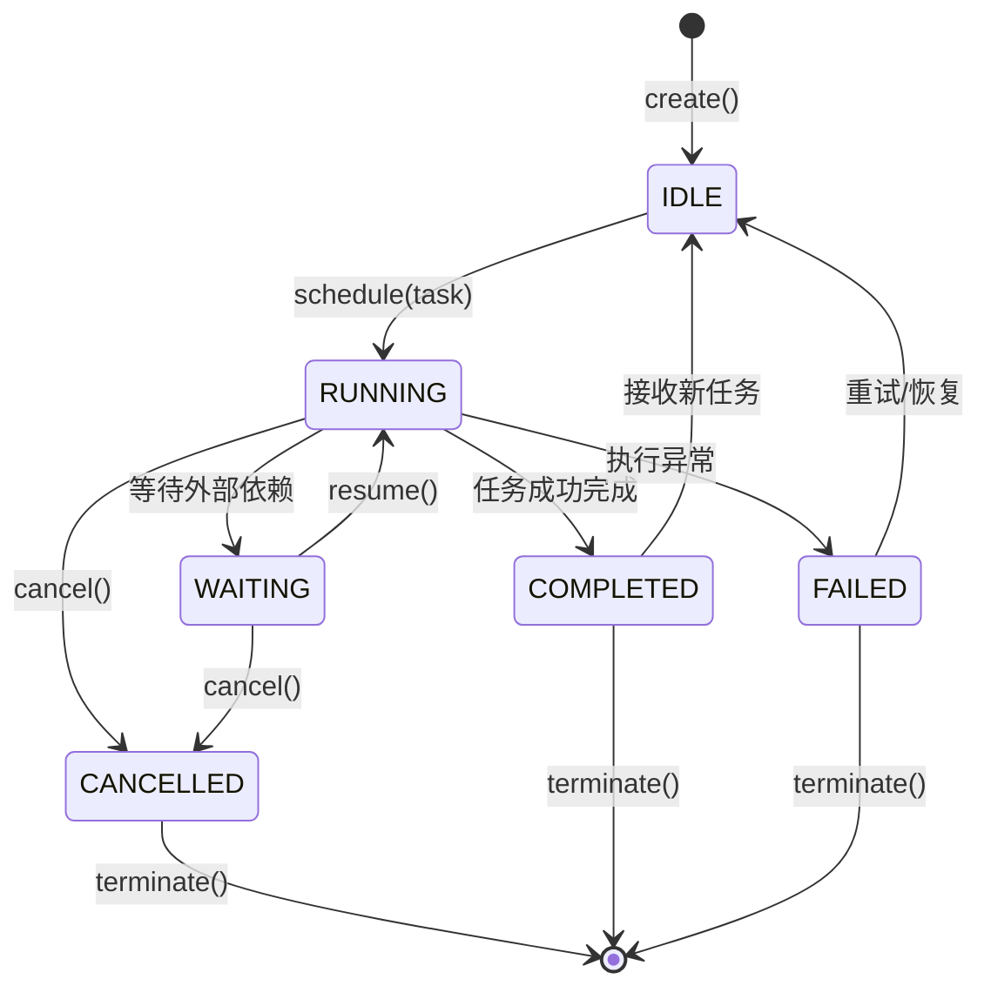
```mermaid
stateDiagram-v2
    [*] --> IDLE: create()
    IDLE --> RUNNING: schedule(task)
    RUNNING --> WAITING: 等待外部依赖
    WAITING --> RUNNING: resume()
    RUNNING --> COMPLETED: 任务成功完成
    RUNNING --> FAILED: 执行异常
    RUNNING --> CANCELLED: cancel()
    WAITING --> CANCELLED: cancel()
    COMPLETED --> IDLE: 接收新任务
    FAILED --> IDLE: 重试/恢复
    CANCELLED --> [*]: terminate()
    COMPLETED --> [*]: terminate()
    FAILED --> [*]: terminate()
```

状态流转说明：
- **IDLE**: Agent空闲，等待任务分配。初始创建后即为此状态。
- **RUNNING**: Agent正在执行任务，由 `schedule()` 触发。
- **WAITING**: Agent因外部依赖（如等待其他Agent的结果）而暂停，可通过 `resume()` 恢复。
- **COMPLETED**: 任务成功完成，Agent可回到IDLE接收新任务或被终止。
- **FAILED**: 执行过程中发生不可恢复的错误，可重试回IDLE或被终止。
- **CANCELLED**: 任务被外部取消，只能通过 `terminate()` 结束。

## 8.3 四种协作模式详解

### 8.3.1 SupervisorWorker（主管-工人）模式

**模式概述：**

SupervisorWorker是最经典的层级协作模式。一个Supervisor（主管）Agent负责将复杂任务分解为多个子任务，分派给多个Worker（工人）Agent执行，最后汇聚结果、审查质量并合成最终输出。

**协作流程：**

1. Supervisor接收 `OrchestrationContext`，分析任务复杂度
2. Supervisor调用 `assign()` 方法，根据Worker的 `capabilities` 和 `historicalAccuracy` 进行子任务分配
3. 每个Worker通过 `AgentLifecycle.schedule()` 接收子任务
4. Worker执行完成后将结果通过 `AgentChannel` 回传给Supervisor
5. Supervisor审查所有子任务结果，必要时进行多轮迭代（通过 `maxRounds` 控制上限）
6. Supervisor合成最终 `AgentResult`

**拓扑结构：**

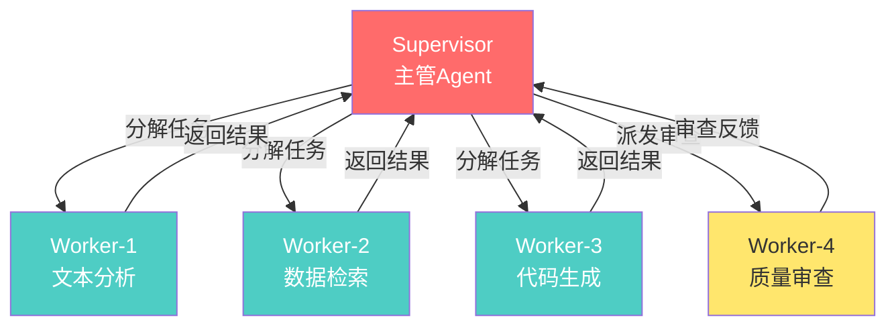
```mermaid
graph TD
    S[Supervisor<br/>主管Agent]
    W1[Worker-1<br/>文本分析]
    W2[Worker-2<br/>数据检索]
    W3[Worker-3<br/>代码生成]
    W4[Worker-4<br/>质量审查]

    S -->|分解任务| W1
    S -->|分解任务| W2
    S -->|分解任务| W3
    S -->|派发审查| W4

    W1 -->|返回结果| S
    W2 -->|返回结果| S
    W3 -->|返回结果| S
    W4 -->|审查反馈| S

    style S fill:#ff6b6b,color:#fff
    style W1 fill:#4ecdc4,color:#fff
    style W2 fill:#4ecdc4,color:#fff
    style W3 fill:#4ecdc4,color:#fff
    style W4 fill:#ffe66d,color:#333
```

该拓扑属于 `TopologyType.STAR`，Supervisor是唯一的中心节点，所有通信必须经过Supervisor。Worker之间不直接通信。

**AssignmentPlan示例：**

```
assignments:
  - agentId: "worker-text-1",    taskNodeId: "parse",       role: "worker", priority: 1
  - agentId: "worker-search-2",  taskNodeId: "retrieve",    role: "worker", priority: 1
  - agentId: "worker-code-3",    taskNodeId: "generate",    role: "worker", priority: 2
  - agentId: "supervisor-main",  taskNodeId: "orchestrate", role: "supervisor", priority: 0
communicationChannels:
  supervisor-main: [worker-text-1, worker-search-2, worker-code-3]
```

**适用场景：**
- 任务可清晰分解为独立子任务
- 需要集中式质量管控
- 任务有明确的层次依赖关系

### 8.3.2 Network（网络）模式

**模式概述：**

Network模式实现了Agent之间的对等（Peer-to-Peer）通信。没有中心Supervisor，每个Agent都是平等的网络节点。Agent之间通过 `AgentChannel` 直接发送 `AgentMessage`，可以根据需要向任意其他Agent请求帮助，或广播事件。

**协作流程：**

1. 任一Agent接收到任务后，评估自身能力是否能独立完成
2. 若需要协助，通过 `AgentRegistry.findByCapability()` 查找具有所需能力的同伴
3. 通过 `AgentCoordinator.broadcast(event)` 或点对点 `AgentChannel.send(message)` 发送请求
4. 接收方Agent处理子请求并返回结果
5. 协调机制：当多个Agent返回冲突结果时，通过 `ConsensusEngine` 进行共识决策

**拓扑结构：**

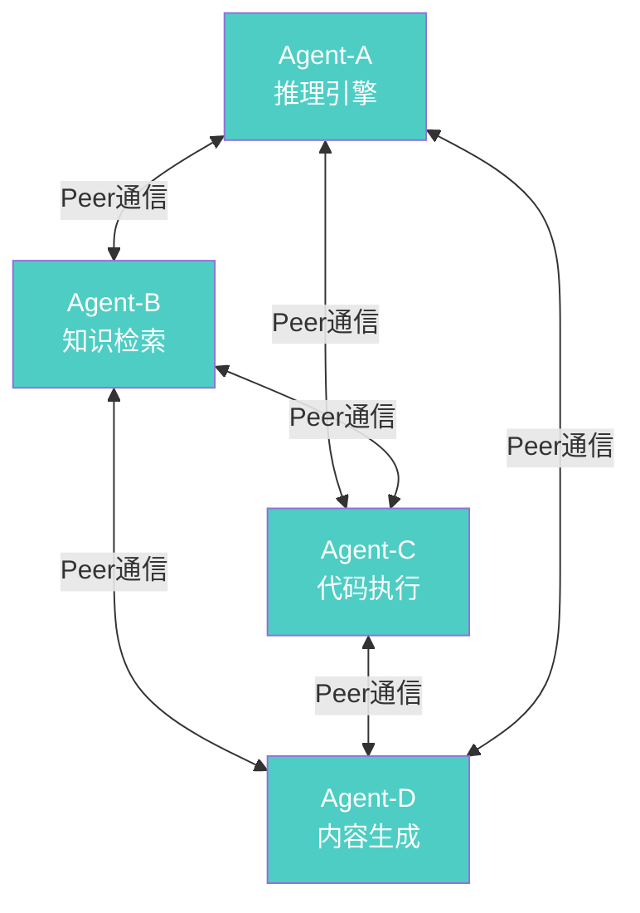
```mermaid
graph TD
    A1[Agent-A<br/>推理引擎]
    A2[Agent-B<br/>知识检索]
    A3[Agent-C<br/>代码执行]
    A4[Agent-D<br/>内容生成]

    A1 <-->|Peer通信| A2
    A1 <-->|Peer通信| A3
    A2 <-->|Peer通信| A3
    A2 <-->|Peer通信| A4
    A3 <-->|Peer通信| A4
    A1 <-->|Peer通信| A4

    style A1 fill:#4ecdc4,color:#fff
    style A2 fill:#4ecdc4,color:#fff
    style A3 fill:#4ecdc4,color:#fff
    style A4 fill:#4ecdc4,color:#fff
```

该拓扑属于 `TopologyType.MESH`，Agent之间形成对等网络。网络规模可通过 `AutoScaler` 动态调整——当负载升高时增加Agent节点，负载降低时缩减。

**通信协议（AgentMessage）：**

```java
public class AgentMessage {
    private final String from;      // 发送方agentId
    private final String to;        // 接收方agentId
    private final String type;      // 消息类型（如 "request", "response", "heartbeat"）
    private final String content;   // 消息内容
    private final Instant timestamp; // 时间戳
}
```

**AgentChannel接口：**

```java
public interface AgentChannel {
    void send(AgentMessage message);     // 发送消息到指定Agent
    void receive(String agentId);        // 从指定Agent接收消息
}
```

**共识引擎（ConsensusEngine）：**

```java
public interface ConsensusEngine {
    boolean hasConsensus(List<PeerResponse> responses);
    ConsensusResult resolve(List<PeerResponse> responses, int round);
    VoteResult vote(List<PeerResponse> candidates, List<AgentHandle> voters);
}
```

PeerResponse携带每个Agent的置信度和历史准确率作为投票权重：

```java
public class PeerResponse {
    private String agentId;
    private String content;            // 响应内容
    private double confidence;         // 自信度 (0.0-1.0)
    private double capabilityWeight;   // 能力权重
    private double historicalAccuracy; // 历史准确率
}
```

ConsensusResult汇总共识决策结果：

```java
public class ConsensusResult {
    private boolean consensusReached;   // 是否达成共识
    private String decision;            // 最终决策
    private double agreementRate;       // 同意率
    private int roundsTaken;            // 共识轮数
    private String majorityAgentId;     // 多数方Agent
}
```

**适用场景：**
- 问题没有明显的主次分解结构
- 需要多Agent从不同视角独立分析后综合
- 需要冗余计算以提高可靠性
- 动态环境中Agent频繁加入/退出

### 8.3.3 Market（市场）模式

**模式概述：**

Market模式模拟自由市场机制来分配任务。任务被发布到"市场"中，Agent作为"竞标者"根据自己的能力和当前负载出价竞争。定价最高（能力最匹配/负载最低）的Agent赢得任务。

**协作流程：**

1. Coordinator将任务广播到所有注册Agent（通过 `AgentCoordinator.broadcast(event)`）
2. 每个空闲Agent评估自己的 `capabilities` 与任务需求的匹配度，结合当前 `AgentState` 决定是否出价
3. 通过 `ConsensusEngine.vote()` 进行加权投票，权重考虑：
   - `PeerResponse.confidence`（能力匹配度）
   - `PeerResponse.capabilityWeight`（Capability权重）
   - `PeerResponse.historicalAccuracy`（历史表现）
4. `VoteResult` 确定中标Agent（`winnerAgentId`），附带完整的 `voteDistribution`

**投票结果（VoteResult）：**

```java
public class VoteResult {
    private String winnerAgentId;              // 中标Agent
    private Map<String, Double> voteDistribution; // 各Agent得票分布
    private double winnerScore;                // 中标分数
    private int totalVoters;                   // 参与投票总数
}
```

**拓扑结构：**

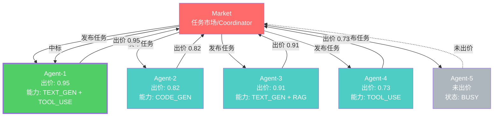
```mermaid
graph TD
    M[Market<br/>任务市场/Coordinator]
    B1[Agent-1<br/>出价: 0.95<br/>能力: TEXT_GEN + TOOL_USE]
    B2[Agent-2<br/>出价: 0.82<br/>能力: CODE_GEN]
    B3[Agent-3<br/>出价: 0.91<br/>能力: TEXT_GEN + RAG]
    B4[Agent-4<br/>出价: 0.73<br/>能力: TOOL_USE]
    B5[Agent-5<br/>未出价<br/>状态: BUSY]

    M -->|发布任务| B1
    M -->|发布任务| B2
    M -->|发布任务| B3
    M -->|发布任务| B4
    M -->|发布任务| B5

    B1 -->|出价 0.95| M
    B2 -->|出价 0.82| M
    B3 -->|出价 0.91| M
    B4 -->|出价 0.73| M
    B5 -.->|未出价| M

    M -->|中标| B1

    style M fill:#ff6b6b,color:#fff
    style B1 fill:#51cf66,color:#fff,stroke-width:3px
    style B2 fill:#4ecdc4,color:#fff
    style B3 fill:#4ecdc4,color:#fff
    style B4 fill:#4ecdc4,color:#fff
    style B5 fill:#adb5bd,color:#fff
```

该拓扑属于 `TopologyType.STAR`（以Market为中心），但竞标逻辑使其区别于标准的Supervisor模式——任务分配由竞争机制而非静态指派决定。

**动态伸缩整合：**

Market模式与 `AutoScaler` 深度集成，`supportsDynamicScaling()` 返回 `true`。当市场中的竞标Agent不足或全部处于BUSY状态时，`AutoScaler` 通过 `AgentPoolSnapshot` 评估当前负载并触发扩容：

```java
public interface AutoScaler {
    ScalingDecision evaluate(AgentPoolSnapshot snapshot);  // 评估是否需要伸缩
    CompletableFuture<ScalingResult> apply(ScalingDecision decision);  // 执行伸缩
}

public class ScalingDecision {
    public enum Action { SCALE_UP, SCALE_DOWN, NONE }
    private Action action;   // 伸缩动作
    private int delta;       // 变化数量
    private String reason;   // 伸缩原因
}
```

**适用场景：**
- 同质化任务大量并发（如批量文档处理）
- 资源优化要求高，需要按需分配计算能力
- Agent能力异构但存在功能重叠
- 需要负载均衡的多租户环境

### 8.3.4 Pipeline（管道）模式

**模式概述：**

Pipeline模式将任务处理分解为顺序执行的多个阶段（Stage），每个阶段由专职Agent负责。前一阶段的输出直接成为下一阶段的输入，形成数据处理流水线。这是典型的**单一职责**模式在Agent协作中的体现。

**协作流程：**

1. Coordinator根据任务类型选择预定义的Pipeline拓扑
2. `AssignmentPlan.communicationChannels` 定义阶段间的数据流向
3. 第一阶段Agent接收原始输入，处理后输出中间结果
4. 中间结果通过 `sharedState`（共享黑板）传递到下一阶段
5. 每阶段完成后，`getProgress()` 返回百分比进度
6. 最终阶段Agent产生最终 `AgentResult`

**拓扑结构：**

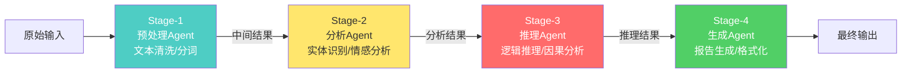
```mermaid
graph LR
    Input[原始输入] --> S1
    S1[Stage-1<br/>预处理Agent<br/>文本清洗/分词] -->|中间结果| S2
    S2[Stage-2<br/>分析Agent<br/>实体识别/情感分析] -->|分析结果| S3
    S3[Stage-3<br/>推理Agent<br/>逻辑推理/因果分析] -->|推理结果| S4
    S4[Stage-4<br/>生成Agent<br/>报告生成/格式化] --> Output[最终输出]

    style S1 fill:#4ecdc4,color:#fff
    style S2 fill:#ffe66d,color:#333
    style S3 fill:#ff6b6b,color:#fff
    style S4 fill:#51cf66,color:#fff
```

该拓扑属于 `TopologyType.HIERARCHICAL`（单链层级结构），任务单向流动，不支持回退。

**协作上下文在Pipeline中的使用：**

Pipeline模式大量依赖 `CollaborationContext.sharedState` 在阶段间传递数据：

```java
// Stage-1 完成后写入共享状态
ctx.setState("cleaned_text", preprocessingResult);

// Stage-2 读取前一阶段数据
String cleanedText = ctx.getState("cleaned_text");
String entities = analyzeEntities(cleanedText);
ctx.setState("entities", entities);

// Stage-3 读取分析结果
String reasoningResult = performReasoning(
    ctx.getState("entities"),
    ctx.getState("sentiment")
);
ctx.setState("reasoning", reasoningResult);
```

**进度跟踪：**

Pipeline模式下 `getProgress()` 的实现最为直观——直接按已完成阶段数 / 总阶段数计算百分比：

```
progress = completedStages / totalStages
```

**适用场景：**
- ETL数据处理流水线
- 文档处理（解析 -> 分析 -> 摘要 -> 翻译）
- 代码审查流水线（检查 -> 分析 -> 修复 -> 验证）
- 任何可分解为线性阶段的处理任务

## 8.4 协作模式对比总结

| 维度 | SupervisorWorker | Network | Market | Pipeline |
|------|-----------------|---------|--------|----------|
| **拓扑类型** | STAR | MESH | STAR | HIERARCHICAL |
| **通信方向** | 双向（中心辐射） | 对等全连接 | 双向（竞标-中标） | 单向流水 |
| **任务分配** | 主管指派 | Agent自主协商 | 市场竞标 | 预定义顺序 |
| **中心节点** | Supervisor | 无 | Market | 无（阶段间传递） |
| **动态伸缩** | 不支持 | 可选 | 支持 | 不支持 |
| **共识机制** | 无需 | ConsensusEngine | VoteResult | 无需 |
| **失败处理** | Supervisor重新分配 | 邻居接管 | 重新竞标 | 当前阶段重试 |
| **适用规模** | 小型团队（3-8个Agent） | 中型（5-20个Agent） | 大规模（10+ Agent） | 固定（2-6个Agent） |

## 8.5 Agent注册与调度

### 8.5.1 AgentRegistry——Agent注册中心

`AgentRegistry` 维护所有可用Agent的索引，提供多维度查找能力：

```java
public interface AgentRegistry {
    void register(AgentHandle agent);
    Optional<AgentHandle> lookup(String agentId);
    List<AgentHandle> findByCapability(String capability);   // 按能力查找
    List<AgentHandle> findByState(AgentState state);          // 按状态查找
    List<AgentHandle> findAvailable(List<String> requiredCapabilities); // 找可用的
}
```

### 8.5.2 AgentCoordinator——Agent调度器

`AgentCoordinator` 是协作执行的入口点，桥接上下文与Agent生命周期管理：

```java
public interface AgentCoordinator {
    CompletableFuture<AgentResult> dispatch(ChatContext context, AgentTask task);
    boolean cancel(String agentId);
    AgentState getState(String agentId);
    List<AgentChannel> getChannels(String agentId);
    void broadcast(Event event);
}
```

### 8.5.3 AgentHandle——Agent句柄

`AgentHandle` 是Agent的轻量级描述符，避免在协作层直接持有重量级Agent对象：

```java
@Data @Builder
public class AgentHandle {
    private String agentId;              // 唯一标识
    private String name;                 // Agent名称
    private AgentState state;            // 当前状态
    private List<String> capabilities;   // 能力列表
    private long createdAt;             // 创建时间戳
    private double historicalAccuracy;  // 历史准确率（用于竞标/共识权重）
}
```

`historicalAccuracy` 字段是关键的质量指标。在Market模式的竞标中，它直接影响Agent的 `PeerResponse.historicalAccuracy`；在Supervisor模式中，它影响Supervisor的任务分配决策。

## 8.6 端到端协作示例

以下是一个完整的协作场景：用户请求"分析最新的AI行业报告并生成摘要"。

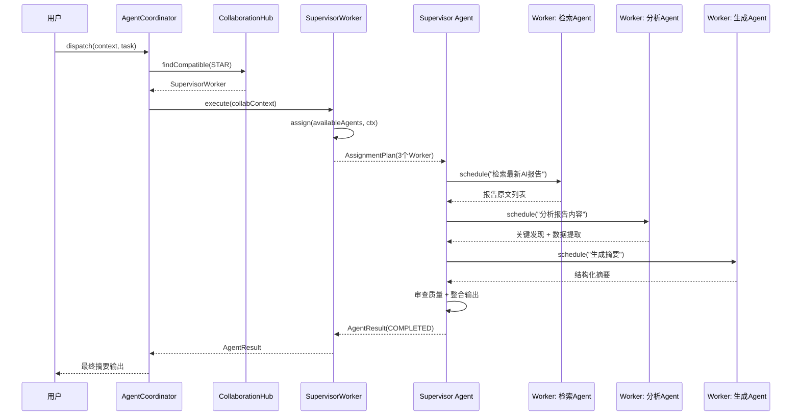
```mermaid
sequenceDiagram
    participant User as 用户
    participant Coord as AgentCoordinator
    participant Hub as CollaborationHub
    participant Mode as SupervisorWorker
    participant Sup as Supervisor Agent
    participant W1 as Worker: 检索Agent
    participant W2 as Worker: 分析Agent
    participant W3 as Worker: 生成Agent

    User->>Coord: dispatch(context, task)
    Coord->>Hub: findCompatible(STAR)
    Hub-->>Coord: SupervisorWorker
    Coord->>Mode: execute(collabContext)
    Mode->>Mode: assign(availableAgents, ctx)
    Mode-->>Sup: AssignmentPlan(3个Worker)
    
    Sup->>W1: schedule("检索最新AI报告")
    W1-->>Sup: 报告原文列表
    
    Sup->>W2: schedule("分析报告内容")
    W2-->>Sup: 关键发现 + 数据提取
    
    Sup->>W3: schedule("生成摘要")
    W3-->>Sup: 结构化摘要
    
    Sup->>Sup: 审查质量 + 整合输出
    Sup-->>Mode: AgentResult(COMPLETED)
    Mode-->>Coord: AgentResult
    Coord-->>User: 最终摘要输出
```

## 8.7 设计原则总结

1. **接口隔离**：每种协作模式仅实现 `CollaborationMode` 接口，不依赖具体实现类，实现模式的可插拔性。

2. **状态封装**：Agent的状态由 `AgentLifecycle` 统一管理，协作层通过 `AgentHandle` 的不可变快照获取状态，避免状态不一致。

3. **通信抽象**：`AgentChannel` 和 `AgentMessage` 屏蔽了底层通信细节（IPC、HTTP、消息队列），协作模式仅关注消息的内容与路由。

4. **弹性伸缩**：Market模式与 `AutoScaler` 的集成展示了协作层的自适应能力——负载低时缩减Agent资源，负载高时自动扩容。

5. **共识驱动**：在Network和Market模式中引入 `ConsensusEngine`，通过多Agent投票和加权机制提高决策的鲁棒性，避免单一Agent决策偏差。

6. **分层架构**：协议层（MCP/A2A）负责外部通信，协作层负责内部Agent编排，两层通过 `ExternalAgentAdapter` 桥接，实现了内部Agent与外部A2A Agent的统一调度。
# 第九章：模型适配器层

## 9.1 概述

模型适配器层（Model Adapter Layer）是 LyClaw 与大语言模型（LLM）之间的抽象桥梁。该层负责将统一的内部 `ChatRequest` 转换为各厂商特定的 API 请求格式，发送 HTTP 调用，并将各厂商的异构响应统一为 `ModelResponse`。通过适配器模式（Adapter Pattern）与模板方法模式（Template Method Pattern）的结合，系统能够在不修改上层调用代码的前提下，无缝切换或同时接入多个模型供应商。

### 9.1.1 核心设计目标

1. **厂商无关性**：上层业务代码只依赖 `ModelAdapter` 接口，不感知底层是 DeepSeek、MiniMax 还是未来接入的其他厂商。
2. **请求/响应对称转换**：每个适配器负责将 `ChatRequest`（统一请求）转换为厂商格式，并将厂商响应还原为 `ModelResponse`（统一响应）。
3. **流式与非流式统一**：`chat()` 返回同步 `ModelResponse`，`chatStream()` 返回 `Flux<String>` 流式响应，两者共享同一套请求构建逻辑。
4. **配置动态化**：API Key、Base URL、模型名等配置通过 `configure(ModelConfig)` 运行时注入，支持从 Nacos 配置中心动态刷新。
5. **错误分类处理**：HTTP 401、403、429、5xx 等不同状态码映射为不同的 `ErrorCode`，便于上层降级和告警。

### 9.1.2 模块结构

适配器层的代码分布在两个 Maven 模块中：

| 模块 | 角色 | 关键包路径 |
|------|------|-----------|
| `lyclaw-core` | SPI 接口定义 | `lyjew.com.lyclaw.adapter.ModelAdapter` |
| `lyclaw-adapter` | 具体实现 | `lyjew.com.lyclaw.adapter.deepseek`, `lyjew.com.lyclaw.adapter.minimax`, `lyjew.com.lyclaw.adapter.factory` |

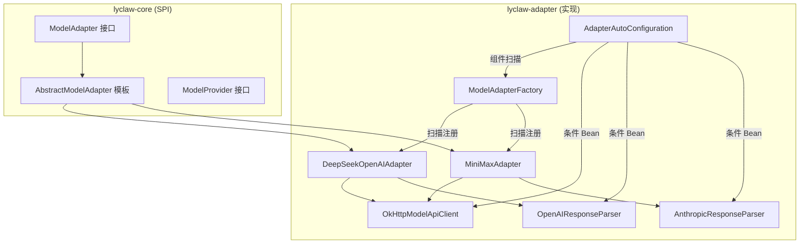
```mermaid
graph TB
    subgraph "lyclaw-core (SPI)"
        MA[ModelAdapter 接口]
        AMA[AbstractModelAdapter 模板]
        MP[ModelProvider 接口]
    end

    subgraph "lyclaw-adapter (实现)"
        MAF[ModelAdapterFactory]
        DS[DeepSeekOpenAIAdapter]
        MM[MiniMaxAdapter]
        AConfig[AdapterAutoConfiguration]
        OKHttp[OkHttpModelApiClient]
        OAI_Parser[OpenAIResponseParser]
        ANTH_Parser[AnthropicResponseParser]
    end

    MA --> AMA
    AMA --> DS
    AMA --> MM

    MAF -->|扫描注册| DS
    MAF -->|扫描注册| MM

    DS --> OKHttp
    DS --> OAI_Parser
    MM --> OKHttp
    MM --> ANTH_Parser

    AConfig -->|组件扫描| MAF
    AConfig -->|条件 Bean| OKHttp
    AConfig -->|条件 Bean| OAI_Parser
    AConfig -->|条件 Bean| ANTH_Parser
```

## 9.2 ModelAdapter 接口设计

`ModelAdapter` 是适配器层的顶层 SPI 接口，定义在 `lyclaw-core` 模块中（`lyjew.com.lyclaw.adapter.ModelAdapter`）。所有模型适配器必须实现以下契约：

```java
public interface ModelAdapter {

    /** 同步非流式对话，返回完整 ModelResponse */
    ModelResponse chat(ChatRequest request);

    /** 流式对话，返回 Flux<String> 实时推送每个 SSE chunk */
    Flux<String> chatStream(ChatRequest request);

    /** 估算 token 数（不调用 API，本地估算） */
    int countTokens(String text);

    /** 发一条最小请求验证连接是否可用 */
    boolean validate();

    /** 返回厂商标识名，如 "deepseek-openai"、"minimax" */
    String getProvider();

    /** 适配器是否已完成 configure() 且持有有效 API Key */
    boolean isConfigured();

    /** 注入运行时配置：API Key、Base URL、模型名 */
    void configure(ModelConfig config);

    /** 获取当前使用的模型名 */
    String getModel();

    /** 获取当前使用的 Base URL */
    String getBaseUrl();

    /** 从原始 SSE 文本中提取 ToolCall 请求（流式后处理） */
    default List<ModelResponse.ToolCallRequest> extractSseToolCalls(String rawSSE) {
        return List.of();
    }

    /** 从原始 SSE 文本中拼接纯文本内容（流式后处理） */
    default String extractSsePlainText(String rawSSE) {
        return "";
    }

    /** 从原始 SSE 文本中提取 token 用量 */
    default String extractSseTokenUsage(String rawSSE) {
        return "prompt=0 completion=0 total=0";
    }
}
```

接口设计的关键考量：

- **`getProvider()`** 作为适配器的唯一身份标识，`ModelAdapterFactory` 通过此值建立注册表映射。
- **`configure()` / `isConfigured()`** 将配置与使用分离。适配器可以在 Spring 容器启动时即被实例化（`@Component`），但直到 `configure()` 被调用后才具备完整调用能力。
- **`extractSseToolCalls()` / `extractSsePlainText()` / `extractSseTokenUsage()`** 提供默认空实现。这些方法用于流式调用场景的后处理：当 SSE 流结束后，调用方传入累积的原始 SSE 文本，由适配器负责按厂商格式解析出工具调用、纯文本和 token 用量。

## 9.3 AbstractModelAdapter 模板方法

`AbstractModelAdapter`（`lyjew.com.lyclaw.template.AbstractModelAdapter`）实现了适配器层的核心控制流，使用模板方法模式将共性逻辑固化，将厂商差异留给子类。

### 9.3.1 模板方法结构

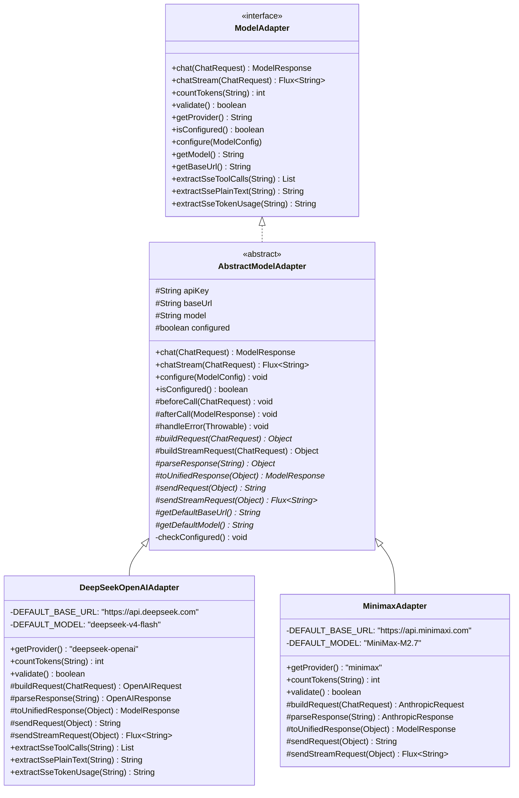
```mermaid
classDiagram
    class ModelAdapter {
        <<interface>>
        +chat(ChatRequest) ModelResponse
        +chatStream(ChatRequest) Flux~String~
        +countTokens(String) int
        +validate() boolean
        +getProvider() String
        +isConfigured() boolean
        +configure(ModelConfig)
        +getModel() String
        +getBaseUrl() String
        +extractSseToolCalls(String) List
        +extractSsePlainText(String) String
        +extractSseTokenUsage(String) String
    }

    class AbstractModelAdapter {
        <<abstract>>
        #String apiKey
        #String baseUrl
        #String model
        #boolean configured
        +chat(ChatRequest) ModelResponse
        +chatStream(ChatRequest) Flux~String~
        +configure(ModelConfig) void
        +isConfigured() boolean
        #beforeCall(ChatRequest) void
        #afterCall(ModelResponse) void
        #handleError(Throwable) void
        #buildRequest(ChatRequest)* Object
        #buildStreamRequest(ChatRequest) Object
        #parseResponse(String)* Object
        #toUnifiedResponse(Object)* ModelResponse
        #sendRequest(Object)* String
        #sendStreamRequest(Object)* Flux~String~
        #getDefaultBaseUrl()* String
        #getDefaultModel()* String
        -checkConfigured() void
    }

    class DeepSeekOpenAIAdapter {
        -DEFAULT_BASE_URL: "https://api.deepseek.com"
        -DEFAULT_MODEL: "deepseek-v4-flash"
        +getProvider() "deepseek-openai"
        +countTokens(String) int
        +validate() boolean
        #buildRequest(ChatRequest) OpenAIRequest
        #parseResponse(String) OpenAIResponse
        #toUnifiedResponse(Object) ModelResponse
        #sendRequest(Object) String
        #sendStreamRequest(Object) Flux~String~
        +extractSseToolCalls(String) List
        +extractSsePlainText(String) String
        +extractSseTokenUsage(String) String
    }

    class MinimaxAdapter {
        -DEFAULT_BASE_URL: "https://api.minimaxi.com"
        -DEFAULT_MODEL: "MiniMax-M2.7"
        +getProvider() "minimax"
        +countTokens(String) int
        +validate() boolean
        #buildRequest(ChatRequest) AnthropicRequest
        #parseResponse(String) AnthropicResponse
        #toUnifiedResponse(Object) ModelResponse
        #sendRequest(Object) String
        #sendStreamRequest(Object) Flux~String~
    }

    ModelAdapter <|.. AbstractModelAdapter
    AbstractModelAdapter <|-- DeepSeekOpenAIAdapter
    AbstractModelAdapter <|-- MinimaxAdapter
```

### 9.3.2 同步调用流程

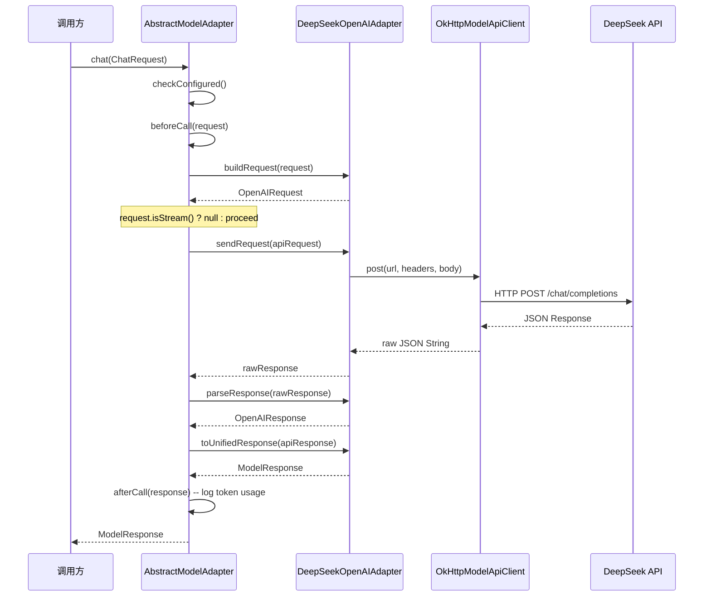
```mermaid
sequenceDiagram
    participant Caller as 调用方
    participant Adapter as AbstractModelAdapter
    participant DSA as DeepSeekOpenAIAdapter
    participant Client as OkHttpModelApiClient
    participant API as DeepSeek API

    Caller->>Adapter: chat(ChatRequest)
    Adapter->>Adapter: checkConfigured()
    Adapter->>Adapter: beforeCall(request)
    Adapter->>DSA: buildRequest(request)
    DSA-->>Adapter: OpenAIRequest
    note over Adapter: request.isStream() ? null : proceed
    Adapter->>DSA: sendRequest(apiRequest)
    DSA->>Client: post(url, headers, body)
    Client->>API: HTTP POST /chat/completions
    API-->>Client: JSON Response
    Client-->>DSA: raw JSON String
    DSA-->>Adapter: rawResponse
    Adapter->>DSA: parseResponse(rawResponse)
    DSA-->>Adapter: OpenAIResponse
    Adapter->>DSA: toUnifiedResponse(apiResponse)
    DSA-->>Adapter: ModelResponse
    Adapter->>Adapter: afterCall(response) -- log token usage
    Adapter-->>Caller: ModelResponse
```

### 9.3.3 流式调用流程

```mermaid
sequenceDiagram
    participant Caller as 调用方
    participant Adapter as AbstractModelAdapter
    participant DSA as DeepSeekOpenAIAdapter
    participant Client as OkHttpModelApiClient
    participant API as DeepSeek API

    Caller->>Adapter: chatStream(ChatRequest)
    Adapter->>Adapter: checkConfigured()
    Adapter->>Adapter: beforeCall(request)
    Adapter->>DSA: buildStreamRequest(request)
    DSA-->>Adapter: OpenAIRequest (stream=true)
    Adapter->>DSA: sendStreamRequest(apiRequest)
    DSA->>Client: postStream(url, headers, body)
    Client->>API: HTTP POST (stream=true)
    API-->>Client: SSE data: {...}\ndata: {...}\n...
    Client-->>Caller: Flux<String> line-by-line
    note over Caller: 每个 line 是一条 "data: {...}" 格式
    note over Caller: 由调用方累积后调用 extractSsePlainText()
```

### 9.3.4 配置生命周期

```java
// AbstractModelAdapter.configure() 的核心逻辑
public void configure(ModelConfig config) {
    // 1. 空值校验
    if (config == null) throw ErrorCode.ADAPTER_NOT_CONFIGURED.exception("ModelConfig 为 null");

    // 2. Provider 校验
    if (!getProvider().equals(config.getProvider()))
        throw ErrorCode.ADAPTER_NOT_CONFIGURED.exception("Provider 不匹配");

    // 3. 注入配置（Base URL 和 Model 均有降级默认值）
    this.apiKey = config.getApiKey();
    this.baseUrl = config.getBaseUrl() != null ? config.getBaseUrl() : getDefaultBaseUrl();
    this.model = config.getModel() != null && !config.getModel().isEmpty()
            ? config.getModel() : getDefaultModel();
    this.configured = true;
}
```

这种设计意味着每个适配器都有一个不可变的默认 Base URL 和默认模型名，`configure()` 可以在运行时覆盖这些默认值，实现多模型、多端点部署的灵活切换。

### 9.3.5 钩子方法一览

| 方法 | 可见性 | 职责 | 默认行为 |
|------|--------|------|---------|
| `buildRequest(ChatRequest)` | protected abstract | 将统一请求转为厂商格式（非流式） | 子类必须实现 |
| `buildStreamRequest(ChatRequest)` | protected | 同上，流式版本 | 委托给 `buildRequest()` |
| `parseResponse(String)` | protected abstract | 反序列化原始 JSON | 子类必须实现 |
| `toUnifiedResponse(Object)` | protected abstract | 厂商响应转 ModelResponse | 子类必须实现 |
| `sendRequest(Object)` | protected abstract | 发送同步 HTTP 请求 | 子类必须实现 |
| `sendStreamRequest(Object)` | protected abstract | 发送流式 HTTP 请求 | 子类必须实现 |
| `getDefaultBaseUrl()` | protected abstract | 默认 API 端点 | 子类必须实现 |
| `getDefaultModel()` | protected abstract | 默认模型名 | 子类必须实现 |
| `beforeCall(ChatRequest)` | protected | 调用前校验 | 校验消息列表非空 |
| `afterCall(ModelResponse)` | protected | 调用后处理 | 记录 token 用量日志 |
| `handleError(Throwable)` | protected | 统一错误处理 | 包装为 ModelException |

## 9.4 ModelAdapterFactory 工厂

`ModelAdapterFactory`（`lyjew.com.lyclaw.adapter.factory.ModelAdapterFactory`）负责适配器的自动发现、注册与按需获取。

### 9.4.1 自动注册机制

工厂在 Spring 容器启动时通过 `@PostConstruct` 自动扫描所有 `ModelAdapter` 实现：

```java
@PostConstruct
public void init() {
    Map<String, ModelAdapter> beans = context.getBeansOfType(ModelAdapter.class);

    if (beans.isEmpty()) {
        log.warn("未找到任何 ModelAdapter 实现，请检查 adapter 包扫描配置");
        return;
    }

    for (Map.Entry<String, ModelAdapter> entry : beans.entrySet()) {
        ModelAdapter adapter = entry.getValue();
        String provider = adapter.getProvider();

        if (provider == null || provider.isEmpty()) {
            log.warn("跳过未设置 provider 的适配器: {}", entry.getKey());
            continue;
        }

        adapterMap.put(provider, adapter);
        log.info("注册适配器: [{}] -> {}", provider, adapter.getClass().getSimpleName());
    }
}
```

注册使用 `ConcurrentHashMap<String, ModelAdapter>` 作为存储，以 `getProvider()` 返回的字符串为键，保证线程安全。

### 9.4.2 对外 API

| 方法 | 说明 |
|------|------|
| `getAdapter(String provider)` | 按厂商名获取适配器（未配置） |
| `getConfiguredAdapter(ModelConfig config)` | 获取适配器并立即执行 `configure()` |
| `findAdapter(String provider)` | 安全查找，返回 `Optional<ModelAdapter>` |
| `listProviders()` | 返回所有已注册的厂商名集合（不可修改） |
| `hasProvider(String provider)` | 判断某厂商是否已注册 |
| `getAdapterCount()` | 返回已注册适配器数量 |
| `refresh()` | 清空并重新扫描，支持热刷新 |

### 9.4.3 使用示例

```java
// 注入工厂
@Autowired
private ModelAdapterFactory adapterFactory;

// 方式一：先获取适配器，再配置
ModelAdapter adapter = adapterFactory.getAdapter("deepseek-openai");
adapter.configure(new ModelConfig("deepseek-openai", "sk-xxx",
    "https://api.deepseek.com", "deepseek-v4-pro"));

// 方式二：一步到位
ModelAdapter adapter = adapterFactory.getConfiguredAdapter(
    new ModelConfig("minimax", "sk-yyy",
        "https://api.minimaxi.com", "MiniMax-M2.7"));

// 验证连接
if (adapter.validate()) {
    ModelResponse resp = adapter.chat(ChatRequest.builder()
        .messages(List.of(Message.builder().role("user").content("你好").build()))
        .build());
}
```

## 9.5 DeepSeekOpenAIAdapter

`DeepSeekOpenAIAdapter`（`lyjew.com.lyclaw.adapter.deepseek.DeepSeekOpenAIAdapter`）对接 DeepSeek API。DeepSeek 提供 OpenAI 兼容端点，因此该适配器内部使用 OpenAI 格式的请求/响应 DTO。

### 9.5.1 基本参数

| 参数 | 值 |
|------|-----|
| Provider 标识 | `"deepseek-openai"` |
| 默认 API 端点 | `https://api.deepseek.com` |
| API 路径 | `/chat/completions` |
| 默认模型 | `deepseek-v4-flash` |
| 响应格式 | OpenAI 兼容 (`chat.completion`) |
| 认证方式 | HTTP Header: `Authorization: Bearer <apiKey>` |

### 9.5.2 请求构建

适配器将 `ChatRequest` 转换为 `OpenAIRequest`，核心逻辑在 `buildOpenAIRequest()` 方法中：

```java
private OpenAIRequest buildOpenAIRequest(ChatRequest request, boolean stream) {
    String modelName = (request.getModel() != null && !request.getModel().isEmpty())
            ? request.getModel() : this.model;

    OpenAIRequest.OpenAIRequestBuilder builder = OpenAIRequest.builder()
            .model(modelName)
            .stream(stream);

    // 标准参数
    if (request.getMaxTokens() != null && request.getMaxTokens() > 0)
        builder.maxTokens(request.getMaxTokens());
    if (request.getTemperature() != null)
        builder.temperature(clampTemperature(request.getTemperature(), 0.0, 2.0));
    if (request.getTopP() != null)
        builder.topP(request.getTopP());
    if (request.getStopSequences() != null && !request.getStopSequences().isEmpty())
        builder.stop(request.getStopSequences());

    // 消息、工具、Thinking
    builder.messages(buildMessages(request));
    if (request.hasTools()) {
        builder.tools(buildTools(request.getTools()));
        builder.toolChoice(resolveToolChoice(request));
    }
    if (request.isThinkingEnabled()) {
        builder.thinking(OpenAIRequest.Thinking.builder().type("enabled").build());
        builder.reasoningEffort(
            request.getThinkingBudget() != null && request.getThinkingBudget() > 8000
                ? "high" : "medium");
    }

    return builder.build();
}
```

关键实现细节：

- **System Prompt 处理**：从 `ChatRequest` 中提取 `systemPrompt`，构造 `role="system"` 的首条消息，后续消息中跳过 `"system"` 角色避免重复。
- **Tool Call 转换**：将内部 `ToolDefinition` 转换为 OpenAI 的 `type: "function"` 格式，`parameters` 字段直接透传 JSON Schema。
- **Tool Choice 解析**：支持三种模式：字符串常量 (`"auto"`/`"none"`/`"required"`)、指定工具名（`{"type": "function", "function": {"name": "xxx"}}`）、以及自定义 `Map` 透传。
- **Thinking 模式**：启用时设置 `reasoning_effort` 为 `"high"`（budget > 8000 token）或 `"medium"`，适配 DeepSeek-R1 系列的推理模式。
- **Temperature 裁剪**：DeepSeek API 的温度范围为 0.0~2.0，适配器自动 `clamp` 确保参数合规。

### 9.5.3 响应解析与统一转换

`OpenAIResponseParser` 通过检查 JSON 中 `"object": "chat.completion"` 字段判定响应格式，然后使用 Jackson 反序列化为 `OpenAIResponse`。

`toUnifiedResponse()` 将 `OpenAIResponse` 转为统一 `ModelResponse`：

```java
protected ModelResponse toUnifiedResponse(Object apiResponse) {
    OpenAIResponse resp = (OpenAIResponse) apiResponse;
    OpenAIResponse.Choice firstChoice = resp.getFirstChoice();

    ModelResponse.ModelResponseBuilder builder = ModelResponse.builder()
            .id(resp.getId())
            .content(message.getContent())     // 纯文本内容
            .model(resp.getModel())
            .finishReason(firstChoice.getFinishReason());

    // Token 用量
    if (resp.getUsage() != null) {
        builder.usage(Usage.of(
            resp.getUsage().getPromptTokens(),
            resp.getUsage().getCompletionTokens()));
    }

    // Tool Call 转换
    if (message.getToolCalls() != null && !message.getToolCalls().isEmpty()) {
        List<ModelResponse.ToolCallRequest> toolCalls = message.getToolCalls().stream()
                .map(tc -> ModelResponse.ToolCallRequest.builder()
                        .id(tc.getId())
                        .name(tc.getFunction().getName())
                        .arguments(tc.getFunction().getArguments())
                        .build())
                .collect(Collectors.toList());
        builder.toolCalls(toolCalls);
    }

    return builder.build();
}
```

### 9.5.4 Token 计数

```java
public int countTokens(String text) {
    if (text == null || text.isEmpty()) return 0;
    return (int) Math.ceil(text.length() / 2.5);
}
```

使用启发式估算（每个 token 约 2.5 个字符），适用于 DeepSeek 系列模型的中英文混合 tokenizer。精确计数需调用 API 的 tokenizer 端点，此估算用于流控决策和预算判断。

## 9.6 MiniMaxAdapter

`MinimaxAdapter`（`lyjew.com.lyclaw.adapter.minimax.MinimaxAdapter`）对接 MiniMax API。MiniMax 的 API 形态与 Anthropic Messages API 高度相似，因此适配器内部使用 Anthropic 格式的请求/响应 DTO。

### 9.6.1 基本参数

| 参数 | 值 |
|------|-----|
| Provider 标识 | `"minimax"` |
| 默认 API 端点 | `https://api.minimaxi.com` |
| API 路径 | `/anthropic/v1/messages` |
| 默认模型 | `MiniMax-M2.7` |
| 响应格式 | Anthropic 兼容 (`type: "message"`) |
| 认证方式 | HTTP Header: `Authorization: Bearer <apiKey>` |

### 9.6.2 Mensaje 请求构建

MiniMax 适配器的 `buildAnthropicRequest()` 构建 `AnthropicRequest`：

```java
private AnthropicRequest buildAnthropicRequest(ChatRequest request, boolean stream) {
    String modelName = (request.getModel() != null && !request.getModel().isEmpty())
            ? request.getModel() : this.model;

    AnthropicRequest.AnthropicRequestBuilder builder = AnthropicRequest.builder()
            .model(modelName)
            .stream(stream)
            .maxTokens(request.getMaxTokens() != null ? request.getMaxTokens() : 2048);

    // System Prompt（独立字段，不在 messages 中）
    if (request.hasSystemPrompt()) {
        builder.system(request.getSystemPrompt());
    }

    // 标准参数
    if (request.getTemperature() != null)
        builder.temperature(clampTemperature(request.getTemperature(), 0.01, 1.0));

    // 消息内容使用 Anthropic 的 content block 格式
    builder.messages(buildMessages(request));

    // 工具定义用 Anthropic 的 input_schema 字段
    if (request.hasTools()) {
        builder.tools(buildTools(request.getTools()));
        builder.toolChoice(resolveToolChoice(request));
    }

    // Thinking 使用 budget_tokens
    if (request.isThinkingEnabled()) {
        builder.thinking(AnthropicRequest.Thinking.builder()
                .type("enabled")
                .budgetTokens(request.getThinkingBudget())
                .build());
    }

    return builder.build();
}
```

与 DeepSeek 适配器的主要差异：

| 差异点 | DeepSeekOpenAIAdapter | MiniMaxAdapter |
|--------|----------------------|----------------|
| System Prompt 位置 | `messages` 数组的第一条，`role="system"` | `AnthropicRequest.system` 独立字段 |
| 消息体格式 | `{"role": "...", "content": "..."}` | `{"role": "...", "content": [{"type": "text", "text": "..."}]}` |
| 工具参数字段 | `parameters` | `input_schema` |
| Tool Choice 值 | `auto`/`none`/`required` | `auto`/`any`/`none` |
| Thinking 配置 | `reasoning_effort` (`high`/`medium`) | `budget_tokens`（直接指定 token 预算） |
| Temperature 范围 | 0.0 ~ 2.0 | 0.01 ~ 1.0 |
| 默认 max_tokens | 无硬默认 | 2048（Anthropic API 要求此字段必填） |

### 9.6.3 Anthropic 响应解析

`AnthropicResponseParser` 通过检查 JSON 中 `"type": "message"` 字段判定响应格式。

`toUnifiedResponse()` 解析 Anthropic 响应的 content blocks，区分 `text`、`thinking` 类型：

```java
protected ModelResponse toUnifiedResponse(Object apiResponse) {
    AnthropicResponse resp = (AnthropicResponse) apiResponse;

    String textContent = "";
    String thinking = "";

    if (resp.getContent() != null) {
        for (AnthropicResponse.ContentBlock block : resp.getContent()) {
            if ("text".equals(block.getType())) {
                textContent += block.getText();
            } else if ("thinking".equals(block.getType())) {
                thinking += block.getThinking();
            }
        }
    }

    // 兜底：如果没有 text 块但有 thinking 内容，使用 thinking 作为输出
    if (textContent.isEmpty() && !thinking.isEmpty()) {
        textContent = thinking;
    }

    ModelResponse.ModelResponseBuilder builder = ModelResponse.builder()
            .id(resp.getId())
            .content(textContent.isEmpty() ? null : textContent)
            .thinking(thinking.isEmpty() ? null : thinking)
            .model(resp.getModel())
            .finishReason(resp.getStopReason());

    // Token 用量映射：Anthropic 用 input_tokens/output_tokens
    if (resp.getUsage() != null) {
        builder.usage(Usage.of(
            resp.getUsage().getInputTokens(),
            resp.getUsage().getOutputTokens()));
    }

    // MiniMax 特有的业务状态码检查
    if (resp.getBaseResp() != null && !resp.getBaseResp().isSuccess()) {
        log.warn("[{}] 业务状态码异常: code={}, msg={}",
                getProvider(), resp.getBaseResp().getStatusCode(),
                resp.getBaseResp().getStatusMsg());
    }

    return builder.build();
}
```

## 9.7 HTTP 客户端：OkHttpModelApiClient

`OkHttpModelApiClient`（`lyjew.com.lyclaw.client.ClientImpl.OkHttpModelApiClient`）是适配器层的 HTTP 传输层，基于 OkHttp 实现，提供同步和流式两种请求模式。

### 9.7.1 配置参数

```java
private static final long TIMEOUT_SECONDS = 300;

private final OkHttpClient httpClient;

public OkHttpModelApiClient() {
    this.httpClient = new OkHttpClient.Builder()
            .connectTimeout(TIMEOUT_SECONDS, TimeUnit.SECONDS)
            .readTimeout(TIMEOUT_SECONDS, TimeUnit.SECONDS)
            .writeTimeout(TIMEOUT_SECONDS, TimeUnit.SECONDS)
            .build();
}
```

关键点：三超时统一设为 300 秒（5 分钟），适配大模型长推理场景（DeepSeek-R1 的深度思考可能耗时数分钟）。

### 9.7.2 同步请求

```java
public String post(String url, Map<String, String> headers, String body) {
    Request request = buildRequest(url, headers, body);

    try (Response response = httpClient.newCall(request).execute()) {
        return handleResponse(response, url);
    } catch (IOException e) {
        throw ModelException.of(ErrorCode.MODEL_API_ERROR, "HTTP请求失败: " + e.getMessage());
    }
}
```

### 9.7.3 流式请求

流式请求的核心是 `Flux.create()` 配合 `BufferedReader` 逐行读取 SSE 数据：

```java
public Flux<String> postStream(String url, Map<String, String> headers, String body) {
    Request request = buildRequest(url, headers, body);

    return Flux.<String>create(sink -> {
        try (Response response = httpClient.newCall(request).execute()) {
            if (!response.isSuccessful()) {
                String errorBody = response.body() != null ? response.body().string() : "";
                sink.error(parseHttpError(response.code(), errorBody, url));
                return;
            }

            ResponseBody responseBody = response.body();
            try (BufferedReader reader = new BufferedReader(
                    new InputStreamReader(responseBody.byteStream()))) {
                String line;
                while ((line = reader.readLine()) != null) {
                    if (line.isEmpty()) continue;  // 跳过 SSE 空行
                    sink.next(line);               // 逐行发射

                    if (sink.isCancelled()) {       // 支持背压取消
                        break;
                    }
                }
            }
            sink.complete();
        } catch (IOException e) {
            sink.error(ModelException.of(ErrorCode.MODEL_API_ERROR,
                    "流式请求失败: " + e.getMessage()));
        }
    }).subscribeOn(Schedulers.boundedElastic());
}
```

### 9.7.4 HTTP 错误分类

```java
private ModelException parseHttpError(int httpStatus, String bodyString, String url) {
    switch (httpStatus) {
        case 401:
            return ModelException.of(ErrorCode.MODEL_API_INVALID_KEY, "状态码=" + httpStatus);
        case 403:
            return ModelException.of(ErrorCode.MODEL_API_FORBIDDEN, "状态码=" + httpStatus);
        case 429:
            return ModelException.of(ErrorCode.MODEL_API_RATE_LIMITED, "状态码=" + httpStatus);
        case 500: case 502: case 503:
            return ModelException.of(ErrorCode.MODEL_API_ERROR, "服务器错误, 状态码=" + httpStatus);
        default:
            return ModelException.withRawResponse(httpStatus,
                    "模型API返回错误, 状态码=" + httpStatus, bodyString);
    }
}
```

HTTP 状态码到 `ErrorCode` 的映射表：

| HTTP 状态码 | ErrorCode | 说明 |
|-------------|-----------|------|
| 401 | `MODEL_API_INVALID_KEY` (2002) | API Key 无效或已过期 |
| 403 | `MODEL_API_FORBIDDEN` (2003) | API Key 没有访问权限 |
| 429 | `MODEL_API_RATE_LIMITED` (2005) | 频率限制，需退避重试 |
| 500/502/503 | `MODEL_API_ERROR` (2006) | 服务端错误 |
| 其他 | `MODEL_API_ERROR`（携带原始响应） | 未预期的错误状态码 |

## 9.8 自动配置：AdapterAutoConfiguration

`AdapterAutoConfiguration`（`lyjew.com.lyclaw.config.AdapterAutoConfiguration`）负责适配器层的 Spring 组件扫描和 Bean 注册。

```java
@Configuration
@ComponentScan(basePackages = {
        "lyjew.com.lyclaw.adapter",
        "lyjew.com.lyclaw.client",
        "lyjew.com.lyclaw.parser"
})
public class AdapterAutoConfiguration {

    @Bean
    @ConditionalOnMissingBean(ObjectMapper.class)
    public ObjectMapper objectMapper() {
        ObjectMapper mapper = new ObjectMapper();
        mapper.registerModule(new JavaTimeModule());
        mapper.disable(SerializationFeature.WRITE_DATES_AS_TIMESTAMPS);
        return mapper;
    }

    @Bean
    @ConditionalOnMissingBean(ModelApiClient.class)
    public ModelApiClient modelApiClient() {
        return new OkHttpModelApiClient();
    }

    @Bean
    @ConditionalOnMissingBean(AnthropicResponseParser.class)
    public AnthropicResponseParser anthropicResponseParser() {
        return new AnthropicResponseParser();
    }

    @Bean
    @ConditionalOnMissingBean(OpenAIResponseParser.class)
    public OpenAIResponseParser openAIResponseParser() {
        return new OpenAIResponseParser();
    }
}
```

设计要点：
- `@ComponentScan` 覆盖 adapter / client / parser 三个包，确保所有适配器实现、HTTP 客户端、解析器被 Spring 容器管理。
- `@ConditionalOnMissingBean` 保证下游项目可以覆盖默认的 Bean 实现（例如替换为带连接池的 HTTP 客户端）。
- `ObjectMapper` 注册 `JavaTimeModule` 以支持 Java 8 时间类型序列化，并禁用 `WRITE_DATES_AS_TIMESTAMPS` 使用 ISO 8601 格式。

## 9.9 适配器错误码

与适配器层相关的 `ErrorCode` 枚举值（定义在 `lyclaw-common` 模块）：

| 错误码 | HTTP 状态 | 枚举常量 | 说明 |
|--------|----------|----------|------|
| 2001 | 404 | `MODEL_CONFIG_NOT_FOUND` | 模型配置不存在 |
| 2002 | 401 | `MODEL_API_INVALID_KEY` | API Key 无效或已过期 |
| 2003 | 403 | `MODEL_API_FORBIDDEN` | API Key 无访问权限 |
| 2004 | 504 | `MODEL_API_TIMEOUT` | 模型 API 响应超时 |
| 2005 | 429 | `MODEL_API_RATE_LIMITED` | 请求过于频繁 |
| 2006 | 502 | `MODEL_API_ERROR` | 模型 API 返回错误 |
| 2007 | 500 | `MODEL_RESPONSE_PARSE_ERROR` | 响应解析失败 |
| 2008 | 400 | `MODEL_TOOL_CALLS_EXCEEDED` | 工具调用轮次超限 |
| 2009 | 400 | `MODEL_INVALID_REQUEST` | 请求参数无效 |
| 2010 | 400 | `MODEL_CONTENT_FILTER` | 内容被安全策略过滤 |
| 2011 | 400 | `MODEL_UNSUPPORTED_OPERATION` | 模型不支持此操作 |
| 2012 | 500 | `ADAPTER_NOT_FOUND` | 未找到对应适配器 |
| 2013 | 400 | `ADAPTER_NOT_CONFIGURED` | 适配器尚未配置 |

## 9.10 SSE 流式解析详解

流式调用（`chatStream`）返回的是 `Flux<String>`，每一行都是原始 SSE 格式的 JSON 片段（形如 `data: {"choices":[{"delta":{"content":"你好"}}]}`）。调用方累积这些行后，需要调用适配器的三个默认方法来提取结构化信息。

### 9.10.1 SSE 数据行的剥离

所有 SSE 解析方法都依赖 `stripSseDataPrefix()` 进行预处理：

```java
private String stripSseDataPrefix(String line) {
    String trimmed = line.trim();
    if (trimmed.isEmpty()) return null;
    if (trimmed.startsWith("data:")) {
        trimmed = trimmed.substring(5).trim();
    }
    if (trimmed.isEmpty() || "[DONE]".equals(trimmed)) return null;
    return trimmed;
}
```

该方法处理三种边界情况：空行（SSE 协议的分隔行）、`data:` 前缀剥离、以及流结束标记 `[DONE]`。

### 9.10.2 工具调用的增量合并

流式传输中，工具调用参数是分块到达的。`extractSseToolCalls()` 通过 `index` 字段识别同一工具调用的不同数据块，并使用 `appendArguments()` 累积拼接参数 JSON 字符串：

```java
for (JsonNode tc : tcNode) {
    int idx = tc.has("index") ? tc.get("index").asInt() : 0;
    String id = tc.has("id") ? tc.get("id").asText() : null;
    JsonNode func = tc.get("function");
    String name = (func != null && func.has("name")) ? func.get("name").asText() : null;
    String args = (func != null && func.has("arguments")) ? func.get("arguments").asText() : null;

    ModelResponse.ToolCallRequest existing = findOrCreate(result, idx, id, name);
    if (args != null && !args.isEmpty()) {
        existing.appendArguments(args);
    }
}
```

`findOrCreate` 确保同一 `index` 的工具调用始终复用同一个 `ToolCallRequest` 对象，实现增量构建。

### 9.10.3 Token 用量提取策略

流式响应中，token 用量信息通常出现在最后一条 SSE 消息中。`extractSseTokenUsage()` 采用倒序扫描策略，从最后一行开始向前查找 `usage` 字段，当遇到首个包含 `usage` 的数据行即返回：

```java
public String extractSseTokenUsage(String rawSSE) {
    String[] lines = rawSSE.split("\n");
    for (int i = lines.length - 1; i >= 0; i--) {
        // 倒序查找 usage 字段
        String json = stripSseDataPrefix(lines[i]);
        if (json == null) continue;
        JsonNode usage = objectMapper.readTree(json).get("usage");
        if (usage != null) {
            return "prompt=" + prompt + " completion=" + completion + " total=" + total;
        }
    }
    return "prompt=0 completion=0 total=0";
}
```

这种设计避免了遍历所有 SSE 行，在长对话场景下性能优势明显。

## 9.11 适配器扩展指南

向 LyClaw 接入新的模型供应商只需三步：

**第一步：创建适配器类**。继承 `AbstractModelAdapter`，实现所有抽象方法：

```java
@Component
public class NewProviderAdapter extends AbstractModelAdapter {

    private static final String DEFAULT_BASE_URL = "https://api.newprovider.com";
    private static final String DEFAULT_MODEL = "new-model-v1";

    @Override
    public String getProvider() { return "newprovider"; }

    @Override
    protected String getDefaultBaseUrl() { return DEFAULT_BASE_URL; }

    @Override
    protected String getDefaultModel() { return DEFAULT_MODEL; }

    // 实现其他抽象方法：buildRequest, parseResponse,
    // toUnifiedResponse, sendRequest, sendStreamRequest
}
```

**第二步：实现请求构建和响应解析**。如果新厂商 API 格式与 OpenAI 或 Anthropic 兼容，可以复用现有的 `OpenAIRequest`/`AnthropicRequest` DTO 和对应的 `ResponseParser`。如果是全新格式，需要新建 DTO 和 Parser。

**第三步：注册到 Spring 容器**。只需在类上标注 `@Component`，并确保类位于 `AdapterAutoConfiguration` 的 `@ComponentScan` 扫描路径下。`ModelAdapterFactory` 在启动时自动发现并注册。

无需修改任何上层业务代码，即可使用新厂商：

```java
ModelAdapter adapter = factory.getConfiguredAdapter(
    new ModelConfig("newprovider", "sk-xxx", null, "new-model-v2"));
ModelResponse resp = adapter.chat(request);
```

---

# 第十章：基础设施层

## 10.1 概述

基础设施层（Infrastructure Layer，Maven 模块 `lyclaw-infra`）为 LyClaw 各业务服务提供横切关注点（Cross-Cutting Concerns）的标准化实现。该层涵盖五个子系统：事件总线、安全管理、配置管理、可观测性和 Spring Cloud Alibaba 集成。

```mermaid
graph TB
    subgraph "lyclaw-infra 模块"
        direction TB
        EB[事件总线 InfraEventBus]
        SEC[安全 EnhancedSecurityManager]
        ALERT[告警 DefaultAlertManager]
        METRICS[指标 MicrometerMetricsCollector]
        CONFIG[配置 LyClawProperties]
    end

    subgraph "Spring Cloud Alibaba"
        NACOS_D[Nacos Discovery]
        NACOS_C[Nacos Config]
        FEIGN[OpenFeign]
        LB[Spring Cloud LoadBalancer]
        GW[Spring Cloud Gateway]
    end

    subgraph "外部系统"
        DB[(RocketMQ)]
        PROM[Prometheus]
    end

    SEC -->|发布事件| EB
    ALERT -->|发布事件| EB
    METRICS -->|提供快照| ALERT

    NACOS_C -->|动态刷新| CONFIG
    NACOS_D -->|服务发现| GW
    GW -->|lb:// 路由| FEIGN
    FEIGN --> LB

    EB -.->|规划集成| DB
    METRICS -.->|暴露指标| PROM
```

## 10.2 事件总线

### 10.2.1 架构设计

事件总线是 LyClaw 内部的轻量级发布/订阅机制，核心接口 `EventBus` 定义在 `lyclaw-core` 中，具体实现 `InfraEventBus` 在 `lyclaw-infra` 中。

```mermaid
classDiagram
    class Event {
        -String eventId
        -Instant timestamp
        -String source
        -String eventType
        +getEventId() String
        +getTimestamp() Instant
        +getSource() String
        +getEventType() String
    }

    class EventBus {
        <<interface>>
        +publish(Event)
        +subscribe(Class~T~, Consumer~T~)
        +unsubscribe(Class~T~, Consumer~T~)
        +clear()
    }

    class InfraEventBus {
        -Map subscribers: ConcurrentHashMap
        -Map wildcardSubscribers
        -ExecutorService asyncExecutor: VirtualThread
        +publish(Event)
        +publishAsync(Event)
        +subscribe(Class~T~, Consumer~T~)
        +unsubscribe(Class~T~, Consumer~T~)
        +clear()
    }

    class MemoryConsolidatedEvent {
        -String userId
        -int promotedCount
        -int mergedCount
        -long durationMs
    }

    class ReflectionCompletedEvent {
        -String reflectionId
        -String sessionId
        -double overallScore
        -boolean hasErrors
    }

    class AlertTriggeredEvent {
        -String alertId
        -AlertType alertType
        -String message
        -double actualValue
        -double threshold
    }

    class AgentStateChangedEvent {
        -String agentId
        -AgentState fromState
        -AgentState toState
        -String sessionId
    }

    class ToolCalledEvent {
        -String toolName
        -Map args
        -boolean success
        -long latencyMs
        -String sessionId
    }

    class TokenConsumedEvent {
        -String provider
        -String model
        -int promptTokens
        -int completionTokens
        -long latencyMs
        -String sessionId
    }

    EventBus <|.. InfraEventBus
    Event <|-- MemoryConsolidatedEvent
    Event <|-- ReflectionCompletedEvent
    Event <|-- AlertTriggeredEvent
    Event <|-- AgentStateChangedEvent
    Event <|-- ToolCalledEvent
    Event <|-- TokenConsumedEvent
```

### 10.2.2 Event 基类

```java
public class Event {
    private final String eventId;      // UUID 唯一标识
    private final Instant timestamp;   // 事件产生时刻
    private final String source;       // 事件源组件名
    private final String eventType;    // 事件类型标识（如 "MEMORY_CONSOLIDATED"）

    public Event(String source, String eventType) {
        this.eventId = UUID.randomUUID().toString();
        this.timestamp = Instant.now();
        this.source = source;
        this.eventType = eventType;
    }
}
```

每个事件自动生成唯一 ID 和时间戳，支持后续的事件溯源和审计。

### 10.2.3 InfraEventBus 实现

```java
@Component("infraEventBus")
public class InfraEventBus implements EventBus {

    // 精确类型订阅：key 为具体 Event 子类的 Class 对象
    private final Map<Class<?>, CopyOnWriteArrayList<Consumer<?>>> subscribers
            = new ConcurrentHashMap<>();

    // 通配订阅：支持父类匹配（如订阅 Event.class 可接收所有事件）
    private final Map<Class<?>, List<Consumer<?>>> wildcardSubscribers
            = new ConcurrentHashMap<>();

    // 异步发布使用虚拟线程池，避免阻塞调用线程
    private final ExecutorService asyncExecutor
            = Executors.newVirtualThreadPerTaskExecutor();
```

核心发布逻辑支持两级匹配：

1. **精确匹配**：订阅的 `Class<T>` 与事件的 `getClass()` 完全一致。
2. **通配匹配**：订阅的父类 `isAssignableFrom(event.getClass())`，例如订阅 `Event.class` 可监听所有事件。

```java
public void publishAsync(Event event) {
    asyncExecutor.submit(() -> publish(event));
}
```

异步发布通过虚拟线程（Virtual Threads，Java 21+）实现，每个事件发布都轻量地在独立虚拟线程中执行，不会阻塞主业务流程。

### 10.2.4 事件类型总览

| 事件类 | eventType | 关键字段 | 触发场景 |
|--------|-----------|---------|---------|
| `MemoryConsolidatedEvent` | `MEMORY_CONSOLIDATED` | userId, promotedCount, mergedCount, durationMs | 记忆整理完成后 |
| `ReflectionCompletedEvent` | `REFLECTION_COMPLETED` | reflectionId, sessionId, overallScore, hasErrors | Agent 反思完成后 |
| `AlertTriggeredEvent` | `ALERT_TRIGGERED` | alertId, alertType, message, actualValue, threshold | 告警规则触发时 |
| `AgentStateChangedEvent` | `AGENT_STATE_CHANGED` | agentId, fromState, toState, sessionId | Agent 状态变更时 |
| `ToolCalledEvent` | `TOOL_CALLED` | toolName, args, success, latencyMs, sessionId | 工具调用执行后 |
| `TokenConsumedEvent` | `TOKEN_CONSUMED` | provider, model, promptTokens, completionTokens, latencyMs, sessionId | 每次 LLM 调用后 |

### 10.2.5 事件流架构图

```mermaid
flowchart LR
    subgraph "事件生产者"
        ENGINE[编排引擎]
        MEMORY[记忆服务]
        REFLECT[反思服务]
        ADAPTER[模型适配器]
    end

    subgraph "InfraEventBus"
        SYNC[同步发布 publish]
        ASYNC[异步发布 publishAsync]
        DISPATCHER[订阅者分派器]
    end

    subgraph "事件消费者"
        ALERT_C[告警管理器]
        METRICS_C[MetricsCollector]
        AUDIT_C[审计日志]
        STREAM_PLUG[流处理插件(规划中)]
    end

    ENGINE -->|AgentStateChangedEvent| SYNC
    MEMORY -->|MemoryConsolidatedEvent| ASYNC
    REFLECT -->|ReflectionCompletedEvent| ASYNC
    ADAPTER -->|TokenConsumedEvent| ASYNC
    ADAPTER -->|ToolCalledEvent| ASYNC
    ALERT_C -->|AlertTriggeredEvent| ASYNC

    SYNC --> DISPATCHER
    ASYNC --> DISPATCHER

    DISPATCHER --> ALERT_C
    DISPATCHER --> METRICS_C
    DISPATCHER --> AUDIT_C
    DISPATCHER -.-> STREAM_PLUG

    STREAM_PLUG -.->|RocketMQ| ROCKETMQ[(RocketMQ)]
```

### 10.2.6 未来规划：Spring Cloud Stream + RocketMQ

当前 `InfraEventBus` 是进程内的事件总线。架构规划中，将通过 Spring Cloud Stream 与 RocketMQ 集成，实现跨服务的异步事件通信：

```
[服务 A] → InfraEventBus → Spring Cloud Stream Binder → RocketMQ Topic → [服务 B]
```

这将使 `MemoryConsolidatedEvent`、`ReflectionCompletedEvent` 等事件能够在服务间传递，支持更复杂的分布式编排场景。

## 10.3 安全管理

### 10.3.1 安全分级体系

LyClaw 的安全系统定义了双层分级：权限级别（PermissionLevel）和沙箱级别（SandboxLevel）。

**权限级别（PermissionLevel）**从低到高：

| 级别 | 整数值 | 说明 | 典型示例 |
|------|--------|------|---------|
| `DENY` | 0 | 拒绝所有操作 | 未授权用户 |
| `READ` | 1 | 只读操作 | 读取文件、Web 搜索、数据库查询 |
| `EXECUTE_SAFE` | 2 | 安全的执行操作 | 执行命令（受限）、发送邮件 |
| `EXECUTE_MODIFY` | 3 | 修改性操作 | 写入文件、修改内存、数据库更新 |
| `EXECUTE_DESTRUCTIVE` | 4 | 破坏性操作 | 删除文件、删除数据库记录、运行脚本 |
| `ADMIN` | 5 | 管理员操作 | 系统配置修改 |

**沙箱级别（SandboxLevel）**：

| 级别 | 说明 | 适用场景 |
|------|------|---------|
| `ISOLATED` | 完全隔离 | `PermissionLevel.DENY` 映射 |
| `READ_ONLY` | 只读沙箱 | `PermissionLevel.READ` 映射 |
| `RESTRICTED` | 受限沙箱 | `EXECUTE_SAFE` / `EXECUTE_MODIFY` 映射 |
| `CONTAINER` | 容器化沙箱 | `EXECUTE_DESTRUCTIVE` 映射 |
| `NONE` | 无沙箱限制 | `ADMIN` 映射 |

两级之间的映射关系：

```java
private SandboxLevel mapToSandboxLevel(PermissionLevel p) {
    return switch (p) {
        case DENY -> SandboxLevel.ISOLATED;
        case READ -> SandboxLevel.READ_ONLY;
        case EXECUTE_SAFE, EXECUTE_MODIFY -> SandboxLevel.RESTRICTED;
        case EXECUTE_DESTRUCTIVE -> SandboxLevel.CONTAINER;
        case ADMIN -> SandboxLevel.NONE;
    };
}
```

### 10.3.2 EnhancedSecurityManager

`EnhancedSecurityManager`（`lyjew.com.lyclaw.infra.security.EnhancedSecurityManager`）实现 `SecurityManager` 接口，提供完整的安全管控能力。

**核心职责：**

1. **护栏链（Guardrail Chain）**：输入/输出内容过滤器链
2. **审批流程（Approval）**：会话级操作审批
3. **权限检查（Permission Check）**：基于用户角色的权限判定
4. **工具权限映射（Tool Permission Map）**：细粒度的工具级权限控制
5. **审计日志（Audit Log）**：带哈希链的不可篡改审计记录

```mermaid
flowchart TD
    REQUEST[用户请求] --> INPUT_GUARD[输入护栏链]
    INPUT_GUARD -->|通过| PERM_CHECK[权限检查]
    INPUT_GUARD -->|拒绝| REJECT[拒绝请求]
    PERM_CHECK -->|READ/SAFE| AUTO_APPROVE[自动批准]
    PERM_CHECK -->|MODIFY/DESTRUCTIVE| PENDING[挂起等待审批]
    PERM_CHECK -->|DENY| REJECT
    PENDING -->|批准| SANDBOX_ASSIGN[分配沙箱级别]
    PENDING -->|拒绝| REJECT
    AUTO_APPROVE --> SANDBOX_ASSIGN
    SANDBOX_ASSIGN --> EXECUTE[执行操作]
    EXECUTE --> OUTPUT_GUARD[输出护栏链]
    OUTPUT_GUARD -->|通过| RESPONSE[返回响应]
    OUTPUT_GUARD -->|拒绝| FILTERED[过滤后返回]
    REQUEST --> AUDIT[记录审计日志]
    EXECUTE --> AUDIT
```

### 10.3.3 护栏链（Guardrail Chain）

护栏链是一个责任链模式（Chain of Responsibility）的内容过滤机制。每个 `ContentFilter` 依次处理内容，可以拒绝（`reject`）或修改（`pass with modification`）。

```java
public FilterResult applyInputGuardrails(String content, ChatContext context) {
    String current = content;
    for (ContentFilter filter : inputFilters) {
        FilterResult result = filter.filter(current, context);
        if (!result.isPassed()) {
            log.warn("Input rejected by filter '{}': {}", filter.getFilterName(), result.getReason());
            writeAuditLog(context, "INPUT_FILTER_REJECT", filter.getFilterName(),
                    PermissionLevel.DENY, false, result.getReason());
            return result;    // 短路：第一个拒绝即终止
        }
        current = result.getFilteredContent();  // 传递修改后的内容
    }
    return FilterResult.pass(current);
}
```

输出护栏链与输入护栏链结构相同，但独立维护，两者可以有不同的过滤器组合。

### 10.3.4 PromptInjectionFilter

`PromptInjectionFilter` 是内置的输入过滤器，防御提示注入（Prompt Injection）攻击。

```java
@Component
public class PromptInjectionFilter implements ContentFilter {

    // 注入攻击模式黑名单
    private static final Set<String> INJECTION_PATTERNS = Set.of(
            "ignore previous instructions", "ignore all previous",
            "disregard your instructions", "forget your training",
            "you are now", "new instructions:", "system prompt:",
            "<<SYS>>", "<|system|>", "DAN mode", "jailbreak");

    // PII（个人身份信息）正则：SSN、信用卡号等
    private static final Pattern PII_PATTERN = Pattern.compile(
            "\\b(\\d{3}-\\d{2}-\\d{4}|\\d{16}|\\d{3}-\\d{3}-\\d{4})\\b");

    @Override
    public FilterResult filter(String content, ChatContext context) {
        String lower = content.toLowerCase();
        for (String pattern : INJECTION_PATTERNS) {
            if (lower.contains(pattern)) {
                return FilterResult.reject(content, "Prompt injection: " + pattern);
            }
        }
        if (PII_PATTERN.matcher(content).find()) {
            String sanitized = PII_PATTERN.matcher(content).replaceAll("***REDACTED***");
            return FilterResult.pass(sanitized);  // 修改通过（脱敏）
        }
        return FilterResult.pass(content);
    }
}
```

### 10.3.5 审计日志哈希链

安全审计日志通过哈希链（Hash Chain）确保不可篡改性：

```java
private String previousHash = "GENESIS";

private void writeAuditLog(ChatContext context, String action, String target,
                           PermissionLevel required, boolean approved, String reason) {
    AuditLog entry = AuditLog.builder()
            .logId(UUID.randomUUID().toString())
            .userId(userId).sessionId(sessionId)
            .action(action).target(target)
            .requiredLevel(required).approved(approved)
            .reason(reason).timestamp(Instant.now())
            .previousHash(previousHash)    // 链接到前一条记录
            .build();
    entry.setCurrentHash(entry.computeHash());
    auditLog.add(entry);
    previousHash = entry.getCurrentHash();  // 更新链尾
}
```

每条审计记录包含前一条记录的哈希值，形成链式结构。任何记录的篡改都会导致后续所有记录的哈希不匹配。

### 10.3.6 默认工具权限映射

```java
private void initToolPermissions() {
    toolPermissions.put("ReadFile",         PermissionLevel.READ);
    toolPermissions.put("WriteFile",        PermissionLevel.EXECUTE_MODIFY);
    toolPermissions.put("DeleteFile",       PermissionLevel.EXECUTE_DESTRUCTIVE);
    toolPermissions.put("ExecuteCommand",   PermissionLevel.EXECUTE_SAFE);
    toolPermissions.put("WebSearch",        PermissionLevel.READ);
    toolPermissions.put("MemoryModify",     PermissionLevel.EXECUTE_MODIFY);
    toolPermissions.put("SystemConfig",     PermissionLevel.ADMIN);
    toolPermissions.put("DatabaseQuery",    PermissionLevel.READ);
    toolPermissions.put("DatabaseUpdate",   PermissionLevel.EXECUTE_MODIFY);
    toolPermissions.put("DatabaseDelete",   PermissionLevel.EXECUTE_DESTRUCTIVE);
    toolPermissions.put("SendEmail",        PermissionLevel.EXECUTE_SAFE);
    toolPermissions.put("CreateFile",       PermissionLevel.EXECUTE_MODIFY);
    toolPermissions.put("RunScript",        PermissionLevel.EXECUTE_DESTRUCTIVE);
}
```

未在映射表中的工具默认使用 `PermissionLevel.EXECUTE_SAFE`。

## 10.4 配置管理

### 10.4.1 LyClawProperties 配置模型

`LyClawProperties`（`lyjew.com.lyclaw.infra.config.LyClawProperties`）是统一的配置元数据类，通过 Spring Boot 的 `@ConfigurationProperties(prefix = "lyclaw")` 绑定：

```yaml
# application.yml 中的配置示例
lyclaw:
  memory:
    enabled: true
    vector-store: inmemory
    embedding:
      model: local-onnx
      dimension: 768
    temporal:
      decay-model: exponential
      half-life-days: 30
    retrieval:
      top-k: 20
      alpha: 0.45
      beta: 0.20
      gamma: 0.15
      delta: 0.20
    consolidator:
      cron: "0 0 * * * *"
    janitor:
      cron: "0 0 2 * * *"
      duplicate-threshold: 0.85

  security:
    enabled: true
    default-permission-level: EXECUTE_SAFE
    audit-enabled: true

  metrics:
    enabled: true
    backend: micrometer

  agent:
    max-concurrent: 5
    pool-size: 10
    default-timeout-ms: 300000
    scaling:
      enabled: true
      target-idle-ratio: 0.3
      max-queue-depth: 20
```

对应的 Java 配置类层级：

```
LyClawProperties
├── MemoryProperties
│   ├── EmbeddingProperties (model, dimension)
│   ├── TemporalProperties (decayModel, halfLifeDays)
│   ├── RetrievalProperties (topK, alpha, beta, gamma, delta)
│   ├── ConsolidatorProperties (cron)
│   └── JanitorProperties (cron, duplicateThreshold)
├── SecurityProperties (enabled, defaultPermissionLevel, auditEnabled)
├── MetricsProperties (enabled, backend)
└── AgentProperties (maxConcurrent, poolSize, defaultTimeoutMs)
    └── ScalingProperties (enabled, targetIdleRatio, maxQueueDepth)
```

### 10.4.2 Nacos 配置中心集成

所有服务通过 `bootstrap.yml` 连接 Nacos：

```yaml
# bootstrap.yml 通用模板
spring:
  application:
    name: lyclaw-{service-name}
  cloud:
    nacos:
      discovery:
        server-addr: 127.0.0.1:8848
        namespace: lyclaw
        group: DEFAULT_GROUP
server:
  port: {port}
```

### 10.4.3 服务端口分配

| 服务 | spring.application.name | 端口 | 说明 |
|------|------------------------|------|------|
| API 网关 | `lyclaw-gateway` | 8080 | 统一入口，Spring Cloud Gateway |
| 编排服务 | `lyclaw-orchestration-service` | 8081 | Agent 编排引擎 |
| 记忆服务 | `lyclaw-memory-service` | 8082 | 记忆存储与检索 |
| 计划服务 | `lyclaw-plan-service` | 8083 | 任务规划 |
| 执行服务 | `lyclaw-action-service` | 8084 | 动作执行 |
| 反思服务 | `lyclaw-reflect-service` | 8085 | Agent 反思 |
| 协议服务 | `lyclaw-protocol-service` | 8086 | MCP/A2A 协议 |

### 10.4.4 Nacos 共享配置（规划）

规划中将 `lyclaw-common.yaml` 发布到 Nacos 配置中心作为各服务共享配置，包含：

| 配置键 | 说明 | 示例值 |
|--------|------|--------|
| `lyclaw.memory.embedding.model` | 嵌入模型 | `local-onnx` |
| `lyclaw.memory.embedding.dimension` | 向量维度 | `768` |
| `lyclaw.security.default-permission-level` | 默认权限级别 | `EXECUTE_SAFE` |
| `lyclaw.security.audit-enabled` | 是否启用审计 | `true` |
| `lyclaw.metrics.backend` | 指标后端 | `micrometer` |
| `lyclaw.agent.max-concurrent` | 最大并发 Agent 数 | `5` |
| `lyclaw.agent.default-timeout-ms` | Agent 默认超时 | `300000` |
| `lyclaw.agent.pool-size` | Agent 线程池大小 | `10` |

每个服务可以在自己的 `application-{profile}.yml` 中覆盖这些共享配置。

## 10.5 可观测性

### 10.5.1 MicrometerMetricsCollector

`MicrometerMetricsCollector`（`lyjew.com.lyclaw.infra.metrics.MicrometerMetricsCollector`）是核心指标采集器，同时维护两种计数器体系：

1. **本地 AtomicLong 计数器**：用于 `getSnapshot()` 快速导出和内存内查询。
2. **Micrometer Counter/Timer**：自动暴露给 Prometheus、Grafana 等外部监控系统。

```java
// Micrometer 指标注册
private void initMicrometerMeters() {
    this.micrometerLlmCalls    = Counter.builder("lyclaw.llm.calls")
                                    .description("Total LLM API calls").register(meterRegistry);
    this.micrometerToolCalls   = Counter.builder("lyclaw.tool.calls")
                                    .description("Total tool invocations").register(meterRegistry);
    this.micrometerErrors      = Counter.builder("lyclaw.errors")
                                    .description("Total error count").register(meterRegistry);
    this.micrometerLlmLatency  = Timer.builder("lyclaw.llm.latency")
                                    .description("LLM call latency").register(meterRegistry);
}
```

### 10.5.2 指标采集 API

| 方法 | 采集内容 |
|------|---------|
| `recordLlmCall(provider, model, promptTokens, completionTokens, latencyMs)` | LLM 调用次数、token 消耗、延迟 |
| `recordToolCall(toolName, success, latencyMs)` | 工具调用次数、成败、延迟 |
| `recordPipelineStage(stageName, durationMs)` | 管道各阶段耗时 |
| `recordMemoryRetrieval(durationMs, resultCount)` | 记忆检索耗时与结果数 |
| `recordAgentTask(agentId, success, durationMs)` | Agent 任务执行记录 |
| `recordPipelineRun(durationMs)` | 管道整体耗时 |
| `recordError()` | 错误计数 |
| `getSnapshot()` | 导出完整 MetricsSnapshot |
| `reset()` | 所有计数器归零 |

### 10.5.3 MetricsSnapshot

`getSnapshot()` 返回的 `MetricsSnapshot` 包含以下汇总指标：

| 字段 | 类型 | 说明 |
|------|------|------|
| `totalLlmCalls` | long | LLM API 调用总次数 |
| `totalTokensConsumed` | long | 总 Token 消耗量 |
| `avgLlmLatencyMs` | double | LLM 平均延迟（毫秒） |
| `totalToolCalls` | long | 工具调用总次数 |
| `failedToolCalls` | long | 失败工具调用次数 |
| `avgToolLatencyMs` | double | 工具平均延迟（毫秒） |
| `totalPipelineRuns` | long | 管道运行总次数 |
| `avgPipelineDurationMs` | double | 管道平均耗时（毫秒） |
| `totalAgentTasks` | long | Agent 任务总次数 |
| `failedAgentTasks` | long | 失败 Agent 任务次数 |
| `stageDurations` | Map\<String, Long\> | 各阶段累计耗时（毫秒） |
| `timestamp` | long | 快照时间戳 |

### 10.5.4 DefaultAlertManager

`DefaultAlertManager` 基于 `MetricsSnapshot` 定期执行告警规则检查，内置 8 类告警规则：

| 告警类型 | 阈值 | 严重级别 | 说明 |
|----------|------|---------|------|
| `TOKEN_OVERUSE` | 单会话 > 100,000 token | WARN | 单会话 Token 过度消耗 |
| `TOKEN_OVER_LIMIT` | 全局 > 1,000,000 token | WARN | 全局 Token 总量超限 |
| `ABNORMAL_BEHAVIOR` | 单会话 > 50 次工具调用 | CRITICAL | 异常行为检测 |
| `ERROR_BURST` | 1 分钟内 > 5 个错误 | CRITICAL | 错误突发 |
| `FAILURE_RATE_HIGH` | 工具失败率 > 30% | WARN | 工具失败率过高 |
| `LATENCY_SPIKE` | 平均 LLM 延迟 > 10s | WARN | 延迟飙升 |
| `MEMORY_NEAR_CAPACITY` | 内存使用率 > 90% | WARN | 内存接近上限 |
| `ANOMALOUS_BEHAVIOR` | 行为偏离度 > 95% | WARN | 异常行为模式 |

告警触发后的处理链路：

```
MetricsSnapshot → DefaultAlertManager.check() → 规则评估 → fireAlert()
    ├── log.warn()                          // 记录告警日志
    ├── Consumer<Alert> handler chain       // 通知所有注册的处理器
    └── InfraEventBus.publishAsync()         // 发布 AlertTriggeredEvent
```

### 10.5.5 日志

基础设施层使用 SLF4J + Logback 进行结构化日志输出。所有组件均标注 `@Slf4j`，日志级别通过 `application.yml` 中的 `logging.level.lyjew.com.lyclaw` 控制。

关键日志点：

| 组件 | 日志级别 | 内容 |
|------|---------|------|
| `InfraEventBus` | DEBUG | 事件发布记录 |
| `EnhancedSecurityManager` | WARN | 护栏拒绝原因 |
| `PromptInjectionFilter` | WARN | 检测到的注入模式 |
| `DefaultAlertManager` | WARN | 告警触发详情 |
| `MicrometerMetricsCollector` | DEBUG | 每次采集的详细数据 |

### 10.5.6 健康检查端点

LyClaw 通过 Spring Boot Actuator 暴露标准健康检查端点：

| 端点 | 路径 | 说明 |
|------|------|------|
| Health | `/actuator/health` | 聚合健康状态（UP/DOWN） |
| Info | `/actuator/info` | 应用信息（版本、构建时间） |
| Metrics | `/actuator/metrics` | 所有 Micrometer 指标 |
| Prometheus | `/actuator/prometheus` | Prometheus 格式指标（如需暴露） |

## 10.6 Spring Cloud Alibaba 集成

### 10.6.1 整体架构

LyClaw 基于 Spring Cloud Alibaba 全家桶构建微服务体系：

```mermaid
graph TB
    GW[lyclaw-gateway :8080]
    OE[lyclaw-orchestration :8081]
    MS[lyclaw-memory :8082]
    PS[lyclaw-plan :8083]
    AS[lyclaw-action :8084]
    RS[lyclaw-reflect :8085]
    PRS[lyclaw-protocol :8086]

    NACOS[(Nacos 注册中心/配置中心<br/>127.0.0.1:8848)]

    GW -->|路由| OE
    GW -->|路由| MS
    GW -->|路由| PS

    OE -->|OpenFeign<br/>lb://lyclaw-memory-service| MS
    OE -->|OpenFeign<br/>lb://lyclaw-plan-service| PS
    OE -->|OpenFeign<br/>lb://lyclaw-action-service| AS
    OE -->|OpenFeign<br/>lb://lyclaw-reflect-service| RS

    GW -.->|注册| NACOS
    OE -.->|注册| NACOS
    MS -.->|注册| NACOS
    PS -.->|注册| NACOS
    AS -.->|注册| NACOS
    RS -.->|注册| NACOS
    PRS -.->|注册| NACOS
```

### 10.6.2 Nacos 服务发现

每个服务通过 `bootstrap.yml` 启用 Nacos 服务发现：

```yaml
spring:
  application:
    name: lyclaw-orchestration-service
  cloud:
    nacos:
      discovery:
        server-addr: 127.0.0.1:8848
        namespace: lyclaw
        group: DEFAULT_GROUP
```

对应 Spring 注解等效：

```java
@SpringBootApplication
@EnableDiscoveryClient  // 启用 Nacos 服务发现
public class OrchestrationApplication { ... }
```

### 10.6.3 OpenFeign 服务间 RPC

编排服务通过 OpenFeign 声明式调用其他微服务。编排服务的 `application.yml` 中配置了 OpenFeign：

```yaml
spring:
  cloud:
    openfeign:
      lazy-attributes-resolution: true
      client:
        config:
          default:
            connectTimeout: 5000
            readTimeout: 30000
```

典型的 Feign 接口定义示例：

```java
@FeignClient(name = "lyclaw-memory-service", path = "/api/memory")
public interface MemoryServiceClient {

    @PostMapping("/retrieve")
    List<MemoryEntry> retrieve(@RequestBody RetrieveRequest request);

    @PostMapping("/consolidate")
    void consolidate(@RequestBody ConsolidateRequest request);
}
```

### 10.6.4 Spring Cloud LoadBalancer

Feign 客户端使用 `lb://` 协议的 URL 自动激活客户端负载均衡。Spring Cloud LoadBalancer 从 Nacos 获取服务实例列表，通过轮询（Round-Robin）策略分发请求。

### 10.6.5 Spring Cloud Gateway

网关服务（`lyclaw-gateway`，端口 8080）是整个系统的统一入口，配置为：

```yaml
spring:
  cloud:
    gateway:
      httpclient:
        response-timeout: 300s
      default-filters:
        - DedupeResponseHeader=Access-Control-Allow-Origin
```

网关配置要点：
- **响应超时 300 秒**：与 LLM API 调用超时一致，防止长时间推理被网关截断。
- **CORS 处理**：`DedupeResponseHeader` 过滤器去除重复的 `Access-Control-Allow-Origin` 头。

### 10.6.6 依赖汇总

`lyclaw-infra` 模块的 Maven 依赖：

| 依赖 | 用途 |
|------|------|
| `lyclaw-core` | 核心 SPI 接口（Event、EventBus、SecurityManager 等） |
| `spring-boot-starter-webflux` | 响应式 Web 支持 |
| `micrometer-core` | 指标采集与暴露 |
| `reactor-core` | 响应式编程基座（Flux、Mono） |
| `jackson-databind` | JSON 序列化/反序列化 |

### 10.6.7 Resilience4j 熔断（规划）

架构规划中将在 OpenFeign 调用链路中集成 Resilience4j Circuit Breaker：

```yaml
# 规划配置示例
resilience4j:
  circuitbreaker:
    instances:
      memory-service:
        sliding-window-size: 10
        failure-rate-threshold: 50
        wait-duration-in-open-state: 30s
```

当记忆服务不可用时，编排引擎可以通过降级策略使用本地缓存而非直接失败，保证系统韧性。

## 10.7 事件驱动架构模式总结

### 10.7.1 进程内事件总线的设计权衡

LyClaw 当前采用进程内事件总线（`InfraEventBus`）而非直接接入消息队列，有以下设计考量：

**优点**：
- **零网络延迟**：事件发布和订阅在同一 JVM 进程内完成，延迟在微秒级别，适合高频的 `TokenConsumedEvent`（每次 LLM 调用触发一次）。
- **事务一致性简化**：事件在同一个事务上下文中处理，不需要分布式事务协调。
- **调试简便**：事件流在单进程中可追踪，不依赖外部消息中间件的启动和配置。

**局限与演进方向**：
- **跨服务不可见**：进程内事件无法被其他微服务消费。例如记忆服务的 `MemoryConsolidatedEvent` 无法直接通知编排引擎。
- **容错有限**：进程崩溃后，未处理的事件全部丢失。

因此，架构规划中 Spring Cloud Stream + RocketMQ 集成将作为进程内事件总线的补充，而非替代。关键跨服务事件（如 `MemoryConsolidatedEvent`、`ReflectionCompletedEvent`）将通过 RocketMQ 发布，进程内事件总线保留用于高频的内部指标事件（如 `TokenConsumedEvent`、`ToolCalledEvent`）。

### 10.7.2 异步事件处理的最佳实践

所有需要在事件回调中执行耗时操作（如写入数据库、调用外部 API）的订阅者，都必须使用 `publishAsync` 而非 `publish`。当前 `InfraEventBus` 使用虚拟线程（Virtual Threads）作为异步执行的载体：

```java
private final ExecutorService asyncExecutor = Executors.newVirtualThreadPerTaskExecutor();

public void publishAsync(Event event) {
    asyncExecutor.submit(() -> publish(event));
}
```

虚拟线程的优势在于：
- **无池化开销**：每个任务创建一个虚拟线程，无需维护线程池大小。
- **同步代码友好**：在虚拟线程中执行阻塞 I/O 时，底层线程会被自动释放，不会耗尽平台线程。
- **天然适配 Java 21+**：LyClaw 基于 Java 21 构建，虚拟线程是标准库的一部分。

### 10.7.3 事件处理的幂等性保障

每个 `Event` 包含唯一的 `eventId`（UUID），消费端可以通过去重机制保证幂等性：

```java
// 消费端示例：基于 eventId 去重
private final Set<String> processedEventIds = ConcurrentHashMap.newKeySet();

public void onMemoryConsolidated(MemoryConsolidatedEvent event) {
    if (!processedEventIds.add(event.getEventId())) {
        return; // 已处理过，直接跳过
    }
    // 执行实际处理逻辑
    updateMetrics(event.getPromotedCount(), event.getMergedCount());
}
```

在未来的 RocketMQ 集成中，消息去重将借助 RocketMQ 的消息 ID 和消费者组的偏移量管理来实现。

## 10.8 安全管理设计深入

### 10.8.1 多层防御架构

LyClaw 的安全体系遵循纵深防御（Defense in Depth）原则，在多个层面设置安全防线：

```
Layer 1: 提示注入过滤（PromptInjectionFilter）
    ↓
Layer 2: 权限级别检查（PermissionLevel 判定）
    ↓
Layer 3: 工具级别权限（Tool Permission Map）
    ↓
Layer 4: 沙箱隔离（SandboxLevel 映射）
    ↓
Layer 5: 输出护栏链（Output Guardrails）
    ↓
Layer 6: 审计日志哈希链（Audit Log Hash Chain）
```

每一层都可以独立配置和启停。例如，在开发环境中可以关闭沙箱隔离（`lyclaw.security.enabled=false`），但在生产环境中启用全部六层。

### 10.8.2 用户角色与权限矩阵

系统定义了三种用户角色，它们的默认权限天花板不同：

| 角色 | 最大权限级别 | 典型使用场景 |
|------|-------------|-------------|
| `anonymous` | `READ` | 未认证的公开访问，只能读取文件、搜索网页 |
| `user`（默认） | `EXECUTE_SAFE` | 普通已认证用户，可执行安全操作 |
| `admin` | `ADMIN` | 系统管理员，拥有全部权限 |

权限检查的核心逻辑位于 `checkPermission()` 方法：

```java
public boolean checkPermission(String userId, String action, PermissionLevel requiredLevel) {
    if (userId == null) return false;
    if ("anonymous".equalsIgnoreCase(userId))
        return requiredLevel.getLevel() <= PermissionLevel.READ.getLevel();
    if ("admin".equalsIgnoreCase(userId)) return true;
    return requiredLevel.getLevel() <= PermissionLevel.EXECUTE_SAFE.getLevel();
}
```

这种设计确保了权限最小化原则（Principle of Least Privilege），默认用户无法执行破坏性操作。

### 10.8.3 审计日志的完整生命周期

审计日志从创建到查询的完整链路：

```
事件发生 → writeAuditLog()
    ├── 生成 UUID 作为 logId
    ├── 记录 previousHash（前一条的哈希）
    ├── computeHash() 计算当前记录哈希
    └── 更新 previousHash 为当前哈希

查询阶段：
    ├── exportAuditLog() → 全部导出
    ├── exportAuditLogByUser(userId) → 按用户过滤
    ├── exportAuditLogBySession(sessionId) → 按会话过滤
    └── exportAuditLogByTimeRange(from, to) → 按时间范围过滤
```

审计日志支持按用户、会话、时间范围三种维度的过滤导出，能够满足安全合规审计的需求。哈希链机制则保证了日志的不可篡改性，任何对历史记录的修改都会破坏后续所有记录的哈希链。

## 10.9 可观测性补充

### 10.9.1 指标采集与告警的闭环

LyClaw 的可观测性体系形成了完整的"采集-聚合-告警"闭环：

```
[各业务组件] → recordLlmCall/recordToolCall/recordPipelineStage
    → MicrometerMetricsCollector (AtomicLong + Micrometer Counter/Timer)
        ├── Prometheus scraping → Grafana Dashboard
        └── getSnapshot() → DefaultAlertManager.check()
                ├── fireAlert() → log.warn()
                ├── Consumer<Alert> handlers → 自定义通知（邮件、钉钉）
                └── InfraEventBus.publishAsync(AlertTriggeredEvent)
```

### 10.9.2 管道阶段耗时追踪

`recordPipelineStage(stageName, durationMs)` 记录管道每个阶段的耗时，通过 `stageDurations` 这个 `ConcurrentHashMap<String, AtomicLong>` 聚合每个阶段的累计耗时。`getSnapshot()` 导出时，`stageDurations` 映射为 `Map<String, Long>` 包含在 `MetricsSnapshot` 中。

典型的管道阶段包括：

| 阶段名 | 说明 | 典型耗时 |
|--------|------|---------|
| `memory-retrieval` | 记忆检索 | 10~200ms |
| `plan-generation` | 计划生成（LLM 调用） | 500~5000ms |
| `action-execution` | 动作执行（工具调用） | 10~30000ms |
| `reflection` | 反思评估（LLM 调用） | 500~10000ms |
| `memory-consolidation` | 记忆整理 | 100~2000ms |

每个阶段的耗时分布可以帮助运营团队定位性能瓶颈。例如，当 `plan-generation` 的耗时持续升高时，可能需要检查 LLM API 的响应时间或调整模型选择策略。

## 10.10 部署与服务编排

### 10.10.1 各服务职责与资源规划

| 服务 | 端口 | CPU 需求 | 内存需求 | 关键依赖 |
|------|------|---------|---------|---------|
| lyclaw-gateway | 8080 | 低 | 512MB | Nacos |
| lyclaw-orchestration | 8081 | 中 | 1GB | 所有下游服务 |
| lyclaw-memory | 8082 | 中 | 2GB (向量索引) | 嵌入模型 |
| lyclaw-plan | 8083 | 低 | 512MB | LLM API |
| lyclaw-action | 8084 | 中 | 512MB | 工具后端 |
| lyclaw-reflect | 8085 | 低 | 512MB | LLM API |
| lyclaw-protocol | 8086 | 低 | 512MB | - |

### 10.10.2 启动顺序建议

考虑到服务间的依赖关系，建议的启动顺序为：

1. **基础设施层**：Nacos 注册中心 / 配置中心（127.0.0.1:8848）
2. **协议层**：lyclaw-protocol（8086，定义 API 契约）
3. **业务服务**：lyclaw-memory（8082）、lyclaw-action（8084）
4. **智能服务**：lyclaw-plan（8083）、lyclaw-reflect（8085）
5. **编排层**：lyclaw-orchestration（8081）
6. **网关层**：lyclaw-gateway（8080）

这一顺序确保了上游服务启动时，其所依赖的下游服务已经在 Nacos 中完成注册。在实际部署中，Kubernetes 的 `initContainers` 或 Docker Compose 的 `depends_on` 和 `healthcheck` 可以实现自动化的启动顺序管理。
# 第十一章：前端架构

## 11.1 技术栈

LyClaw 前端采用现代 Vue 3 生态体系构建，完整技术栈如下:

| 技术 | 版本 | 用途 |
|------|------|------|
| Vue | 3.5.32 | 渐进式UI框架，采用 Composition API |
| TypeScript | 5.7.0 | 类型安全开发 |
| Vite | 8.0.8 | 构建工具与开发服务器 |
| Pinia | 2.3.1 | 状态管理 |
| Vue Router | 4.5.1 | 客户端路由 |
| marked | 18.0.2 | Markdown 渲染(GFM 支持) |
| SCSS/CSS Variables | - | 主题系统(亮色/暗色双主题) |

开发辅助工具: vue-tsc(类型检查)、vite-plugin-vue-devtools(浏览器调试)。

## 11.2 项目结构

```
lyclaw-ui/
├── index.html                  # 入口 HTML
├── package.json                # 依赖与脚本声明
├── vite.config.ts              # Vite 构建配置(含 API 代理)
├── tsconfig.json               # TypeScript 编译选项
├── env.d.ts                    # 环境变量类型声明
├── public/                     # 静态资源(不经过编译)
└── src/
    ├── main.ts                 # 应用入口(创建 Vue App + Pinia + Router)
    ├── App.vue                 # 根组件(主题根节点 + AppShell)
    ├── assets/
    │   └── styles/
    │       ├── variables.css   # CSS 自定义属性(亮/暗双主题令牌)
    │       ├── base.css        # 全局重置与工具类
    │       └── markdown.css    # Markdown 渲染样式
    ├── router/
    │   └── index.ts            # 路由定义(5个页面 + 根重定向)
    ├── stores/
    │   ├── chat.ts             # 对话状态(chartStore)
    │   ├── session.ts          # 会话管理(sessionStore)
    │   └── settings.ts         # 用户设置(settingsStore)
    ├── composables/
    │   ├── useSSE.ts           # SSE 流式连接客户端
    │   ├── useChat.ts          # 对话业务逻辑编排
    │   └── useMarkdown.ts      # Markdown 渲染 composable
    ├── types/
    │   ├── index.ts            # 类型统一导出
    │   ├── chat.ts             # 消息/SSE事件/工具调用类型
    │   ├── session.ts          # 会话类型
    │   ├── model.ts            # 模型/提供商类型
    │   └── settings.ts         # 设置/主题/连接状态类型
    ├── views/
    │   ├── ChatView.vue        # 对话主页面
    │   ├── SessionsView.vue    # 会话记录管理
    │   ├── SettingsView.vue    # 设置页面
    │   ├── ModelsView.vue      # 模型提供商管理
    │   └── DashboardView.vue   # 服务健康仪表盘
    └── components/
        ├── chat/
        │   ├── ChatPanel.vue       # 对话主面板(编排组件)
        │   ├── MessageList.vue     # 消息列表(含流式渲染)
        │   ├── MessageBubble.vue   # 单条消息气泡
        │   ├── MessageInput.vue    # 消息输入框(Enter发送)
        │   ├── ToolCallCard.vue    # 工具调用状态卡片
        │   └── StreamingIndicator.vue # 流式输出指示器
        ├── layout/
        │   ├── AppShell.vue        # 应用外壳(侧边栏 + 顶部 + 主内容)
        │   ├── AppSidebar.vue      # 侧边导航栏(可折叠)
        │   └── AppHeader.vue       # 顶部标题栏
        └── common/
            ├── MarkdownRenderer.vue # Markdown 渲染组件
            ├── ErrorAlert.vue       # 错误/警告提示条
            └── ThemeToggle.vue      # 主题切换按钮
```

## 11.3 路由设计

采用 `createWebHistory` 模式(无Hash)，支持懒加载。所有路由定义在 `src/router/index.ts`:

| 路径 | 路由名称 | 视图组件 | 说明 |
|------|---------|---------|------|
| `/` | (redirect) | - | 自动重定向到 `/chat` |
| `/chat` | `chat` | `ChatView.vue` (懒加载) | 主对话界面 |
| `/sessions` | `sessions` | `SessionsView.vue` (懒加载) | 会话历史管理 |
| `/models` | `models` | `ModelsView.vue` (懒加载) | 模型提供商管理 |
| `/dashboard` | `dashboard` | `DashboardView.vue` (懒加载) | 服务健康仪表盘 |
| `/settings` | `settings` | `SettingsView.vue` (懒加载) | 用户设置 |
| `/:pathMatch(.*)*` | `not-found` | - | 404 兜底，重定向到 `/chat` |

所有页面组件使用动态 `import()` 实现路由级代码分割，由 Vite 自动拆分为独立 chunk。

## 11.4 状态管理 (Pinia Stores)

LyClaw 使用三个 Pinia Store，全部采用 Composition API 风格(`defineStore` + `setup` 函数)。

### 11.4.1 chatStore — 对话状态

```typescript
// /src/stores/chat.ts
export const useChatStore = defineStore('chat', () => {
  // --- 状态 ---
  const messages = ref<Message[]>([])      // 消息列表
  const currentOutput = ref('')            // 流式输出缓冲区
  const isStreaming = ref(false)           // 是否正在流式接收
  const error = ref<string | null>(null)   // 错误信息

  // --- 计算属性 ---
  const messageCount = computed(...)       // 消息总数
  const lastUserMessage = computed(...)    // 最近一条用户消息
  const lastAssistantMessage = computed(...) // 最近一条AI回复
  const toolCallMessages = computed(...)   // 所有工具调用消息

  // --- 核心方法 ---
  addMessage(msg)                          // 添加消息(自动生成ID+时间戳)
  updateMessage(id, updates)               // 更新消息(按ID)
  appendToCurrentOutput(text)              // 追加流式文本到缓冲区
  finalizeAssistantMessage()               // 将缓冲区内容固化到消息列表
  clearChat()                              // 清空整个对话
})
```

**关键设计**:
- 消息ID使用 `msg_{timestamp}_{counter}` 格式保证唯一性
- 流式输出使用 `currentOutput` 缓冲区暂存，流结束后通过 `finalizeAssistantMessage()` 固化，避免每条 token 都触发完整消息列表重排
- 双向绑定: `composable/useChat.ts` 持有本地消息列表，Store 持有全局共享状态，两者可独立使用

### 11.4.2 sessionStore — 会话管理

```typescript
export const useSessionStore = defineStore('session', () => {
  const sessions = ref<Session[]>([])           // 会话列表
  const currentSessionId = ref<string>('')      // 当前选中会话ID
  const searchQuery = ref('')                   // 搜索关键词

  // 计算属性
  const filteredSessions = computed(...)        // 按搜索词过滤
  const currentSession = computed(...)           // 当前会话对象

  // 核心方法
  initSession()          // 初始化新会话(生成UUID)
  fetchSessions()        // GET /api/sessions 拉取历史
  createSession()        // POST /api/sessions 创建新会话
  deleteSession(id)      // DELETE /api/sessions/:id 删除会话
  selectSession(id)      // 切换当前会话
  updateSessionTitle(id, title)  // 更新会话标题
})
```

**关键设计**:
- 会话排序: 按 `updatedAt` 降序(最近活跃的在前)
- 删除策略: 先本地删除(乐观更新)，再调用服务端接口(容错，接口失败不影响本地状态)
- 搜索过滤: 同时匹配标题和最后一条消息内容

### 11.4.3 settingsStore — 用户设置

```typescript
export const useSettingsStore = defineStore('settings', () => {
  const theme = ref<Theme>('light')              // 亮色/暗色
  const defaultModel = ref('gpt-4')              // 默认AI模型
  const language = ref<Language>('zh')           // 界面语言
  const apiBaseUrl = ref('')                     // 自定义API地址

  // 持久化: localStorage key = "lyclaw-settings"
  // 自动监听所有状态变更并写入 localStorage
  // 监听系统配色方案(prefers-color-scheme)自动切换主题
})
```

**关键设计**:
- 持久化: 所有设置通过 `localStorage` 的 `lyclaw-settings` key 自动存取
- 自动主题: 监听 `prefers-color-scheme: dark` 媒体查询，仅在用户未手动设置主题时自动跟随系统
- 主题应用: 通过 `document.documentElement.setAttribute('data-theme', t)` 切换 CSS 变量

## 11.5 SSE Client — useSSE Composable

这是前端最核心的技术模块，实现了基于 Fetch API 的 Server-Sent Events 客户端，支持自动重连与指数退避。

### 11.5.1 架构概览

```typescript
// /src/composables/useSSE.ts
export function useSSE(options: SSEOptions) {
  // 参数: url, onEvent, onError, onConnectionChange
  //       maxRetries=5, retryDelay=2000

  // 核心状态
  const connectionState = ref<ConnectionState>('disconnected')
  // 'disconnected' | 'connecting' | 'connected' | 'reconnecting'

  // 返回: { connectionState, error, connect, disconnect, resetRetries }
}
```

### 11.5.2 SSE 事件流解析

SSE 协议格式为:

```
event: message
data: {"content": "Hello"}

event: tool_call
data: {"type":"tool_call","name":"search","status":"executing"}

data: [DONE]
```

解析器 `parseSSEChunk()` 按行拆分缓冲区:
1. `event:` 行 -> 记录当前事件类型 (`message` | `tool_call` | `error`)
2. `data:` 行 -> 累积数据内容
3. 空行 -> 标志事件结束，触发 `onEvent` 回调
4. `[DONE]` -> 生成 `{ type: 'done' }` 事件

### 11.5.3 重连逻辑

```
                  ┌──────────────────────────────┐
                  │     connect(requestBody)       │
                  └──────────────┬───────────────┘
                                 │
                    ┌────────────▼────────────┐
                    │  setState('connecting')  │
                    └────────────┬────────────┘
                                 │
                    ┌────────────▼────────────┐
                    │  fetch(url, POST, JSON)  │
                    └────────────┬────────────┘
                                 │
              ┌──────────────────┼──────────────────┐
              │                  │                  │
         HTTP 200           HTTP Error        AbortError
              │                  │                  │
     ┌────────▼────────┐  ┌─────▼──────┐   ┌───────▼────────┐
     │setState('conn')  │  │ retryCount │   │setState('disc') │
     │ retryCount=0     │  │ < max(5)?  │   │    return       │
     └────────┬─────────┘  └──┬──────┬──┘   └────────────────┘
              │               │ Yes  │ No
     ┌────────▼────────┐  ┌──▼──┐ ┌─▼───────────┐
     │ ReadableStream  │  │delay=│ │setState('disc')│
     │   .getReader()  │  │2^retry│ │  停止重连    │
     │  while read...  │  │ ×2000│ └───────────────┘
     └────────┬────────┘  └──┬───┘
              │              │
     ┌────────▼────────┐  ┌──▼──────────┐
     │ parseSSEChunk() │  │ setTimeout(  │
     │ decodeUnicode() │  │  connect,    │
     │ onEvent(evt)    │  │  delay)      │
     └────────┬────────┘  └──────────────┘
              │
     ┌────────▼────────┐
     │ 流自然结束       │
     │ emit({type:done})│
     │ setState('disc') │
     └─────────────────┘
```

重连退避序列: 2s -> 4s -> 8s -> 16s -> 32s (最多5次)

### 11.5.4 Unicode 转义处理

LLM 返回的流式数据可能包含 `\uXXXX` 格式的 Unicode 转义序列(如中文字符)。`decodeUnicodeEscapes()` 使用正则 `/\\u([0-9a-fA-F]{4})/g` 将这些序列还原为实际字符:

```typescript
function decodeUnicodeEscapes(raw: string): string {
  if (!raw) return ''
  return raw.replace(/\\u([0-9a-fA-F]{4})/g, (_, hex) =>
    String.fromCharCode(parseInt(hex, 16)),
  )
}
```

### 11.5.5 useChat — 上层业务编排

`useChat` composable 在 `useSSE` 之上封装了对话业务逻辑:

```
用户输入 "text"
    │
    ▼
sendMessage(text)
    │
    ├─ 添加 user 消息到 messages[]
    ├─ 设置 isStreaming = true
    ├─ 调用 connect({ sessionId, messages, stream: true })
    │
    ▼
handleSSEEvent(event)
    │
    ├─ type: 'message'    -> currentOutput += event.data  (逐token追加)
    ├─ type: 'tool_call'  -> 更新/创建 tool_call 消息到 messages[]
    ├─ type: 'error'      -> chatError = event.data
    └─ type: 'done'       -> finalizeAssistantMessage()
                             将 currentOutput 固化到 messages[]
                             将 executing 的工具调用标记为 done
                             清除 currentToolCalls Map
                             isStreaming = false
```

## 11.6 组件树

```mermaid
graph TD
    App["App.vue<br/>根组件(data-theme绑定)"]
    AppShell["AppShell.vue<br/>应用外壳(布局管理)"]

    App --> AppShell

    AppShell --> AppSidebar["AppSidebar.vue<br/>侧边导航(可折叠)"]
    AppShell --> AppHeader["AppHeader.vue<br/>顶部标题栏"]
    AppShell --> RouterView["&lt;router-view /&gt;<br/>路由出口(含过渡动画)"]

    AppSidebar --> NavItems["导航项: 对话/会话/模型/仪表盘/设置"]
    AppSidebar --> ThemeToggle["ThemeToggle.vue<br/>主题切换"]

    RouterView --> ChatView["ChatView.vue<br/>对话页面"]
    RouterView --> SessionsView["SessionsView.vue<br/>会话记录"]
    RouterView --> ModelsView["ModelsView.vue<br/>模型管理"]
    RouterView --> DashboardView["DashboardView.vue<br/>服务仪表盘"]
    RouterView --> SettingsView["SettingsView.vue<br/>设置页面"]

    ChatView --> ChatPanel["ChatPanel.vue<br/>对话主面板(useChat编排)"]

    ChatPanel --> ErrorAlert["ErrorAlert.vue<br/>错误提示条"]
    ChatPanel --> MessageList["MessageList.vue<br/>消息列表(含流式渲染)"]
    ChatPanel --> MessageInput["MessageInput.vue<br/>输入区域"]

    MessageList --> MessageBubble["MessageBubble.vue<br/>单条消息气泡"]
    MessageBubble --> MarkdownRenderer["MarkdownRenderer.vue<br/>Markdown渲染"]
    MessageBubble --> ToolCallCard["ToolCallCard.vue<br/>工具调用卡片"]

    MessageList --> StreamingMsg["流式输出行内组件<br/>(isStreaming时显示)"]
    StreamingMsg --> MarkdownRenderer

    style App fill:#1677ff,color:#fff
    style AppShell fill:#e6f0ff,color:#333
    style ChatPanel fill:#f6ffed,color:#333
    style MessageList fill:#fffbe6,color:#333
```

**布局策略**:
- 桌面端(>=768px): 侧边栏 240px 固定宽度，可折叠至 64px; 主内容区 flex:1
- 移动端(<768px): 侧边栏通过 `position: fixed` + `transform: translateX(-100%)` 实现抽屉式滑入/滑出，点击遮罩层关闭
- 路由切换使用 `<transition name="fade" mode="out-in">` 实现淡入淡出

## 11.7 API 层 — 请求通路

前端不直接引用 Axios 或其他 HTTP 库，而是使用原生 `fetch` API。所有 `/api/*` 请求的通路如下:

```
浏览器 (Vue App)
    │
    │  fetch('/api/chat/stream', { method: 'POST', ... })
    │
    ▼
Vite Dev Server (localhost:5173)
    │
    │  vite.config.ts proxy 配置:
    │  '/api' -> 'http://localhost:8080'
    │  SSE 特殊处理: proxyRes 时设置 cache-control: no-cache
    │
    ▼
LyClaw Gateway (localhost:8080)  [Spring Cloud Gateway]
    │
    │  根据路径前缀路由到对应微服务(lb:// 负载均衡):
    │  /api/chat/**      -> lyclaw-orchestration-service
    │  /api/sessions/**  -> lyclaw-orchestration-service
    │  /api/memory/**    -> lyclaw-memory-service
    │  /api/plan/**      -> lyclaw-plan-service
    │  /api/action/**    -> lyclaw-action-service
    │  /api/reflect/**   -> lyclaw-reflect-service
    │  /api/protocol/**  -> lyclaw-protocol-service
    │
    ▼
Nacos Discovery (localhost:8848)
    │ 服务发现: 根据服务名查找可用实例
    │
    ▼
目标微服务 (Spring Boot on 8081-8086)
```

**Vite 代理关键配置**:

```typescript
// vite.config.ts
server: {
  host: '0.0.0.0',
  proxy: {
    '/api': {
      target: 'http://localhost:8080',
      changeOrigin: true,
      configure: (proxy) => {
        proxy.on('proxyRes', (proxyRes) => {
          // SSE 流式响应需要禁用缓存
          if (proxyRes.headers['content-type']?.includes('text/event-stream')) {
            proxyRes.headers['cache-control'] = 'no-cache'
          }
        })
      },
    },
  },
},
```

**生产环境**: 构建后的静态文件可以部署到 Nginx 或通过 Gateway 直接 serve，此时前端请求直接打到 Gateway 的 `/api` 路径，无需 Vite 代理层。

## 11.8 构建配置

### 脚本命令

```json
{
  "scripts": {
    "dev": "vite",                          // 启动开发服务器(热更新)
    "build": "vue-tsc --noEmit && vite build", // 类型检查 + 生产构建
    "preview": "vite preview",              // 预览生产构建
    "type-check": "vue-tsc --noEmit"        // 仅类型检查(不输出文件)
  }
}
```

### 构建输出

Vite 默认输出到 `lyclaw-ui/dist/` 目录:
- `index.html` — 入口文件(含 preload 和 module 脚本引用)
- `assets/` — 编译后的 JS/CSS/图片等静态资源(带 content hash 文件名)

### 路径别名

```typescript
resolve: {
  alias: {
    '@': fileURLToPath(new URL('./src', import.meta.url)),
  },
}
```

使得所有 `@/components/...`、`@/stores/...` 等引用均映射到 `src/` 目录。

### 环境变量

项目遵循 Vite 的环境变量规范:
- `.env.development` — 开发环境变量(`VITE_API_BASE_URL=http://localhost:8080`)
- `.env.production` — 生产环境变量

所有 `VITE_` 前缀的变量通过 `import.meta.env.VITE_XXX` 在代码中访问。

## 11.9 主题系统

LyClaw 实现了一套完整的 CSS 自定义属性(CSS Custom Properties)主题系统，支持亮色/暗色双主题。

### 机制

- 根变量定义在 `:root` (默认亮色) 和 `[data-theme='dark']` 选择器中
- `settingsStore` 通过 `document.documentElement.setAttribute('data-theme', theme)` 切换
- 所有组件使用 `var(--color-bg)`、`var(--color-text)` 等变量引用颜色
- 过渡动画: 在 `.app-root` 上添加 `transition: background-color 0.25s ease, color 0.25s ease`

### 令牌分类

| 分类 | 令牌数量 | 示例 |
|------|---------|------|
| 主色调(Primary) | 4个 | `--color-primary: #1677ff` / `--color-primary-hover` / `--color-primary-active` / `--color-primary-bg` |
| 语义色(Semantic) | 9个 | `--color-success` / `--color-warning` / `--color-error` 及其 bg/border 变体 |
| 背景色(Background) | 6个 | `--color-bg` / `--color-bg-card` / `--color-bg-sidebar` / `--color-bg-input` / `--color-bg-hover` |
| 文本色(Text) | 6个 | `--color-text` / `--color-text-primary` / `--color-text-secondary` / `--color-text-muted` / `--color-text-inverse` / `--color-text-sidebar` |
| 边框色(Border) | 3个 | `--color-border` / `--color-border-light` / `--color-border-input` |
| 间距(Spacing) | 9个 | `--spacing-xs: 4px` ~ `--spacing-3xl: 32px` |
| 字体(Typography) | 8个 | `--font-size-xs: 11px` ~ `--font-size-3xl: 32px` |
| 阴影(Shadow) | 5个 | `--shadow-sm` / `--shadow-md` / `--shadow-lg` / `--shadow-card` / `--shadow-dropdown` |
| 布局(Layout) | 3个 | `--sidebar-width: 240px` / `--sidebar-collapsed-width: 64px` / `--header-height: 56px` |
| 过渡(Transition) | 3个 | `--transition-fast: 0.15s ease` / `--transition-normal` / `--transition-slow` |
| Z-index | 5个 | `--z-sidebar: 100` / `--z-header: 200` / `--z-overlay: 300` / `--z-modal: 400` / `--z-toast: 500` |

---

# 第十二章：部署与运维

## 12.1 本地开发环境

### 12.1.1 环境要求

| 工具 | 最低版本 | 用途 |
|------|---------|------|
| JDK | 17+ | 编译和运行 Spring Boot 微服务 |
| Maven | 3.8+ | 项目构建与依赖管理 |
| Node.js | 20.19+ 或 22.12+ | 前端构建 |
| Docker | 24+ | 运行 Nacos 和服务容器 |

### 12.1.2 启动 Nacos

LyClaw 所有微服务依赖 Nacos 进行服务注册与发现。本地开发使用 standalone 模式启动:

```bash
docker run -d \
  --name lyclaw-nacos \
  -p 8848:8848 \
  -p 9848:9848 \
  -e MODE=standalone \
  nacos/nacos-server:v2.5.0
```

启动后验证:
```bash
curl -s http://localhost:8848/nacos/v1/console/health/readiness
# 预期输出: ok
```

Nacos 控制台: `http://localhost:8848/nacos` (默认用户名/密码: nacos/nacos)

### 12.1.3 构建所有微服务

```bash
# 项目根目录
cd /home/lyjew/Documents/Unicom/LyClaw

# 完整编译(跳过测试)
mvn clean compile -DskipTests

# 或完整构建(含打包)
mvn clean package -DskipTests
```

### 12.1.4 按顺序启动微服务

由于服务间存在依赖(如 Feign 调用、Nacos 注册)，建议按以下顺序启动:

```bash
# 1. 启动网关(端口 8080)
mvn spring-boot:run -pl lyclaw-gateway &

# 2. 启动编排服务(端口 8081) — 核心服务，先启动
mvn spring-boot:run -pl lyclaw-orchestration &

# 3. 启动四元核心服务(端口 8082-8085)
mvn spring-boot:run -pl lyclaw-memory &
mvn spring-boot:run -pl lyclaw-plan &
mvn spring-boot:run -pl lyclaw-action &
mvn spring-boot:run -pl lyclaw-reflect &

# 4. 启动协议服务(端口 8086)
mvn spring-boot:run -pl lyclaw-protocol &
```

### 12.1.5 启动前端

```bash
cd lyclaw-ui
npm install
npm run dev
# Vite 开发服务器默认在 http://localhost:5173 启动
```

前端开发服务器已配置代理，所有 `/api/*` 请求自动转发到 `localhost:8080` 网关。

## 12.2 Docker Compose 生产部署

### 12.2.1 完整部署配置

```yaml
version: '3.8'
services:
  # ============ 基础设施 ============
  nacos:
    image: nacos/nacos-server:v2.5.0
    container_name: lyclaw-nacos
    ports:
      - "8848:8848"
      - "9848:9848"
    environment:
      MODE: standalone
    volumes:
      - nacos_data:/home/nacos/data
    healthcheck:
      test: curl -s http://localhost:8848/nacos/v1/console/health/readiness || exit 1
      interval: 10s
      timeout: 5s
      retries: 30

  # ============ 微服务 ============
  lyclaw-gateway:
    build: ./lyclaw-gateway
    container_name: lyclaw-gateway
    ports:
      - "8080:8080"
    depends_on:
      nacos:
        condition: service_healthy
    environment:
      - JAVA_OPTS=-Xms256m -Xmx512m

  lyclaw-orchestration-service:
    build: ./lyclaw-orchestration
    container_name: lyclaw-orchestration
    ports:
      - "8081:8081"
    depends_on:
      nacos:
        condition: service_healthy
    environment:
      - JAVA_OPTS=-Xms256m -Xmx512m

  lyclaw-memory-service:
    build: ./lyclaw-memory
    container_name: lyclaw-memory
    ports:
      - "8082:8082"
    depends_on:
      nacos:
        condition: service_healthy
    environment:
      - JAVA_OPTS=-Xms256m -Xmx512m

  lyclaw-plan-service:
    build: ./lyclaw-plan
    container_name: lyclaw-plan
    ports:
      - "8083:8083"
    depends_on:
      nacos:
        condition: service_healthy
    environment:
      - JAVA_OPTS=-Xms256m -Xmx512m

  lyclaw-action-service:
    build: ./lyclaw-action
    container_name: lyclaw-action
    ports:
      - "8084:8084"
    depends_on:
      nacos:
        condition: service_healthy
    environment:
      - JAVA_OPTS=-Xms256m -Xmx512m

  lyclaw-reflect-service:
    build: ./lyclaw-reflect
    container_name: lyclaw-reflect
    ports:
      - "8085:8085"
    depends_on:
      nacos:
        condition: service_healthy
    environment:
      - JAVA_OPTS=-Xms256m -Xmx512m

  lyclaw-protocol-service:
    build: ./lyclaw-protocol
    container_name: lyclaw-protocol
    ports:
      - "8086:8086"
    depends_on:
      nacos:
        condition: service_healthy
    environment:
      - JAVA_OPTS=-Xms256m -Xmx512m

volumes:
  nacos_data:
```

### 12.2.2 服务端口分配

| 服务名称 | 端口 | 说明 |
|---------|------|------|
| nacos | 8848, 9848 | 注册中心与控制台 |
| lyclaw-gateway | 8080 | Spring Cloud Gateway 统一入口 |
| lyclaw-orchestration-service | 8081 | 编排引擎(OODA循环) |
| lyclaw-memory-service | 8082 | 层次化记忆系统 |
| lyclaw-plan-service | 8083 | 任务规划(DAG/COT/ReAct) |
| lyclaw-action-service | 8084 | 工具与技能执行(沙箱) |
| lyclaw-reflect-service | 8085 | 质量评估与反思 |
| lyclaw-protocol-service | 8086 | MCP/A2A 协议适配 |

### 12.2.3 Dockerfile 示例 (每个服务)

```dockerfile
FROM eclipse-temurin:17-jre-alpine
WORKDIR /app
COPY target/*.jar app.jar
EXPOSE 8080
ENTRYPOINT ["java", "-jar", "app.jar"]
```

### 12.2.4 部署架构图

```mermaid
graph TB
    subgraph "客户端层"
        Browser["浏览器<br/>Vue 3 SPA<br/>localhost:5173(dev)"]
    end

    subgraph "网关层"
        Gateway["Spring Cloud Gateway<br/>lyclaw-gateway :8080"]
    end

    subgraph "注册中心"
        Nacos["Nacos Server<br/>:8848(HTTP) :9848(gRPC)"]
    end

    subgraph "微服务集群"
        direction TB
        Orch["编排服务 :8081<br/>OODA循环引擎"]
        Memory["记忆服务 :8082<br/>层次化记忆"]
        Plan["规划服务 :8083<br/>DAG/COT/ReAct"]
        Action["行动服务 :8084<br/>工具/技能/沙箱"]
        Reflect["反思服务 :8085<br/>质量评估"]
        Protocol["协议服务 :8086<br/>MCP/A2A"]
    end

    subgraph "外部依赖"
        LLM["LLM API<br/>(OpenAI/Anthropic/本地)"]
        MCP["MCP Server<br/>(外部工具)"]
    end

    Browser -->|"HTTP/SSE<br/>/api/*"| Gateway
    Gateway -->|"服务发现<br/>lb://service-name"| Nacos
    Gateway -->|"路由转发"| Orch
    Gateway -->|"路由转发"| Memory
    Gateway -->|"路由转发"| Plan
    Gateway -->|"路由转发"| Action
    Gateway -->|"路由转发"| Reflect
    Gateway -->|"路由转发"| Protocol

    Orch & Memory & Plan & Action & Reflect & Protocol -->|"注册/心跳"| Nacos

    Orch -->|"Feign调用"| Memory
    Orch -->|"Feign调用"| Plan
    Orch -->|"Feign调用"| Action
    Orch -->|"Feign调用"| Reflect

    Protocol -->|"MCP协议"| MCP
    Action -->|"API调用"| LLM
    Protocol -->|"模型聊天"| LLM

    style Nacos fill:#1a6fb5,color:#fff
    style Gateway fill:#52c41a,color:#fff
    style Orch fill:#1677ff,color:#fff
    style Browser fill:#faad14,color:#333
```

## 12.3 Nacos 配置管理

### 12.3.1 创建命名空间

LyClaw 使用独立的 `lyclaw` 命名空间隔离服务:

```bash
curl -X POST 'http://localhost:8848/nacos/v1/console/namespaces' \
  -d 'customNamespaceId=lyclaw' \
  -d 'namespaceName=LyClaw微服务' \
  -d 'namespaceDesc=LyClaw AI调度引擎微服务集群'
```

### 12.3.2 上传共享配置

将各服务通用的配置抽取到 Nacos 共享配置中:

```bash
# 创建共享配置 lyclaw-common.yaml
curl -X POST 'http://localhost:8848/nacos/v1/cs/configs' \
  -d 'dataId=lyclaw-common.yaml' \
  -d 'group=DEFAULT_GROUP' \
  -d 'namespaceId=lyclaw' \
  -d "content=spring:
  cloud:
    nacos:
      discovery:
        server-addr: 127.0.0.1:8848
        namespace: lyclaw
        group: DEFAULT_GROUP"
```

### 12.3.3 服务注册验证

```bash
# 查看已注册服务列表
curl -s 'http://localhost:8848/nacos/v1/ns/service/list?namespaceId=lyclaw&pageNo=1&pageSize=20' | python3 -m json.tool

# 预期输出包含以下服务:
# lyclaw-gateway
# lyclaw-orchestration-service
# lyclaw-memory-service
# lyclaw-plan-service
# lyclaw-action-service
# lyclaw-reflect-service
# lyclaw-protocol-service

# 查看单个服务实例详情
curl -s 'http://localhost:8848/nacos/v1/ns/instance/list?namespaceId=lyclaw&serviceName=lyclaw-orchestration-service' | python3 -m json.tool
```

### 12.3.4 配置刷新

所有 Spring Boot 微服务在 `bootstrap.yml` 中配置了 Nacos 连接，启动时自动拉取配置。支持通过 Nacos 控制台动态修改配置并实时生效(使用 `@RefreshScope` 注解)。

## 12.4 监控与健康检查

### 12.4.1 Nacos 控制台

访问 `http://localhost:8848/nacos` 进入控制台:
- **服务管理 > 服务列表**: 查看所有注册服务及其健康实例数
- **配置管理 > 配置列表**: 管理各服务的配置项
- **命名空间**: 切换到 `lyclaw` 命名空间查看专属配置

### 12.4.2 Spring Boot Actuator

每个微服务都集成了 Spring Boot Actuator，提供标准健康检查端点:

```bash
# 健康检查
curl http://localhost:8080/actuator/health
# 返回: {"status":"UP"}

# 应用指标
curl http://localhost:8080/actuator/metrics

# 查看特定指标(如JVM内存)
curl http://localhost:8080/actuator/metrics/jvm.memory.used

# 环境信息
curl http://localhost:8080/actuator/env

# 已注册的服务(通过Gateway)
curl http://localhost:8080/actuator/gateway/routes
```

### 12.4.3 前端仪表盘

`DashboardView.vue` 提供了简易的服务健康监控面板:
- 列出7个微服务的名称、端口和状态
- 每30秒自动轮询 `/api/health` 检查各服务状态
- 服务状态分三种: `up`(绿色)、`down`(红色)、`unknown`(灰色)
- 支持手动点击 Refresh 按钮立即刷新

### 12.4.4 Prometheus + Grafana (规划中)

计划通过 Micrometer(已在 POM 中声明 `micrometer-core:1.14.5`)暴露 Prometheus 指标:

```yaml
# 未来添加的 actuator 配置
management:
  endpoints:
    web:
      exposure:
        include: health,metrics,prometheus
  metrics:
    export:
      prometheus:
        enabled: true
```

## 12.5 CI/CD 流水线 (规划中)

计划使用 GitHub Actions 实现自动化构建与部署:

```yaml
# .github/workflows/ci-cd.yml (规划)
name: LyClaw CI/CD

on:
  push:
    branches: [main]
  pull_request:
    branches: [main]

jobs:
  build-backend:
    runs-on: ubuntu-latest
    steps:
      - uses: actions/checkout@v4
      - uses: actions/setup-java@v4
        with:
          java-version: '17'
          distribution: 'temurin'
      - name: Build with Maven
        run: mvn clean package -DskipTests

  build-frontend:
    runs-on: ubuntu-latest
    steps:
      - uses: actions/checkout@v4
      - uses: actions/setup-node@v4
        with:
          node-version: '22'
      - name: Install and Build
        run: |
          cd lyclaw-ui
          npm ci
          npm run build

  docker-build:
    needs: [build-backend, build-frontend]
    runs-on: ubuntu-latest
    steps:
      - name: Build Docker images
        run: docker compose build
      - name: Push to registry
        run: docker compose push

  deploy:
    needs: docker-build
    runs-on: ubuntu-latest
    steps:
      - name: Deploy via SSH
        run: |
          ssh deploy@server "cd /opt/lyclaw && docker compose pull && docker compose up -d"
```

### 流水线阶段

| 阶段 | 动作 | 产出 |
|------|------|------|
| Build Backend | `mvn clean package -DskipTests` | 7个Spring Boot JAR |
| Build Frontend | `npm ci && npm run build` | `lyclaw-ui/dist/` 静态文件 |
| Docker Build | `docker compose build` | 8个Docker镜像 |
| Test (规划) | 运行单元测试和集成测试 | 测试报告 |
| Push | 推送镜像到容器仓库 | 版本化的镜像 |
| Deploy | SSH到服务器执行 `docker compose up -d` | 运行中的服务集群 |

---

# 附录

## A. API 端点完整参考

### A.1 编排服务 (lyclaw-orchestration-service, :8081)

| 方法 | 路径 | 说明 | 请求体/参数 | 响应类型 |
|------|------|------|-----------|---------|
| POST | `/api/chat/stream` | 流式对话(SSE) | `ChatRequest { sessionId, messages[], stream }` | `text/event-stream` |
| POST | `/api/chat` | 非流式对话 | 同上 | `ChatResult { content, finishReason }` |
| POST | `/api/sessions` | 创建会话 | `ChatRequest`(可选) | `Session` |
| GET | `/api/sessions/{id}` | 获取会话详情 | 路径参数 sessionId | `Session` |
| DELETE | `/api/sessions/{id}` | 删除会话 | 路径参数 sessionId | `{ deleted, sessionId }` |

### A.2 记忆服务 (lyclaw-memory-service, :8082)

| 方法 | 路径 | 说明 | 请求体/参数 |
|------|------|------|-----------|
| POST | `/api/memory/retrieve` | 检索记忆 | `MemoryQuery { topK, layerFilter }` |
| POST | `/api/memory/ingest` | 摄入感知数据 | `PerceptionData` + `?sessionId=&userId=` |
| POST | `/api/memory/consolidate` | 巩固记忆 | `?userId=&sessionId=` |
| GET | `/api/memory/stats` | 记忆统计 | 无 |

### A.3 规划服务 (lyclaw-plan-service, :8083)

| 方法 | 路径 | 说明 | 请求体/参数 |
|------|------|------|-----------|
| POST | `/api/plan/plan` | 生成任务计划 | `PlanRequest { sessionId, userIntent, strategy }` |
| POST | `/api/plan/revise` | 修订计划 | `ReviseRequest { currentPlan, feedback, reason }` |
| POST | `/api/plan/decompose` | 任务分解 | `{ taskDescription, strategy, planner }` |
| GET | `/api/plan/progress/{id}` | 计划进度 | 路径参数 planId |
| POST | `/api/plan/validate` | 验证计划 | `TaskPlan` |
| POST | `/api/plan/graph` | 构建任务图 | `{ nodes[], edges[] }` |
| GET | `/api/plan/strategies` | 列出分解策略 | 无 |

### A.4 行动服务 (lyclaw-action-service, :8084)

| 方法 | 路径 | 说明 | 请求体/参数 |
|------|------|------|-----------|
| POST | `/api/action/execute-tool` | 执行工具 | `ToolExecuteRequest { toolName, args, sandboxLevel }` |
| POST | `/api/action/execute-skill` | 执行技能 | `SkillExecuteRequest { skillId }` |
| GET | `/api/action/tools` | 列出工具定义 | 无 |
| GET | `/api/action/skills` | 列出已注册技能 | 无 |
| GET | `/api/action/sandbox/health` | 沙箱健康检查 | 无 |
| GET | `/api/action/tools/stats` | 工具统计 | 无 |

### A.5 反思服务 (lyclaw-reflect-service, :8085)

| 方法 | 路径 | 说明 | 请求体/参数 |
|------|------|------|-----------|
| POST | `/api/reflect/reflect` | 完整反思评估 | `ReflectRequest { output, context, expectedOutput, sessionId }` |
| POST | `/api/reflect/evaluate` | 质量评估 | `{ output, criteria }` |
| POST | `/api/reflect/detect-errors` | 错误检测 | `{ output, groundTruth[] }` |

### A.6 协议服务 (lyclaw-protocol-service, :8086)

| 方法 | 路径 | 说明 | 请求体/参数 |
|------|------|------|-----------|
| POST | `/api/protocol/mcp/discover` | 发现MCP工具 | `?serverCommand=` |
| POST | `/api/protocol/model/chat` | 模型聊天(存根) | `Map<String, Object>` |
| GET | `/api/protocol/a2a/card` | Agent卡片信息 | 无 |

## B. 配置文件参考

### B.1 所有微服务通用配置模板

```yaml
# bootstrap.yml — 引导配置(Nacos连接)
spring:
  application:
    name: lyclaw-{service-name}
  cloud:
    nacos:
      discovery:
        server-addr: 127.0.0.1:8848
        namespace: lyclaw
        group: DEFAULT_GROUP
server:
  port: {port}
```

### B.2 网关服务专属配置

```yaml
# application.yml — lyclaw-gateway
spring:
  application:
    name: lyclaw-gateway
  cloud:
    nacos:
      discovery:
        server-addr: 127.0.0.1:8848
        namespace: lyclaw
        group: DEFAULT_GROUP
    gateway:
      server:
        webflux:
          httpclient:
            response-timeout: 300s       # SSE长连接超时5分钟
      default-filters:
        - DedupeResponseHeader=Access-Control-Allow-Origin
server:
  port: 8080
```

### B.3 编排服务专属配置

```yaml
# application.yml — lyclaw-orchestration-service
spring:
  application:
    name: lyclaw-orchestration-service
  cloud:
    nacos:
      discovery:
        server-addr: 127.0.0.1:8848
        namespace: lyclaw
        group: DEFAULT_GROUP
    openfeign:
      lazy-attributes-resolution: true
      client:
        config:
          default:
            connectTimeout: 5000         # Feign连接超时5秒
            readTimeout: 30000           # Feign读取超时30秒
server:
  port: 8081
```

### B.4 其他服务配置 (内存/规划/行动/反思/协议)

```yaml
# 统一格式，仅端口不同
spring:
  application:
    name: lyclaw-{memory|plan|action|reflect|protocol}-service
  cloud:
    nacos:
      discovery:
        server-addr: 127.0.0.1:8848
        namespace: lyclaw
        group: DEFAULT_GROUP
server:
  port: {8082|8083|8084|8085|8086}
```

### B.5 网关路由配置 (Java)

```java
// GatewayConfig.java — 路由规则定义
@Bean
public RouteLocator customRoutes(RouteLocatorBuilder builder) {
    return builder.routes()
        .route("chat-api", r -> r
            .path("/api/chat", "/api/chat/stream")
            .uri("lb://lyclaw-orchestration-service"))
        .route("sessions-api", r -> r
            .path("/api/sessions/**")
            .uri("lb://lyclaw-orchestration-service"))
        .route("memory-api", r -> r
            .path("/api/memory/**")
            .uri("lb://lyclaw-memory-service"))
        .route("plan-api", r -> r
            .path("/api/plan/**")
            .uri("lb://lyclaw-plan-service"))
        .route("action-api", r -> r
            .path("/api/action/**", "/api/tools/**", "/api/skills/**")
            .uri("lb://lyclaw-action-service"))
        .route("reflect-api", r -> r
            .path("/api/reflect/**")
            .uri("lb://lyclaw-reflect-service"))
        .route("protocol-api", r -> r
            .path("/api/protocol/**", "/api/models/**")
            .uri("lb://lyclaw-protocol-service"))
        .build();
}
```

### B.6 前端 Vite 配置

```typescript
// vite.config.ts
export default defineConfig({
  plugins: [vue(), vueDevTools()],
  server: {
    host: '0.0.0.0',
    proxy: {
      '/api': {
        target: 'http://localhost:8080',
        changeOrigin: true,
        configure: (proxy) => {
          proxy.on('proxyRes', (proxyRes) => {
            if (proxyRes.headers['content-type']?.includes('text/event-stream')) {
              proxyRes.headers['cache-control'] = 'no-cache'
            }
          })
        },
      },
    },
  },
  resolve: {
    alias: { '@': fileURLToPath(new URL('./src', import.meta.url)) },
  },
})
```

## C. 词汇表

| 中文术语 | 英文术语 | 说明 |
|---------|---------|------|
| 编排服务 | Orchestration Service | 实现OODA循环(Observe-Orient-Decide-Act)的核心调度服务 |
| 记忆服务 | Memory Service | 层次化记忆系统(感知层/短期/长期)，管理对话上下文 |
| 规划服务 | Plan Service | 任务规划引擎，支持DAG/COT/ReAct/分层等多种策略 |
| 行动服务 | Action Service | 工具执行与技能调度，含沙箱安全隔离 |
| 反思服务 | Reflect Service | 输出质量评估、幻觉检测、策略调整建议 |
| 协议服务 | Protocol Service | MCP(Model Context Protocol)和A2A(Agent-to-Agent)协议适配 |
| 网关 | API Gateway | Spring Cloud Gateway，统一入口与路由转发 |
| 注册中心 | Service Registry | Nacos，服务注册/发现与配置管理 |
| 组合式API | Composition API | Vue 3 的 `setup()` / `ref()` / `computed()` 编程范式 |
| 状态管理 | State Management | Pinia Store，管理全局共享状态 |
| SSE | Server-Sent Events | 服务端推送事件，用于流式对话 |
| 熔断器 | Circuit Breaker | 防止级联故障的保护机制(规划中) |
| 命名空间 | Namespace | Nacos中的租户隔离单位 |
| Feign | OpenFeign | 声明式HTTP客户端，用于微服务间调用 |
| OODA | Observe-Orient-Decide-Act | LyClaw的核心调度循环模型 |
| DAG | Directed Acyclic Graph | 有向无环图，用于任务依赖建模 |
| COT | Chain of Thought | 思维链策略，逐步推理 |
| ReAct | Reasoning + Acting | 推理与行动交替的策略 |
| MCP | Model Context Protocol | 模型上下文协议(Anthropic定义的工具交互标准) |
| A2A | Agent-to-Agent | 智能体间通信协议 |
| 工具调用 | Tool Call | LLM请求执行外部工具(搜索/计算/文件操作等) |
| 沙箱 | Sandbox | 安全隔离执行环境 |
| 令牌 | Token | 大语言模型的文本计量单位 |

## D. Nacos 常见问题 FAQ

### D.1 命名空间(Namespace)相关问题

**Q: 为什么要使用独立的 `lyclaw` 命名空间?**

A: 命名空间用于实现租户级隔离。使用独立命名空间可以:
- 将 LyClaw 微服务与其他项目(如开发/测试环境)隔离开
- 避免服务名冲突
- 独立的配置管理

**Q: 如何验证命名空间已创建?**

```bash
curl -s 'http://localhost:8848/nacos/v1/console/namespaces' | python3 -m json.tool
# 查看 namespaceId 为 "lyclaw" 的条目
```

### D.2 服务列表 vs 节点列表

**Q: Nacos 的"服务列表"和"节点列表"有什么区别?**

A:
- **服务列表** (`/nacos/v1/ns/service/list`): 列出所有注册的微服务(如 `lyclaw-gateway`)，每个服务下可以有多个实例
- **节点列表** (Nacos 集群管理): 列出 Nacos 集群自身的节点(如 `192.168.1.10:8848`)，用于集群健康监控

在日常运维中，查看服务列表即可了解微服务健康状态。节点列表仅在 Nacos 集群部署时才需要关注。

**Q: 服务列表中显示"健康实例数 0"怎么办?**

A: 排查步骤:
1. 确认对应的微服务已启动: `docker ps | grep lyclaw` 或检查 Java 进程
2. 查看微服务启动日志: 搜索 `nacos registry` 关键字确认注册成功/失败
3. 检查 `bootstrap.yml` 中的 `server-addr` 和 `namespace` 配置是否正确
4. 确认 Nacos 容器网络可达: 从微服务容器内部 `curl http://nacos:8848/nacos/v1/console/health/readiness`
5. 检查防火墙规则是否放行了 8848 和 9848 端口

### D.3 配置管理问题

**Q: 修改 Nacos 配置后微服务未刷新?**

A: 确保:
1. 配置类上添加了 `@RefreshScope` 注解
2. `bootstrap.yml` 中启用了 `spring.cloud.nacos.config.refresh-enabled=true`
3. 或者直接重启微服务使配置生效

### D.4 服务发现问题

**Q: Gateway 报错 `503 Service Unavailable`?**

A: 常见原因:
1. 目标微服务未启动或未注册到 Nacos
2. Nacos namespace 不匹配(Gateway 和目标服务必须使用同一个 namespace)
3. 服务名称不匹配(Gateway 路由中的 `lb://service-name` 必须与目标服务的 `spring.application.name` 完全一致)
4. 检查 Nacos 控制台 -> 服务列表 -> 切换到 `lyclaw` 命名空间 -> 确认目标服务存在且健康实例数 >= 1

### D.5 开发调试技巧

**Q: 如何在本地开发时调试多个微服务间的调用?**

A:
1. 使用 Nacos 控制台查看服务依赖关系
2. 在 Gateway 日志中查看请求路由: 设置日志级别 `logging.level.org.springframework.cloud.gateway=DEBUG`
3. 使用 Feign 日志: 设置 `logging.level.lyjew.com.lyclaw=DEBUG` 可看到微服务间的 HTTP 调用详情
4. 前端调试: 打开浏览器 DevTools -> Network -> 查看 `/api/chat/stream` 的 EventStream 标签页，可实时看到每个 SSE 事件

---

> **文档版本**: 0.1.0
> **最后更新**: 2026-05-10
> **适用范围**: LyClaw AI 调度引擎 v0.0.1-SNAPSHOT
